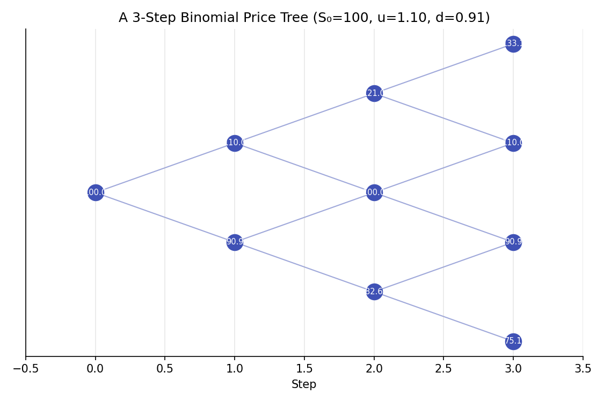
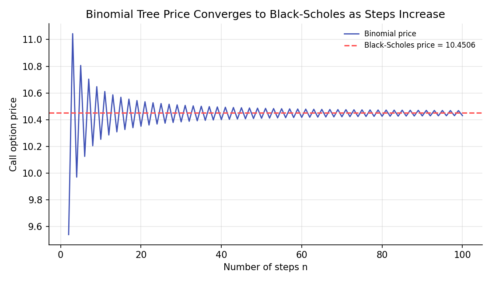

# Binomial Trees

!!! objectives "Learning objectives"
    By the end of this lecture you should be able to:

    - [ ] Price a one-period option by constructing a replicating portfolio of the underlying and a risk-free bond
    - [ ] Derive the risk-neutral probability and explain why it differs from the real-world probability of an up-move
    - [ ] Extend the one-period model to a multi-step binomial tree via backward induction
    - [ ] Price European and American options with a binomial tree in Python, and show convergence to Black-Scholes

## 1. Intuition

The previous lecture derived option price *bounds* using no-arbitrage arguments alone, without needing to model how the underlying's price actually evolves. To get an *exact* price, some model of price movement is required. The **binomial tree** (Cox, Ross & Rubinstein, 1979) is the simplest such model: over each short time step, the underlying can only move to one of two prices, up or down. This sounds like a drastic oversimplification of real price dynamics, and it is, but it turns out to be enough to derive, by the same replication logic used for forwards and the option bounds, an *exact* price for the option in this simplified world. Critically, as the number of steps grows and each step becomes vanishingly short, the binomial model converges to the continuous-time Black-Scholes model developed in the next lecture, so it is not merely a toy, it is a discrete-time version of the same underlying economics, and a genuinely useful numerical pricing tool in its own right, especially for American-style options with early exercise.

## 2. Mathematical formulation

**One-period binomial model.** The underlying starts at \( S_0 \) and moves to either \( S_0u \) (up, with real-world probability \( p_{\text{real}} \)) or \( S_0d \) (down), with \( d<e^{r\Delta t}<u \) (a no-arbitrage condition ensuring neither the up nor down move dominates risk-free lending). An option on this underlying is worth \( f_u \) in the up state and \( f_d \) in the down state at the end of the period.

**Replicating portfolio.** Hold \( \Delta \) shares of the underlying and \( B \) in risk-free bonds, chosen so the portfolio exactly matches the option's payoff in both states:

\[
\Delta S_0u + Be^{r\Delta t} = f_u, \qquad \Delta S_0d+Be^{r\Delta t}=f_d
\]

**Risk-neutral pricing formula**, the solution of this system expressed as a discounted expected value:

\[
f_0 = e^{-r\Delta t}\big[p\,f_u+(1-p)f_d\big], \qquad p=\frac{e^{r\Delta t}-d}{u-d}
\]

\( p \) is the **risk-neutral probability**, distinct from the real-world probability \( p_{\text{real}} \).

**Multi-step tree (Cox-Ross-Rubinstein, CRR, parametrization).** With \( n \) steps of length \( \Delta t=T/n \), and \( \sigma \) the underlying's volatility:

\[
u=e^{\sigma\sqrt{\Delta t}}, \qquad d=1/u, \qquad p=\frac{e^{r\Delta t}-d}{u-d}
\]

The option is valued by **backward induction**: compute the payoff at every terminal node, then work backward one step at a time applying the one-period formula above at each node (for American options, additionally comparing to the immediate-exercise value at each node and taking the maximum).

## 3. Derivation

**Solving the replicating portfolio, and why \( \Delta \) is the option's sensitivity to the underlying.** Subtracting the two equations in Section 2:

\[
\Delta S_0(u-d) = f_u-f_d \quad\Longrightarrow\quad \Delta = \frac{f_u-f_d}{S_0(u-d)}
\]

This is exactly the option's **delta**, the change in option value per unit change in the underlying over this step, foreshadowing the Greeks lecture later in this module. Substituting \( \Delta \) back into either original equation and solving for \( B \), then computing the portfolio's cost today, \( f_0=\Delta S_0+B \), and simplifying algebraically yields precisely the risk-neutral pricing formula in Section 2.

**Why the risk-neutral probability \( p \), not the real-world probability, appears in the pricing formula, and why this is not a contradiction.** The replicating portfolio was constructed to match the option's payoff in *both* states using only the underlying and a risk-free bond, both of whose prices today are directly observable; the real-world probability of an up-move, \( p_{\text{real}} \), never entered the replication argument at all. Since the option, by construction, has the *exact same payoff* as this replicating portfolio in every possible future state, the law of one price (used identically for forwards and the no-arbitrage bounds) requires the option to cost exactly what the replicating portfolio costs today, regardless of what anyone believes about \( p_{\text{real}} \). The quantity \( p \) that appears in the resulting formula is simply whatever value makes the formula's expected discounted payoff match this replication cost algebraically; it can be shown directly that \( p \) is exactly the probability that would make the underlying's own expected return equal the risk-free rate, \( E^p[S_{\Delta t}]=S_0e^{r\Delta t} \) (substitute and verify: \( p\cdot S_0u+(1-p)\cdot S_0d=S_0e^{r\Delta t} \) is precisely the definition of \( p \) in Section 2, rearranged). This is why \( p \) is called the risk-neutral probability: it is the probability under which the underlying earns exactly the risk-free rate, as it would if all investors were risk-neutral, even though real investors are not, and the real-world \( p_{\text{real}} \) can differ substantially from \( p \) (real investors generally demand compensation for risk, so \( p_{\text{real}} \) typically reflects a higher expected return than \( r \)). The key insight, central to the entire risk-neutral pricing framework developed further in Module 5, is that because the option's price is pinned down purely by replication and no-arbitrage, which attitudes toward risk never entered that argument, the price can be computed *as if* investors were risk-neutral, using \( p \) in place of \( p_{\text{real}} \), and the answer is correct even in a world of risk-averse investors.

**Backward induction and American options.** For a multi-step tree, the one-period formula is applied recursively: a node's value is the discounted risk-neutral expectation of its two possible successor nodes' values, exactly the one-period logic applied repeatedly, one step at a time, from the known terminal payoffs back to today. For an American option, which permits early exercise, each node's value is instead the *greater* of this continuation value and the payoff from exercising immediately at that node, since a rational holder exercises early only when doing so is worth more than holding the (replicable) option alive.

## 4. Worked numerical example

A stock at \$100, strike \$100, risk-free rate 5%, volatility 20%, 1-year maturity, priced with a binomial tree. Using the CRR parametrization with, say, \( n=2 \) steps (each \( \Delta t=0.5 \)): \( u=e^{0.2\sqrt{0.5}}\approx1.1519 \), \( d=1/u\approx0.8681 \), \( p=\frac{e^{0.05\times0.5}-0.8681}{1.1519-0.8681}\approx0.5539 \). Working backward from the terminal payoffs at the three ending nodes (\$132.69, \$100.00, \$75.36, corresponding to \( \max(S_T-100,0)=32.69,\ 0,\ 0 \)) through the intermediate nodes gives a 2-step binomial call price of \$9.54, still well off the true price at this coarse a resolution. As the number of steps increases toward 100 and beyond (Section 6's second chart), the binomial price converges to approximately \$10.43-\$10.45, closely tracking the exact Black-Scholes price of \$10.4506 for the same inputs (computed using the closed-form formula developed fully in the next lecture), confirming the binomial model's convergence to the continuous-time result as the time step shrinks.

## 5. Python implementation

```python
import numpy as np

def binomial_option_price(S0, K, r, sigma, T, n, option_type="call", american=False):
    """Price a European or American option via a CRR binomial tree."""
    dt = T / n
    u = np.exp(sigma * np.sqrt(dt))
    d = 1 / u
    p = (np.exp(r * dt) - d) / (u - d)
    disc = np.exp(-r * dt)

    # Terminal stock prices at each of the n+1 ending nodes
    j = np.arange(n + 1)
    S_T = S0 * (u ** (n - j)) * (d ** j)

    if option_type == "call":
        values = np.maximum(S_T - K, 0)
    else:
        values = np.maximum(K - S_T, 0)

    # Backward induction
    for step in range(n, 0, -1):
        values = disc * (p * values[:-1] + (1 - p) * values[1:])
        if american:
            j_step = np.arange(step)
            S_step = S0 * (u ** (step - 1 - j_step)) * (d ** j_step)
            intrinsic = np.maximum(S_step - K, 0) if option_type == "call" else np.maximum(K - S_step, 0)
            values = np.maximum(values, intrinsic)

    return values[0]

S0, K, r, sigma, T = 100.0, 100.0, 0.05, 0.20, 1.0

# --- Price with a small number of steps ---
price_2step = binomial_option_price(S0, K, r, sigma, T, n=2)
print(f"2-step binomial call price: {price_2step:.4f}")

# --- Convergence as the number of steps increases ---
for n in [2, 10, 50, 100, 500]:
    price = binomial_option_price(S0, K, r, sigma, T, n)
    print(f"n={n:4}: price = {price:.4f}")

# --- American put: early exercise can matter even without dividends when r > 0 ---
european_put = binomial_option_price(S0, K, r, sigma, T, n=200, option_type="put", american=False)
american_put = binomial_option_price(S0, K, r, sigma, T, n=200, option_type="put", american=True)
print(f"\nEuropean put: {european_put:.4f}")
print(f"American put: {american_put:.4f}  (should be >= European, reflecting early-exercise value)")
```


Continuing directly from the code above, here is the plotting code that produces both charts in Section 6:

```python
import matplotlib.pyplot as plt

# --- Chart 1: a small 3-step binomial tree diagram ---
S0_tree, u_tree, d_tree, n_tree = 100, 1.1, 1/1.1, 3
fig, ax = plt.subplots(figsize=(7.5, 5))
for step in range(n_tree + 1):
    for j in range(step + 1):
        node_price = S0_tree * (u_tree ** (step - j)) * (d_tree ** j)
        x, y = step, step - 2 * j
        ax.scatter(x, y, s=200, color="#3f51b5", zorder=3)
        ax.text(x, y, f"{node_price:.1f}", ha="center", va="center", color="white", fontsize=7, zorder=4)
        if step < n_tree:
            ax.plot([x, x+1], [y, y+1], color="#9fa8da", lw=1, zorder=1)
            ax.plot([x, x+1], [y, y-1], color="#9fa8da", lw=1, zorder=1)
ax.set_title(f"A 3-Step Binomial Price Tree (S₀={S0_tree}, u={u_tree:.2f}, d={d_tree:.2f})")
ax.set_xlabel("Step"); ax.set_yticks([])
ax.set_xlim(-0.5, n_tree + 0.5)
fig.tight_layout()
plt.show()

# --- Chart 2: convergence of the binomial price to Black-Scholes ---
from scipy.stats import norm

def bs_call(S0, K, r, sigma, T):
    d1 = (np.log(S0/K) + (r + 0.5*sigma**2)*T) / (sigma*np.sqrt(T))
    d2 = d1 - sigma*np.sqrt(T)
    return S0*norm.cdf(d1) - K*np.exp(-r*T)*norm.cdf(d2)

true_price = bs_call(S0, K, r, sigma, T)
ns = range(2, 101)
binom_prices = [binomial_option_price(S0, K, r, sigma, T, n) for n in ns]

fig, ax = plt.subplots(figsize=(7.5, 4.3))
ax.plot(list(ns), binom_prices, color="#3f51b5", lw=1.3, label="Binomial price")
ax.axhline(true_price, color="#ff5252", ls="--", lw=1.5, label=f"Black-Scholes price = {true_price:.4f}")
ax.set_xlabel("Number of steps n"); ax.set_ylabel("Call option price")
ax.set_title("Binomial Tree Price Converges to Black-Scholes as Steps Increase")
ax.legend(frameon=False, fontsize=8)
fig.tight_layout()
plt.show()
```

## 6. Visualization

<figure class="qf-figure" markdown>

<figcaption>A 3-step binomial price tree. Starting from $100, each step the price moves up by a factor u or down by a factor d. The replicating-portfolio argument from Section 3 is applied one step at a time, working backward from the terminal nodes on the right to today's price on the left.</figcaption>
</figure>

<figure class="qf-figure" markdown>

<figcaption>As the number of time steps n grows, the CRR binomial tree's call price (blue) converges toward the exact Black-Scholes price (red dashed line), confirming that the discrete binomial model approaches the continuous-time result as each step shrinks.</figcaption>
</figure>

## 7. Financial interpretation

The binomial tree's main practical advantage over Black-Scholes, covered next, is its flexibility: it handles American-style early exercise naturally (via the backward-induction comparison in Section 3), and it extends readily to options with more complex features (dividends paid at specific dates, barrier features, and more) where closed-form solutions may not exist. Its main drawback is computational: pricing to high precision, or computing sensitivities (the Greeks) by finite differences, can require many steps and repeated tree evaluations, which the closed-form Black-Scholes formula avoids entirely for the simpler European case it covers. In practice, the two are often used together: Black-Scholes for fast, exact European option pricing, and binomial (or more general lattice and finite-difference) methods for American options and other situations where no closed form exists.

## 8. Common mistakes

!!! danger "Common mistake: using too few steps for a precise price"
    As Section 6's convergence chart shows, a very small number of steps (such as the illustrative \( n=2 \) in Section 4) can be noticeably off from the true price; production pricing typically uses dozens to hundreds of steps, with the appropriate number depending on the required precision and the option's specific features.

!!! danger "Common mistake: confusing the risk-neutral probability with a real-world forecast"
    As derived carefully in Section 3, \( p \) is a mathematical device arising from the replication argument, not a statement about the actual likelihood of the underlying rising or falling. Interpreting a high \( p \) as "the market expects the price to rise" is a misreading of what risk-neutral pricing means.

!!! danger "Common mistake: forgetting the early-exercise check for American options"
    Applying the European backward-induction formula to an American option, without the additional comparison to immediate-exercise value at each node, systematically undervalues the American option whenever early exercise can be optimal, exactly the comparison implemented in Section 5's `american=True` branch.

## 9. Exercises

1. By hand, compute the 2-step binomial call price for the example in Section 4, working through each node explicitly, and verify it against the Python implementation in Section 5.
2. Modify the code in Section 5 to price an American call (rather than put) on a dividend-paying stock (add a continuous dividend yield \( q \) to the drift, analogous to the forward-pricing adjustment from two lectures ago) and compare it to the corresponding European call. Under what conditions would you expect early exercise of an American call to actually be optimal?
3. Using the convergence data from Section 5, estimate roughly how many steps are needed for the binomial price to be within \$0.01 of the Black-Scholes price (\$10.4506) for the given parameters.

## 10. Further reading

- Cox, Ross, and Rubinstein (1979) is the original paper; it remains a very readable introduction to the model.

## 11. References

1. Cox, J. C., Ross, S. A., & Rubinstein, M. (1979). "Option Pricing: A Simplified Approach." *Journal of Financial Economics*, 7(3), 229–263.
2. Hull, J. C. (2022). *Options, Futures, and Other Derivatives* (11th ed.), Chapters 13 and 21. Pearson.
3. Shreve, S. E. (2004). *Stochastic Calculus for Finance I: The Binomial Asset Pricing Model*. Springer Finance.

---

<div class="grid" markdown>
[:material-arrow-left: Previous: Options and No-Arbitrage Bounds](/qf-lectures/derivatives/options-no-arbitrage-bounds/){ .md-button }
[Next: Black-Scholes-Merton Model :material-arrow-right:](/qf-lectures/derivatives/black-scholes-merton/){ .md-button .md-button--primary }
</div>
