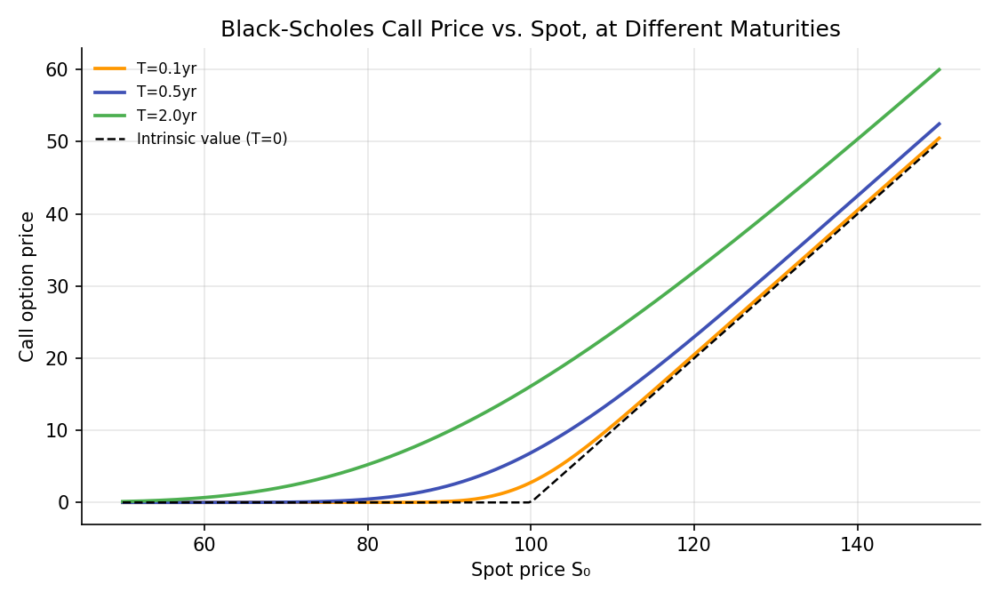
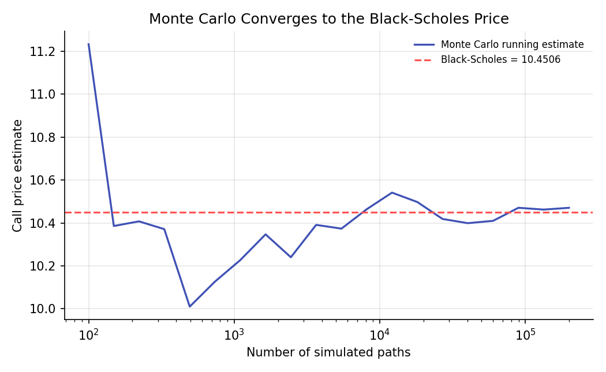

# Black-Scholes-Merton Model

!!! objectives "Learning objectives"
    By the end of this lecture you should be able to:

    - [ ] State the Black-Scholes-Merton formula for a European call and put, and interpret each term
    - [ ] Explain, at the level of the underlying argument, how the binomial model's limit as steps increase leads to Black-Scholes
    - [ ] Verify put-call parity and the no-arbitrage bounds from earlier lectures hold for the Black-Scholes price
    - [ ] Compute Black-Scholes prices in Python and confirm them via Monte Carlo simulation

## 1. Intuition

The Binomial Trees lecture showed that an option can be priced exactly, within a discrete up/down model, through replication and risk-neutral valuation, and that the resulting price converges to a single limiting value as the number of time steps grows and each step becomes infinitesimally short. The **Black-Scholes-Merton model** (Black & Scholes, 1973; Merton, 1973) is the continuous-time version of exactly this limit: instead of the underlying taking discrete up/down steps, it is modeled as following a continuous random process (geometric Brownian motion, developed rigorously in Module 5), and the same replication logic, now using continuous trading and calculus rather than discrete steps and algebra, yields a closed-form pricing formula.

This formula was a landmark result (it won Scholes and Merton the 1997 Nobel Memorial Prize in Economic Sciences; Black had died in 1995 and was ineligible) precisely because it gives an *exact, closed-form* price for a European option as a function of only five observable or estimable inputs, with no need to simulate a tree or run a Monte Carlo simulation at all. This lecture presents the formula and its ingredients; its full derivation via stochastic calculus (Itô's lemma and the Black-Scholes partial differential equation) is developed properly in Module 5, once the necessary mathematical machinery is in place.

## 2. Mathematical formulation

For a European call and put on a non-dividend-paying underlying with current price \( S_0 \), strike \( K \), continuously compounded risk-free rate \( r \), volatility \( \sigma \) (of log returns), and time to maturity \( T \):

\[
C = S_0\,N(d_1) - Ke^{-rT}\,N(d_2)
\]

\[
P = Ke^{-rT}\,N(-d_2) - S_0\,N(-d_1)
\]

where

\[
d_1 = \frac{\ln(S_0/K)+\left(r+\tfrac12\sigma^2\right)T}{\sigma\sqrt T}, \qquad d_2 = d_1-\sigma\sqrt T
\]

and \( N(\cdot) \) is the standard Normal cumulative distribution function (the Probability Foundations lecture).

**Interpretation of each piece:**

- \( N(d_1) \) and \( N(d_2) \) are both probabilities between 0 and 1, computed under different measures; \( N(d_2) \) is (under the risk-neutral measure) the probability the option is exercised, and \( S_0N(d_1) \) can be interpreted as the present value of receiving the stock conditional on exercise.
- \( Ke^{-rT} \) is the present value of the strike, exactly as it appeared in the put-call parity and no-arbitrage bounds lectures.
- \( \sigma\sqrt T \) is the total standard deviation of the log return over the option's life, the natural "scale" of uncertainty the formula is built around.

## 3. Derivation

A full derivation of the Black-Scholes partial differential equation from first principles requires Itô's lemma and is deferred to Module 5. What can be said now, using only tools already developed, is how the formula connects to, and is consistent with, everything derived so far in this module.

**Connecting to risk-neutral pricing from the Binomial Trees lecture.** The Black-Scholes formula can be written as a discounted risk-neutral expectation, exactly the structure derived for the one-period binomial model:

\[
C = e^{-rT}\,E^{\mathbb Q}\big[\max(S_T-K,0)\big]
\]

where \( \mathbb Q \) is the risk-neutral measure under which the underlying's expected growth rate is exactly \( r \) (the continuous-time analogue of the binomial risk-neutral probability \( p \)), the same "price as if risk-neutral" logic that made the binomial formula work, carried over to continuous time. Under \( \mathbb Q \), \( \ln S_T \) is Normally distributed with mean \( \ln S_0+(r-\tfrac12\sigma^2)T \) and variance \( \sigma^2T \); evaluating the expectation above using this distribution (a calculus exercise using the Normal density, carried out in full in most derivatives textbooks, e.g. Hull, 2022, Chapter 15) produces exactly the \( d_1,d_2 \) formula in Section 2. The binomial model, as the number of steps grows, has its risk-neutral terminal distribution converge to precisely this lognormal distribution (a continuous-time, many-step limit of a sum of many small up/down log-moves, itself an application of the Central Limit Theorem from the Probability Foundations lecture), which is the formal sense in which the binomial model converges to Black-Scholes, as demonstrated numerically in the previous lecture.

**Consistency with put-call parity.** Subtracting the put formula from the call formula:

\[
C-P = S_0\big[N(d_1)+N(-d_1)\big] - Ke^{-rT}\big[N(d_2)+N(-d_2)\big] = S_0 - Ke^{-rT}
\]

using the identity \( N(x)+N(-x)=1 \) for the standard Normal CDF (since \( N(-x)=1-N(x) \) by the Normal distribution's symmetry around zero, established in the Probability Distributions lecture). This exactly recovers put-call parity, derived purely from no-arbitrage in the Options and No-Arbitrage Bounds lecture, with no assumption about the underlying's distribution at all. That the Black-Scholes formula, built from a *specific* distributional assumption (lognormal terminal prices), automatically satisfies a relationship that had to hold under *any* correct model is an essential consistency check, confirming the formula does not violate the model-free constraints derived earlier.

## 4. Worked numerical example

A stock at \$100, strike \$100, risk-free rate 5%, volatility 20%, 1-year maturity (the same inputs used for the binomial convergence check in the previous lecture):

\[
d_1 = \frac{\ln(1)+(0.05+0.02)\times1}{0.2\times1} = \frac{0.07}{0.2}=0.35, \qquad d_2 = 0.35-0.2=0.15
\]

\[
N(0.35)\approx0.6368, \qquad N(0.15)\approx0.5596
\]

\[
C = 100\times0.6368 - 100e^{-0.05}\times0.5596 = 63.68 - 95.12\times0.5596 \approx 63.68-53.23=\$10.45
\]

matching, as expected, the Black-Scholes price of \$10.4506 used as the convergence target in the previous lecture's binomial tree chart.

## 5. Python implementation

```python
import numpy as np
from scipy.stats import norm

def black_scholes(S0, K, r, sigma, T, option_type="call"):
    d1 = (np.log(S0/K) + (r + 0.5*sigma**2)*T) / (sigma*np.sqrt(T))
    d2 = d1 - sigma*np.sqrt(T)
    if option_type == "call":
        return S0*norm.cdf(d1) - K*np.exp(-r*T)*norm.cdf(d2)
    else:
        return K*np.exp(-r*T)*norm.cdf(-d2) - S0*norm.cdf(-d1)

S0, K, r, sigma, T = 100.0, 100.0, 0.05, 0.20, 1.0
call_price = black_scholes(S0, K, r, sigma, T, "call")
put_price = black_scholes(S0, K, r, sigma, T, "put")
print(f"Call price: {call_price:.4f}")
print(f"Put price:  {put_price:.4f}")

# --- Verify put-call parity holds exactly ---
parity_lhs = call_price - put_price
parity_rhs = S0 - K*np.exp(-r*T)
print(f"\nC - P = {parity_lhs:.6f}, S0 - Ke^(-rT) = {parity_rhs:.6f}  (should match exactly)")

# --- Verify via Monte Carlo simulation (the risk-neutral expectation, directly) ---
rng = np.random.default_rng(121)
n_sims = 200_000
Z = rng.normal(size=n_sims)
S_T = S0 * np.exp((r - 0.5*sigma**2)*T + sigma*np.sqrt(T)*Z)   # risk-neutral terminal price
payoffs = np.maximum(S_T - K, 0)
mc_price = np.exp(-r*T) * payoffs.mean()
mc_se = np.exp(-r*T) * payoffs.std() / np.sqrt(n_sims)
print(f"\nMonte Carlo call price: {mc_price:.4f} +/- {1.96*mc_se:.4f} (95% CI)")
print(f"Black-Scholes call price: {call_price:.4f}  (should fall within the CI)")

# --- Check against the no-arbitrage bounds from the earlier lecture ---
call_lower = max(S0 - K*np.exp(-r*T), 0)
print(f"\nNo-arbitrage lower bound: {call_lower:.4f} <= BS price {call_price:.4f} <= S0 = {S0:.2f}")
```


Continuing directly from the code above, here is the plotting code that produces both charts in Section 6:

```python
import matplotlib.pyplot as plt

# --- Chart 1: call price vs. spot, at different maturities ---
S_range = np.linspace(50, 150, 200)
fig, ax = plt.subplots(figsize=(7.5, 4.5))
for T_plot, c in [(0.1, "#ff9800"), (0.5, "#3f51b5"), (2.0, "#4caf50")]:
    prices = black_scholes(S_range, K, r, sigma, T_plot, "call")
    ax.plot(S_range, prices, color=c, lw=1.8, label=f"T={T_plot}yr")
ax.plot(S_range, np.maximum(S_range - K, 0), color="black", ls="--", lw=1.2, label="Intrinsic value (T=0)")
ax.set_xlabel("Spot price S₀"); ax.set_ylabel("Call option price")
ax.set_title("Black-Scholes Call Price vs. Spot, at Different Maturities")
ax.legend(frameon=False, fontsize=8)
fig.tight_layout()
plt.show()

# --- Chart 2: Monte Carlo running estimate converging to the Black-Scholes price ---
ns = np.unique(np.logspace(2, 5.3, 20).astype(int))
mc_running = [np.exp(-r*T) * payoffs[:n].mean() for n in ns]

fig, ax = plt.subplots(figsize=(7, 4.3))
ax.plot(ns, mc_running, color="#3f51b5", lw=1.6, label="Monte Carlo running estimate")
ax.axhline(call_price, color="#ff5252", ls="--", lw=1.5, label=f"Black-Scholes = {call_price:.4f}")
ax.set_xscale("log")
ax.set_xlabel("Number of simulated paths"); ax.set_ylabel("Call price estimate")
ax.set_title("Monte Carlo Converges to the Black-Scholes Price")
ax.legend(frameon=False, fontsize=8)
fig.tight_layout()
plt.show()
```

## 6. Visualization

<figure class="qf-figure" markdown>

<figcaption>Black-Scholes call prices as a function of spot price, for three maturities. Shorter-maturity curves (orange) sit closer to the intrinsic value (black dashed), while longer-maturity curves (green) retain more time value, especially near the strike, where outcome uncertainty matters most.</figcaption>
</figure>

<figure class="qf-figure" markdown>

<figcaption>A Monte Carlo estimate of the same call option's price, using the risk-neutral simulation from Section 5, converges to the Black-Scholes closed-form price (red dashed) as the number of simulated paths grows, the same 1/√n convergence behavior derived in the Monte Carlo Simulation for Risk lecture, here applied to option pricing specifically.</figcaption>
</figure>

## 7. Financial interpretation

The Black-Scholes formula's inputs are instructive about what actually drives an option's value: \( S_0 \) and \( K \) jointly determine moneyness, \( r \) and \( T \) determine the present value of the strike, and \( \sigma \) (together with \( T \), through the combined term \( \sigma\sqrt T \)) determines the magnitude of outcome uncertainty the option is providing protection against or exposure to. Notably, the formula does **not** depend on the underlying's expected return (the real-world drift), only on \( r \), a direct consequence of risk-neutral pricing (Section 3): two traders with wildly different views on where the stock is headed should, if they agree on \( \sigma \), agree on the option's fair price, which can feel counterintuitive at first but follows directly from the same replication logic used throughout this module. In practice, every input except \( \sigma \) is directly observable; \( \sigma \) must be estimated or, as the Implied Volatility lecture later in this module covers, backed out from observed option prices themselves, inverting the formula rather than using it to produce a price.

## 8. Common mistakes

!!! danger "Common mistake: using the wrong volatility convention"
    \( \sigma \) in the Black-Scholes formula is the annualized standard deviation of continuously compounded (log) returns, exactly the quantity derived and discussed at length in the Returns and Log Returns lecture, not simple returns and not a single-period (e.g., daily) figure without proper annualization (typically scaling a daily estimate by \( \sqrt{252} \)).

!!! danger "Common mistake: applying the formula to dividend-paying or American-style options without adjustment"
    The formula in Section 2 assumes no dividends and European-style exercise. A dividend-paying underlying requires the same \( S_0\to S_0e^{-qT} \) adjustment seen in the Forwards and Futures lecture, and American options generally require a numerical method (such as the binomial tree from the previous lecture) rather than this closed form, since early exercise can be optimal in some cases (puts, and calls on dividend-paying stocks).

!!! danger "Common mistake: forgetting the formula gives a price, not a prediction"
    As emphasized in Section 7, the Black-Scholes price does not encode a view on whether the stock will go up or down; using it, or its implied probabilities \( N(d_1),N(d_2) \), as a forecast of the real-world likelihood of the stock rising is a misapplication of what the formula's risk-neutral construction actually represents.

## 9. Exercises

1. Reproduce the hand calculation in Section 4 for a put instead of a call, and verify your answer against the Python implementation in Section 5.
2. Using the code in Section 5, compute how the call price changes if volatility rises from 20% to 30% (all else equal), and relate the direction of the change to the role of \( \sigma\sqrt T \) discussed in Section 2.
3. Verify numerically that as \( T\to0 \) (e.g., \( T=0.001 \)), the Black-Scholes call price converges to the option's intrinsic value \( \max(S_0-K,0) \), consistent with the T=0 curve shown in Section 6's first chart.

## 10. Further reading

- Black and Scholes (1973) and Merton (1973) are the two foundational papers; both are challenging but rewarding to read directly once the Itô calculus machinery from Module 5 is in hand.

## 11. References

1. Black, F., & Scholes, M. (1973). "The Pricing of Options and Corporate Liabilities." *Journal of Political Economy*, 81(3), 637–654.
2. Merton, R. C. (1973). "Theory of Rational Option Pricing." *The Bell Journal of Economics and Management Science*, 4(1), 141–183.
3. Hull, J. C. (2022). *Options, Futures, and Other Derivatives* (11th ed.), Chapter 15. Pearson.
4. SciPy Developers. "`scipy.stats.norm`." [docs.scipy.org](https://docs.scipy.org/doc/scipy/reference/generated/scipy.stats.norm.html)

---

<div class="grid" markdown>
[:material-arrow-left: Previous: Binomial Trees](/qf-lectures/derivatives/binomial-trees/){ .md-button }
[Next: The Greeks :material-arrow-right:](/qf-lectures/derivatives/the-greeks/){ .md-button .md-button--primary }
</div>
