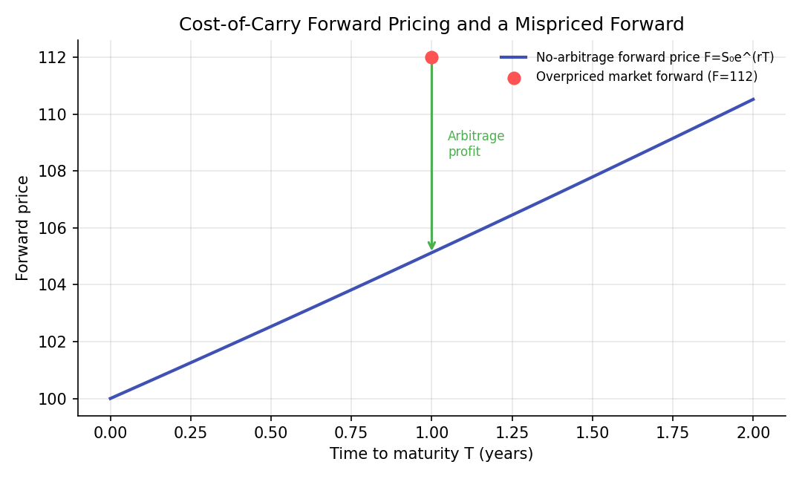
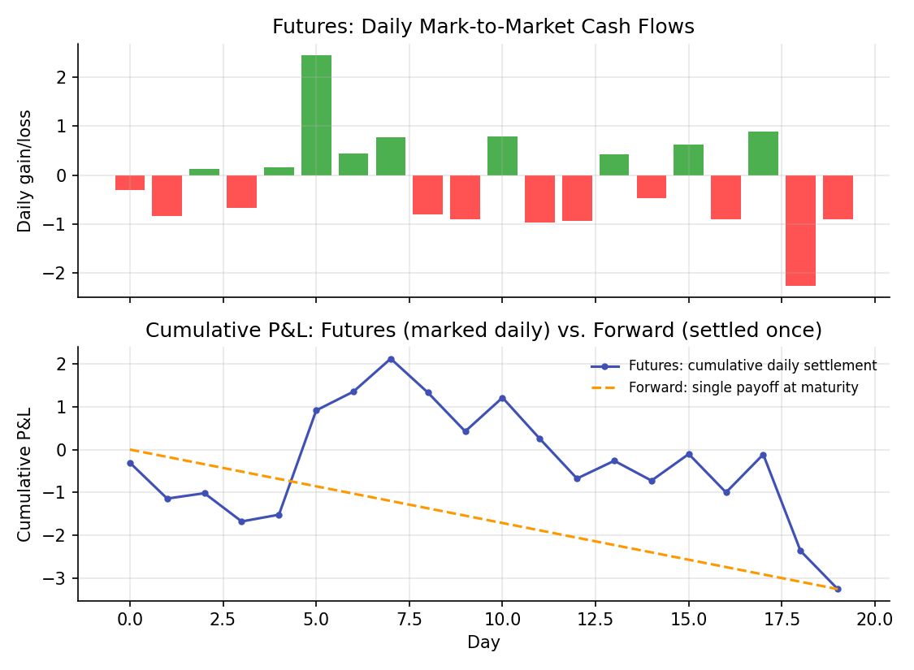

# Forwards and Futures

!!! objectives "Learning objectives"
    By the end of this lecture you should be able to:

    - [ ] Derive the no-arbitrage forward price using a cost-of-carry argument
    - [ ] Construct the specific arbitrage trade that enforces the no-arbitrage forward price when it is violated
    - [ ] Explain the structural difference between a forward and a futures contract, specifically daily mark-to-market settlement
    - [ ] Compute forward prices and simulate futures mark-to-market cash flows in Python

## 1. Intuition

The Derivatives Overview lecture introduced the forward payoff \( S_T-K \) and distinguished it from an option's kinked payoff. This lecture asks a sharper question: given today's spot price, what *should* the forward price \( K \) be, if no one is to be able to lock in a riskless profit? The answer turns out not to depend on anyone's forecast of where the price is headed; it follows purely from a **no-arbitrage** argument based on the cost of financing and holding the underlying asset until the forward's maturity, the **cost-of-carry** model.

**Futures** contracts have economically the same payoff structure as forwards but differ in one operationally important way: a futures contract is **marked to market daily**, meaning gains and losses are settled in cash every single day rather than accumulated silently until maturity as with a forward. This distinction, mostly a technical, exchange-clearing detail, nonetheless has real financial consequences, covered at the end of this lecture.

## 2. Mathematical formulation

**No-arbitrage forward price** on an asset with spot price \( S_0 \), continuously compounded risk-free rate \( r \), and time to maturity \( T \) (assuming no dividends or storage costs, the simplest case):

\[
F_0 = S_0\,e^{rT}
\]

**With a continuous dividend yield \( q \)** (e.g., for a stock index or currency):

\[
F_0 = S_0\,e^{(r-q)T}
\]

**With storage costs** \( u \) (continuously compounded, as a fraction of the asset's value, relevant for physical commodities) and a **convenience yield** \( y \) (the non-monetary benefit of holding the physical commodity itself, such as avoiding a stockout):

\[
F_0 = S_0\,e^{(r+u-y)T}
\]

**Value of an existing forward position** at some time \( t<T \), with current forward price \( F_t \) for the same maturity and original contracted price \( K \):

\[
V_t = (F_t-K)\,e^{-r(T-t)}
\]

## 3. Derivation

**The cost-of-carry forward price, via a replication/arbitrage argument.** Consider two ways to guarantee ownership of the asset at time \( T \):

- **Strategy A**: enter a forward contract today to buy the asset at \( T \) for price \( F_0 \).
- **Strategy B**: borrow \( S_0 \) today at the risk-free rate, buy the asset now for \( S_0 \), and hold it until \( T \). At \( T \), the loan has grown to \( S_0e^{rT} \), which must be repaid, and the investor then owns the asset.

Both strategies deliver exactly one unit of the asset at time \( T \), with no other cash flows in between (ignoring dividends and storage costs for now), so by the **law of one price** (if two strategies produce identical future payoffs, they must cost the same today, or a riskless arbitrage exists), their costs must be equal:

\[
F_0 = S_0 e^{rT}
\]

exactly the formula in Section 2. If dividends at continuous yield \( q \) are paid on the asset while held, Strategy B's holder additionally receives those dividends (reducing the effective cost of carrying the position, since dividend income can be reinvested or used to offset the financing cost), which modifies the replication argument to produce the \( e^{(r-q)T} \) formula instead; a fully worked version of this adjustment appears in Hull (2022).

**Why a mispriced forward creates a genuine arbitrage, with the explicit trade.** Suppose, as in Section 6's chart, the market forward price \( F_{\text{market}} \) exceeds the theoretical \( F_0=S_0e^{rT} \). An arbitrageur can:

1. **Sell** (go short) the overpriced forward at \( F_{\text{market}} \), agreeing to deliver the asset at \( T \) for that price.
2. **Borrow** \( S_0 \) today at rate \( r \) and **buy** the asset now (replicating Strategy B above).
3. At \( T \): deliver the asset into the forward contract, receiving \( F_{\text{market}} \); repay the loan, which has grown to \( S_0e^{rT} \).

The riskless profit, locked in at time 0 with no net cash outlay, is exactly

\[
F_{\text{market}} - S_0e^{rT} > 0
\]

by assumption. This is a genuine, riskless arbitrage: every cash flow and quantity involved is known and contracted for at time 0, with no exposure to where the spot price actually ends up at \( T \). The existence of this trade is precisely what competitive, well-functioning markets are expected to eliminate quickly, pushing \( F_{\text{market}} \) back toward \( S_0e^{rT} \), which is why the no-arbitrage formula, not a forecast of future spot prices, is the standard pricing relationship used in practice. (An analogous short-the-asset, lend-the-proceeds trade enforces the price from the other direction if the market forward is instead too *low*.)

## 4. Worked numerical example

A non-dividend-paying stock trades at \$100, the continuously compounded risk-free rate is 5%, and a forward contract matures in 1 year. The no-arbitrage forward price is

\[
F_0 = 100\,e^{0.05\times1} \approx \$105.13
\]

If the market were instead quoting a 1-year forward at \$112 (Section 6's chart), the arbitrage trade in Section 3 locks in a riskless profit of \( 112-105.13=\$6.87 \) per unit, with zero net investment and zero price risk, exactly the kind of "free money" that competitive markets compete away, which is the economic reason the forward price should converge to \$105.13 rather than persist at \$112.

## 5. Python implementation

```python
import numpy as np

# --- No-arbitrage forward pricing ---
def forward_price(S0, r, T, q=0.0):
    """Cost-of-carry forward price, with an optional continuous dividend/convenience yield q."""
    return S0 * np.exp((r - q) * T)

S0, r, T = 100.0, 0.05, 1.0
F0 = forward_price(S0, r, T)
print(f"No-arbitrage forward price: ${F0:.2f}")

# --- The arbitrage trade, explicitly, when the market forward is mispriced ---
F_market = 112.0
if F_market > F0:
    profit = F_market - S0 * np.exp(r * T)
    print(f"Market forward (${F_market}) is overpriced.")
    print(f"Arbitrage: short the forward, borrow ${S0:.2f} to buy the asset now.")
    print(f"Riskless profit at T, locked in today: ${profit:.2f}")

# --- Forward price with a dividend yield, e.g. an equity index ---
F0_with_div = forward_price(S0, r, T, q=0.02)
print(f"\nForward price with a 2% dividend yield: ${F0_with_div:.2f}  (lower, since holding the asset earns income)")

# --- Futures: simulated daily mark-to-market cash flows vs. a forward's single payoff at maturity ---
rng = np.random.default_rng(111)
days = 20
price_path = 100 + np.cumsum(rng.normal(0, 1, days))
daily_mtm = np.diff(price_path, prepend=100)   # daily gain/loss on a long futures position
cumulative_mtm = np.cumsum(daily_mtm)

print(f"\nFutures: sum of daily mark-to-market cash flows = {cumulative_mtm[-1]:.2f}")
print(f"Forward: single payoff at maturity (same underlying move) = {price_path[-1] - 100:.2f}")
print("(Equal in this simplified, constant-rate example; they can differ once interest on interim cash flows is modeled.)")
```


Continuing directly from the code above, here is the plotting code that produces both charts in Section 6:

```python
import matplotlib.pyplot as plt

# --- Chart 1: no-arbitrage forward price curve and a mispriced forward ---
T_grid = np.linspace(0, 2, 100)
F_theoretical = S0 * np.exp(r * T_grid)
T1_idx = np.argmin(np.abs(T_grid - 1))

fig, ax = plt.subplots(figsize=(7.2, 4.3))
ax.plot(T_grid, F_theoretical, color="#3f51b5", lw=2, label="No-arbitrage forward price F=S₀e^(rT)")
ax.scatter([1], [F_market], color="#ff5252", s=60, zorder=5, label=f"Overpriced market forward (F={F_market})")
ax.annotate("", xy=(1, F_theoretical[T1_idx]), xytext=(1, F_market),
            arrowprops=dict(arrowstyle="->", color="#4caf50", lw=1.5))
ax.text(1.05, (F_market + F_theoretical[T1_idx]) / 2, "Arbitrage\nprofit", color="#4caf50", fontsize=8)
ax.set_xlabel("Time to maturity T (years)"); ax.set_ylabel("Forward price")
ax.set_title("Cost-of-Carry Forward Pricing and a Mispriced Forward")
ax.legend(frameon=False, fontsize=8)
fig.tight_layout()
plt.show()

# --- Chart 2: futures daily mark-to-market vs. forward single payoff ---
fig, axes = plt.subplots(2, 1, figsize=(7.5, 5.5), sharex=True)
axes[0].bar(range(days), daily_mtm, color=["#4caf50" if d >= 0 else "#ff5252" for d in daily_mtm])
axes[0].set_title("Futures: Daily Mark-to-Market Cash Flows"); axes[0].set_ylabel("Daily gain/loss")

axes[1].plot(range(days), cumulative_mtm, color="#3f51b5", marker="o", ms=3,
             label="Futures: cumulative daily settlement")
axes[1].plot([0, days-1], [0, cumulative_mtm[-1]], color="#ff9800", ls="--",
             label="Forward: single payoff at maturity")
axes[1].set_title("Cumulative P&L: Futures (marked daily) vs. Forward (settled once)")
axes[1].set_xlabel("Day"); axes[1].set_ylabel("Cumulative P&L"); axes[1].legend(frameon=False, fontsize=8)
fig.tight_layout()
plt.show()
```

## 6. Visualization

<figure class="qf-figure" markdown>

<figcaption>The theoretical no-arbitrage forward price (blue curve) grows with maturity at the risk-free rate, per the cost-of-carry formula. A market-quoted forward above this curve (red dot) permits the riskless arbitrage trade derived in Section 3, capturing the gap (green) as a locked-in profit.</figcaption>
</figure>

<figure class="qf-figure" markdown>

<figcaption>Top: a futures position's daily gains (green) and losses (red) are settled in cash every day. Bottom: the cumulative sum of those daily settlements (blue) tracks a forward contract's single payoff at maturity (orange dashed) in this simplified example, but the *timing* of the cash flows differs sharply, interim cash is paid and received throughout the futures contract's life, not just at the end.</figcaption>
</figure>

## 7. Financial interpretation

The cost-of-carry formula is the standard starting point for pricing forwards and futures across asset classes: equity index futures use the dividend-yield-adjusted version, currency forwards use an analogous interest-rate-differential version (covered interest rate parity), and commodity futures incorporate storage costs and convenience yield. The forward/futures distinction matters practically because daily mark-to-market settlement means a futures position generates (or demands) real interim cash flows well before maturity, exposing the holder to reinvestment-rate risk on interim gains and margin-call liquidity risk on interim losses, neither of which a forward contract, settled only once at maturity, exposes the holder to in the same way. This is also why futures prices and forward prices can differ slightly, in theory, when interest rates are themselves stochastic and correlated with the underlying's price path, though for most practical purposes, and in nearly all introductory treatments, the two are priced using the same cost-of-carry logic.

## 8. Common mistakes

!!! danger "Common mistake: using the simple discounted-spot formula when dividends or storage costs apply"
    Omitting a known dividend yield, or storage costs for a physical commodity, systematically misprices the forward relative to what a correct replication argument implies, as Section 2's extended formulas make explicit.

!!! danger "Common mistake: treating the forward price as a 'forecast' of the future spot price"
    The no-arbitrage forward price reflects the *cost of carrying* the asset to maturity, not a market consensus prediction of where the spot price will actually be. Under certain assumptions the two can coincide, but the forward price is derived without any reference to expected future spot prices at all, exactly the point of the replication argument in Section 3.

!!! danger "Common mistake: ignoring the practical consequences of daily mark-to-market"
    Assuming a futures position behaves exactly like a forward in terms of cash flow timing ignores the real liquidity and reinvestment implications of daily settlement, margin calls on losing positions are a genuine practical risk that a forward contract, by construction, does not carry in the same way.

## 9. Exercises

1. A commodity trades at \$50 per unit, the risk-free rate is 4%, annual storage costs are 2% of value, and the commodity's convenience yield is estimated at 1%. Compute the 6-month no-arbitrage futures price.
2. Suppose the market forward price in Section 5's example were instead \$100 (below the \$105.13 theoretical price) rather than \$112. Describe the specific arbitrage trade (the mirror image of Section 3's trade) that would profit from this mispricing, and compute the riskless profit.
3. Extend the futures mark-to-market simulation in Section 5 to include a (small) short-term reinvestment rate on each day's cash settlement, compounded daily, and compare the final cumulative value to the simple-sum version. Under what condition would this make futures and forward payoffs diverge?

## 10. Further reading

- Hull (2022), Chapters 3 and 5, develops the cost-of-carry model for a wide range of underlying asset types in full detail.

## 11. References

1. Hull, J. C. (2022). *Options, Futures, and Other Derivatives* (11th ed.), Chapters 3 and 5. Pearson.
2. Bodie, Z., Kane, A., & Marcus, A. J. (2021). *Investments* (12th ed.), Chapter 22. McGraw-Hill.
3. CFA Institute — "Pricing and Valuation of Forward Commitments." [cfainstitute.org](https://www.cfainstitute.org/)

---

<div class="grid" markdown>
[:material-arrow-left: Back to Curriculum](/qf-lectures/curriculum/){ .md-button }
[Next: Options and No-Arbitrage Bounds :material-arrow-right:](/qf-lectures/derivatives/options-no-arbitrage-bounds/){ .md-button .md-button--primary }
</div>
