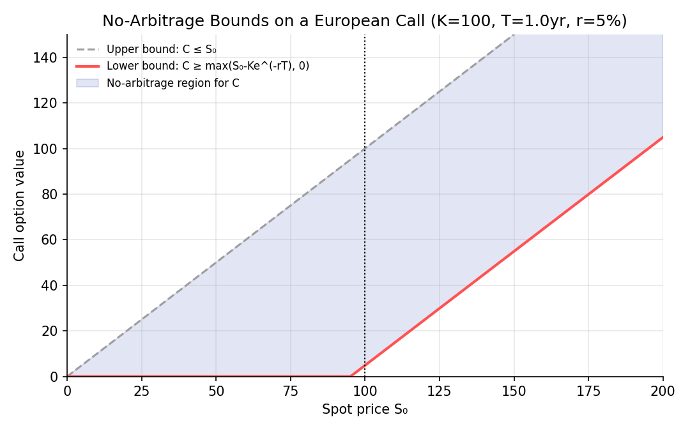
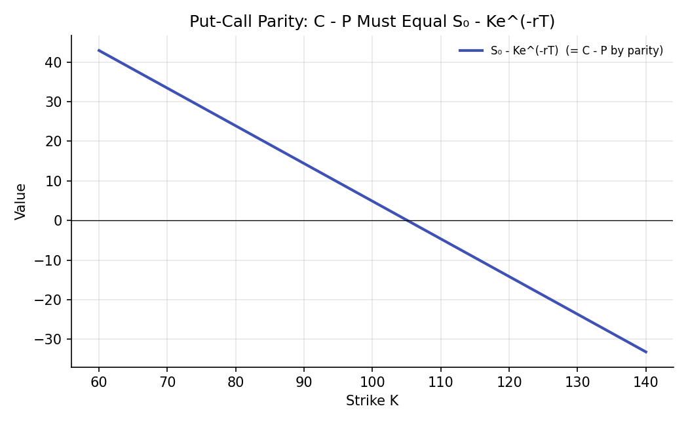

# Options and No-Arbitrage Bounds

!!! objectives "Learning objectives"
    By the end of this lecture you should be able to:

    - [ ] Derive upper and lower no-arbitrage bounds on a European call and put option's price, without any pricing model
    - [ ] State and derive put-call parity, and explain why it must hold regardless of any model assumptions
    - [ ] Use put-call parity to replicate one option type from the other, the risk-free asset, and the underlying
    - [ ] Verify no-arbitrage bounds and put-call parity numerically in Python

## 1. Intuition

Before any specific option pricing model (the binomial tree or Black-Scholes, covered in the next two lectures) is introduced, it is worth asking what can be said about an option's price using *only* no-arbitrage logic, the same style of argument that pinned down the forward price in the previous lecture, with no assumptions yet about how the underlying's price actually moves. It turns out quite a lot can be said: options have hard upper and lower price bounds that any rational price must respect, and calls and puts on the same underlying, strike, and maturity are locked together by an exact algebraic relationship called **put-call parity**, which holds regardless of volatility, the probability distribution of future prices, or any other modeling assumption. These model-free results are useful in their own right (as sanity checks on any pricing model's output) and as the essential scaffolding the binomial and Black-Scholes models are built on top of.

## 2. Mathematical formulation

For a European call \( C \) and put \( P \), both with strike \( K \) and maturity \( T \), on a non-dividend-paying underlying with current price \( S_0 \), risk-free rate \( r \):

**Call option bounds.**

\[
\max\big(S_0-Ke^{-rT},\ 0\big) \ \le\ C \ \le\ S_0
\]

**Put option bounds.**

\[
\max\big(Ke^{-rT}-S_0,\ 0\big) \ \le\ P \ \le\ Ke^{-rT}
\]

**Put-call parity.**

\[
C - P = S_0 - Ke^{-rT}
\]

## 3. Derivation

**Upper bound on a call: \( C\le S_0 \).** A call option gives the right, never the obligation, to buy the underlying for \( K \). Suppose instead \( C>S_0 \). Then sell the call for \( C \) and buy the underlying for \( S_0 \), pocketing the positive difference \( C-S_0 \) today. At expiration, whatever happens, the underlying held can always be used to cover the call's exercise if needed, so there is no further liability. This locks in a riskless profit today with no possible future loss, a model-free arbitrage, so \( C>S_0 \) cannot persist, confirming \( C\le S_0 \) must hold.

**Lower bound on a call: \( C\ge\max(S_0-Ke^{-rT},0) \).** Since \( C\ge0 \) trivially (an option, a *right*, can never have negative value; the holder simply does not exercise it if unfavorable), it remains to show \( C\ge S_0-Ke^{-rT} \). Suppose instead \( C<S_0-Ke^{-rT} \). Then: buy the call for \( C \), short the underlying for \( S_0 \) (receiving \( S_0 \) in cash), and invest the net proceeds \( S_0-C \) at the risk-free rate until \( T \), growing to \( (S_0-C)e^{rT} \). At \( T \): if \( S_T>K \), exercise the call, buying the underlying for \( K \) to close the short position, leaving \( (S_0-C)e^{rT}-K>0 \) (positive by the assumed inequality, after discounting back) in cash; if \( S_T\le K \), buy the underlying in the market at \( S_T\le K \) to close the short instead (the call is simply left unexercised), leaving \( (S_0-C)e^{rT}-S_T\ge(S_0-C)e^{rT}-K>0 \) as well. Either way, a strictly positive, riskless profit results, again a model-free arbitrage, so \( C<S_0-Ke^{-rT} \) cannot persist, confirming the lower bound. The symmetric argument, with buying and selling roles reversed, establishes the put bounds.

**Put-call parity, via two portfolios with identical payoffs at \( T \).** Consider two portfolios constructed today:

- **Portfolio A**: one call option \( C \), plus cash \( Ke^{-rT} \) invested at the risk-free rate (growing to exactly \( K \) at \( T \)).
- **Portfolio B**: one put option \( P \), plus one share of the underlying \( S_0 \).

At expiration, Portfolio A is worth \( \max(S_T-K,0)+K=\max(S_T,K) \) (the call pays \( S_T-K \) if exercised, plus the cash \( K \) either way; if \( S_T\le K \) the call is worthless and the position is just the cash \( K \), and since \( K\ge S_T \) in that case, this equals \( \max(S_T,K) \) in both branches). Portfolio B is worth \( \max(K-S_T,0)+S_T=\max(S_T,K) \) by the identical logic applied to the put. Since both portfolios have the **exact same payoff in every possible future state**, \( \max(S_T,K) \), the law of one price (the same principle used for the forward price in the previous lecture) requires they have the same cost today:

\[
C+Ke^{-rT} = P+S_0 \quad\Longrightarrow\quad C-P = S_0-Ke^{-rT}
\]

exactly put-call parity. Crucially, this derivation never assumed anything about how \( S_T \) is distributed, what volatility is, or any specific stochastic process; it rests purely on the two portfolios' payoffs matching state-by-state at \( T \), which is why put-call parity holds for *any* correct option pricing model, including the binomial tree and Black-Scholes models developed next, as a necessary consistency check.

## 4. Worked numerical example

A stock trades at \$100, the risk-free rate is 5%, and a European call and put both have strike \$100 and 1-year maturity. The call's no-arbitrage bounds are \( 0\le C\le100 \) from the trivial bound, and more tightly \( \max(100-100e^{-0.05},0)=\max(100-95.12,0)=4.88\le C\le100 \). If the call is observed trading at \$8, put-call parity then pins down the put's price exactly: \( P=C-S_0+Ke^{-rT}=8-100+95.12=3.12 \). Any put price other than \$3.12 (given this call price and these inputs) would open a model-free arbitrage opportunity of the type derived in Section 3 using Portfolios A and B.

## 5. Python implementation

```python
import numpy as np

S0, K, r, T = 100.0, 100.0, 0.05, 1.0
disc_K = K * np.exp(-r * T)

# --- No-arbitrage bounds ---
call_lower = max(S0 - disc_K, 0)
call_upper = S0
put_lower = max(disc_K - S0, 0)
put_upper = disc_K

print(f"Call bounds: [{call_lower:.2f}, {call_upper:.2f}]")
print(f"Put bounds:  [{put_lower:.2f}, {put_upper:.2f}]")

# --- Put-call parity: given a call price, solve for the no-arbitrage put price ---
C_observed = 8.0
P_implied = C_observed - S0 + disc_K
print(f"\nGiven C = {C_observed}, put-call parity implies P = {P_implied:.2f}")

# --- Verify parity with explicit portfolio payoffs across many terminal prices ---
S_T_grid = np.linspace(50, 150, 11)
portfolio_A = np.maximum(S_T_grid - K, 0) + K          # call payoff + cash grown to K
portfolio_B = np.maximum(K - S_T_grid, 0) + S_T_grid    # put payoff + underlying

print("\nS_T    Portfolio A (call+cash)   Portfolio B (put+stock)")
for s, a, b in zip(S_T_grid, portfolio_A, portfolio_B):
    print(f"{s:5.0f}        {a:10.2f}              {b:10.2f}")
assert np.allclose(portfolio_A, portfolio_B), "Parity payoffs should match in every state"

# --- Detecting a parity violation and the resulting arbitrage profit ---
C_market, P_market = 8.0, 2.0   # suppose the put is mispriced relative to parity
parity_gap = (C_market - P_market) - (S0 - disc_K)
if abs(parity_gap) > 1e-6:
    print(f"\nParity violated by {parity_gap:.2f}: a model-free arbitrage exists "
          f"({'sell the call, buy the put and stock' if parity_gap > 0 else 'buy the call, sell the put and stock'}).")
```


Continuing directly from the code above, here is the plotting code that produces both charts in Section 6:

```python
import matplotlib.pyplot as plt

# --- Chart 1: no-arbitrage call price bounds ---
S_range = np.linspace(0, 200, 300)
lower_curve = np.maximum(S_range - disc_K, 0)
upper_curve = S_range

fig, ax = plt.subplots(figsize=(7.2, 4.5))
ax.plot(S_range, upper_curve, color="#9e9e9e", lw=1.5, ls="--", label="Upper bound: C ≤ S₀")
ax.plot(S_range, lower_curve, color="#ff5252", lw=2, label="Lower bound: C ≥ max(S₀-Ke^(-rT), 0)")
ax.fill_between(S_range, lower_curve, upper_curve, color="#3f51b5", alpha=0.15, label="No-arbitrage region for C")
ax.axvline(K, color="black", ls=":", lw=1)
ax.set_xlabel("Spot price S₀"); ax.set_ylabel("Call option value")
ax.set_title(f"No-Arbitrage Bounds on a European Call (K={K:.0f}, T={T:.0f}yr, r={r*100:.0f}%)")
ax.legend(frameon=False, fontsize=8)
ax.set_xlim(0, 200); ax.set_ylim(0, 150)
fig.tight_layout()
plt.show()

# --- Chart 2: put-call parity across strikes ---
strikes = np.linspace(60, 140, 40)
rhs = S0 - strikes * np.exp(-r * T)

fig, ax = plt.subplots(figsize=(7, 4.3))
ax.plot(strikes, rhs, color="#3f51b5", lw=2, label="S₀ - Ke^(-rT)  (= C - P by parity)")
ax.axhline(0, color="black", lw=0.6)
ax.set_xlabel("Strike K"); ax.set_ylabel("Value")
ax.set_title("Put-Call Parity: C - P Must Equal S₀ - Ke^(-rT)")
ax.legend(frameon=False, fontsize=8)
fig.tight_layout()
plt.show()
```

## 6. Visualization

<figure class="qf-figure" markdown>

<figcaption>The shaded region shows every call price consistent with no-arbitrage, for a given spot price: above the lower bound (red, derived in Section 3) and below the trivial upper bound C≤S₀ (grey dashed). Any specific pricing model, including Black-Scholes in a later lecture, must always produce a price inside this model-free region.</figcaption>
</figure>

<figure class="qf-figure" markdown>

<figcaption>Put-call parity requires C−P to equal exactly S₀−Ke^(−rT) at every strike, shown here as a function of strike K. Any observed call and put pair whose price difference departs from this line, for the same strike and maturity, signals a model-free arbitrage opportunity, as derived in Section 3.</figcaption>
</figure>

## 7. Financial interpretation

These model-free results serve two closely related practical purposes. First, they are a sanity check: any option pricing model's output, from a simple binomial tree to a sophisticated stochastic-volatility model (Module 7), must fall within the no-arbitrage bounds and satisfy put-call parity exactly, or the model (or its calibration) contains an error. Second, put-call parity is directly used for **synthetic replication**: a put can be constructed from a call, the underlying, and borrowing (or lending), and vice versa, which is routinely used in practice to access a payoff that may not be directly available, or to construct a specific combined position (e.g., a "synthetic forward" from a call and a put at the same strike, since by parity \( C-P=S_0-Ke^{-rT} \) is exactly a forward's value from the previous lecture).

## 8. Common mistakes

!!! danger "Common mistake: applying put-call parity with dividends or carrying costs ignored"
    The simple parity relationship in Section 2 assumes a non-dividend-paying underlying. For a dividend-paying stock, a currency, or a commodity with carrying costs, the relationship must be adjusted (analogously to the forward price adjustments in the previous lecture) by replacing \( S_0 \) with \( S_0e^{-qT} \) or the appropriate cost-of-carry-adjusted spot value; using the unadjusted formula introduces a systematic, model-free-detectable error.

!!! danger "Common mistake: applying European put-call parity to American options"
    American options, which can be exercised at any time before expiration rather than only at maturity, do not satisfy the same exact equality; early exercise possibilities break the clean replication argument in Section 3 (which relied on holding both legs unexercised until \( T \)), and only an inequality version of parity holds for American options.

!!! danger "Common mistake: treating no-arbitrage bounds as a pricing model"
    The bounds in Section 2 only exclude a range of *impossible* prices; they do not pin down a single "correct" price within that range. A specific model (binomial tree, Black-Scholes) is still needed to get an actual price estimate, with the no-arbitrage bounds serving only as an external consistency check on that model's output.

## 9. Exercises

1. A call with strike \$95 is observed trading at \$3, with the stock at \$90 and the risk-free rate at 4% over a 6-month maturity. Check whether this call price violates its no-arbitrage lower bound, and if so, describe the specific arbitrage trade from Section 3 that would profit from it.
2. Using put-call parity, derive an expression for a "synthetic call" built from a put, the underlying, and borrowing/lending, and verify algebraically that it reproduces the call's payoff exactly.
3. Extend the Python code in Section 5 to also check the put's no-arbitrage bounds given a specific market-quoted put price, and report whether it is consistent with the bounds derived in Section 3.

## 10. Further reading

- Hull (2022), Chapter 11, derives these and several related model-free bounds (including bounds relating American and European option prices) in full detail.

## 11. References

1. Hull, J. C. (2022). *Options, Futures, and Other Derivatives* (11th ed.), Chapter 11. Pearson.
2. Stoll, H. R. (1969). "The Relationship Between Put and Call Option Prices." *The Journal of Finance*, 24(5), 801–824.
3. Merton, R. C. (1973). "Theory of Rational Option Pricing." *The Bell Journal of Economics and Management Science*, 4(1), 141–183.

---

<div class="grid" markdown>
[:material-arrow-left: Previous: Forwards and Futures](/qf-lectures/derivatives/forwards-futures/){ .md-button }
[Next: Binomial Trees :material-arrow-right:](/qf-lectures/derivatives/binomial-trees/){ .md-button .md-button--primary }
</div>
