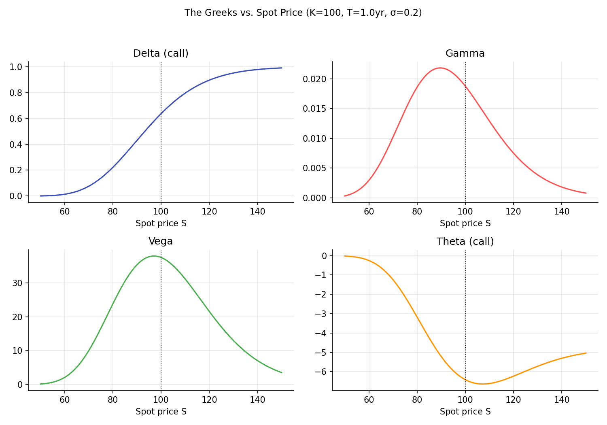
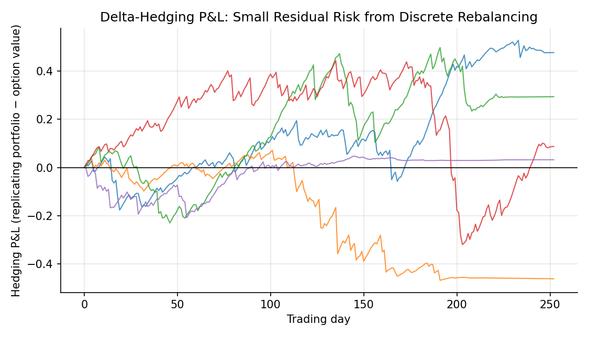

# The Greeks

!!! objectives "Learning objectives"
    By the end of this lecture you should be able to:

    - [ ] Define delta, gamma, vega, theta, and rho as partial derivatives of the Black-Scholes price
    - [ ] Derive the Black-Scholes delta and explain its dual role as a hedge ratio and an approximate exercise probability
    - [ ] Explain the relationship between gamma and the accuracy of a delta hedge, using a Taylor expansion
    - [ ] Compute the Greeks in Python and simulate a delta-hedging strategy to see gamma risk directly

## 1. Intuition

The Black-Scholes price is a function of five inputs: \( S_0,K,r,\sigma,T \). The **Greeks** are the partial derivatives of that price with respect to each of these inputs (or, for gamma, a second derivative), and they answer the practical question every options trader and risk manager asks constantly: if one input moves a little, how much does the option's value move? This is exactly the Calculus for Finance lecture's "sensitivities" idea, applied directly to the pricing formula derived in the previous lecture.

The Greeks serve two purposes at once. First, they are **hedging instructions**: delta, specifically, tells a market maker exactly how many shares of the underlying to hold to offset a short option position's exposure to small price moves, the same replicating-portfolio idea from the Binomial Trees lecture, now expressed as a continuous, instantaneously-updated quantity rather than a discrete tree calculation. Second, they are **risk decomposition**: a complex options book's total exposure to market moves, volatility changes, and time decay can be summarized by aggregating the Greeks across every position, rather than having to reprice the entire book from scratch for every small market change.

## 2. Mathematical formulation

For a European call, using the Black-Scholes notation from the previous lecture (\( d_1,d_2,N(\cdot) \) as defined there, and \( N'(\cdot) \) the standard Normal density):

\[
\Delta_{\text{call}} = \frac{\partial C}{\partial S_0} = N(d_1), \qquad \Delta_{\text{put}} = N(d_1)-1
\]

\[
\Gamma = \frac{\partial^2 C}{\partial S_0^2} = \frac{\partial \Delta}{\partial S_0} = \frac{N'(d_1)}{S_0\sigma\sqrt T}
\]

(gamma is identical for calls and puts with the same strike and maturity, a consequence of put-call parity, shown in Section 3)

\[
\text{Vega} = \frac{\partial C}{\partial \sigma} = S_0\,N'(d_1)\sqrt T
\]

(also identical for calls and puts, by the same parity argument)

\[
\Theta_{\text{call}} = \frac{\partial C}{\partial t} = -\frac{S_0N'(d_1)\sigma}{2\sqrt T} - rKe^{-rT}N(d_2)
\]

\[
\rho_{\text{call}} = \frac{\partial C}{\partial r} = KTe^{-rT}N(d_2)
\]

where \( N'(x)=\frac{1}{\sqrt{2\pi}}e^{-x^2/2} \) is the standard Normal density.

## 3. Derivation

**Why gamma and vega are identical for calls and puts.** Differentiate put-call parity, \( C-P=S_0-Ke^{-rT} \) (Options and No-Arbitrage Bounds, and verified for Black-Scholes in the previous lecture), with respect to \( S_0 \) once more (having already differentiated once to get \( \Delta_{\text{call}}-\Delta_{\text{put}}=1 \), itself just confirming the call/put delta relationship in Section 2):

\[
\frac{\partial^2 C}{\partial S_0^2} - \frac{\partial^2 P}{\partial S_0^2} = \frac{\partial^2}{\partial S_0^2}\big(S_0-Ke^{-rT}\big) = 0 \quad\Longrightarrow\quad \Gamma_{\text{call}}=\Gamma_{\text{put}}
\]

since the right-hand side, \( S_0-Ke^{-rT} \), is linear in \( S_0 \) and its second derivative is exactly zero. An identical argument differentiating parity with respect to \( \sigma \) (which does not appear at all on the right-hand side, so its derivative is trivially zero) gives \( \text{Vega}_{\text{call}}=\text{Vega}_{\text{put}} \). This is a clean example of how a model-free relationship (parity) constrains even model-specific quantities (the Greeks) derived from a particular pricing formula.

**Why gamma measures the error of a delta hedge, via a Taylor expansion.** Consider a market maker who has sold a call and hedges by holding \( \Delta \) shares of the underlying, so the combined (hedged) portfolio's value is \( V=-C+\Delta S_0 \), chosen so that to *first order*, a small move in \( S_0 \) leaves \( V \) unchanged: \( \partial V/\partial S_0=-\Delta_{\text{call}}+\Delta=0 \) when \( \Delta=\Delta_{\text{call}} \), exactly the replication idea from the Binomial Trees lecture, now instantaneous rather than over a discrete step. But a Taylor expansion of the option price for a finite (not infinitesimal) move \( \delta S \) in the underlying (the Calculus for Finance lecture's Taylor series, applied here) gives

\[
C(S_0+\delta S) \approx C(S_0) + \Delta\,\delta S + \tfrac12\Gamma\,(\delta S)^2
\]

The hedged portfolio's change in value is therefore approximately \( -\big[\Delta\,\delta S+\tfrac12\Gamma(\delta S)^2\big]+\Delta\,\delta S=-\tfrac12\Gamma(\delta S)^2 \): the first-order (delta) terms cancel exactly by construction, but the **second-order (gamma) term survives**, and it is always negative for a short-call, delta-hedged position (since \( \Gamma>0 \) always for a plain vanilla option, from Section 2's formula, which is manifestly positive). This is precisely why delta hedging is not a perfect, risk-free hedge for any finite move: it eliminates first-order (linear) price risk but leaves a residual, gamma-driven exposure that grows with the *square* of the underlying's move, exactly the same first-order-versus-second-order distinction the Calculus for Finance lecture drew between duration and convexity for bonds. A larger gamma (which Section 2's formula shows is largest when the option is near the strike and close to expiration) means a delta hedge needs more frequent rebalancing to stay accurate, since the hedge's accuracy window shrinks as gamma grows.

## 4. Worked numerical example

Using the same inputs as the Black-Scholes worked example (\( S_0=K=100,\ r=5\%,\ \sigma=20\%,\ T=1 \), where \( d_1=0.35,\ d_2=0.15 \)):

\[
\Delta_{\text{call}} = N(0.35) \approx 0.6368
\]

\[
\Gamma = \frac{N'(0.35)}{100\times0.2\times\sqrt1} = \frac{0.3752}{20} \approx 0.01876
\]

\[
\text{Vega} = 100\times0.3752\times\sqrt1 \approx 37.52
\]

A delta of 0.6368 means a market maker who sold one call should hold approximately 0.6368 shares of the underlying to be instantaneously hedged against small price moves. The vega of 37.52 (conventionally often quoted per 1% change in volatility, i.e., divided by 100, giving about \$0.375) means a 1 percentage point rise in volatility (e.g., from 20% to 21%) raises the call's value by roughly \$0.375, holding everything else fixed.

## 5. Python implementation

```python
import numpy as np
from scipy.stats import norm

def bs_greeks(S0, K, r, sigma, T, option_type="call"):
    d1 = (np.log(S0/K) + (r + 0.5*sigma**2)*T) / (sigma*np.sqrt(T))
    d2 = d1 - sigma*np.sqrt(T)

    if option_type == "call":
        delta = norm.cdf(d1)
        theta = -S0*norm.pdf(d1)*sigma/(2*np.sqrt(T)) - r*K*np.exp(-r*T)*norm.cdf(d2)
        rho = K*T*np.exp(-r*T)*norm.cdf(d2)
    else:
        delta = norm.cdf(d1) - 1
        theta = -S0*norm.pdf(d1)*sigma/(2*np.sqrt(T)) + r*K*np.exp(-r*T)*norm.cdf(-d2)
        rho = -K*T*np.exp(-r*T)*norm.cdf(-d2)

    gamma = norm.pdf(d1) / (S0*sigma*np.sqrt(T))   # same for call and put
    vega = S0*norm.pdf(d1)*np.sqrt(T)              # same for call and put

    return {"delta": delta, "gamma": gamma, "vega": vega, "theta": theta, "rho": rho}

S0, K, r, sigma, T = 100.0, 100.0, 0.05, 0.20, 1.0
g = bs_greeks(S0, K, r, sigma, T, "call")
for name, value in g.items():
    print(f"{name:>6}: {value:.5f}")

# --- Verify gamma and vega are identical for call and put ---
g_put = bs_greeks(S0, K, r, sigma, T, "put")
print(f"\nGamma call={g['gamma']:.5f}, put={g_put['gamma']:.5f}  (should match)")
print(f"Vega  call={g['vega']:.5f}, put={g_put['vega']:.5f}  (should match)")

# --- Verify delta numerically via finite differences, against the closed form ---
def bs_price(S0, K, r, sigma, T, option_type="call"):
    d1 = (np.log(S0/K) + (r + 0.5*sigma**2)*T) / (sigma*np.sqrt(T))
    d2 = d1 - sigma*np.sqrt(T)
    if option_type == "call":
        return S0*norm.cdf(d1) - K*np.exp(-r*T)*norm.cdf(d2)
    return K*np.exp(-r*T)*norm.cdf(-d2) - S0*norm.cdf(-d1)

h = 0.01
numeric_delta = (bs_price(S0+h, K, r, sigma, T) - bs_price(S0-h, K, r, sigma, T)) / (2*h)
print(f"\nNumeric delta (finite difference): {numeric_delta:.5f}")
print(f"Closed-form delta:                 {g['delta']:.5f}")
```


Continuing directly from the code above, here is the plotting code that produces both charts in Section 6:

```python
import matplotlib.pyplot as plt

# --- Chart 1: the four main Greeks vs. spot price ---
S_range = np.linspace(50, 150, 200)
deltas = [bs_greeks(s, K, r, sigma, T, "call")["delta"] for s in S_range]
gammas = [bs_greeks(s, K, r, sigma, T, "call")["gamma"] for s in S_range]
vegas  = [bs_greeks(s, K, r, sigma, T, "call")["vega"]  for s in S_range]
thetas = [bs_greeks(s, K, r, sigma, T, "call")["theta"] for s in S_range]

fig, axes = plt.subplots(2, 2, figsize=(10, 7))
axes[0,0].plot(S_range, deltas, color="#3f51b5"); axes[0,0].set_title("Delta (call)")
axes[0,1].plot(S_range, gammas, color="#ff5252"); axes[0,1].set_title("Gamma")
axes[1,0].plot(S_range, vegas, color="#4caf50"); axes[1,0].set_title("Vega")
axes[1,1].plot(S_range, thetas, color="#ff9800"); axes[1,1].set_title("Theta (call)")
for a in axes.flat:
    a.axvline(K, color="black", ls=":", lw=0.8)
    a.set_xlabel("Spot price S")
fig.suptitle(f"The Greeks vs. Spot Price (K={K:.0f}, T={T:.0f}yr, σ={sigma})", fontsize=11)
fig.tight_layout(rect=[0, 0, 1, 0.95])
plt.show()

# --- Chart 2: simulated daily-rebalanced delta-hedging P&L ---
rng = np.random.default_rng(131)
mu, n_steps, n_paths = 0.08, 252, 5
dt = T / n_steps

fig, ax = plt.subplots(figsize=(7.5, 4.3))
for _ in range(n_paths):
    S = np.zeros(n_steps + 1); S[0] = S0
    Z = rng.normal(size=n_steps)
    for t in range(1, n_steps + 1):
        S[t] = S[t-1] * np.exp((mu - 0.5*sigma**2)*dt + sigma*np.sqrt(dt)*Z[t-1])

    delta_prev = bs_greeks(S0, K, r, sigma, T, "call")["delta"]
    cash = bs_price(S0, K, r, sigma, T) - delta_prev * S0   # premium received minus initial hedge cost
    pnl = np.zeros(n_steps + 1)

    for t in range(1, n_steps + 1):
        tau = T - t*dt
        cash *= np.exp(r*dt)
        delta_t = bs_greeks(S[t], K, r, sigma, max(tau, 1e-6), "call")["delta"] if tau > 1e-6 else (1.0 if S[t] > K else 0.0)
        cash -= (delta_t - delta_prev) * S[t]
        delta_prev = delta_t
        port_value = delta_t * S[t] + cash
        option_value = bs_price(S[t], K, r, sigma, tau) if tau > 1e-6 else max(S[t] - K, 0)
        pnl[t] = port_value - option_value

    ax.plot(pnl, lw=1, alpha=0.8)

ax.axhline(0, color="black", lw=0.8)
ax.set_xlabel("Trading day"); ax.set_ylabel("Hedging P&L (replicating portfolio − option value)")
ax.set_title("Delta-Hedging P&L: Small Residual Risk from Discrete Rebalancing")
fig.tight_layout()
plt.show()
```

## 6. Visualization

<figure class="qf-figure" markdown>

<figcaption>The four main Greeks for a call option, as a function of spot price (strike marked with a dotted line). Delta rises smoothly from 0 to 1 as the option moves from deep out-of-the-money to deep in-the-money; gamma and vega both peak sharply near the strike, exactly where the option's value is most sensitive to small moves and most uncertain about whether it will finish in or out of the money.</figcaption>
</figure>

<figure class="qf-figure" markdown>

<figcaption>Simulated P&L of a daily-rebalanced delta-hedged short-call position, across five simulated price paths. Each path's hedging error stays relatively small but is not exactly zero, the residual gamma risk derived algebraically in Section 3: a delta hedge rebalanced only once per day, not continuously, cannot perfectly cancel a nonlinear option payoff.</figcaption>
</figure>

## 7. Financial interpretation

Options market makers manage their books primarily through the Greeks: a "delta-neutral" book has no first-order exposure to small underlying moves, but as Section 3 shows, remains exposed to gamma (the risk of larger moves) and vega (the risk of volatility changing), both of which require separate, explicit hedging or risk limits. Theta's negative sign for a long option position (visible in Section 6's chart) is the formal expression of "options lose value as time passes, all else equal", the option seller earns this time decay as compensation for bearing the gamma and vega risk the buyer has transferred to them. The entire practice of "Greek-based risk management" is, at its core, a Taylor-expansion approach to risk: approximate a complex, nonlinear portfolio's response to market moves using its first and second derivatives, exactly the same mathematical idea as bond duration and convexity from the Calculus for Finance lecture, applied here to options instead.

## 8. Common mistakes

!!! danger "Common mistake: treating delta hedging as a perfect hedge"
    As derived explicitly in Section 3 and shown in Section 6's simulation, a delta hedge only cancels first-order risk; the residual gamma exposure means a delta-hedged position is not risk-free, especially for large underlying moves or long gaps between rebalancing.

!!! danger "Common mistake: confusing the sign conventions across calls, puts, and long/short positions"
    Theta is typically negative for a *long* option position (value erodes over time) but the sign flips for a short position; delta is positive for a long call but negative for a long put. Keeping these signs straight, and being explicit about which position is being described, matters enormously when aggregating Greeks across a mixed book of long and short positions.

!!! danger "Common mistake: ignoring gamma and vega when 'delta-hedging is enough'"
    A position with zero delta can still carry substantial gamma and vega risk (this is exactly what "delta-neutral" means, zero first-order risk, not zero risk overall), and ignoring these higher-order Greeks when they are large, particularly near expiration or near the strike where gamma peaks (Section 6), can lead to large, unexpected losses from moves a simple delta hedge was never designed to protect against.

## 9. Exercises

1. Using the code in Section 5, compute all five Greeks for a put with the same inputs as the worked call example, and verify \( \Delta_{\text{put}}=\Delta_{\text{call}}-1 \) numerically.
2. Compute gamma and vega for the same option at three different maturities (0.1, 1, and 5 years) and explain, using the formulas in Section 2, why both tend to fall as maturity grows very large (for fixed moneyness).
3. Extend the delta-hedging simulation in Section 5 to rebalance only once per week instead of daily, and compare the resulting hedging P&L variability to the daily-rebalanced case. Relate your observation to the Taylor-expansion argument in Section 3 about how hedging frequency affects residual gamma risk.

## 10. Further reading

- Taleb's *Dynamic Hedging* is a practitioner-oriented classic specifically on managing Greeks in a real trading book.

## 11. References

1. Hull, J. C. (2022). *Options, Futures, and Other Derivatives* (11th ed.), Chapter 19. Pearson.
2. Taleb, N. N. (1997). *Dynamic Hedging: Managing Vanilla and Exotic Options*. Wiley.
3. Black, F., & Scholes, M. (1973). "The Pricing of Options and Corporate Liabilities." *Journal of Political Economy*, 81(3), 637–654.

---

<div class="grid" markdown>
[:material-arrow-left: Previous: Black-Scholes-Merton Model](/qf-lectures/derivatives/black-scholes-merton/){ .md-button }
[Next: Implied Volatility and the Volatility Smile :material-arrow-right:](/qf-lectures/derivatives/implied-volatility-smile/){ .md-button .md-button--primary }
</div>
