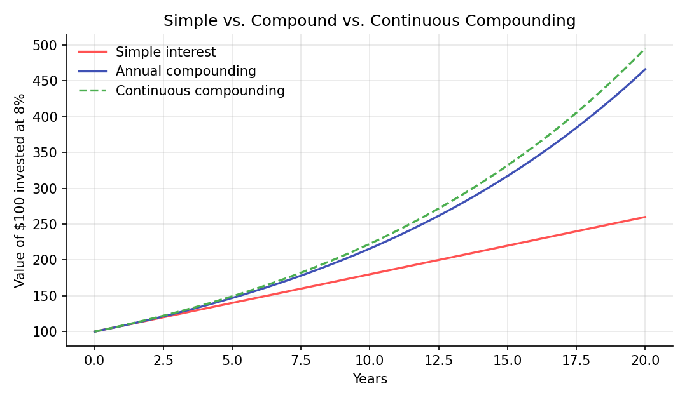
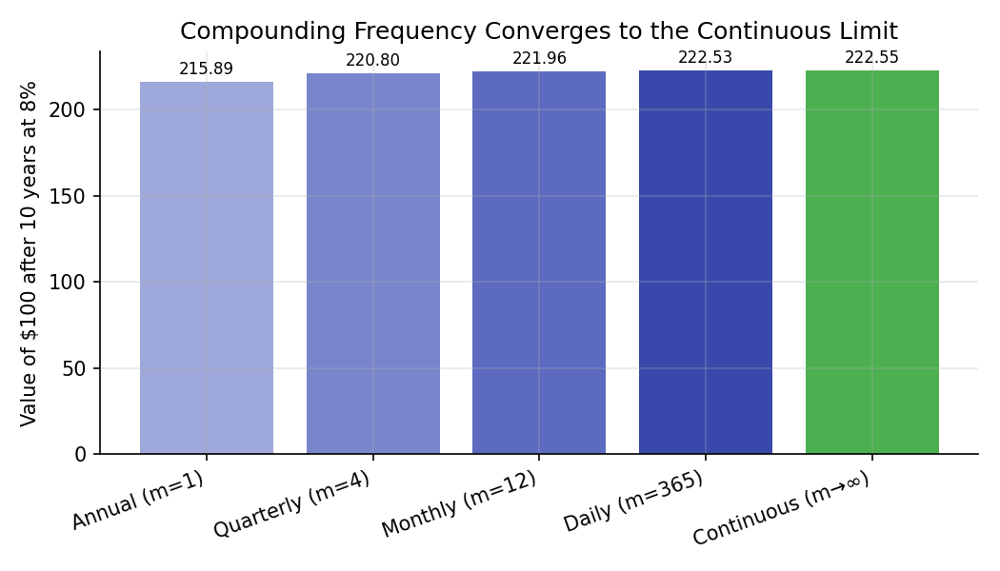

# Compounding and the Time Value of Money

!!! objectives "Learning objectives"
    By the end of this lecture you should be able to:

    - [ ] State the time value of money principle and explain why it follows from the existence of a positive interest rate
    - [ ] Derive the future value and present value formulas under simple interest, discrete (periodic) compounding, and continuous compounding
    - [ ] Explain why continuous compounding is the natural limit of discrete compounding as the compounding frequency increases, and derive that limit
    - [ ] Compute future value, present value, and effective annual rates in Python, and convert correctly between nominal and continuously compounded rates

## 1. Intuition

A dollar today is worth more than a dollar a year from now — not because of inflation (though that's real too), but because a dollar today can be *invested* to earn a return, becoming more than a dollar by next year. This is the **time value of money**: money has a "rental price," the interest rate, and that price is what lets us compare cash flows that happen at different points in time on a common footing.

**Compounding** is what happens when interest itself earns interest. \$100 growing at 8% simple interest gains a flat \$8 every year forever. \$100 compounding at 8% annually gains \$8 in year one, but in year two it gains 8% of \$108 — slightly more than \$8 — because the first year's interest is now also earning interest. This snowballing effect is the single most important mechanism in this lecture, and understanding exactly how it behaves as you compound more and more frequently (annually, monthly, daily, continuously) sets up the mathematics used throughout Module 5 (Brownian motion, geometric Brownian motion) and Module 4 (Black-Scholes discounting).

## 2. Mathematical formulation

Let \( PV \) be the present value (today's value) of an amount of money, \( FV \) its future value at some later time, \( r \) the interest rate, and \( t \) the time elapsed (in years).

**Simple interest.** Interest is earned only on the original principal:

\[
FV = PV \,(1 + rt)
\]

**Discrete (periodic) compounding.** Interest compounds \( m \) times per year at nominal annual rate \( r \), over \( t \) years:

\[
FV = PV \left(1 + \frac{r}{m}\right)^{mt}
\]

where:

- \( PV \) — the present (initial) value
- \( r \) — the nominal annual interest rate (e.g., 0.08 for 8%)
- \( m \) — the number of compounding periods per year (1 = annual, 12 = monthly, 365 = daily)
- \( t \) — the number of years
- \( FV \) — the resulting future value after \( t \) years

**Continuous compounding.** The limit as compounding frequency \( m \to \infty \):

\[
FV = PV \, e^{rt}
\]

**Present value** (discounting) is simply the future-value formula solved for \( PV \) — under continuous compounding:

\[
PV = FV \, e^{-rt}
\]

**Effective annual rate (EAR)** converts any compounding convention into the annually-compounded rate that produces the same growth:

\[
\text{EAR} = \left(1 + \frac{r}{m}\right)^{m} - 1 \qquad \text{(discrete)} \qquad\qquad \text{EAR} = e^{r} - 1 \qquad \text{(continuous)}
\]

## 3. Derivation

**Claim: continuous compounding is the limit of discrete compounding as \( m \to \infty \).**

Start from the discrete compounding formula and take the limit as the compounding frequency \( m \) grows without bound, holding the nominal rate \( r \) and time \( t \) fixed:

\[
\lim_{m \to \infty} \left(1 + \frac{r}{m}\right)^{mt}
\]

Substitute \( n = m/r \) (so \( m = nr \) and \( m \to \infty \iff n \to \infty \)):

\[
\lim_{n \to \infty} \left(1 + \frac{1}{n}\right)^{nrt} = \left[ \lim_{n \to \infty} \left(1 + \frac{1}{n}\right)^{n} \right]^{rt}
\]

The bracketed limit is the standard definition of Euler's number:

\[
\lim_{n \to \infty} \left(1 + \frac{1}{n}\right)^{n} = e
\]

so the whole expression collapses to \( e^{rt} \), giving \( FV = PV\, e^{rt} \) exactly as stated in Section 2. This is not a separate assumption — continuous compounding is *mechanically* what discrete compounding becomes as the compounding periods get infinitely short, which is exactly the same limiting idea that motivates modeling asset prices as evolving continuously in time (Brownian motion, Module 5) rather than only at discrete daily or monthly steps.

**Why compounding more often always earns you at least as much.** Because \( m \) only appears as \( (1 + r/m)^m \), and this expression is increasing in \( m \) for fixed \( r > 0 \) (each extra compounding period lets a smaller, positive amount of interest start earning interest slightly sooner), the discrete formula is bounded above by, and converges monotonically to, the continuous formula. This is why the annual, monthly, daily, and continuous curves in Section 6's chart stack in that specific order — annual lowest, continuous highest — for the same nominal rate.

## 4. Worked numerical example

Invest \$100 at a nominal annual rate of 8% for 10 years.

**Simple interest:**

$$
FV = 100 \times (1 + 0.08 \times 10) = 100 \times 1.80 = \$180.00
$$

**Annual compounding** (\(m=1\)):

$$
FV = 100 \times (1.08)^{10} = \$215.89
$$

**Monthly compounding** (\(m=12\)):

$$
FV = 100 \times \left(1 + \frac{0.08}{12}\right)^{120} = \$221.96
$$

**Continuous compounding:**

$$
FV = 100 \times e^{0.08 \times 10} = 100 \times e^{0.8} = \$222.55
$$

Note the ordering: \$180.00 (simple) < \$215.89 (annual) < \$221.96 (monthly) < \$222.55 (continuous) — exactly the monotonic convergence proven in Section 3, with diminishing additional gains as compounding frequency keeps increasing.

## 5. Python implementation

```python
import numpy as np

PV = 100.0
r = 0.08
t = 10

# --- Simple interest ---
fv_simple = PV * (1 + r * t)

# --- Discrete compounding at various frequencies ---
def fv_discrete(pv, rate, years, m):
    return pv * (1 + rate / m) ** (m * years)

fv_annual   = fv_discrete(PV, r, t, m=1)
fv_monthly  = fv_discrete(PV, r, t, m=12)
fv_daily    = fv_discrete(PV, r, t, m=365)

# --- Continuous compounding: the limit as m -> infinity ---
fv_continuous = PV * np.exp(r * t)

print(f"Simple:      ${fv_simple:.2f}")
print(f"Annual:      ${fv_annual:.2f}")
print(f"Monthly:     ${fv_monthly:.2f}")
print(f"Daily:       ${fv_daily:.2f}")
print(f"Continuous:  ${fv_continuous:.2f}")

# --- Present value: discounting a future cash flow back to today ---
FV_target = 1000.0
years_out = 5
pv_continuous = FV_target * np.exp(-r * years_out)
print(f"\nPV of $1,000 in 5 years at 8% (continuous): ${pv_continuous:.2f}")

# --- Effective annual rate (EAR): comparing compounding conventions on equal footing ---
nominal_rate = 0.08
ear_monthly = (1 + nominal_rate / 12) ** 12 - 1
ear_continuous = np.exp(nominal_rate) - 1
print(f"\nEAR (nominal 8%, monthly compounding):    {ear_monthly*100:.4f}%")
print(f"EAR (nominal 8%, continuous compounding): {ear_continuous*100:.4f}%")

# --- Converting a discretely-compounded rate to its continuous equivalent ---
# Used constantly in Module 4/5: r_continuous = ln(1 + EAR)
r_continuous_equiv = np.log(1 + ear_monthly)
print(f"\nContinuous rate equivalent to that monthly-compounded EAR: {r_continuous_equiv*100:.4f}%")
```

## 6. Visualization

<figure class="qf-figure" markdown>

<figcaption>$100 invested at 8% under three conventions. Simple interest (red) grows linearly. Annual compounding (blue) and continuous compounding (green, dashed) both grow exponentially, with continuous compounding always at or above annual compounding — the monotonic ordering proven in Section 3.</figcaption>
</figure>

<figure class="qf-figure" markdown>

<figcaption>The same $100 at 8% for 10 years, compounded at increasing frequency. Each step toward more frequent compounding closes part of the gap to the continuous limit (green) — but with rapidly diminishing gains, illustrating why daily and continuous compounding are numerically almost indistinguishable in practice.</figcaption>
</figure>

## 7. Financial interpretation

The time value of money is the reason every valuation technique in this curriculum — bond pricing (this module), option pricing (Module 4), portfolio net present value calculations (Module 3) — starts by **discounting** future cash flows back to the present using some interest rate. Continuous compounding isn't just a mathematical curiosity: it's the convention used almost universally in derivatives pricing (the risk-free discount factor in Black-Scholes is \( e^{-rT} \), not \( (1+r)^{-T} \)) precisely because it's the natural limit that arises when modeling prices as evolving continuously through time, and because continuously compounded (log) returns are additive, as shown in the previous lecture.

## 8. Common mistakes

!!! danger "Common mistake: mixing nominal and effective rates"
    Quoting a "12% annual rate, compounded monthly" and then plugging 12% directly into an annual-compounding formula understates the true growth — the effective annual rate (EAR) is what should be compared across products with different compounding frequencies, not the nominal rate.

!!! danger "Common mistake: using the wrong discount factor convention"
    Discounting a cash flow with \( (1+r)^{-t} \) when the rate quoted is actually continuously compounded (or vice versa) introduces a small but real pricing error. Always check which convention a quoted rate uses before discounting — Section 5's code shows how to convert between them via \( r_{\text{continuous}} = \ln(1 + \text{EAR}) \).

!!! danger "Common mistake: applying simple interest over long horizons"
    Simple interest is only appropriate for very short-term instruments (e.g., some money-market calculations) or as a first approximation. Applying it over multi-year horizons, where compounding effects are material, significantly understates true growth, as the 10-year example in Section 4 shows (\$180 vs. \$215.89+).

## 9. Exercises

1. \$5,000 is invested for 15 years at a nominal annual rate of 6%. Compute the future value under annual, quarterly, and continuous compounding, and rank them.
2. Derive, from the continuous-compounding present value formula, the interest rate \( r \) implied by a bond that costs \$950 today and pays \$1,000 in exactly 1 year (assume no coupons). Solve for \( r \) algebraically before checking your answer numerically.
3. Two savings accounts advertise "10% annual, compounded annually" and "9.8% annual, compounded monthly." Compute the EAR of each and determine which is actually the better deal.

## 10. Further reading

- Any standard corporate finance textbook's chapter on time value of money is a good supplementary read — cross-check formulas against the references below.

## 11. References

1. Bodie, Z., Kane, A., & Marcus, A. J. (2021). *Investments* (12th ed.), Chapter 14 (Bond discounting conventions). McGraw-Hill.
2. Hull, J. C. (2022). *Options, Futures, and Other Derivatives* (11th ed.), Chapter 4 (Interest rates and compounding conventions). Pearson.
3. Shreve, S. E. (2004). *Stochastic Calculus for Finance I*, Chapter 1 (Discrete-time models and discounting). Springer Finance.
4. NumPy Developers. "`numpy.exp`." [numpy.org/doc](https://numpy.org/doc/stable/reference/generated/numpy.exp.html)

---

<div class="grid" markdown>
[:material-arrow-left: Previous: Returns and Log Returns](/qf-lectures/financial-foundations/returns-and-log-returns/){ .md-button }
[Next: Financial Instruments: Equities and Bonds :material-arrow-right:](/qf-lectures/financial-foundations/equities-and-bonds/){ .md-button .md-button--primary }
</div>
