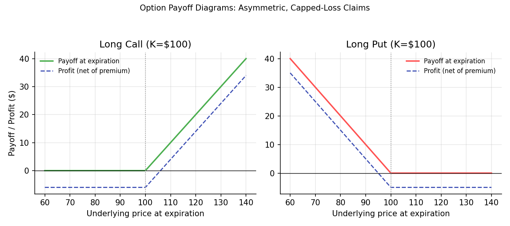
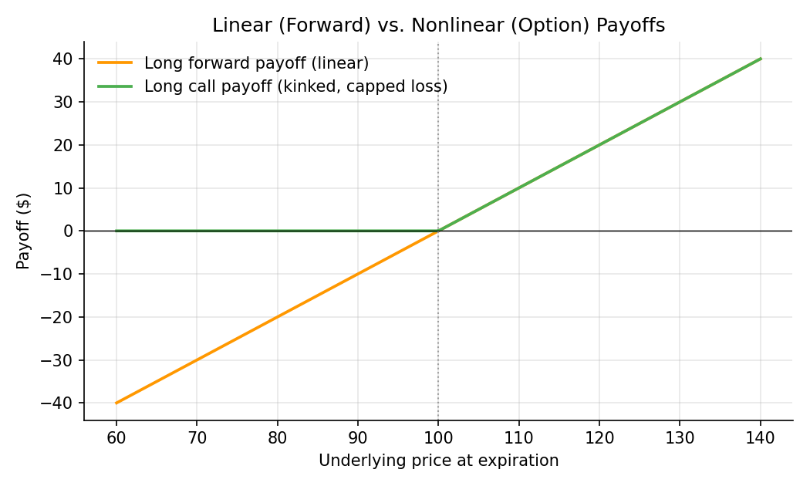

# Derivatives: An Overview

!!! objectives "Learning objectives"
    By the end of this lecture you should be able to:

    - [ ] Define a derivative contract and explain how its value derives from an underlying asset
    - [ ] Distinguish forwards, futures, and options by their obligations, payoff shapes, and risk profiles
    - [ ] Write and plot the payoff functions of a forward, a call option, and a put option at expiration
    - [ ] Explain the difference between hedging and speculating with derivatives, and identify which motive a given position reflects

## 1. Intuition

A **derivative** is a contract whose value is *derived* from something else — an underlying asset like a stock, a bond, a commodity, or an interest rate — rather than being an asset in its own right. You don't own the underlying when you hold a derivative; you own a claim on some function of its future price.

The three basic building blocks are:

- A **forward** (or its exchange-traded cousin, a **future**) is an obligation: both parties commit today to transact at a fixed price on a future date, whatever the market price turns out to be then.
- An **option** is a right, not an obligation: the holder can choose whether to exercise it. A **call** gives the right to *buy* the underlying at a fixed price; a **put** gives the right to *sell* it.

This obligation-versus-right distinction is the single most important idea in this lecture. It is what makes forward/future payoffs **linear** (symmetric gains and losses) and option payoffs **kinked** (asymmetric: the buyer's loss is capped at the premium paid, while the upside is not) — a difference made precise in Section 2 and visualized in Section 6, and one that drives the entire pricing apparatus built in Module 4.

## 2. Mathematical formulation

Let \( S_T \) be the price of the underlying asset at the contract's expiration date \( T \), and \( K \) the fixed price specified in the contract (the forward price, or the option's **strike price**).

**Forward contract payoff** (to the long/buyer side, who has agreed to buy at \( K \)):

\[
\text{Payoff}_{\text{forward}} = S_T - K
\]

This is symmetric and unbounded in both directions: the long side gains dollar-for-dollar if \( S_T > K \), and loses dollar-for-dollar if \( S_T < K \).

**Call option payoff** (to the holder, who has the *right* to buy at \( K \)):

\[
\text{Payoff}_{\text{call}} = \max(S_T - K,\ 0)
\]

**Put option payoff** (to the holder, who has the *right* to sell at \( K \)):

\[
\text{Payoff}_{\text{put}} = \max(K - S_T,\ 0)
\]

where:

- \( S_T \) — the underlying's price at expiration; the only random/uncertain quantity in these formulas
- \( K \) — the strike (options) or agreed forward price, fixed at contract inception
- \( \max(\cdot, 0) \) — the "floor at zero" that gives options their asymmetric, one-sided payoff: the holder never has a *negative* payoff at expiration, because they simply decline to exercise when it's unfavorable

**Option profit** (as opposed to raw payoff) subtracts the premium \( c \) (for a call) or \( p \) (for a put) paid upfront to acquire the option:

\[
\text{Profit}_{\text{call}} = \max(S_T - K,\ 0) - c \qquad \qquad \text{Profit}_{\text{put}} = \max(K - S_T,\ 0) - p
\]

## 3. Derivation

**Why is a forward payoff linear while an option payoff is kinked?**

This isn't really a derivation so much as a direct reading of the contractual obligation each instrument creates, but it's worth making the logic explicit because it explains where the \( \max(\cdot, 0) \) comes from.

A forward is a **binding, two-sided** commitment: both counterparties *must* transact at \( K \) regardless of where \( S_T \) ends up. There is no "opt out," so the payoff function is simply the difference \( S_T - K \) — a straight line, with slope 1, extending without bound in both directions.

An option, by construction, is **one-sided**: only the holder decides whether to exercise, and a rational holder exercises if and only if doing so is profitable, i.e., only when the intrinsic payoff would be positive. For a call, exercising is worthwhile exactly when \( S_T > K \) (buying at \( K \) below the market price \( S_T \) captures a gain of \( S_T - K \)); when \( S_T \le K \), the holder simply lets the option expire worthless rather than exercising into a loss. Formally, the holder's optimal decision is

\[
\text{Payoff}_{\text{call}} = \max\big(\, \underbrace{S_T - K}_{\text{payoff if exercised}},\ \ \underbrace{0}_{\text{payoff if not exercised}} \,\big) = \max(S_T-K,\ 0)
\]

The put payoff follows by the same argument with the buy/sell direction reversed. This is why every option payoff diagram has a flat region (where the option is left unexercised, and the holder's downside is capped) meeting a linear region (where it behaves just like a forward) at the strike price \( K \) — the kink visible in Section 6's chart is the geometric signature of that optimal exercise decision.

## 4. Worked numerical example

**Forward:** An investor agrees today to buy an asset in 3 months at a forward price of \$100. If the asset is at \$115 at expiration, the payoff is \( 115 - 100 = +\$15 \). If instead it's at \$85, the payoff is \( 85 - 100 = -\$15 \) — a real loss, since the forward is a binding obligation.

**Call option:** An investor pays a \$6 premium for a call option with strike \( K = \$100 \).

- If \( S_T = \$115 \): payoff \( = \max(115-100, 0) = \$15 \); profit \( = 15 - 6 = +\$9 \).
- If \( S_T = \$95 \): payoff \( = \max(95-100, 0) = \$0 \) (the option expires worthless); profit \( = 0 - 6 = -\$6 \) — the loss is capped at the \$6 premium, no matter how far below \$100 the price falls.

**Put option:** An investor pays a \$5 premium for a put option with strike \( K = \$100 \).

- If \( S_T = \$85 \): payoff \( = \max(100-85, 0) = \$15 \); profit \( = 15 - 5 = +\$10 \).
- If \( S_T = \$115 \): payoff \( = \max(100-115, 0) = \$0 \); profit \( = 0 - 5 = -\$5 \).

Compare the call's \$95 scenario to the forward's \$85 scenario: the forward buyer's loss grows without limit as the price falls further, while the call holder's loss is fixed at the \$6 premium regardless of how far the price falls — the capped-downside property proven in Section 3.

## 5. Python implementation

```python
import numpy as np

def forward_payoff(S_T, K):
    """Payoff to the long side of a forward contract."""
    return S_T - K

def call_payoff(S_T, K):
    """Payoff to the holder of a European call option."""
    return np.maximum(S_T - K, 0)

def put_payoff(S_T, K):
    """Payoff to the holder of a European put option."""
    return np.maximum(K - S_T, 0)

K = 100.0
S_T_grid = np.linspace(60, 140, 9)

print(f"{'S_T':>6} | {'Forward':>8} | {'Call':>6} | {'Put':>6}")
for S_T in S_T_grid:
    fwd = forward_payoff(S_T, K)
    call = call_payoff(S_T, K)
    put = put_payoff(S_T, K)
    print(f"{S_T:6.0f} | {fwd:8.2f} | {call:6.2f} | {put:6.2f}")

# --- Profit (net of premium) for a specific scenario ---
premium_call = 6.0
premium_put = 5.0
S_T_scenario = 115.0

call_profit = call_payoff(S_T_scenario, K) - premium_call
put_profit = put_payoff(S_T_scenario, K) - premium_put
print(f"\nAt S_T=${S_T_scenario:.0f}:  call profit = ${call_profit:.2f},  put profit = ${put_profit:.2f}")

# --- Put-call parity check (a no-arbitrage relationship covered fully in Module 4) ---
# For European options with the same K and T on a non-dividend-paying stock:
#   C - P = S_0 - K * exp(-r*T)
# This is a preview; the full derivation and its arbitrage argument appear in Module 4.
```


Continuing directly from the code above, here is the plotting code that produces both charts in Section 6:

```python
import matplotlib.pyplot as plt

S_grid = np.linspace(60, 140, 200)
call_pay = call_payoff(S_grid, K)
put_pay = put_payoff(S_grid, K)

# --- Chart 1: call and put payoff/profit diagrams ---
fig, axes = plt.subplots(1, 2, figsize=(9, 4))
axes[0].plot(S_grid, call_pay, color="#4caf50", linewidth=1.8, label="Payoff at expiration")
axes[0].plot(S_grid, call_pay - premium_call, color="#3f51b5", linewidth=1.4,
             linestyle="--", label="Profit (net of premium)")
axes[0].axhline(0, color="black", linewidth=0.7)
axes[0].axvline(K, color="#9e9e9e", linestyle=":", linewidth=1)
axes[0].set_title(f"Long Call (K=${K:.0f})"); axes[0].legend(frameon=False, fontsize=8)

axes[1].plot(S_grid, put_pay, color="#ff5252", linewidth=1.8, label="Payoff at expiration")
axes[1].plot(S_grid, put_pay - premium_put, color="#3f51b5", linewidth=1.4,
             linestyle="--", label="Profit (net of premium)")
axes[1].axhline(0, color="black", linewidth=0.7)
axes[1].axvline(K, color="#9e9e9e", linestyle=":", linewidth=1)
axes[1].set_title(f"Long Put (K=${K:.0f})"); axes[1].legend(frameon=False, fontsize=8)

fig.suptitle("Option Payoff Diagrams: Asymmetric, Capped-Loss Claims", fontsize=10)
fig.tight_layout(rect=[0, 0, 1, 0.93])
plt.show()

# --- Chart 2: linear forward payoff vs. kinked call payoff ---
fig, ax = plt.subplots(figsize=(7, 4.2))
ax.plot(S_grid, forward_payoff(S_grid, K), color="#ff9800", linewidth=1.8, label="Long forward payoff (linear)")
ax.plot(S_grid, call_pay, color="#4caf50", linewidth=1.8, label="Long call payoff (kinked, capped loss)")
ax.axhline(0, color="black", linewidth=0.7)
ax.axvline(K, color="#9e9e9e", linestyle=":", linewidth=1)
ax.set_title("Linear (Forward) vs. Nonlinear (Option) Payoffs")
ax.legend(frameon=False)
fig.tight_layout()
plt.show()
```

## 6. Visualization

<figure class="qf-figure" markdown>

<figcaption>Payoff (green/red) and profit net of premium (blue, dashed) for a long call and long put with strike $100. Both show the characteristic kink at the strike derived in Section 3: a flat region where the option is left unexercised, meeting a linear region where it behaves like a forward.</figcaption>
</figure>

<figure class="qf-figure" markdown>

<figcaption>The forward payoff (orange) is a straight line through the strike — symmetric, unbounded gains and losses. The call payoff (green) is flat (capped loss) below the strike and linear above it — the defining geometric difference between an obligation and a right.</figcaption>
</figure>

## 7. Financial interpretation

Derivatives serve two distinct economic purposes, and the same instrument can serve either depending on who's using it and why:

- **Hedging**: reducing existing risk. A wheat farmer selling a forward contract locks in a sale price today, removing uncertainty about what wheat will sell for at harvest — even if it means giving up potential upside if prices rise.
- **Speculating**: taking on new risk in pursuit of a return. A trader buying a call option with no underlying position is making a directional bet, using the option's capped-loss, unlimited-upside structure to take a leveraged view on the asset rising.

The same call option purchase could be a hedge (e.g., held alongside a short stock position) or pure speculation (held alone) — the instrument's payoff function is the same either way; what differs is the *portfolio context* it sits in. This hedging/speculating distinction reappears throughout Module 4 (option strategies) and Module 6 (using derivatives-like payoff structures in systematic trading).

## 8. Common mistakes

!!! danger "Common mistake: confusing payoff with profit"
    An option's payoff at expiration is never negative (it's a \( \max(\cdot, 0) \) expression), but the *profit* — payoff minus the premium paid — absolutely can be, and routinely is, negative. Reporting an option's "payoff" as if it already accounts for the premium overstates realized returns.

!!! danger "Common mistake: treating an option like a forward for risk purposes"
    Because a forward's payoff is linear, its risk (sensitivity to the underlying) is constant across all prices. An option's payoff is *not* linear, so its risk sensitivity (its **delta**, formally introduced in Module 4) changes as the underlying price moves — using forward-style risk intuition on an option position can badly misjudge exposure, especially near the strike.

!!! danger "Common mistake: assuming a long option position is always the speculative one"
    Whether a derivatives position is a hedge or speculation depends on the rest of the holder's portfolio, not on the derivative itself. A long put held against an existing long stock position is a hedge (protective put); the identical put held alone is a directional bet.

## 9. Exercises

1. An investor buys a call option with strike \$50 for a \$4 premium. Compute the profit at expiration for underlying prices of \$40, \$50, \$54, and \$70. At what underlying price does the position exactly break even?
2. A wheat farmer expects to harvest and sell 10,000 bushels in 6 months. Explain, using the forward payoff formula, how selling a forward contract on 10,000 bushels offsets the farmer's exposure to wheat price declines — and what the farmer gives up in exchange.
3. Using the `call_payoff` and `put_payoff` functions from Section 5, verify numerically (for several values of \( S_T \)) that a long call plus a short put at the same strike \( K \) produces exactly the same payoff as a long forward at that strike. (This equivalence is the intuition behind put-call parity, formalized in Module 4.)

## 10. Further reading

- Hull's textbook (below), Chapter 1, gives a thorough plain-language introduction to these instrument types before the mathematics of Module 4 is introduced.

## 11. References

1. Hull, J. C. (2022). *Options, Futures, and Other Derivatives* (11th ed.), Chapters 1–2. Pearson.
2. Bodie, Z., Kane, A., & Marcus, A. J. (2021). *Investments* (12th ed.), Chapter 20 (Options) and Chapter 22 (Futures). McGraw-Hill.
3. U.S. Securities and Exchange Commission — "Investor Bulletin: An Introduction to Options." [sec.gov](https://www.sec.gov/)
4. CFA Institute — "Derivative Markets and Instruments." [cfainstitute.org](https://www.cfainstitute.org/)

---

<div class="grid" markdown>
[:material-arrow-left: Previous: Financial Instruments: Equities and Bonds](/qf-lectures/financial-foundations/equities-and-bonds/){ .md-button }
[Next: Market Structure and Order Books :material-arrow-right:](/qf-lectures/financial-foundations/market-structure-order-books/){ .md-button .md-button--primary }
</div>
