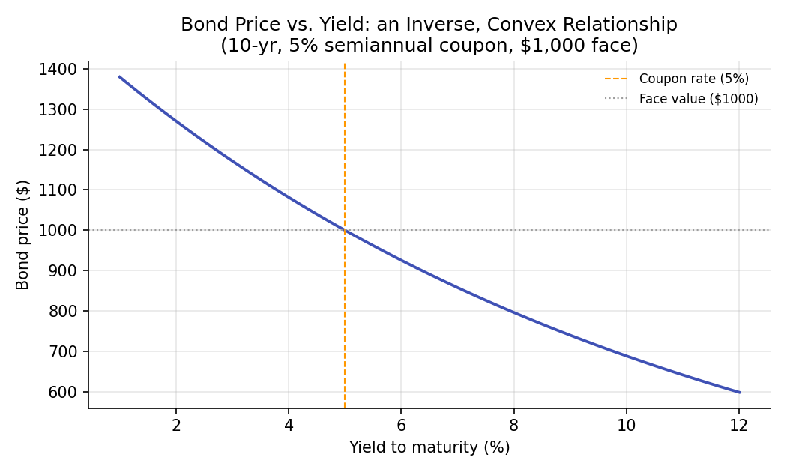
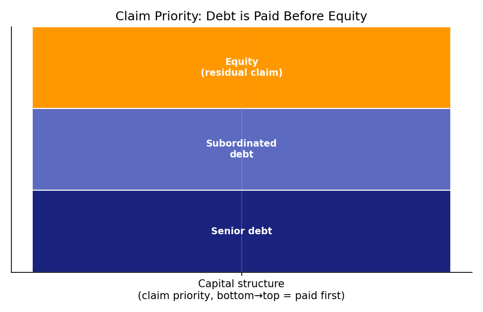

# Financial Instruments: Equities and Bonds

!!! objectives "Learning objectives"
    By the end of this lecture you should be able to:

    - [ ] Explain the fundamental economic difference between a bond (a loan) and a share of equity (a residual ownership claim)
    - [ ] Derive the bond pricing formula as the present value of its cash flows, and compute a bond's price from its coupon, face value, and yield
    - [ ] Explain why bond prices and yields move inversely, and why that relationship is convex, not linear
    - [ ] Compute bond prices and a simple dividend-discount equity value in Python, and explain the "claim priority" that distinguishes debt from equity

## 1. Intuition

Two basic ways exist to raise money for a company: **borrow it** or **sell ownership in it**. A **bond** is a loan — the bondholder lends money and, in exchange, has a contractual right to fixed interest payments (coupons) and the return of principal at maturity, regardless of how well the company performs. A **share of equity** (stock) is ownership — the shareholder has no fixed payment schedule at all, but instead owns a proportional claim on whatever is left after every other obligation (including bondholders) has been paid.

This difference — a *fixed, contractual* claim versus a *residual, variable* claim — is the single most important distinction in this lecture, and it explains almost everything else: why bonds are priced with the time-value-of-money machinery from the previous lecture, why equity is inherently riskier (and therefore, in expectation, must offer a higher return — a theme that becomes precise in Module 3's CAPM), and why bondholders get paid before shareholders if a company runs into trouble.

## 2. Mathematical formulation

**Bond pricing.** A bond is fully described by: face value \( F \) (also called par value, repaid at maturity), annual coupon rate \( c \), coupon frequency \( m \) (e.g., 2 for semiannual), years to maturity \( T \), and yield to maturity \( y \) (the discount rate). Its price is the present value of all its cash flows:

\[
P = \sum_{i=1}^{mT} \frac{C}{\left(1+\frac{y}{m}\right)^{i}} + \frac{F}{\left(1+\frac{y}{m}\right)^{mT}}
\]

where:

- \( C = F \times c / m \) — the fixed coupon payment made every period
- \( y \) — the yield to maturity: the single discount rate that makes the present value of all cash flows equal the bond's price
- \( m \) — number of coupon payments per year
- \( T \) — years until the bond matures and the face value \( F \) is repaid
- \( P \) — the resulting bond price today

**Equity valuation (dividend discount model, simplest case).** If a stock pays a constant expected dividend \( D \) per period forever, and investors require return \( r \) per period, its fair value is a perpetuity:

\[
P_0 = \frac{D}{r}
\]

More generally, with dividends growing at constant rate \( g < r \) (the Gordon Growth Model):

\[
P_0 = \frac{D_1}{r - g}
\]

where \( D_1 \) is next period's expected dividend, \( r \) is the required rate of return on equity, and \( g \) is the constant perpetual growth rate of dividends.

## 3. Derivation

**Why bond prices and yields are inversely, and convexly, related.**

Consider the bond price as a function of yield, \( P(y) \), from Section 2. Each cash flow term \( \frac{C}{(1+y/m)^i} \) is a **decreasing** function of \( y \) — raising the discount rate lowers the present value of every future cash flow. Since \( P(y) \) is a sum of strictly decreasing terms, \( P(y) \) itself is strictly decreasing in \( y \): this proves the inverse relationship.

For convexity, look at the second derivative behavior qualitatively: each term \( (1+y/m)^{-i} \) is a convex function of \( y \) (its curve bends upward), and this convexity is *more pronounced* for cash flows further in the future (larger \( i \)) because the exponent \( i \) amplifies the curvature. Since \( P(y) \) sums these convex terms, \( P(y) \) is itself convex in \( y \). Financially, this means: **the price gain from a yield decrease is larger than the price loss from an equal-sized yield increase.** This asymmetry (formally quantified by a bond's "convexity," a second-order risk measure built on top of the first-order "duration" measure) is a direct mathematical consequence of discounting being an exponential — not linear — function of the rate, and is visible in the curvature of the chart in Section 6.

**Why the Gordon Growth Model requires \( g < r \).** The perpetuity sum is

\[
P_0 = \sum_{t=1}^{\infty} \frac{D_1 (1+g)^{t-1}}{(1+r)^t} = \frac{D_1}{1+r}\sum_{t=0}^{\infty}\left(\frac{1+g}{1+r}\right)^{t}
\]

This is a geometric series with common ratio \( \frac{1+g}{1+r} \), which only converges to a finite sum if that ratio is strictly less than 1 — i.e., only if \( g < r \). Summing the geometric series (\( \sum_{t=0}^\infty x^t = \frac{1}{1-x} \) for \( |x|<1 \)) and simplifying yields exactly \( P_0 = D_1/(r-g) \). If growth is expected to equal or exceed the required return forever, the model implies an infinite (undefined) present value — a signal that the constant-growth assumption cannot hold indefinitely in that case, not that equity is literally worth infinity.

## 4. Worked numerical example

**Bond:** \$1,000 face value, 5% annual coupon rate paid semiannually, 10 years to maturity, yield to maturity of 6%.

- Semiannual coupon: \( C = 1000 \times 0.05 / 2 = \$25 \)
- Number of periods: \( mT = 2 \times 10 = 20 \)
- Semiannual discount rate: \( y/m = 0.06/2 = 0.03 \)

$$
P = \sum_{i=1}^{20} \frac{25}{(1.03)^i} + \frac{1000}{(1.03)^{20}} \approx 25 \times 14.877 + 1000 \times 0.5537 \approx 371.9 + 553.7 = \$925.6
$$

Because the yield (6%) exceeds the coupon rate (5%), the bond trades **below** par (\$925.60 < \$1,000) — investors demand a discount to accept a below-market coupon. If the yield instead equaled the coupon rate exactly, the bond would price at exactly \$1,000 (par), which you can verify is a general property of the formula.

**Equity (Gordon Growth):** A stock expected to pay a \$2 dividend next year, growing 4% per year forever, with a required return of 9%:

$$
P_0 = \frac{2}{0.09 - 0.04} = \frac{2}{0.05} = \$40.00
$$

## 5. Python implementation

```python
import numpy as np

# --- Bond pricing ---
def bond_price(face, coupon_rate, ytm, years, freq=2):
    """Price a fixed-coupon bond as the present value of its cash flows."""
    coupon = face * coupon_rate / freq
    n_periods = int(years * freq)
    periods = np.arange(1, n_periods + 1)
    discount_factors = (1 + ytm / freq) ** periods

    cash_flows = np.full(n_periods, coupon, dtype=float)
    cash_flows[-1] += face  # final period also repays face value

    return np.sum(cash_flows / discount_factors)

price = bond_price(face=1000, coupon_rate=0.05, ytm=0.06, years=10, freq=2)
print(f"Bond price: ${price:.2f}")

# Verify: when ytm == coupon_rate, price should equal par (1000)
par_check = bond_price(face=1000, coupon_rate=0.05, ytm=0.05, years=10, freq=2)
print(f"Sanity check (ytm == coupon): ${par_check:.2f}  (should be ~$1000)")

# --- Price sensitivity to yield: demonstrating the inverse, convex relationship ---
yields = np.linspace(0.01, 0.12, 12)
prices = [bond_price(1000, 0.05, y, 10) for y in yields]
for y, p in zip(yields, prices):
    print(f"  yield={y*100:5.1f}%  ->  price=${p:8.2f}")

# --- Equity: Gordon Growth (constant-growth dividend discount model) ---
def gordon_growth_price(next_dividend, required_return, growth_rate):
    if growth_rate >= required_return:
        raise ValueError("Gordon Growth model requires growth_rate < required_return to converge.")
    return next_dividend / (required_return - growth_rate)

equity_value = gordon_growth_price(next_dividend=2.0, required_return=0.09, growth_rate=0.04)
print(f"\nGordon Growth equity value: ${equity_value:.2f}")
```

## 6. Visualization

<figure class="qf-figure" markdown>

<figcaption>Price of a 10-year, 5% semiannual-coupon, $1,000 face-value bond as yield to maturity varies. The curve slopes downward (price and yield move inversely) and bends — it is convex, not a straight line — matching the derivation in Section 3. The dashed orange line marks the coupon rate, where the price crosses exactly through par (the gray dotted line).</figcaption>
</figure>

<figure class="qf-figure" markdown>

<figcaption>A simplified capital structure. In a liquidation or bankruptcy, claims are paid from the bottom up: senior debt first, then subordinated debt, with equity holders receiving only whatever residual value remains — which can be zero. This claim-priority ordering is the formal expression of "bonds are a fixed claim, equity is a residual claim" from Section 1.</figcaption>
</figure>

## 7. Financial interpretation

The debt-versus-equity distinction drives most of the rest of this curriculum's structure. Because bond cash flows are contractually fixed, bond pricing is a relatively mechanical present-value exercise (this lecture), and bond *risk* is primarily about interest-rate risk (duration/convexity) and credit/default risk. Because equity cash flows are not fixed — dividends can be cut, and the "cash flow" a shareholder ultimately owns is the entire uncertain future of the business — equity valuation and risk require a fundamentally different toolkit: portfolio theory and CAPM (Module 3) for how equity risk should be priced, and derivatives (Module 4) for how equity's optionality (shareholders can walk away with limited liability, but capture unlimited upside) gets modeled explicitly.

## 8. Common mistakes

!!! danger "Common mistake: confusing coupon rate with yield to maturity"
    The coupon rate is fixed at issuance and determines the dollar coupon payment; the yield to maturity is the market's current required return and moves with market conditions. A bond's coupon rate never changes, but its yield (and therefore its price) does, every day the bond trades — conflating the two leads to mispricing.

!!! danger "Common mistake: applying Gordon Growth with g ≥ r"
    As derived in Section 3, the constant-growth perpetuity formula is only mathematically valid when the growth rate is strictly less than the required return. Plugging in a growth rate that meets or exceeds the discount rate produces a negative or nonsensical "price" — a sign the model's assumptions have broken down, not a valid valuation.

!!! danger "Common mistake: ignoring day-count and compounding conventions"
    Real bond markets use specific day-count conventions (e.g., 30/360, actual/actual) and semiannual compounding is standard for many bonds — using annual compounding or the wrong day count when replicating a real bond's price will produce a value that's close but not exact, which matters for anything beyond a first-pass estimate.

## 9. Exercises

1. Price a 5-year, \$1,000 face value bond with a 4% semiannual coupon at yields of 3%, 4%, and 5%. Confirm the "trades above/at/below par" pattern described in Section 4.
2. Using the Python function from Section 5, compute bond prices for yields from 1% to 15% in 1% increments, and by inspection (or by computing successive price differences) verify that the price change from a 1% yield decrease is larger in magnitude than the price change from an equivalent 1% yield increase — the convexity effect proven in Section 3.
3. A stock just paid a \$3 dividend, is expected to grow dividends at 5% per year forever, and investors require an 11% return. What is its fair value today? (Careful: is \$3 this period's dividend, or next period's \( D_1 \)?)

## 10. Further reading

- Hull's textbook (below) has an accessible treatment of bond pricing and duration/convexity that pairs well with this lecture.

## 11. References

1. Hull, J. C. (2022). *Options, Futures, and Other Derivatives* (11th ed.), Chapter 4. Pearson.
2. Bodie, Z., Kane, A., & Marcus, A. J. (2021). *Investments* (12th ed.), Chapters 10 (Bonds) and 13 (Equity Valuation). McGraw-Hill.
3. Gordon, M. J., & Shapiro, E. (1956). "Capital Equipment Analysis: The Required Rate of Profit." *Management Science*, 3(1), 102–110.
4. U.S. Securities and Exchange Commission — "Bonds." [investor.gov](https://www.investor.gov/introduction-investing/investing-basics/investment-products/bonds-or-fixed-income-products/bonds)

---

<div class="grid" markdown>
[:material-arrow-left: Previous: Compounding and the Time Value of Money](/qf-lectures/financial-foundations/compounding-time-value/){ .md-button }
[Next: Derivatives — An Overview :material-arrow-right:](/qf-lectures/financial-foundations/derivatives-overview/){ .md-button .md-button--primary }
</div>
