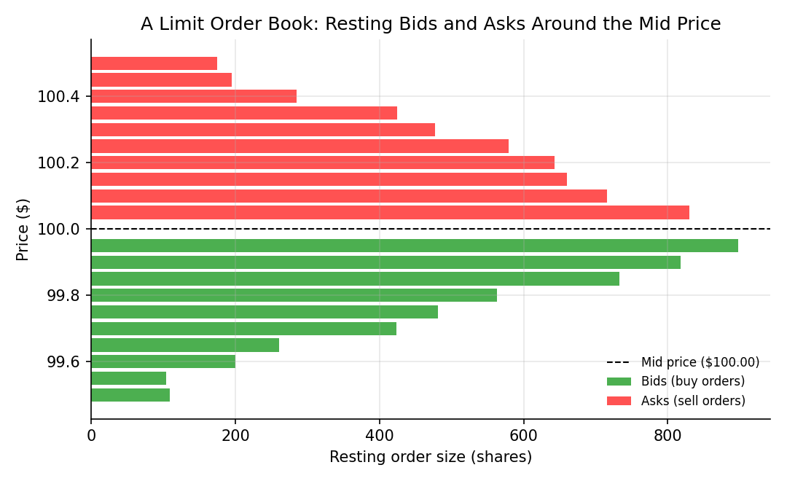

# Market Structure and Order Books

!!! objectives "Learning objectives"
    By the end of this lecture you should be able to:

    - [ ] Distinguish market orders from limit orders, and explain the trade-off each represents
    - [ ] Define the bid, the ask, and the bid-ask spread, and explain what determines who "pays" the spread
    - [ ] Explain how a limit order book aggregates resting orders into a picture of supply and demand at each price level
    - [ ] Construct and query a simple limit order book in Python, and compute the best bid, best ask, and spread from it

## 1. Intuition

Trading doesn't happen at a single, universally agreed price the way a textbook supply-and-demand diagram might suggest. Instead, modern electronic markets operate through a **limit order book**: a continuously updated list of everyone currently willing to buy (bids) or sell (asks) at specific prices, waiting for a matching counterparty.

Two fundamentally different ways to place an order capture the core trade-off in market structure:

- A **market order** says "execute immediately, at whatever price is currently available." It guarantees execution but not price.
- A **limit order** says "execute only at this price or better." It guarantees price but not execution — it might sit unfilled indefinitely if the market never reaches that level.

The gap between the best available buy price and the best available sell price — the **bid-ask spread** — is the cost of demanding immediacy, and it's the mechanism through which liquidity providers (often called market makers) are compensated for standing ready to trade. This lecture builds the vocabulary and a simple working model of the order book that underlies every subsequent discussion of transaction costs (Module 6) and market microstructure (Module 7).

## 2. Mathematical formulation

At any moment, a limit order book can be represented as two ordered lists of (price, quantity) pairs:

\[
\text{Bids} = \{(p_1^b, q_1^b),\ (p_2^b, q_2^b),\ \dots\} \quad \text{with } p_1^b > p_2^b > \cdots
\]

\[
\text{Asks} = \{(p_1^a, q_1^a),\ (p_2^a, q_2^a),\ \dots\} \quad \text{with } p_1^a < p_2^a < \cdots
\]

where:

- \( p_i^b \) — the \( i \)-th highest resting bid price (buy orders are sorted from highest to lowest priority)
- \( p_i^a \) — the \( i \)-th lowest resting ask price (sell orders are sorted from lowest to highest priority)
- \( q_i^b, q_i^a \) — the quantity (e.g., shares) available at that price level

The **best bid** \( p_1^b \) and **best ask** \( p_1^a \) define two key quantities:

\[
\text{Spread} = p_1^a - p_1^b \qquad \qquad \text{Mid price} = \frac{p_1^a + p_1^b}{2}
\]

By construction (and enforced by exchange matching engines), \( p_1^a > p_1^b \) always holds in a functioning market — if a resting bid ever met or exceeded a resting ask, the matching engine would immediately execute a trade between them rather than let both continue resting, so a positive spread \( p_1^a - p_1^b > 0 \) is a structural invariant, not a market outcome that requires deeper explanation.

## 3. Derivation

There is no formula to derive here in the calculus sense; instead, the important logical step is understanding **why a market order always executes at a worse price than the current mid price** — the mechanical source of one component of transaction costs formalized in Module 6.

Consider a trader who submits a market **buy** order for quantity \( Q \). The matching engine fills it against the resting **asks**, starting from the best (lowest) ask price \( p_1^a \) and "walking up" the book:

- If \( Q \le q_1^a \), the entire order fills at \( p_1^a \).
- If \( Q > q_1^a \), the first \( q_1^a \) units fill at \( p_1^a \), the next \( q_2^a \) units (or however much of \( Q \) remains) fill at the worse price \( p_2^a \), and so on, until \( Q \) units have been filled.

The resulting **average execution price** is therefore a *quantity-weighted average of ask prices at or above* \( p_1^a \):

\[
\bar{p}_{\text{buy}} = \frac{\sum_i p_i^a \cdot (\text{units filled at } p_i^a)}{Q} \ \ge\ p_1^a\ >\ \text{Mid price}
\]

This is strictly greater than the mid price (since \( p_1^a \) itself already exceeds the mid price by half the spread, and walking further up the book only raises the average further for large orders). The symmetric argument holds for a market sell order executing against the bids, which fills at or below \( p_1^b \), below the mid price. This asymmetry — buyers pay at or above the ask, sellers receive at or below the bid — is precisely what "paying the spread" means, and it is the most basic, unavoidable component of the transaction costs that Module 6 shows can silently inflate a backtested strategy's apparent profitability if ignored.

## 4. Worked numerical example

Suppose the order book for a stock looks like this:

| Bids (buy orders) | | Asks (sell orders) | |
|---|---|---|---|
| Price | Size | Price | Size |
| \$99.95 | 200 | \$100.05 | 150 |
| \$99.90 | 300 | \$100.10 | 250 |
| \$99.85 | 500 | \$100.15 | 400 |

- Best bid \( p_1^b = \$99.95 \), best ask \( p_1^a = \$100.05 \)
- Spread \( = 100.05 - 99.95 = \$0.10 \)
- Mid price \( = (100.05 + 99.95)/2 = \$100.00 \)

A market buy order for **300 shares**: the first 150 shares fill at \$100.05 (exhausting that price level), and the remaining 150 shares fill at \$100.10 (the next level up). The average execution price is:

$$
\bar{p}_{\text{buy}} = \frac{150 \times 100.05 + 150 \times 100.10}{300} = \frac{15007.5 + 15015}{300} = \$100.075
$$

This is \$0.075 above the \$100.00 mid price — the market order "walked the book" and paid a worse average price than either the best ask alone or the mid price, exactly as derived in Section 3.

## 5. Python implementation

```python
import numpy as np

# A simple limit order book: sorted lists of (price, size) tuples.
bids = [(99.95, 200), (99.90, 300), (99.85, 500)]   # sorted best (highest) first
asks = [(100.05, 150), (100.10, 250), (100.15, 400)]  # sorted best (lowest) first

def best_bid(bids):
    return bids[0]

def best_ask(asks):
    return asks[0]

def spread(bids, asks):
    return best_ask(asks)[0] - best_bid(bids)[0]

def mid_price(bids, asks):
    return (best_ask(asks)[0] + best_bid(bids)[0]) / 2

def market_buy_avg_price(asks, quantity):
    """Simulate a market buy order 'walking the book' and return the
    quantity-weighted average execution price."""
    remaining = quantity
    total_cost = 0.0
    for price, size in asks:
        fill = min(remaining, size)
        total_cost += fill * price
        remaining -= fill
        if remaining <= 0:
            break
    if remaining > 0:
        raise ValueError("Not enough resting liquidity to fill the order.")
    return total_cost / quantity

print(f"Best bid: ${best_bid(bids)[0]:.2f}  Best ask: ${best_ask(asks)[0]:.2f}")
print(f"Spread:   ${spread(bids, asks):.2f}")
print(f"Mid price: ${mid_price(bids, asks):.2f}")

qty = 300
avg_price = market_buy_avg_price(asks, qty)
print(f"\nMarket buy of {qty} shares -> avg execution price: ${avg_price:.4f}")
print(f"Slippage vs. mid price: ${avg_price - mid_price(bids, asks):.4f} per share")
```


Continuing directly from the code above, here is the plotting code that produces the chart in Section 6:

```python
import matplotlib.pyplot as plt

bid_prices = [p for p, _ in bids]; bid_sizes = [q for _, q in bids]
ask_prices = [p for p, _ in asks]; ask_sizes = [q for _, q in asks]

fig, ax = plt.subplots(figsize=(7.2, 4.4))
ax.barh(bid_prices, bid_sizes, height=0.03, color="#4caf50", label="Bids (buy orders)")
ax.barh(ask_prices, ask_sizes, height=0.03, color="#ff5252", label="Asks (sell orders)")
ax.axhline(mid_price(bids, asks), color="black", linestyle="--", linewidth=1,
           label=f"Mid price (${mid_price(bids, asks):.2f})")
ax.set_xlabel("Resting order size (shares)"); ax.set_ylabel("Price ($)")
ax.set_title("A Limit Order Book: Resting Bids and Asks Around the Mid Price")
ax.legend(frameon=False, fontsize=8, loc="lower right")
fig.tight_layout()
plt.show()
```

## 6. Visualization

<figure class="qf-figure" markdown>

<figcaption>A snapshot of a limit order book: green bars are resting buy orders (bids) below the mid price, red bars are resting sell orders (asks) above it. A market buy order consumes ask liquidity starting from the top (lowest ask price) downward; a market sell order consumes bid liquidity starting from the bottom (highest bid) upward.</figcaption>
</figure>

## 7. Financial interpretation

Market structure is not a peripheral detail — it is where trading theory meets trading reality. Every backtest in Module 6 that assumes trades execute "at the closing price" with no cost is implicitly ignoring the mechanics shown in this lecture: real execution walks the book, pays the spread, and (for large orders relative to available liquidity) can move the price further still — an effect called **market impact**, covered alongside transaction costs in Module 6. Understanding the order book is also foundational to the market microstructure topics in Module 7, which study how order flow itself carries information about future price movement.

## 8. Common mistakes

!!! danger "Common mistake: assuming you always trade at the mid price"
    Backtests and academic examples often assume trades execute at the mid price or the last traded price, but real market orders execute at the bid or ask (or worse, for large orders) — never at the mid price itself. This overstates realistic returns, especially for strategies that trade frequently or trade illiquid instruments with wide spreads.

!!! danger "Common mistake: ignoring order book depth for large orders"
    Assuming an order of any size fills entirely at the best bid/ask ignores that resting size at the top of book is finite. For a sufficiently large order relative to book depth, this materially understates execution cost, as shown by the "walking the book" calculation in Sections 3–5.

!!! danger "Common mistake: confusing a limit order's price guarantee with an execution guarantee"
    A limit order guarantees you won't trade at a worse price than specified, but it can also simply never execute if the market never trades through your price — a limit order is not a substitute for a market order when certainty of execution matters more than price.

## 9. Exercises

1. Using the order book in Section 4, compute the average execution price for a market **sell** order of 400 shares (walking down the bids). Compare the slippage versus the mid price to the buy-side example worked in Section 4.
2. A trader places a limit buy order at \$99.92. Using the order book in Section 4, explain whether this order would execute immediately, and if not, where it would sit in the book relative to the existing resting bids.
3. Extend the `market_buy_avg_price` function from Section 5 to also compute a `market_sell_avg_price` function that walks the bids, and verify it produces the answer you computed by hand in Exercise 1.

## 10. Further reading

- The academic market microstructure literature (Module 7) builds directly on the order book concepts here; O'Hara's *Market Microstructure Theory* is a standard graduate-level reference, cited in full there.

## 11. References

1. Harris, L. (2003). *Trading and Exchanges: Market Microstructure for Practitioners*, Chapters 2–4. Oxford University Press.
2. Hull, J. C. (2022). *Options, Futures, and Other Derivatives* (11th ed.), Chapter 2 (Mechanics of futures/securities markets). Pearson.
3. U.S. Securities and Exchange Commission — "Market Structure." [sec.gov](https://www.sec.gov/rules-regulations/2022/12/market-structure-modernization-national-market-system)

---

<div class="grid" markdown>
[:material-arrow-left: Previous: Derivatives — An Overview](/qf-lectures/financial-foundations/derivatives-overview/){ .md-button }
[Next: Portfolio Basics :material-arrow-right:](/qf-lectures/financial-foundations/portfolio-basics/){ .md-button .md-button--primary }
</div>
