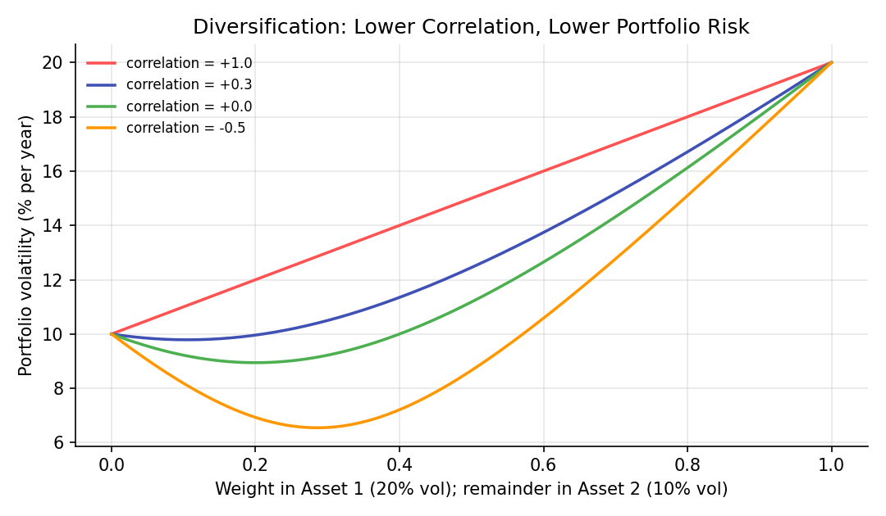

# Portfolio Basics

!!! objectives "Learning objectives"
    By the end of this lecture you should be able to:

    - [ ] Define portfolio weights and compute a portfolio's return as a weighted average of asset returns
    - [ ] Derive the expected return and variance of a portfolio, in both two-asset and matrix form
    - [ ] Explain why portfolio volatility is generally *less* than the weighted average of asset volatilities, and what role correlation plays
    - [ ] Compute portfolio risk and return in Python using NumPy matrix operations

## 1. Intuition

A **portfolio** is simply a collection of assets held together. The central insight of modern finance is that the risk of a portfolio is *not* the average of the risks of its parts. When two assets do not move in perfect lockstep, a loss in one is partly offset by a gain (or a smaller loss) in the other, so combining them smooths the overall ride. This is **diversification**.

Two numbers per asset are not enough to describe this. You also need to know how assets move *together*, which is captured by covariance and correlation. That is why, from this lecture onward, portfolios are described with a vector of expected returns and a covariance matrix. Module 3 builds Markowitz optimization, CAPM, and risk measures directly on the formulas derived here.

## 2. Mathematical formulation

Consider \( N \) assets. Let \( w_i \) be the **weight** (fraction of total wealth) invested in asset \( i \), with the budget constraint

\[
\sum_{i=1}^{N} w_i = 1
\]

Let \( R_i \) be the (random) simple return of asset \( i \) over one period. The portfolio's simple return is the weighted average

\[
R_p = \sum_{i=1}^{N} w_i R_i = \mathbf{w}^\top \mathbf{R}
\]

(This is why the previous lecture on returns said to aggregate *across assets* using simple returns.)

**Expected return.** Let \( \mu_i = E[R_i] \) and \( \boldsymbol{\mu} = (\mu_1, \dots, \mu_N)^\top \). By linearity of expectation,

\[
\mu_p = E[R_p] = \sum_i w_i \mu_i = \mathbf{w}^\top \boldsymbol{\mu}
\]

**Variance.** Let \( \Sigma \) be the covariance matrix with entries \( \Sigma_{ij} = \text{Cov}(R_i, R_j) \), so \( \Sigma_{ii} = \sigma_i^2 \). Then

\[
\sigma_p^2 = \text{Var}(R_p) = \sum_{i=1}^{N}\sum_{j=1}^{N} w_i w_j \Sigma_{ij} = \mathbf{w}^\top \Sigma\, \mathbf{w}
\]

**Two-asset special case.** With correlation \( \rho = \dfrac{\text{Cov}(R_1,R_2)}{\sigma_1 \sigma_2} \) and weights \( w \) and \( 1-w \):

\[
\sigma_p^2 = w^2\sigma_1^2 + (1-w)^2\sigma_2^2 + 2\,w(1-w)\,\rho\,\sigma_1\sigma_2
\]

where:

- \( \mu_i \) — expected return of asset \( i \)
- \( \sigma_i \) — standard deviation (volatility) of asset \( i \)
- \( \rho \) — correlation between the two assets' returns, between \(-1\) and \(+1\)
- \( \sigma_p \) — portfolio volatility, the square root of \( \sigma_p^2 \)

## 3. Derivation

**Portfolio variance from the definition.** Write the portfolio's deviation from its mean as \( R_p - \mu_p = \sum_i w_i (R_i - \mu_i) \). Then

\[
\text{Var}(R_p) = E\!\left[\Big(\sum_i w_i (R_i-\mu_i)\Big)\Big(\sum_j w_j (R_j-\mu_j)\Big)\right] = \sum_i \sum_j w_i w_j\, E[(R_i-\mu_i)(R_j-\mu_j)]
\]

and \( E[(R_i-\mu_i)(R_j-\mu_j)] = \Sigma_{ij} \) is the definition of covariance. This gives \( \mathbf{w}^\top \Sigma \mathbf{w} \). For \( N=2 \) the double sum has four terms: two "own variance" terms and two identical cross terms, which combine into \( 2 w_1 w_2 \Sigma_{12} = 2w(1-w)\rho\sigma_1\sigma_2 \).

**Why diversification works.** Because \( \rho \le 1 \), the cross term is at most \( 2w(1-w)\sigma_1\sigma_2 \), so

\[
\sigma_p^2 \le w^2\sigma_1^2 + (1-w)^2\sigma_2^2 + 2w(1-w)\sigma_1\sigma_2 = \big(w\sigma_1 + (1-w)\sigma_2\big)^2
\]

Taking square roots, \( \sigma_p \le w\sigma_1 + (1-w)\sigma_2 \), with equality only when \( \rho = 1 \). Portfolio volatility never exceeds the weighted average of individual volatilities, and it falls below it whenever correlation is less than one. This is an algebraic fact, not an empirical claim. How large the benefit is in practice depends on the actual correlations, which are estimated from data and change over time.

## 4. Worked numerical example

Asset 1: \( \mu_1 = 8\% \), \( \sigma_1 = 20\% \). Asset 2: \( \mu_2 = 4\% \), \( \sigma_2 = 10\% \). Correlation \( \rho = 0.3 \). Weights \( w_1 = 0.6 \), \( w_2 = 0.4 \). (Illustrative numbers, not estimates from real data.)

**Expected return:**

$$
\mu_p = 0.6(0.08) + 0.4(0.04) = 0.048 + 0.016 = 6.4\%
$$

**Variance:**

$$
\sigma_p^2 = (0.6)^2(0.20)^2 + (0.4)^2(0.10)^2 + 2(0.6)(0.4)(0.3)(0.20)(0.10)
$$

$$
= 0.0144 + 0.0016 + 0.00288 = 0.01888
$$

$$
\sigma_p = \sqrt{0.01888} \approx 13.74\%
$$

The weighted average of the two volatilities is \( 0.6(20\%) + 0.4(10\%) = 16\% \). The portfolio's volatility of 13.74% is about 2.26 percentage points lower. That gap is the diversification benefit at \( \rho = 0.3 \).

## 5. Python implementation

```python
import numpy as np

mu = np.array([0.08, 0.04])           # expected returns
sigma = np.array([0.20, 0.10])        # volatilities
rho = 0.3
corr = np.array([[1.0, rho],
                 [rho, 1.0]])

# Covariance matrix: Sigma_ij = rho_ij * sigma_i * sigma_j
Sigma = corr * np.outer(sigma, sigma)

w = np.array([0.6, 0.4])              # weights sum to 1
assert np.isclose(w.sum(), 1.0)

port_return = w @ mu
port_var = w @ Sigma @ w
port_vol = np.sqrt(port_var)
weighted_avg_vol = w @ sigma

print(f"Expected return:       {port_return:.4%}")
print(f"Portfolio volatility:  {port_vol:.4%}")
print(f"Weighted avg vol:      {weighted_avg_vol:.4%}")
print(f"Diversification gain:  {weighted_avg_vol - port_vol:.4%}")

# Volatility as correlation varies (weights fixed)
for r in [1.0, 0.3, 0.0, -0.5]:
    S = np.array([[1, r], [r, 1]]) * np.outer(sigma, sigma)
    print(f"rho={r:+.1f}  ->  portfolio vol = {np.sqrt(w @ S @ w):.4%}")
```

The `@` operator is matrix multiplication, so `w @ Sigma @ w` is exactly \( \mathbf{w}^\top \Sigma \mathbf{w} \).


Continuing directly from the code above, here is the plotting code that produces the chart in Section 6:

```python
import matplotlib.pyplot as plt

weights = np.linspace(0, 1, 200)
fig, ax = plt.subplots(figsize=(7.2, 4.2))
for r_val, color in [(1.0, "#ff5252"), (0.3, "#3f51b5"), (0.0, "#4caf50"), (-0.5, "#ff9800")]:
    S_r = np.array([[1, r_val], [r_val, 1]]) * np.outer(sigma, sigma)
    vol = np.sqrt([ [wi, 1-wi] @ S_r @ [wi, 1-wi] for wi in weights ])
    ax.plot(weights, vol * 100, color=color, linewidth=1.7, label=f"correlation = {r_val:+.1f}")
ax.set_xlabel("Weight in Asset 1 (20% vol); remainder in Asset 2 (10% vol)")
ax.set_ylabel("Portfolio volatility (% per year)")
ax.set_title("Diversification: Lower Correlation, Lower Portfolio Risk")
ax.legend(frameon=False, fontsize=8)
fig.tight_layout()
plt.show()
```

## 6. Visualization

<figure class="qf-figure" markdown>

<figcaption>Portfolio volatility as the weight in the riskier asset varies, for four correlation values. At perfect correlation (red) volatility is just the straight-line weighted average. As correlation falls, the curve bends downward. With negative correlation, some mixes are less volatile than either asset alone.</figcaption>
</figure>

## 7. Financial interpretation

The formula \( \mathbf{w}^\top \Sigma \mathbf{w} \) is the foundation of portfolio theory. It says an asset's contribution to portfolio risk depends on how it covaries with everything else you hold, not just its own volatility. This is the idea behind Markowitz optimization, beta, and risk parity in Module 3. Note also that expected return is linear in the weights while risk is not. Combining assets can therefore improve the trade-off between the two, which is the motivation for the efficient frontier.

## 8. Common mistakes

!!! danger "Common mistake: averaging volatilities"
    Computing portfolio risk as \( \sum_i w_i \sigma_i \) is only correct when all assets are perfectly correlated. Otherwise it overstates risk. Use the full covariance matrix.

!!! danger "Common mistake: treating correlations as stable"
    The diversification benefit depends on correlations, and estimated correlations can change substantially over time, particularly in market stress. Treat a historical covariance matrix as an estimate, not a fixed fact. Estimation error in \( \Sigma \) is a major theme of Modules 3 and 7.

!!! danger "Common mistake: forgetting the weights must sum to one"
    The formulas above assume a fully invested portfolio with no leverage or cash. If weights don't sum to one, returns and variances are computed on a different base and are not comparable. Short positions (negative weights) are allowed, but the sum must still be one.

## 9. Exercises

1. Using the example in Section 4, compute portfolio volatility for \( \rho = -0.5 \) and \( \rho = 1 \). Check the \( \rho = 1 \) answer against the weighted average of volatilities.
2. For the two-asset case, show that the weight minimizing portfolio variance is \( w^* = \dfrac{\sigma_2^2 - \rho\sigma_1\sigma_2}{\sigma_1^2 + \sigma_2^2 - 2\rho\sigma_1\sigma_2} \) by differentiating \( \sigma_p^2 \) with respect to \( w \). Evaluate it for the numbers in Section 4.
3. Extend the Python code to three assets with a covariance matrix of your choice, and confirm that the portfolio variance is never negative. Why must a valid covariance matrix be positive semi-definite?

## 10. Further reading

- Module 3 begins with Markowitz mean-variance optimization, which chooses weights to trade off \( \mu_p \) against \( \sigma_p \).

## 11. References

1. Markowitz, H. (1952). "Portfolio Selection." *The Journal of Finance*, 7(1), 77–91.
2. Bodie, Z., Kane, A., & Marcus, A. J. (2021). *Investments* (12th ed.), Chapters 6–7. McGraw-Hill.
3. NumPy Developers. "`numpy.outer`." [numpy.org/doc](https://numpy.org/doc/stable/reference/generated/numpy.outer.html)

---

<div class="grid" markdown>
[:material-arrow-left: Previous: Market Structure and Order Books](/qf-lectures/financial-foundations/market-structure-order-books/){ .md-button }
[Next: Probability Distributions in Finance :material-arrow-right:](/qf-lectures/statistics/probability-distributions/){ .md-button .md-button--primary }
</div>
