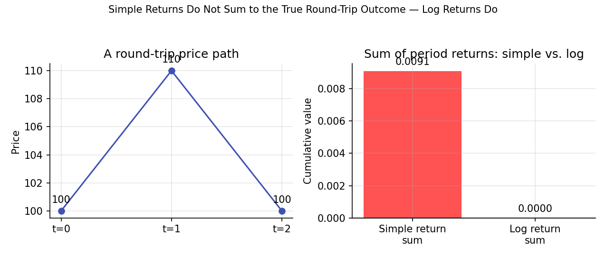

# Returns and Log Returns

!!! objectives "Learning objectives"
    By the end of this lecture you should be able to:

    - [ ] Define simple and logarithmic (log) returns precisely, and convert between them
    - [ ] Explain why log returns — and not simple returns — are additive over time, and derive that property
    - [ ] Identify the conditions under which simple and log returns are approximately equal, and when that approximation breaks down
    - [ ] Compute both return types in pandas from a raw price series and correctly aggregate them over multiple periods

## 1. Intuition

If a stock goes from \$100 to \$110, most people say "that's a 10% return." That number — the **simple return** — is intuitive because it matches how you'd compute profit and loss. But it has an awkward property: simple returns don't add up cleanly across multiple periods. If the stock then falls from \$110 back to \$100, that's a −9.09% simple return, not −10% — even though the price round-tripped exactly.

**Log returns** solve this by measuring the *continuously compounded* rate of change. Their defining virtue is that they **are** additive across time: the log return over two periods is exactly the sum of the log returns over each period. This single property is why almost every piece of statistical machinery in Module 2 (regression, ARIMA, GARCH) and Module 5 (Brownian motion, Itô calculus) is built on log returns rather than simple returns.

## 2. Mathematical formulation

Let \( P_t \) denote the price of an asset at time \( t \).

**Simple return** over one period:

\[
R_t = \frac{P_t - P_{t-1}}{P_{t-1}} = \frac{P_t}{P_{t-1}} - 1
\]

where:

- \( P_t \) — the asset price at time \( t \) (today)
- \( P_{t-1} \) — the asset price at time \( t-1 \) (the prior period)
- \( R_t \) — the fractional gain or loss over the period, e.g. \( R_t = 0.10 \) means a 10% gain

**Log return** (continuously compounded return) over one period:

\[
r_t = \ln\left(\frac{P_t}{P_{t-1}}\right) = \ln(P_t) - \ln(P_{t-1})
\]

where \( \ln(\cdot) \) is the natural logarithm. Note the direct relationship between the two:

\[
r_t = \ln(1 + R_t) \qquad \Longleftrightarrow \qquad R_t = e^{r_t} - 1
\]

**Multi-period log return.** For \( k \) periods:

\[
r_{t-k,t} = \ln\left(\frac{P_t}{P_{t-k}}\right) = \sum_{i=0}^{k-1} r_{t-i}
\]

## 3. Derivation

**Claim: log returns are additive across time; simple returns are not (they compound multiplicatively).**

Start from the multi-period simple return over two periods, from \( P_{t-2} \) to \( P_t \):

\[
1 + R_{t-1,t} = \frac{P_t}{P_{t-2}} = \frac{P_t}{P_{t-1}} \cdot \frac{P_{t-1}}{P_{t-2}} = (1 + R_t)(1 + R_{t-1})
\]

So compounded simple returns **multiply**: \( 1 + R_{t-1,t} = (1+R_t)(1+R_{t-1}) \), not add. This is why, in the intuition above, +10% followed by −9.09% is *not* the same magnitude as a clean "+10%, −10%."

Now take logs of both sides:

\[
\ln(1 + R_{t-1,t}) = \ln\big[(1+R_t)(1+R_{t-1})\big] = \ln(1+R_t) + \ln(1+R_{t-1})
\]

But by definition, \( \ln(1+R_t) = r_t \) is exactly the log return. So:

\[
r_{t-1,t} = r_t + r_{t-1}
\]

which generalizes by induction to the sum formula in Section 2. The additivity is a direct consequence of the logarithm turning products into sums — nothing more, but it is exactly the property that makes log returns tractable for statistical modeling: the sum of many independent random variables has well-understood limiting behavior (e.g., the Central Limit Theorem, used heavily in Module 2), while a *product* of random variables does not, in general.

**Small-return approximation.** Using the Taylor expansion \( \ln(1+x) \approx x - \frac{x^2}{2} + \cdots \) for small \( x \):

\[
r_t = \ln(1+R_t) \approx R_t \quad \text{when } |R_t| \text{ is small}
\]

This is why, for typical daily equity returns (usually well under ±5%), simple and log returns are numerically close — but the approximation degrades visibly for large moves (a −50% simple return corresponds to a log return of \( \ln(0.5) \approx -0.693 \), not −0.50).

## 4. Worked numerical example

Take the round-trip example from the introduction: a price that goes \$100 → \$110 → \$100.

**Simple returns:**

$$
R_1 = \frac{110 - 100}{100} = +10.00\% \qquad R_2 = \frac{100 - 110}{110} = -9.09\%
$$

Note these don't sum to zero (\(10.00\% - 9.09\% = 0.91\% \ne 0\)), even though the price ended exactly where it started — the asymmetry is a real property of simple returns, not a rounding artifact.

**Log returns:**

$$
r_1 = \ln\left(\frac{110}{100}\right) = \ln(1.10) = +9.531\%
$$

$$
r_2 = \ln\left(\frac{100}{110}\right) = \ln(0.90909\ldots) = -9.531\%
$$

$$
r_1 + r_2 = 9.531\% - 9.531\% = 0.000\%
$$

The log returns sum to exactly zero, correctly reflecting that the price round-tripped with no net change. This is the additivity property proven in Section 3, made concrete.

## 5. Python implementation

```python
import numpy as np
import pandas as pd

prices = pd.Series([100.0, 110.0, 100.0], index=pd.date_range("2026-01-01", periods=3, freq="D"))

# Simple returns
simple_returns = prices.pct_change().dropna()

# Log returns
log_returns = np.log(prices / prices.shift(1)).dropna()

print("Simple returns:\n", simple_returns.round(5))
print("\nLog returns:\n", log_returns.round(5))

print("\nSum of simple returns:", simple_returns.sum().round(5))   # does NOT equal the true round-trip
print("Sum of log returns:   ", log_returns.sum().round(5))        # equals ~0, matching the round trip

# Converting between the two
recovered_simple = np.exp(log_returns) - 1
assert np.allclose(recovered_simple, simple_returns)

# Multi-period log return directly from endpoints — matches the sum above
multi_period_log_return = np.log(prices.iloc[-1] / prices.iloc[0])
print("\nDirect multi-period log return:", round(multi_period_log_return, 5))
```

## 6. Visualization

<figure class="qf-figure" markdown>

<figcaption>Left: a price that goes from 100 to 110 and back to 100 — a true round trip. Right: summing the two simple returns leaves a nonzero residual (red), while summing the two log returns correctly nets to zero (green), confirming the additivity property derived in Section 3.</figcaption>
</figure>

## 7. Financial interpretation

The choice between simple and log returns is not cosmetic:

- **Simple returns** are the right measure for **portfolio-level** aggregation at a single point in time — the return on a portfolio of assets *is* the value-weighted average of the assets' simple returns, which is not exactly true for log returns.
- **Log returns** are the right measure for **time-series** aggregation and statistical modeling — multi-period compounding, volatility estimation, and the stochastic-process framework in Module 5 (geometric Brownian motion, Itô calculus) are all naturally expressed in log-return space, because that's where additivity (and, by extension, the Central Limit Theorem machinery in Module 2) applies cleanly.

A practical rule of thumb used throughout this curriculum: aggregate returns **across assets** in simple-return space, and aggregate returns **across time** in log-return space.

## 8. Common mistakes

!!! danger "Common mistake: summing simple returns across time"
    Adding up daily simple returns to get a "cumulative return" over a month systematically misstates the true compounded outcome, especially over longer horizons or during volatile periods — the true cumulative simple return requires *multiplying* \( (1+R_t) \) terms, not summing them, as derived in Section 3.

!!! danger "Common mistake: assuming simple ≈ log always holds"
    The small-return approximation \( r_t \approx R_t \) is only good for small moves. Applying it uncritically to large single-day moves (crashes, earnings gaps) or to long horizons (multi-year returns) introduces meaningful error — always check the magnitude before relying on the approximation.

!!! danger "Common mistake: averaging simple returns to estimate expected compounded growth"
    The arithmetic mean of simple returns systematically overstates the actual compounded (geometric) growth rate an investor experiences, a gap that grows with volatility. This distinction — arithmetic vs. geometric mean return — is revisited quantitatively in Module 3.

## 9. Exercises

1. A price moves \$50 → \$60 → \$45. Compute the simple return for each period and the log return for each period. Verify that the log returns sum to \( \ln(45/50) \), and check numerically how far the sum of simple returns is from the "true" two-period simple return \( \frac{45-50}{50} \).
2. Prove algebraically that if \( R_t = 0 \) for all \( t \) (price never moves), then \( r_t = 0 \) for all \( t \) as well. Then show that the converse also holds.
3. Using the Taylor expansion given in Section 3, estimate the log return corresponding to a −20% simple return using only the first two terms of the expansion, and compare it to the exact value \( \ln(0.8) \). How large is the approximation error?

## 10. Further reading

- Investopedia-style explainers are useful for intuition but are **not** cited here as authoritative sources — cross-check any formula against the textbook references below.

## 11. References

1. Campbell, J. Y., Lo, A. W., & MacKinlay, A. C. (1997). *The Econometrics of Financial Markets*, Chapter 1. Princeton University Press.
2. Tsay, R. S. (2010). *Analysis of Financial Time Series* (3rd ed.), Chapter 1. Wiley.
3. Bodie, Z., Kane, A., & Marcus, A. J. (2021). *Investments* (12th ed.), Chapter 5. McGraw-Hill.
4. NumPy Developers. "`numpy.log`." [numpy.org/doc](https://numpy.org/doc/stable/reference/generated/numpy.log.html)

---

<div class="grid" markdown>
[:material-arrow-left: Previous: Python, NumPy & Pandas](/qf-lectures/prerequisites/python-numpy-pandas/){ .md-button }
[Next: Probability Distributions in Finance :material-arrow-right:](/qf-lectures/statistics/probability-distributions/){ .md-button .md-button--primary }
</div>
