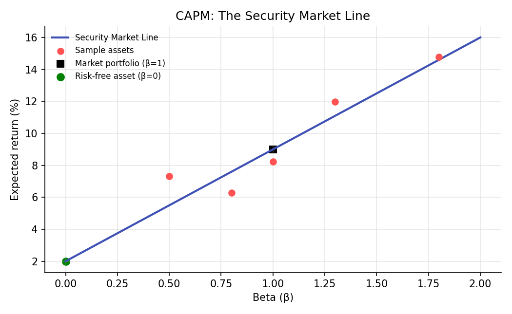

# CAPM and Factor Models

!!! objectives "Learning objectives"
    By the end of this lecture you should be able to:

    - [ ] State the CAPM equation and explain the economic argument that leads to it
    - [ ] Derive why an asset's risk premium depends only on its beta, not its total volatility
    - [ ] Interpret alpha as a regression intercept and explain its relationship to CAPM
    - [ ] Extend single-factor CAPM to the Fama-French three-factor model and estimate both in Python

## 1. Intuition

The Markowitz lecture showed that if every investor holds the same tangency portfolio, combined in different proportions with a risk-free asset, then in equilibrium, when supply must equal demand across all investors, that common tangency portfolio must be the **market portfolio** (the value-weighted portfolio of all risky assets). The **Capital Asset Pricing Model** (CAPM; Sharpe, 1964; Lintner, 1965) works out what this equilibrium implies about the expected return of any individual asset.

The central, somewhat surprising result: an asset's expected return premium above the risk-free rate depends only on its **beta**, its sensitivity to the market portfolio, not on its total volatility. Two assets with the same total volatility can have very different betas (and therefore very different expected returns) if one asset's risk is mostly diversifiable (unrelated to the market) and the other's is mostly systematic (moves with the market). This is a direct consequence of the diversification logic from Portfolio Basics: only the risk that *cannot* be diversified away should be compensated with extra expected return.

## 2. Mathematical formulation

**CAPM.** For any asset \( i \), with market portfolio return \( R_M \) and risk-free rate \( r_f \):

\[
E[R_i] = r_f + \beta_i\,\big(E[R_M]-r_f\big), \qquad \beta_i = \frac{\text{Cov}(R_i,R_M)}{\text{Var}(R_M)}
\]

The term \( E[R_M]-r_f \) is the **market risk premium**, and \( \beta_i(E[R_M]-r_f) \) is asset \( i \)'s required risk premium.

**Empirical (regression) form.** CAPM is tested by regressing an asset's *excess* return (return minus the risk-free rate) on the market's excess return (this is exactly the OLS setup from the Linear Regression lecture):

\[
R_i - r_f = \alpha_i + \beta_i (R_M-r_f) + \varepsilon_i
\]

If CAPM holds exactly, \( \alpha_i=0 \): all expected return is explained by exposure to market risk, with nothing left over. A statistically significant nonzero \( \hat\alpha_i \) is often interpreted as evidence of mispricing, of a missing risk factor, or of genuine skill, depending on context.

**Fama-French three-factor model.** Extends the single market factor with two additional empirically motivated factors, size (SMB, "small minus big") and value (HML, "high minus low" book-to-market):

\[
R_i-r_f = \alpha_i + \beta_{i,M}(R_M-r_f) + \beta_{i,\text{SMB}}\,\text{SMB} + \beta_{i,\text{HML}}\,\text{HML} + \varepsilon_i
\]

## 3. Derivation

**Why only beta, and not total variance, is priced.** Consider an asset \( i \) as one component of the value-weighted market portfolio, with weight \( w_i \). The market's variance can be decomposed (using the portfolio variance formula from Portfolio Basics, applied to the market portfolio itself) as

\[
\text{Var}(R_M) = \sum_j w_j\,\text{Cov}(R_j,R_M)
\]

so each asset's *marginal* contribution to market variance is \( \text{Cov}(R_i,R_M) \), not \( \text{Var}(R_i) \) itself. An asset with high total volatility but low covariance with the market barely adds to the market's overall risk, since much of that volatility is diversified away when combined with everything else in the market portfolio; an asset with the same total volatility but high covariance with the market contributes much more to the undiversifiable risk that a fully diversified investor is actually exposed to. A general equilibrium argument (originally due to Sharpe, 1964, and Lintner, 1965; a full derivation appears in most asset pricing textbooks, e.g. Cochrane, 2005) shows that in a market where every investor holds some combination of the risk-free asset and the (mean-variance efficient) market portfolio, as the two-fund separation theorem from the Markowitz lecture implies, the equilibrium risk premium on any asset must be proportional to exactly this marginal, covariance-based risk contribution, \( \beta_i=\text{Cov}(R_i,R_M)/\text{Var}(R_M) \), rather than to the asset's own variance. Idiosyncratic risk, the part of \( \text{Var}(R_i) \) not correlated with the market, earns no risk premium in this framework because it can be diversified away at no cost by holding many assets, exactly the diversification argument at the heart of Portfolio Basics; only the systematic, undiversifiable component, captured by beta, needs compensating.

**Why alpha is a regression intercept, and what a nonzero alpha implies.** Take expectations of the empirical regression equation in Section 2:

\[
E[R_i]-r_f = \alpha_i+\beta_i\big(E[R_M]-r_f\big)
\]

Comparing directly to the CAPM equation in Section 2, CAPM holding exactly is precisely the statement \( \alpha_i=0 \). A regression's intercept, ordinarily just a nuisance parameter absorbing whatever the slope term doesn't explain, takes on this direct economic meaning here: it is the average excess return *not* explained by market exposure. This is exactly why fund performance is often evaluated using "alpha", it is a direct test, via ordinary least squares from the Linear Regression lecture, of whether a strategy earned more than its market risk exposure alone would predict.

## 4. Worked numerical example

Consider five hypothetical assets with betas \( 0.5, 0.8, 1.0, 1.3, 1.8 \), a market expected return of 9%, and a risk-free rate of 2%. Under CAPM, their expected returns should fall exactly on the **Security Market Line**, \( E[R_i]=2\%+\beta_i\times7\% \): approximately \( 5.5\%,\ 7.6\%,\ 9.0\%,\ 11.1\%,\ 14.6\% \) respectively. An asset trading with an expected return noticeably above this line (for its beta) looks statistically cheap under CAPM's logic (a positive predicted alpha); one below the line looks expensive (a negative predicted alpha). Section 6's chart plots several such sample assets against the theoretical line, illustrating both assets close to CAPM's prediction and assets that diverge from it, exactly the kind of divergence that motivated extending CAPM to the Fama-French model.

## 5. Python implementation

```python
import numpy as np

rng = np.random.default_rng(61)

# --- CAPM regression: single-asset excess return on market excess return ---
n = 250
market_excess = rng.normal(0.0004, 0.011, n)
true_alpha, true_beta = 0.0001, 1.2
asset_excess = true_alpha + true_beta * market_excess + rng.normal(0, 0.006, n)

X = np.column_stack([np.ones(n), market_excess])
coef = np.linalg.solve(X.T @ X, X.T @ asset_excess)
alpha_hat, beta_hat = coef
print(f"Estimated alpha: {alpha_hat:.5f} (true: {true_alpha})")
print(f"Estimated beta:  {beta_hat:.3f} (true: {true_beta})")

# --- Security Market Line: expected return for a range of betas ---
rf, market_return = 0.02, 0.09
betas = np.linspace(0, 2, 50)
sml = rf + betas * (market_return - rf)

sample_betas = np.array([0.5, 0.8, 1.0, 1.3, 1.8])
sample_expected = rf + sample_betas * (market_return - rf)
print("\nCAPM-implied expected returns for sample betas:", np.round(sample_expected * 100, 2), "%")

# --- Fama-French three-factor regression ---
smb = rng.normal(0.0001, 0.006, n)   # simulated size factor
hml = rng.normal(0.0001, 0.006, n)   # simulated value factor
true_b_smb, true_b_hml = 0.3, -0.2
asset_excess_ff = (true_alpha + true_beta * market_excess
                    + true_b_smb * smb + true_b_hml * hml + rng.normal(0, 0.005, n))

X_ff = np.column_stack([np.ones(n), market_excess, smb, hml])
coef_ff = np.linalg.solve(X_ff.T @ X_ff, X_ff.T @ asset_excess_ff)
print("\nFama-French 3-factor estimates [alpha, beta_mkt, beta_smb, beta_hml]:")
print(np.round(coef_ff, 4))
```


Continuing directly from the code above, here is the plotting code that produces the chart in Section 6:

```python
import matplotlib.pyplot as plt

fig, ax = plt.subplots(figsize=(7, 4.3))
ax.plot(betas, sml * 100, color="#3f51b5", lw=2, label="Security Market Line")
ax.scatter(sample_betas, sample_expected * 100 + rng.normal(0, 0.8, 5), color="#ff5252",
           zorder=5, label="Sample assets")
ax.scatter([1.0], [market_return * 100], color="black", marker="s", s=50, label="Market portfolio (β=1)")
ax.scatter([0], [rf * 100], color="green", marker="o", s=50, label="Risk-free asset (β=0)")
ax.set_xlabel("Beta (β)"); ax.set_ylabel("Expected return (%)")
ax.set_title("CAPM: The Security Market Line")
ax.legend(frameon=False, fontsize=8)
fig.tight_layout()
plt.show()
```

## 6. Visualization

<figure class="qf-figure" markdown>

<figcaption>The Security Market Line (blue): CAPM's prediction of expected return as a function of beta alone. The market portfolio sits at β=1 (black square) and the risk-free asset at β=0 (green circle). Sample assets (red) scatter around the line; a point above the line has a positive estimated alpha (looks statistically attractive under CAPM), and a point below has a negative alpha.</figcaption>
</figure>

## 7. Financial interpretation

CAPM's single number, beta, remains the standard first-pass measure of an asset's market risk exposure across the industry, used for cost-of-capital calculations, performance attribution, and risk budgeting. But CAPM's empirical performance is genuinely mixed: average returns on real portfolios formed by size and value characteristics show patterns that a single market-beta factor does not explain well, which is precisely the empirical motivation behind Fama and French (1993) adding size and value factors, and behind the large factor-investing literature that followed (momentum, quality, low-volatility, and other factors have all been proposed as additional explanatory dimensions beyond simple market beta). Whatever the “right” factor model turns out to be, the underlying logic from Section 3, only systematic, undiversifiable risk should earn a premium, remains the organizing principle behind essentially all of asset pricing theory.

## 8. Common mistakes

!!! danger "Common mistake: treating a positive alpha as free money"
    A statistically estimated alpha carries sampling uncertainty (the Hypothesis Testing lecture's Sharpe ratio standard error discussion applies here too); a positive point estimate that is not statistically significant, or that does not survive out-of-sample, is not reliable evidence of skill or mispricing.

!!! danger "Common mistake: using total volatility instead of beta to assess required return"
    As Section 3 derives carefully, CAPM's risk premium depends on *covariance with the market*, not total variance. An asset can be highly volatile yet have low beta (if its volatility is mostly idiosyncratic), and CAPM says it should not command a large risk premium for that reason alone.

!!! danger "Common mistake: assuming beta is stable over time"
    Betas estimated from historical regressions can and do drift as a company's business, leverage, or market conditions change. Using a stale beta estimate for current risk or valuation purposes can materially mislead; rolling-window beta estimation is common practice for this reason.

## 9. Exercises

1. Using the code in Section 5, compute the R² of the single-factor CAPM regression and the three-factor Fama-French regression on the same simulated asset. Which one explains more of the asset's variance, and is that a fair comparison given how the simulated data was constructed?
2. An asset has an estimated beta of 1.4 and, over the sample period, an average excess return of 12%, while the market's average excess return was 7%. Compute its CAPM-implied expected excess return and its estimated alpha.
3. Simulate an asset whose true excess return does NOT depend on the market factor at all (true beta = 0) but does depend on the SMB factor. Run a single-factor CAPM regression on it and note the R² and the estimated alpha; then run the three-factor regression and compare. What does this illustrate about omitted-variable bias in factor models?

## 10. Further reading

- Fama and French (1993) is the seminal three-factor paper; Cochrane's *Asset Pricing* textbook develops the general equilibrium argument behind CAPM in full rigor.

## 11. References

1. Sharpe, W. F. (1964). "Capital Asset Prices: A Theory of Market Equilibrium under Conditions of Risk." *The Journal of Finance*, 19(3), 425–442.
2. Lintner, J. (1965). "The Valuation of Risk Assets and the Selection of Risky Investments in Stock Portfolios and Capital Budgets." *The Review of Economics and Statistics*, 47(1), 13–37.
3. Fama, E. F., & French, K. R. (1993). "Common Risk Factors in the Returns on Stocks and Bonds." *Journal of Financial Economics*, 33(1), 3–56.
4. Cochrane, J. H. (2005). *Asset Pricing* (Revised ed.). Princeton University Press.

---

<div class="grid" markdown>
[:material-arrow-left: Previous: Markowitz Mean-Variance Optimization](/qf-lectures/portfolio-risk/markowitz-optimization/){ .md-button }
[Next: Sharpe Ratio, Beta, and Covariance :material-arrow-right:](/qf-lectures/portfolio-risk/sharpe-beta-covariance/){ .md-button .md-button--primary }
</div>
