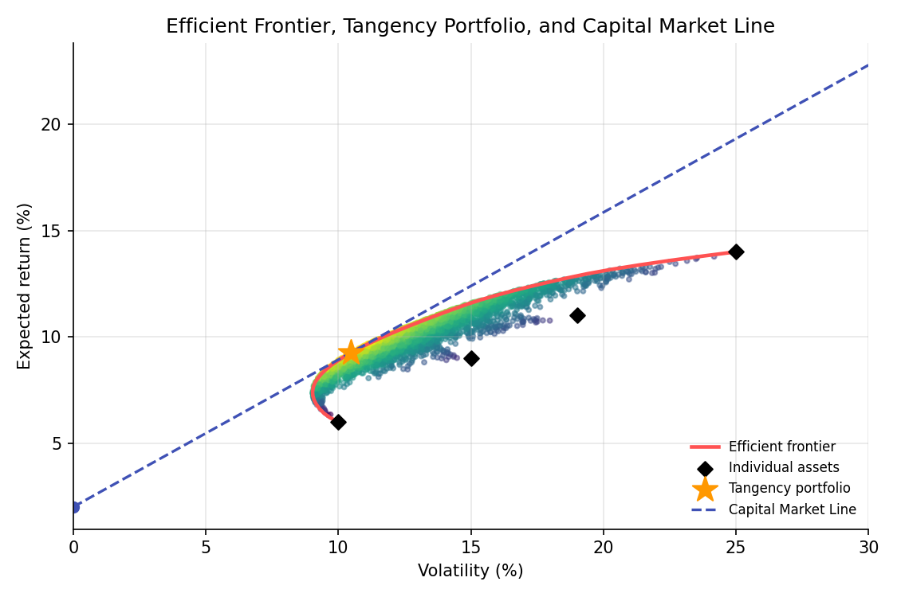

# Markowitz Mean-Variance Optimization

!!! objectives "Learning objectives"
    By the end of this lecture you should be able to:

    - [ ] State the Markowitz mean-variance optimization problem and explain what an efficient frontier represents
    - [ ] Derive the minimum-variance portfolio for a target return using a Lagrangian
    - [ ] Introduce a risk-free asset and derive the tangency portfolio and the Capital Market Line
    - [ ] Compute an efficient frontier and tangency portfolio in Python using a numerical solver

## 1. Intuition

The Portfolio Basics lecture showed that combining assets whose returns are not perfectly correlated reduces risk below the weighted average of the individual risks, and the Optimization Foundations lecture derived the single minimum-variance weight for two assets. Markowitz (1952) generalized this into a full framework: among all portfolios that achieve a given expected return, find the one with the least variance. Sweeping the target return across all achievable values traces out the **efficient frontier**, the set of portfolios that no investor with a preference for more return and less risk would willingly move away from.

Adding a risk-free asset to the mix changes the picture further: instead of choosing anywhere along the curved efficient frontier, every investor's problem reduces to choosing how much to put in a single "best" risky portfolio (the **tangency portfolio**) and how much in the risk-free asset, a result known as the two-fund separation theorem. This is the theoretical backbone the Sharpe ratio, CAPM, and beta (later lectures in this module) are all built on top of.

## 2. Mathematical formulation

Using the notation from Portfolio Basics: \( N \) assets, weight vector \( \mathbf w \), expected return vector \( \boldsymbol\mu \), covariance matrix \( \Sigma \), portfolio expected return \( \mu_p=\mathbf w^\top\boldsymbol\mu \), portfolio variance \( \sigma_p^2=\mathbf w^\top\Sigma\mathbf w \).

**Markowitz problem** (fully invested, short sales allowed):

\[
\min_{\mathbf w}\ \mathbf w^\top\Sigma\mathbf w \qquad \text{s.t.}\quad \mathbf w^\top\mathbf 1=1,\quad \mathbf w^\top\boldsymbol\mu = \mu_{\text{target}}
\]

**With a risk-free asset** earning \( r_f \), the **Sharpe ratio** of a risky portfolio is

\[
S(\mathbf w) = \frac{\mathbf w^\top\boldsymbol\mu - r_f}{\sqrt{\mathbf w^\top\Sigma\mathbf w}}
\]

The **tangency portfolio** \( \mathbf w_T \) maximizes this Sharpe ratio over risky-asset weights (with \( \mathbf w^\top\mathbf 1=1 \) among the risky assets):

\[
\mathbf w_T = \frac{\Sigma^{-1}(\boldsymbol\mu-r_f\mathbf 1)}{\mathbf 1^\top\Sigma^{-1}(\boldsymbol\mu-r_f\mathbf 1)}
\]

**Capital Market Line (CML).** Any combination of the risk-free asset and the tangency portfolio, with fraction \( a \) in the tangency portfolio, has

\[
\mu = r_f + a\,(\mu_T-r_f), \qquad \sigma = a\,\sigma_T \quad\Longrightarrow\quad \mu = r_f + \frac{\mu_T-r_f}{\sigma_T}\,\sigma
\]

a straight line in mean-standard-deviation space with slope equal to the tangency portfolio's Sharpe ratio.

## 3. Derivation

**Minimum-variance portfolio for a target return, via Lagrangian.** Form the Lagrangian for the constrained problem in Section 2:

\[
\mathcal L(\mathbf w,\lambda_1,\lambda_2) = \mathbf w^\top\Sigma\mathbf w - \lambda_1(\mathbf w^\top\mathbf 1-1) - \lambda_2(\mathbf w^\top\boldsymbol\mu-\mu_{\text{target}})
\]

Differentiating with respect to \( \mathbf w \) and setting to zero (following the Optimization Foundations lecture's Lagrangian method, generalized to a vector of decision variables and two constraints):

\[
2\Sigma\mathbf w - \lambda_1\mathbf 1 - \lambda_2\boldsymbol\mu = 0 \quad\Longrightarrow\quad \mathbf w^* = \tfrac12\Sigma^{-1}(\lambda_1\mathbf 1+\lambda_2\boldsymbol\mu)
\]

Substituting back into the two constraints gives two linear equations in \( \lambda_1,\lambda_2 \), which can be solved explicitly (the resulting closed form is standard but algebraically lengthy; see Merton, 1972, for the full derivation). The key structural result is that \( \mathbf w^* \) is always a linear combination of \( \Sigma^{-1}\mathbf 1 \) and \( \Sigma^{-1}\boldsymbol\mu \): every minimum-variance portfolio, for any target return, lies in the two-dimensional space spanned by these two vectors. This is why the entire efficient frontier can be generated as a combination of any two efficient portfolios, a classical mutual fund separation result.

**Why a risk-free asset produces a straight-line (not curved) efficient set.** Consider a portfolio that mixes the risk-free asset with weight \( 1-a \) and a fixed risky portfolio \( P \) with weight \( a \). Since the risk-free asset has zero variance and zero covariance with everything, the combined portfolio's variance is simply

\[
\sigma^2 = a^2\sigma_P^2 \quad\Longrightarrow\quad \sigma = a\,\sigma_P \ \ (\text{for } a\ge0)
\]

so risk scales *linearly* with \( a \) (there is no diversification benefit left to exploit between the risk-free asset and \( P \), since the risk-free asset contributes no variance and no covariance at all). Combined with the linear expected-return relationship \( \mu=r_f+a(\mu_P-r_f) \) (from linearity of expectation), eliminating \( a \) gives a straight line in \( (\sigma,\mu) \) space with slope \( (\mu_P-r_f)/\sigma_P \), the risky portfolio's Sharpe ratio. Since this slope depends only on which risky portfolio \( P \) is chosen, and steeper is better (more expected return per unit of risk along the whole line), every investor prefers the single risky portfolio with the *highest possible* Sharpe ratio, the tangency portfolio, over any other point on the curved risky-only efficient frontier. This is the geometric content of the two-fund separation theorem: with a risk-free asset available, only one risky portfolio, the tangency portfolio, is ever optimal to combine with it; different investors' risk appetites are expressed purely through \( a \), how much of that same portfolio to hold, not through choosing a different risky mix.

## 4. Worked numerical example

Four assets with annual expected returns \( 6\%,9\%,11\%,14\% \) and volatilities \( 10\%,15\%,19\%,25\% \), moderately positively correlated with each other (illustrative numbers, not estimates from real data), and a risk-free rate of 2%. Solving numerically (Section 5) for the maximum-Sharpe-ratio portfolio with no short sales gives approximate weights of 38% in the lowest-risk asset, 23%, 18%, and 21% in the remaining three, achieving an expected return of about 9.3% at a volatility of about 10.5%, a Sharpe ratio of roughly 0.70. Every portfolio on the Capital Market Line, combinations of this tangency portfolio with the risk-free asset, dominates every other combination of risky assets alone that is not on the frontier, in the specific sense of offering more expected return for the same risk or less risk for the same expected return.

## 5. Python implementation

```python
import numpy as np
from scipy.optimize import minimize

rng = np.random.default_rng(61)

mu = np.array([0.06, 0.09, 0.11, 0.14])
sig = np.array([0.10, 0.15, 0.19, 0.25])
corr = np.array([
    [1.0, 0.3, 0.2, 0.1],
    [0.3, 1.0, 0.4, 0.2],
    [0.2, 0.4, 1.0, 0.3],
    [0.1, 0.2, 0.3, 1.0],
])
Sigma = corr * np.outer(sig, sig)
n = len(mu)
rf = 0.02

def port_stats(w):
    return w @ mu, np.sqrt(w @ Sigma @ w)

# --- Efficient frontier: minimize variance for a range of target returns, no short sales ---
target_rets = np.linspace(mu.min(), mu.max(), 40)
frontier_vol = []
for target in target_rets:
    cons = ({"type": "eq", "fun": lambda w: w.sum() - 1},
             {"type": "eq", "fun": lambda w, target=target: w @ mu - target})
    bounds = [(0, 1)] * n
    res = minimize(lambda w: w @ Sigma @ w, x0=np.ones(n)/n, constraints=cons, bounds=bounds)
    frontier_vol.append(np.sqrt(res.fun) if res.success else np.nan)
frontier_vol = np.array(frontier_vol)

# --- Tangency portfolio: maximize Sharpe ratio, no short sales ---
def neg_sharpe(w):
    r, v = port_stats(w)
    return -(r - rf) / v

cons = ({"type": "eq", "fun": lambda w: w.sum() - 1},)
bounds = [(0, 1)] * n
result = minimize(neg_sharpe, x0=np.ones(n)/n, constraints=cons, bounds=bounds)
w_tangency = result.x
r_tan, v_tan = port_stats(w_tangency)

print("Tangency portfolio weights:", np.round(w_tangency, 3))
print(f"Tangency return: {r_tan:.4f}, volatility: {v_tan:.4f}, Sharpe: {(r_tan-rf)/v_tan:.4f}")

# --- Closed-form check via Sigma^{-1}(mu - rf) (unconstrained, short sales allowed) ---
excess = mu - rf
w_unconstrained = np.linalg.solve(Sigma, excess)
w_unconstrained = w_unconstrained / w_unconstrained.sum()
print("Unconstrained (closed-form) tangency weights:", np.round(w_unconstrained, 3))
```


Continuing directly from the code above, here is the plotting code that produces the chart in Section 6:

```python
import matplotlib.pyplot as plt

# Random long-only portfolios, colored by Sharpe ratio
W_random = rng.dirichlet(np.ones(n), 4000)
rets_random = W_random @ mu
vols_random = np.sqrt(np.einsum('ij,jk,ik->i', W_random, Sigma, W_random))

fig, ax = plt.subplots(figsize=(7.5, 5))
ax.scatter(vols_random * 100, rets_random * 100, c=(rets_random - rf) / vols_random,
           cmap="viridis", s=8, alpha=0.5)
ax.plot(frontier_vol * 100, target_rets * 100, color="#ff5252", lw=2.2, label="Efficient frontier")
ax.scatter(sig * 100, mu * 100, color="black", marker="D", s=40, zorder=5, label="Individual assets")
ax.scatter([v_tan * 100], [r_tan * 100], color="#ff9800", marker="*", s=250, zorder=6,
           label="Tangency portfolio")

cml_x = np.linspace(0, 30, 50)
cml_y = rf * 100 + (r_tan - rf) / v_tan * cml_x
ax.plot(cml_x, cml_y, color="#3f51b5", ls="--", lw=1.6, label="Capital Market Line")
ax.scatter([0], [rf * 100], color="#3f51b5", marker="o", s=40)

ax.set_xlabel("Volatility (%)"); ax.set_ylabel("Expected return (%)")
ax.set_title("Efficient Frontier, Tangency Portfolio, and Capital Market Line")
ax.legend(frameon=False, fontsize=8, loc="lower right")
ax.set_xlim(0, 30)
fig.tight_layout()
plt.show()
```

## 6. Visualization

<figure class="qf-figure" markdown>

<figcaption>Grey dots are 4,000 random long-only portfolios of the four assets, colored by Sharpe ratio. The red curve is the efficient frontier: for each level of risk, the minimum-variance portfolio achieving that return. The orange star is the tangency portfolio, and the blue dashed line is the Capital Market Line, the set of portfolios achievable by combining it with the risk-free asset (blue dot), which lies above the risky-asset-only frontier everywhere except at the tangency point itself.</figcaption>
</figure>

## 7. Financial interpretation

Markowitz optimization formalizes "don't put all your eggs in one basket" into a precise, solvable mathematical problem, and the two-fund separation result is a striking simplification: in this idealized framework, every rational investor, regardless of risk tolerance, should hold the *same* risky portfolio (the tangency portfolio), differing only in how much they leverage or de-leverage it with the risk-free asset. This is also the direct theoretical ancestor of the CAPM, covered next, which asks what the tangency portfolio must look like in market equilibrium if every investor follows this logic. In practice, the beautiful theory runs into an ugly problem: \( \boldsymbol\mu \) and \( \Sigma \) must be estimated, and (as flagged already in Estimation Theory and Linear Regression and Regularization) especially \( \boldsymbol\mu \) is estimated with a great deal of noise, which can make naively "optimal" Markowitz weights extremely unstable in practice, a theme picked up again in Risk Parity later in this module.

## 8. Common mistakes

!!! danger "Common mistake: treating estimated inputs as certain"
    Markowitz optimization is only as good as \( \boldsymbol\mu \) and \( \Sigma \). Because expected returns are notoriously hard to estimate precisely (Estimation Theory lecture), naive mean-variance optimization can produce extreme, unintuitive weights that are really just overfitting to estimation noise, a well-documented practical criticism of the textbook approach.

!!! danger "Common mistake: ignoring short-sale and other real-world constraints"
    The unconstrained closed-form solution can call for large short positions that may be impractical, costly, or simply disallowed for a given investor. Section 5 shows both the constrained (no-short-sales) numerical solution and the unconstrained closed-form one; they can differ substantially.

!!! danger "Common mistake: conflating the tangency portfolio with 'the market portfolio'"
    The tangency portfolio depends entirely on the specific \( \boldsymbol\mu \) and \( \Sigma \) used to compute it. Assuming it automatically equals the observed market portfolio (as CAPM's equilibrium argument requires under specific conditions) is an additional economic assumption, not something Markowitz optimization guarantees on its own.

## 9. Exercises

1. Using the code in Section 5, compute the *global minimum-variance* portfolio (ignore expected return entirely, just minimize \( \mathbf w^\top\Sigma\mathbf w \) subject to \( \mathbf w^\top\mathbf 1=1 \)) and compare its weights and volatility to the tangency portfolio.
2. Increase the risk-free rate to 5% and recompute the tangency portfolio. How do the weights change, and why does a higher risk-free rate generally push the tangency portfolio toward lower-risk assets?
3. Verify numerically that every portfolio on the plotted Capital Market Line has a Sharpe ratio exactly equal to the tangency portfolio's Sharpe ratio, confirming the CML's constant-slope property derived in Section 3.

## 10. Further reading

- Merton (1972) gives the full closed-form algebraic solution to the Markowitz problem referenced in Section 3.

## 11. References

1. Markowitz, H. (1952). "Portfolio Selection." *The Journal of Finance*, 7(1), 77–91.
2. Merton, R. C. (1972). "An Analytic Derivation of the Efficient Portfolio Frontier." *Journal of Financial and Quantitative Analysis*, 7(4), 1851–1872.
3. Bodie, Z., Kane, A., & Marcus, A. J. (2021). *Investments* (12th ed.), Chapter 7. McGraw-Hill.
4. SciPy Developers. "`scipy.optimize.minimize`." [docs.scipy.org](https://docs.scipy.org/doc/scipy/reference/generated/scipy.optimize.minimize.html)

---

<div class="grid" markdown>
[:material-arrow-left: Back to Curriculum](/qf-lectures/curriculum/){ .md-button }
[Next: CAPM and Factor Models :material-arrow-right:](/qf-lectures/portfolio-risk/capm-factor-models/){ .md-button .md-button--primary }
</div>
