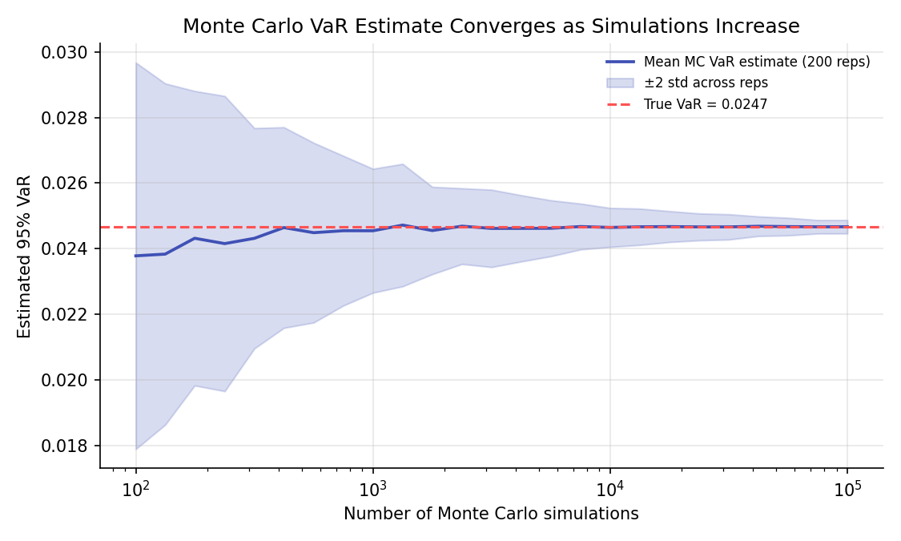
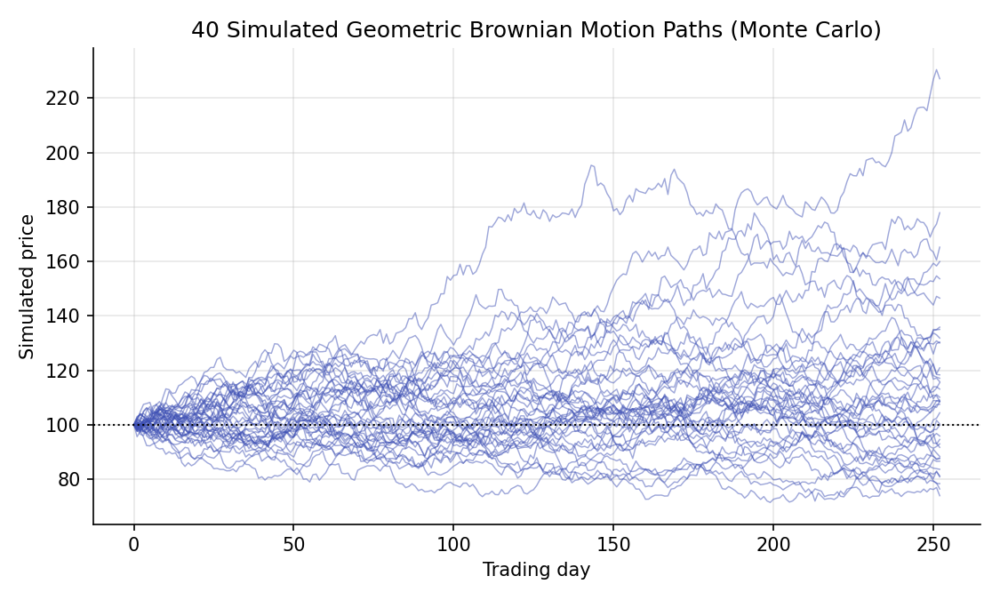

# Monte Carlo Simulation for Risk

!!! objectives "Learning objectives"
    By the end of this lecture you should be able to:

    - [ ] Explain the Monte Carlo method as an application of the Law of Large Numbers
    - [ ] Derive how the standard error of a Monte Carlo estimate shrinks with the number of simulations
    - [ ] Simulate correlated multi-asset returns and geometric Brownian motion price paths in Python
    - [ ] Compute Monte Carlo VaR and Expected Shortfall for a nonlinear portfolio and explain when Monte Carlo is preferred over closed-form methods

## 1. Intuition

The VaR/Expected Shortfall lecture computed a closed-form VaR under a Normal return assumption and a historical VaR from an empirical sample. There is a third approach, **Monte Carlo simulation**: specify a model for how returns (or prices) evolve, generate many random scenarios from that model, and compute the risk measure directly from the simulated outcomes. This is the same Law of Large Numbers logic from the Probability Foundations lecture, applied constructively: rather than deriving a risk measure analytically, simulate enough scenarios that the empirical distribution of simulated outcomes closely approximates the true one.

Monte Carlo earns its place, over the closed-form Normal approach, when the portfolio's payoff is not a simple linear function of a Normal return, exactly the situation for portfolios containing options (Module 4) or other nonlinear instruments, where no simple closed-form VaR formula exists. It also allows richer return models than a single Normal distribution, including the fat-tailed and volatility-clustering models introduced earlier in this module and the previous one.

## 2. Mathematical formulation

**Monte Carlo estimator.** To estimate \( E[g(X)] \) for some function \( g \) of a random variable \( X \) with known distribution, draw \( n \) i.i.d. samples \( X_1,\dots,X_n \) and compute

\[
\widehat{E[g(X)]} = \frac1n\sum_{i=1}^n g(X_i)
\]

By the Law of Large Numbers (Probability Foundations lecture), this converges to the true \( E[g(X)] \) as \( n\to\infty \).

**Monte Carlo standard error.** By the same variance-of-a-sum argument used throughout this curriculum (Portfolio Basics, Probability Foundations),

\[
\text{SE}\big(\widehat{E[g(X)]}\big) = \frac{\sigma_{g(X)}}{\sqrt n}
\]

where \( \sigma_{g(X)} \) is the standard deviation of \( g(X) \) across a single draw.

**Geometric Brownian motion (GBM) simulation**, a standard model for a price path (developed formally in Module 5):

\[
S_{t+\Delta t} = S_t \exp\left[\left(\mu-\tfrac12\sigma^2\right)\Delta t + \sigma\sqrt{\Delta t}\,Z_t\right], \qquad Z_t\sim\mathcal N(0,1)\text{ i.i.d.}
\]

**Correlated multi-asset simulation.** To simulate returns for \( N \) assets with covariance matrix \( \Sigma=LL^\top \) (a Cholesky decomposition, with \( L \) lower-triangular), draw a vector \( \mathbf z\sim\mathcal N(\mathbf 0,I) \) of independent standard Normals and set \( \mathbf r=\boldsymbol\mu+L\mathbf z \), which has the correct mean and covariance structure.

**Monte Carlo VaR/ES.** Given \( n \) simulated portfolio losses \( L_1,\dots,L_n \), sorted ascending,

\[
\widehat{\text{VaR}}_\alpha = L_{(\lceil (1-\alpha)n\rceil)}, \qquad \widehat{\text{ES}}_\alpha = \text{mean of the losses at or beyond } \widehat{\text{VaR}}_\alpha
\]

## 3. Derivation

**Why the Monte Carlo standard error shrinks as \( 1/\sqrt n \), and what this means practically.** This is exactly the same variance-of-the-sample-mean result derived in the Probability Foundations lecture, applied here to \( g(X_i) \) rather than \( X_i \) directly: \( \text{Var}\big(\frac1n\sum_i g(X_i)\big)=\sigma_{g(X)}^2/n \), so the standard error is \( \sigma_{g(X)}/\sqrt n \). The practical consequence, also noted there, is that halving the Monte Carlo error requires *quadrupling* the number of simulations, a real computational cost when \( g \) is expensive to evaluate (for instance, pricing a complex option inside every simulated scenario). This is precisely why Monte Carlo convergence is visibly slow in Section 6's chart, and why variance-reduction techniques (antithetic variates, control variates, and others, beyond this lecture's scope) are an active area of computational finance specifically aimed at improving this \( 1/\sqrt n \) rate's constant factor.

**Why the Cholesky decomposition produces correctly correlated draws.** Suppose \( \mathbf z \) is a vector of independent standard Normals, so \( \text{Cov}(\mathbf z)=I \). Let \( \mathbf r=L\mathbf z \) for a matrix \( L \). Then, using the general rule for the covariance of a linear transformation (the same rule underlying the portfolio variance formula \( \mathbf w^\top\Sigma\mathbf w \) from Portfolio Basics, here applied to a full vector transformation rather than a single scalar combination),

\[
\text{Cov}(\mathbf r) = \text{Cov}(L\mathbf z) = L\,\text{Cov}(\mathbf z)\,L^\top = LIL^\top = LL^\top
\]

So if \( L \) is chosen such that \( LL^\top=\Sigma \), exactly the defining property of the Cholesky decomposition (which exists and is unique for any symmetric positive semi-definite matrix, recall from Linear Algebra for Finance that a valid covariance matrix always has this property), then \( \mathbf r=L\mathbf z \) has covariance matrix exactly \( \Sigma \), as desired. This is the standard, computationally efficient way to generate correlated Normal random vectors for Monte Carlo simulation, used directly in Section 5.

## 4. Worked numerical example

Estimate the 95% VaR of a portfolio with returns \( \mathcal N(0,0.015^2) \) (the same setup as the previous lecture's closed-form example, with true VaR \( \approx0.0247 \)) using Monte Carlo simulation at increasing sample sizes: 100, 1,000, 10,000, and 100,000 simulations. Averaged over 200 independent repetitions at each sample size (to see the estimator's own sampling behavior), the Monte Carlo VaR estimate's spread visibly narrows as the number of simulations grows (Section 6), converging toward the true closed-form value of 0.0247 while its estimation noise shrinks at the theoretical \( 1/\sqrt n \) rate: going from 100 to 10,000 simulations (a 100-fold increase) narrows the spread by roughly a factor of 10, exactly as the derivation in Section 3 predicts.

## 5. Python implementation

```python
import numpy as np
from scipy import stats

rng = np.random.default_rng(91)

# --- Monte Carlo VaR convergence: estimate at increasing simulation counts ---
alpha = 0.05
mu, sigma = 0.0, 0.015
true_var = -(mu + sigma * stats.norm.ppf(alpha))

sample_sizes = [100, 1_000, 10_000, 100_000]
for n in sample_sizes:
    reps = 200
    estimates = [-np.percentile(rng.normal(mu, sigma, n), alpha * 100) for _ in range(reps)]
    print(f"n={n:>7}: mean VaR={np.mean(estimates):.4f}, std across reps={np.std(estimates):.5f}")
print(f"True (closed-form) VaR: {true_var:.4f}")

# --- Correlated multi-asset simulation via Cholesky decomposition ---
mu_assets = np.array([0.0005, 0.0003, 0.0004])
sig_assets = np.array([0.012, 0.015, 0.010])
corr = np.array([[1.0, 0.5, 0.2], [0.5, 1.0, 0.3], [0.2, 0.3, 1.0]])
Sigma = corr * np.outer(sig_assets, sig_assets)

L = np.linalg.cholesky(Sigma)
n_sims = 50_000
Z = rng.normal(size=(n_sims, 3))
simulated_returns = mu_assets + Z @ L.T   # each row: one simulated day's 3-asset return vector

print("\nSimulated covariance (should be close to Sigma):")
print(np.round(np.cov(simulated_returns, rowvar=False), 6))
print("Target Sigma:")
print(np.round(Sigma, 6))

# --- Monte Carlo VaR/ES for an equal-weighted portfolio of the three assets ---
weights = np.array([1/3, 1/3, 1/3])
portfolio_returns = simulated_returns @ weights
VaR_mc = -np.percentile(portfolio_returns, alpha * 100)
ES_mc = -portfolio_returns[portfolio_returns <= -VaR_mc].mean()
print(f"\nPortfolio Monte Carlo VaR(95%) = {VaR_mc:.4f}, ES(95%) = {ES_mc:.4f}")

# --- Geometric Brownian motion price path simulation ---
S0, mu_gbm, sigma_gbm, T, steps, n_paths = 100, 0.06, 0.25, 1.0, 252, 1000
dt = T / steps
paths = np.zeros((n_paths, steps + 1))
paths[:, 0] = S0
Z_paths = rng.normal(size=(n_paths, steps))
for t in range(1, steps + 1):
    paths[:, t] = paths[:, t-1] * np.exp((mu_gbm - 0.5*sigma_gbm**2)*dt + sigma_gbm*np.sqrt(dt)*Z_paths[:, t-1])

final_prices = paths[:, -1]
print(f"\nSimulated GBM: mean final price={final_prices.mean():.2f}, "
      f"analytic E[S_T]={S0*np.exp(mu_gbm*T):.2f}")
```


Continuing directly from the code above, here is the plotting code that produces both charts in Section 6:

```python
import matplotlib.pyplot as plt

# --- Chart 1: MC VaR convergence as simulations increase ---
ns = np.unique(np.logspace(2, 5, 25).astype(int))
means, stds = [], []
for n in ns:
    ests = [-np.percentile(rng.normal(mu, sigma, n), alpha * 100) for _ in range(200)]
    means.append(np.mean(ests)); stds.append(np.std(ests))
means, stds = np.array(means), np.array(stds)

fig, ax = plt.subplots(figsize=(7.5, 4.5))
ax.plot(ns, means, color="#3f51b5", lw=1.8, label="Mean MC VaR estimate (200 reps)")
ax.fill_between(ns, means - 2*stds, means + 2*stds, color="#3f51b5", alpha=0.2, label="±2 std across reps")
ax.axhline(true_var, color="#ff5252", ls="--", lw=1.5, label=f"True VaR = {true_var:.4f}")
ax.set_xscale("log")
ax.set_xlabel("Number of Monte Carlo simulations"); ax.set_ylabel("Estimated 95% VaR")
ax.set_title("Monte Carlo VaR Estimate Converges as Simulations Increase")
ax.legend(frameon=False, fontsize=8)
fig.tight_layout()
plt.show()

# --- Chart 2: simulated GBM price paths ---
fig, ax = plt.subplots(figsize=(7.5, 4.5))
for i in range(40):
    ax.plot(paths[i], lw=0.7, alpha=0.5, color="#3f51b5")
ax.axhline(S0, color="black", ls=":", lw=1)
ax.set_xlabel("Trading day"); ax.set_ylabel("Simulated price")
ax.set_title("40 Simulated Geometric Brownian Motion Paths (Monte Carlo)")
fig.tight_layout()
plt.show()
```

## 6. Visualization

<figure class="qf-figure" markdown>

<figcaption>The Monte Carlo VaR estimate (blue), averaged over 200 repetitions at each sample size, converges toward the true closed-form VaR (red dashed line) as the number of simulations grows, with the band of estimation uncertainty (shaded) narrowing at the 1/√n rate derived in Section 3.</figcaption>
</figure>

<figure class="qf-figure" markdown>

<figcaption>40 simulated one-year daily price paths under geometric Brownian motion, all starting from the same price. Each path represents one Monte Carlo scenario; a full risk or option-pricing simulation would typically use thousands or more such paths, computing whatever risk measure or payoff is needed on each before averaging.</figcaption>
</figure>

## 7. Financial interpretation

Monte Carlo simulation is the standard tool for risk and pricing problems too complex for a closed-form solution: portfolios with options or other nonlinear payoffs (Module 4's Monte Carlo option pricing lecture applies exactly this machinery to pricing), multi-asset portfolios under non-Normal, correlated, or regime-dependent return models, and path-dependent risk measures that depend on more than a single-period return distribution. The trade-off is computational cost and the slow \( 1/\sqrt n \) convergence rate derived in Section 3: getting a precise Monte Carlo estimate, especially for a deep-tail risk measure like a 99.9% VaR where relevant scenarios are rare by construction, can require a very large number of simulations, motivating the variance-reduction techniques mentioned above in more advanced treatments.

## 8. Common mistakes

!!! danger "Common mistake: using too few simulations for a deep-tail estimate"
    Estimating a 99% or 99.9% VaR requires enough simulated scenarios to have a meaningful number of observations in that extreme tail; with only a few thousand simulations, a 99.9% VaR estimate may rest on only a handful of tail observations and be highly unstable, exactly the kind of estimation-noise problem quantified in Section 3.

!!! danger "Common mistake: forgetting the drift adjustment in GBM simulation"
    The \( -\tfrac12\sigma^2 \) term in the GBM formula (Section 2) is not optional; it corrects for the fact that the log of a lognormal variable's expectation is *not* simply the mean of the log. Omitting it produces a systematic upward bias in simulated price paths, a subtle but consequential error covered rigorously when Itô's lemma is developed in Module 5.

!!! danger "Common mistake: assuming independence across assets when simulating a portfolio"
    Simulating each asset's returns independently, ignoring their true covariance structure, produces a portfolio risk estimate that is generally too low (since diversification benefits are overstated when correlations are wrongly set to zero) or, if correlations are actually negative in reality, too high. The Cholesky-based approach in Section 5 is the standard fix.

## 9. Exercises

1. Using the code in Section 5, compute the Monte Carlo standard error of the VaR estimate at \( n=10,000 \) and \( n=1{,}000{,}000 \), and confirm the ratio is close to \( \sqrt{100}=10 \), consistent with the \( 1/\sqrt n \) convergence rate.
2. Modify the correlated-asset simulation to use a correlation of \(-0.5\) between the first two assets instead of \(+0.5\), and recompute the portfolio VaR. Does it increase or decrease, and does that match the diversification intuition from Portfolio Basics?
3. Extend the GBM simulation to price a simple European call option via Monte Carlo: simulate many final prices \( S_T \), compute the payoff \( \max(S_T-K,0) \) for each, average, and discount back at the risk-free rate. Compare your answer to the Black-Scholes closed-form price once you reach Module 4.

## 10. Further reading

- Glasserman's *Monte Carlo Methods in Financial Engineering* is the standard graduate-level reference on variance reduction and simulation techniques for finance.

## 11. References

1. Glasserman, P. (2003). *Monte Carlo Methods in Financial Engineering*. Springer.
2. Boyle, P. P. (1977). "Options: A Monte Carlo Approach." *Journal of Financial Economics*, 4(3), 323–338.
3. Jorion, P. (2006). *Value at Risk: The New Benchmark for Managing Financial Risk* (3rd ed.), Chapter 12. McGraw-Hill.
4. NumPy Developers. "`numpy.linalg.cholesky`." [numpy.org/doc](https://numpy.org/doc/stable/reference/generated/numpy.linalg.cholesky.html)

---

<div class="grid" markdown>
[:material-arrow-left: Previous: Value at Risk and Expected Shortfall](/qf-lectures/portfolio-risk/var-expected-shortfall/){ .md-button }
[Next: Risk Parity and Drawdowns :material-arrow-right:](/qf-lectures/portfolio-risk/risk-parity-drawdowns/){ .md-button .md-button--primary }
</div>
