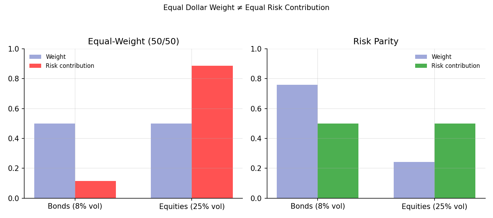
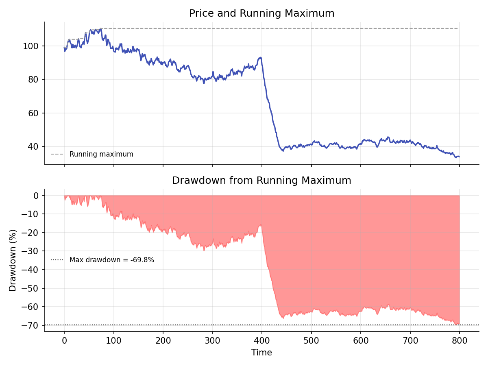

# Risk Parity and Drawdowns

!!! objectives "Learning objectives"
    By the end of this lecture you should be able to:

    - [ ] Define each asset's marginal and total risk contribution to portfolio variance
    - [ ] Derive the risk parity weights for a two-asset portfolio and explain why equal dollar weights do not mean equal risk
    - [ ] Define maximum drawdown and explain why it is a widely used, intuitive risk measure distinct from volatility or VaR
    - [ ] Compute risk contributions, risk parity weights, and running drawdown in Python

## 1. Intuition

A traditional "balanced" 60/40 stock/bond portfolio allocates 60% of *dollars* to equities and 40% to bonds, but because equities are typically far more volatile than bonds, this allocation can end up putting the overwhelming majority of the portfolio's actual *risk* in the equity sleeve. **Risk parity** reframes portfolio construction around equalizing each asset's contribution to total portfolio risk, rather than equalizing dollar weights, directly motivated by the realization, formalized below, that dollar weight and risk contribution are simply different quantities that happen to coincide only in special cases.

**Drawdown**, separately, measures risk from an entirely different angle than variance or VaR: rather than asking about the distribution of single-period returns, it tracks the decline from a portfolio's historical peak value, directly capturing the experience an investor actually lives through during a sustained losing stretch. **Maximum drawdown**, the worst peak-to-trough decline over a given history, is one of the most widely quoted risk statistics in practice, precisely because it maps so directly onto investor psychology and real withdrawal or leverage constraints, in a way that a single-period volatility number does not.

## 2. Mathematical formulation

**Marginal risk contribution.** For a portfolio with weights \( \mathbf w \) and covariance matrix \( \Sigma \), portfolio variance \( \sigma_p^2=\mathbf w^\top\Sigma\mathbf w \), the marginal contribution of asset \( i \) to portfolio *volatility* is

\[
\text{MRC}_i = \frac{\partial \sigma_p}{\partial w_i} = \frac{(\Sigma\mathbf w)_i}{\sigma_p}
\]

**Total risk contribution.** Asset \( i \)'s total contribution to portfolio volatility, satisfying \( \sum_i\text{TRC}_i=\sigma_p \) (a consequence of Euler's theorem for homogeneous functions, since \( \sigma_p \) is a degree-1 homogeneous function of \( \mathbf w \)):

\[
\text{TRC}_i = w_i\times\text{MRC}_i = \frac{w_i(\Sigma\mathbf w)_i}{\sigma_p}
\]

Dividing by \( \sigma_p \) gives each asset's **percentage risk contribution**, summing to 1 across assets.

**Risk parity weights.** The portfolio in which every asset's percentage risk contribution is equal:

\[
\text{TRC}_i = \text{TRC}_j \quad \text{for all } i,j
\]

For two uncorrelated assets, this has the closed form \( w_i\propto1/\sigma_i \): weight inversely proportional to volatility.

**Drawdown.** For a price (or NAV) series \( P_t \), with running maximum \( M_t=\max_{s\le t}P_s \):

\[
DD_t = \frac{P_t-M_t}{M_t} \quad (\le 0)
\]

**Maximum drawdown** over a history of length \( T \):

\[
\text{MDD} = \min_{t\le T} DD_t
\]

## 3. Derivation

**Risk parity weights for two uncorrelated assets.** With \( \rho=0 \), portfolio variance is \( \sigma_p^2=w_1^2\sigma_1^2+w_2^2\sigma_2^2 \) (the two-asset formula from Portfolio Basics with the correlation term dropped), so \( (\Sigma\mathbf w)_1=w_1\sigma_1^2 \) and the total risk contribution of asset 1 is

\[
\text{TRC}_1 = \frac{w_1\cdot w_1\sigma_1^2}{\sigma_p} = \frac{w_1^2\sigma_1^2}{\sigma_p}
\]

and symmetrically \( \text{TRC}_2=w_2^2\sigma_2^2/\sigma_p \). Setting \( \text{TRC}_1=\text{TRC}_2 \):

\[
w_1^2\sigma_1^2 = w_2^2\sigma_2^2 \quad\Longrightarrow\quad w_1\sigma_1 = w_2\sigma_2 \quad\Longrightarrow\quad \frac{w_1}{w_2}=\frac{\sigma_2}{\sigma_1}
\]

so, combined with \( w_1+w_2=1 \), \( w_i\propto1/\sigma_i \) exactly as stated in Section 2: the higher-volatility asset gets a smaller weight, in inverse proportion to its volatility, specifically so that its larger volatility and smaller weight exactly offset to produce the same risk contribution as the lower-volatility, larger-weight asset. This is a clean, direct generalization of the inverse-volatility weighting intuition, though for more than two assets, or with nonzero correlations, risk parity weights generally require solving a nonlinear system numerically rather than this simple closed form.

**Why \( \sum_i\text{TRC}_i=\sigma_p \) exactly (Euler's theorem).** Portfolio volatility \( \sigma_p(\mathbf w)=\sqrt{\mathbf w^\top\Sigma\mathbf w} \) is a homogeneous function of degree 1 in \( \mathbf w \): scaling every weight by a constant \( k>0 \) scales the function value by exactly \( k \), since \( \sigma_p(k\mathbf w)=\sqrt{k^2\mathbf w^\top\Sigma\mathbf w}=k\sigma_p(\mathbf w) \). Euler's homogeneous function theorem states that for any degree-1 homogeneous, differentiable function \( f \), \( \sum_i w_i\frac{\partial f}{\partial w_i}=f(\mathbf w) \). Applying this directly gives \( \sum_i w_i\,\text{MRC}_i=\sigma_p \), i.e. \( \sum_i\text{TRC}_i=\sigma_p \) exactly, confirming that the total risk contributions genuinely add up to the whole, with nothing left over and nothing double-counted, which is what makes "percentage risk contribution" a sensible, well-defined concept in the first place rather than an approximation.

## 4. Worked numerical example

A simplified stock/bond portfolio: bonds with 8% volatility, equities with 25% volatility, correlation 0.1. An equal-dollar-weight (50/50) allocation gives bonds a risk contribution of only about 11.5% and equities about 88.5%, a striking imbalance given the "balanced" 50/50 dollar split. The risk parity weights for this pair work out to roughly 76% bonds and 24% equities (close to, though not exactly, the uncorrelated closed form \( 1/\sigma_i \) due to the small positive correlation), which by construction gives each asset exactly a 50% risk contribution. This large gap between the equal-weight and risk-parity allocations, visualized in Section 6, is the entire practical motivation for the risk parity approach: achieving genuine risk diversification, not merely diversification of dollars, across a bond/equity mix where volatilities differ by a factor of three.

## 5. Python implementation

```python
import numpy as np

# --- Risk contribution analysis: equal weight vs. risk parity ---
sig = np.array([0.08, 0.25])          # bond and equity volatilities
rho = 0.1
Sigma = np.array([[sig[0]**2, rho*sig[0]*sig[1]],
                   [rho*sig[0]*sig[1], sig[1]**2]])

def risk_contributions(w, Sigma):
    port_vol = np.sqrt(w @ Sigma @ w)
    marginal = (Sigma @ w) / port_vol      # marginal contribution to volatility
    total = w * marginal                   # total (percentage, since they sum to port_vol) contribution
    return total / port_vol                # normalize to sum to 1

w_equal = np.array([0.5, 0.5])
rc_equal = risk_contributions(w_equal, Sigma)
print("Equal-weight risk contributions:", np.round(rc_equal, 4))

# Closed-form risk parity weights for the uncorrelated case, as a starting point
w_rp_guess = (1 / sig) / (1 / sig).sum()

# Solve the (correlated) risk-parity condition numerically
from scipy.optimize import minimize

def rp_objective(w):
    w_full = np.append(w, 1 - w.sum())
    rc = risk_contributions(w_full, Sigma)
    return np.sum((rc - rc.mean())**2)   # minimized at 0 when all risk contributions are equal

res = minimize(rp_objective, x0=[w_rp_guess[0]], bounds=[(0.01, 0.99)])
w_rp = np.array([res.x[0], 1 - res.x[0]])
rc_rp = risk_contributions(w_rp, Sigma)
print("Risk parity weights:            ", np.round(w_rp, 4))
print("Risk parity risk contributions: ", np.round(rc_rp, 4))

# --- Maximum drawdown ---
rng = np.random.default_rng(101)
T = 800
returns = rng.normal(0.0004, 0.012, T)
returns[400:440] -= 0.02   # inject a crash period

price = 100 * np.cumprod(1 + returns)
running_max = np.maximum.accumulate(price)
drawdown = price / running_max - 1
max_drawdown = drawdown.min()
max_dd_time = drawdown.argmin()

print(f"\nMaximum drawdown: {max_drawdown*100:.2f}% at t={max_dd_time}")

# Longest drawdown duration: time between a peak and full recovery to a new peak
underwater = drawdown < 0
```


Continuing directly from the code above, here is the plotting code that produces both charts in Section 6:

```python
import matplotlib.pyplot as plt

# --- Chart 1: weight vs. risk contribution, equal-weight vs. risk parity ---
fig, axes = plt.subplots(1, 2, figsize=(9.5, 4.2))
labels = ["Bonds (8% vol)", "Equities (25% vol)"]
x = np.arange(2); bar_w = 0.35

axes[0].bar(x - bar_w/2, w_equal, bar_w, label="Weight", color="#9fa8da")
axes[0].bar(x + bar_w/2, rc_equal, bar_w, label="Risk contribution", color="#ff5252")
axes[0].set_xticks(x); axes[0].set_xticklabels(labels); axes[0].set_title("Equal-Weight (50/50)")
axes[0].legend(frameon=False, fontsize=8); axes[0].set_ylim(0, 1)

axes[1].bar(x - bar_w/2, w_rp, bar_w, label="Weight", color="#9fa8da")
axes[1].bar(x + bar_w/2, rc_rp, bar_w, label="Risk contribution", color="#4caf50")
axes[1].set_xticks(x); axes[1].set_xticklabels(labels); axes[1].set_title("Risk Parity")
axes[1].legend(frameon=False, fontsize=8); axes[1].set_ylim(0, 1)

fig.suptitle("Equal Dollar Weight ≠ Equal Risk Contribution", fontsize=10)
fig.tight_layout(rect=[0, 0, 1, 0.93])
plt.show()

# --- Chart 2: price, running maximum, and drawdown ---
fig, axes = plt.subplots(2, 1, figsize=(8, 6), sharex=True)
axes[0].plot(price, color="#3f51b5")
axes[0].plot(running_max, color="#9e9e9e", ls="--", lw=1, label="Running maximum")
axes[0].set_title("Price and Running Maximum"); axes[0].legend(frameon=False, fontsize=8)

axes[1].fill_between(range(T), drawdown * 100, 0, color="#ff5252", alpha=0.6)
axes[1].axhline(max_drawdown * 100, color="black", ls=":", lw=1, label=f"Max drawdown = {max_drawdown*100:.1f}%")
axes[1].set_title("Drawdown from Running Maximum"); axes[1].set_xlabel("Time"); axes[1].set_ylabel("Drawdown (%)")
axes[1].legend(frameon=False, fontsize=8)
fig.tight_layout()
plt.show()
```

## 6. Visualization

<figure class="qf-figure" markdown>

<figcaption>Left: an equal-weight (50/50) bond/equity portfolio puts only about 50% of dollars but nearly 88% of risk into equities, since equity volatility is roughly three times bond volatility. Right: the risk-parity portfolio, with about 76% in bonds and 24% in equities, achieves an exactly even 50/50 risk split, confirming the algebra from Section 3.</figcaption>
</figure>

<figure class="qf-figure" markdown>

<figcaption>Top: a simulated price path (blue) with its running historical maximum (grey dashed). Bottom: the resulting drawdown, the percentage decline from that running maximum at every point in time, reaching its deepest point (maximum drawdown, marked) well after the injected crash period, since a drawdown continues to deepen with every subsequent loss until a new all-time high is eventually reached.</figcaption>
</figure>

## 7. Financial interpretation

Risk parity strategies, popularized by funds such as Bridgewater's All Weather approach, are a direct institutional response to the imbalance illustrated in Section 4: a naively "balanced" 60/40 portfolio is, in risk terms, overwhelmingly an equity bet. Equalizing risk contributions across asset classes, rather than dollar weights, is intended to produce a portfolio whose performance is not dominated by any single risk source, though it is worth noting this typically requires leveraging the lower-volatility sleeve (bonds, here) to achieve a competitive overall expected return, since naive risk parity alone tends to produce a lower-return, lower-volatility portfolio than a dollar-weighted equity-heavy one. Maximum drawdown, meanwhile, is widely used alongside or instead of volatility and VaR specifically because it captures sustained, realized pain in a way a single-period statistic cannot, and it directly determines practical constraints like margin calls, redemption pressure, and an investor's psychological capacity to stay invested through a losing stretch, something a smooth, symmetric Normal-distribution volatility number does not convey nearly as viscerally.

## 8. Common mistakes

!!! danger "Common mistake: confusing dollar weight with risk weight"
    As Section 4 shows starkly, a portfolio can look "balanced" by dollar allocation while being extremely concentrated in risk terms. Always check risk contributions explicitly, as in Section 5, rather than assuming dollar diversification implies risk diversification.

!!! danger "Common mistake: computing maximum drawdown from returns instead of cumulative price levels"
    Drawdown is defined relative to a running *price or NAV* maximum, not computed directly from individual period returns. Attempting to shortcut the calculation by working only with returns, without first reconstructing the cumulative price path and its running maximum as in Section 5, is a common implementation error.

!!! danger "Common mistake: ignoring drawdown duration, not just depth"
    Maximum drawdown reports only the depth of the worst decline, not how long the portfolio remained "underwater" before recovering to a new high. Two portfolios with identical maximum drawdown can have very different recovery times, a meaningfully different risk experience that depth alone does not capture.

## 9. Exercises

1. Using the code in Section 5, recompute the risk parity weights if the bond/equity correlation were \(-0.2\) instead of \(+0.1\). How does the risk-parity weight split change, and why?
2. Extend the risk contribution function to three assets (add a commodities sleeve with, say, 18% volatility and modest correlations to both bonds and equities) and solve for the three-asset risk parity weights numerically.
3. Using the simulated price series in Section 5, compute the drawdown *duration*: the number of periods from the pre-crash peak until the price series first reaches a new all-time high again (if it does within the simulated window). Report both the maximum drawdown and its duration together.

## 10. Further reading

- Qian (2005) and Maillard, Roncalli, and Teïletche (2010) are foundational papers formalizing the risk parity approach described here.

## 11. References

1. Qian, E. (2005). "Risk Parity Portfolios: Efficient Portfolios Through True Diversification." Panagora Asset Management.
2. Maillard, S., Roncalli, T., & Teïletche, J. (2010). "The Properties of Equally Weighted Risk Contribution Portfolios." *The Journal of Portfolio Management*, 36(4), 60–70.
3. Bodie, Z., Kane, A., & Marcus, A. J. (2021). *Investments* (12th ed.), Chapter 24 (Performance Evaluation). McGraw-Hill.
4. NumPy Developers. "`numpy.maximum.accumulate`." [numpy.org/doc](https://numpy.org/doc/stable/reference/generated/numpy.maximum.accumulate.html)

---

<div class="grid" markdown>
[:material-arrow-left: Previous: Monte Carlo Simulation for Risk](/qf-lectures/portfolio-risk/monte-carlo-risk/){ .md-button }
[Back to Curriculum :material-arrow-right:](/qf-lectures/curriculum/){ .md-button .md-button--primary }
</div>
