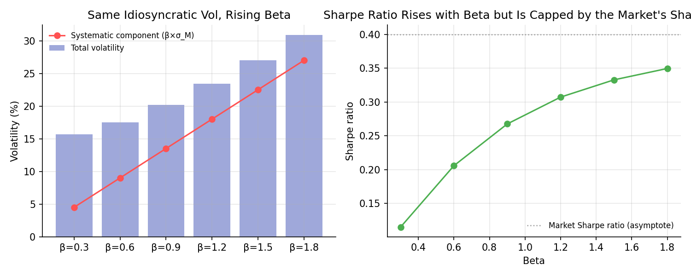
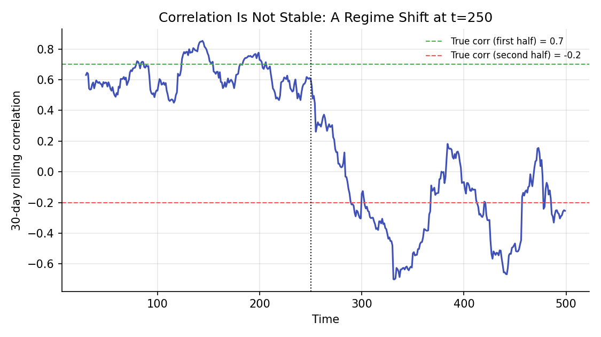

# Sharpe Ratio, Beta, and Covariance

!!! objectives "Learning objectives"
    By the end of this lecture you should be able to:

    - [ ] Define the Sharpe ratio and explain what it does and does not measure
    - [ ] Decompose an asset's total variance into systematic and idiosyncratic components using beta
    - [ ] Explain why beta, not total volatility, determines an asset's required CAPM return, quantitatively
    - [ ] Compute rolling beta and covariance in Python and explain why they are unstable over time

## 1. Intuition

This module has now built the Sharpe ratio (introduced informally in Hypothesis Testing, where its statistical estimation error was derived), beta (introduced in CAPM), and covariance (introduced in Portfolio Basics and Linear Algebra) separately. This lecture ties the three together and makes explicit something easy to gloss over: the Sharpe ratio measures reward per unit of *total* risk, while CAPM's beta measures exposure to *systematic* risk only, and these are genuinely different lenses on the same asset. An asset can have a mediocre Sharpe ratio on its own while still being a valuable diversifier in a portfolio, precisely because what matters for the portfolio is not the asset's own risk-reward trade-off in isolation but its covariance with everything else already held, the same insight, now viewed from a different angle, that drove the entire Markowitz framework.

## 2. Mathematical formulation

**Sharpe ratio**, per period:

\[
SR_i = \frac{E[R_i]-r_f}{\sigma_i}
\]

**Beta**, as in the CAPM lecture:

\[
\beta_i = \frac{\text{Cov}(R_i,R_M)}{\text{Var}(R_M)} = \rho_{iM}\,\frac{\sigma_i}{\sigma_M}
\]

where \( \rho_{iM} \) is the correlation between asset \( i \) and the market.

**Variance decomposition.** Writing the single-factor (market) model \( R_i=\alpha_i+\beta_iR_M+\varepsilon_i \) with \( \varepsilon_i \) uncorrelated with \( R_M \):

\[
\sigma_i^2 = \underbrace{\beta_i^2\sigma_M^2}_{\text{systematic}} + \underbrace{\sigma_{\varepsilon_i}^2}_{\text{idiosyncratic}}
\]

**Information ratio**, a Sharpe-ratio analogue for *active* (benchmark-relative) performance:

\[
IR_i = \frac{\alpha_i}{\sigma_{\varepsilon_i}}
\]

using the alpha and idiosyncratic (residual) volatility from the same regression.

## 3. Derivation

**Why the Sharpe ratio and beta can disagree about which asset is "better."** Rewrite beta using \( \rho_{iM}=\text{Cov}(R_i,R_M)/(\sigma_i\sigma_M) \), so \( \beta_i=\rho_{iM}\sigma_i/\sigma_M \). Substituting into the CAPM risk premium \( \beta_i(E[R_M]-r_f) \) and dividing by \( \sigma_i \) to compare with the Sharpe ratio:

\[
SR_i \overset{\text{CAPM}}{=} \frac{\beta_i(E[R_M]-r_f)}{\sigma_i} = \rho_{iM}\,\frac{E[R_M]-r_f}{\sigma_M} = \rho_{iM}\times SR_M
\]

This is a genuinely useful identity: under CAPM holding exactly, an asset's Sharpe ratio is simply its correlation with the market times the market's own Sharpe ratio. It immediately shows that an asset's Sharpe ratio is capped by \( SR_M \) (since \( \rho_{iM}\le1 \)) and is highest when the asset moves in lockstep with the market (\( \rho_{iM}=1 \)); an asset with a *low* correlation to the market (low \( \rho_{iM} \), and hence typically also low beta, since \( \beta_i=\rho_{iM}\sigma_i/\sigma_M \)) cannot have a high Sharpe ratio under this identity, no matter how attractive its beta-implied CAPM return looks relative to its total volatility (which, recall, it wasn't priced against in the first place, CAPM prices against covariance, not total variance). This confirms and quantifies the qualitative point from Section 1: total-risk-adjusted return (Sharpe) and systematic-risk exposure (beta) are related but distinct, and an asset that looks unremarkable by Sharpe ratio alone can still be exactly the low-correlation diversifier a portfolio needs, an idea developed further in the Risk Parity lecture later in this module.

**Why the variance decomposition holds.** From \( R_i=\alpha_i+\beta_iR_M+\varepsilon_i \) with \( \text{Cov}(R_M,\varepsilon_i)=0 \) by the regression's own construction (an OLS residual is, by the normal equations from the Linear Regression lecture, uncorrelated with the regressor):

\[
\text{Var}(R_i) = \text{Var}(\beta_iR_M) + \text{Var}(\varepsilon_i) + 2\,\text{Cov}(\beta_iR_M,\varepsilon_i) = \beta_i^2\sigma_M^2 + \sigma_{\varepsilon_i}^2 + 0
\]

exactly the decomposition in Section 2. This shows explicitly that total variance splits cleanly into a piece explained by market exposure and a piece that is not, and it is the residual (idiosyncratic) piece, not the total, that diversifies away in a large, well-diversified portfolio, per the CAPM lecture's argument.

## 4. Worked numerical example

Consider six hypothetical assets, all with the same idiosyncratic volatility of 15%, but betas ranging from 0.3 to 1.8 (market volatility 15%, market premium 6%, risk-free rate 2%). As beta rises, total volatility rises (since the systematic component \( \beta_i\sigma_M \) grows), and so does the implied correlation with the market, \( \rho_{iM}=\beta_i\sigma_M/\sigma_i \). Computing the Sharpe ratio for each asset (Section 5) shows it rising from about 0.11 at \( \beta=0.3 \) to about 0.35 at \( \beta=1.8 \), consistent with the identity \( SR_i=\rho_{iM}\times SR_M \) derived in Section 3: with idiosyncratic volatility held fixed, a higher beta mechanically raises the market-correlation term \( \rho_{iM} \) toward 1, pulling the asset's Sharpe ratio up toward, but never above, the market's own Sharpe ratio of \( 0.06/0.15=0.40 \). The Sharpe ratio does not keep climbing without bound as beta grows; it saturates, approaching \( SR_M \) asymptotically. This is the quantitative content of "beta and Sharpe ratio are related but distinct": an asset's Sharpe ratio here is entirely a function of how correlated it is with the market, not of its beta or total risk in isolation, and no amount of additional beta (holding idiosyncratic risk fixed) can push it past the market's own risk-reward ratio.

## 5. Python implementation

```python
import numpy as np

rng = np.random.default_rng(71)

# --- Variance decomposition and the Sharpe/beta identity for a range of betas ---
betas = np.array([0.3, 0.6, 0.9, 1.2, 1.5, 1.8])
mkt_vol, idio_vol = 0.15, 0.15
mkt_premium, rf = 0.06, 0.02

total_vol = np.sqrt((betas * mkt_vol)**2 + idio_vol**2)
capm_return = rf + betas * mkt_premium
sharpe = (capm_return - rf) / total_vol
rho_iM = (betas * mkt_vol) / total_vol   # implied correlation with the market
sharpe_market = mkt_premium / mkt_vol

print("beta   total_vol  Sharpe   rho_iM   rho_iM*SR_market")
for b, tv, s, r in zip(betas, total_vol, sharpe, rho_iM):
    print(f"{b:.1f}    {tv:.4f}    {s:.4f}   {r:.4f}   {r*sharpe_market:.4f}")

# --- Rolling beta and covariance: showing instability over time ---
T = 500
regime = np.r_[np.full(250, 0.7), np.full(250, -0.2)]   # correlation shifts halfway through
r1 = rng.normal(0, 0.01, T)
r2 = np.array([regime[t]*r1[t] + np.sqrt(1-regime[t]**2)*rng.normal(0, 0.01) for t in range(T)])

window = 30
roll_corr = np.array([
    np.corrcoef(r1[t-window:t], r2[t-window:t])[0, 1] for t in range(window, T)
])
roll_beta = np.array([
    np.cov(r2[t-window:t], r1[t-window:t])[0, 1] / np.var(r1[t-window:t]) for t in range(window, T)
])

print(f"\nRolling correlation, first 5 windows:  {np.round(roll_corr[:5], 3)}")
print(f"Rolling correlation, around the shift (t=245-255): {np.round(roll_corr[215:225], 3)}")
print(f"Rolling correlation, last 5 windows:   {np.round(roll_corr[-5:], 3)}")
```


Continuing directly from the code above, here is the plotting code that produces both charts in Section 6:

```python
import matplotlib.pyplot as plt

# --- Chart 1: systematic vs. idiosyncratic volatility, and the resulting Sharpe ratio ---
fig, axes = plt.subplots(1, 2, figsize=(10, 4))
axes[0].bar(range(len(betas)), total_vol * 100, color="#9fa8da", label="Total volatility")
axes[0].plot(range(len(betas)), betas * mkt_vol * 100, "o-", color="#ff5252",
             label="Systematic component (β×σ_M)")
axes[0].set_xticks(range(len(betas))); axes[0].set_xticklabels([f"β={b}" for b in betas])
axes[0].set_ylabel("Volatility (%)"); axes[0].set_title("Same Idiosyncratic Vol, Rising Beta")
axes[0].legend(frameon=False, fontsize=8)

axes[1].plot(betas, sharpe, "o-", color="#4caf50")
axes[1].axhline(sharpe_market, color="#9e9e9e", ls=":", lw=1.2, label="Market Sharpe ratio (asymptote)")
axes[1].set_xlabel("Beta"); axes[1].set_ylabel("Sharpe ratio")
axes[1].set_title("Sharpe Ratio Rises with Beta but Is Capped by the Market's Sharpe Ratio")
axes[1].legend(frameon=False, fontsize=8)
fig.tight_layout()
plt.show()

# --- Chart 2: rolling correlation showing a regime shift ---
fig, ax = plt.subplots(figsize=(7.5, 4.2))
ax.plot(range(window, T), roll_corr, color="#3f51b5")
ax.axhline(0.7, color="#4caf50", ls="--", lw=1, label="True corr (first half) = 0.7")
ax.axhline(-0.2, color="#ff5252", ls="--", lw=1, label="True corr (second half) = -0.2")
ax.axvline(250, color="black", ls=":", lw=1)
ax.set_xlabel("Time"); ax.set_ylabel(f"{window}-day rolling correlation")
ax.set_title("Correlation Is Not Stable: A Regime Shift at t=250")
ax.legend(frameon=False, fontsize=8)
fig.tight_layout()
plt.show()
```

## 6. Visualization

<figure class="qf-figure" markdown>

<figcaption>Left: with idiosyncratic volatility held fixed, total volatility (bars) grows with beta, driven by the growing systematic component (red line). Right: the resulting Sharpe ratio is not simply increasing in beta, confirming that beta (systematic risk exposure) and Sharpe ratio (total-risk-adjusted return) are genuinely different measures, as derived algebraically in Section 3.</figcaption>
</figure>

<figure class="qf-figure" markdown>

<figcaption>A rolling correlation estimate between two series whose true correlation shifts from 0.7 to −0.2 halfway through the sample. The rolling estimate (blue) tracks each regime reasonably well within it but reacts only gradually right around the shift, illustrating why covariance and beta estimates are treated as time-varying, not fixed, quantities in practice.</figcaption>
</figure>

## 7. Financial interpretation

Fund managers and risk teams routinely report both Sharpe ratio (or information ratio, for active managers benchmarked against an index) and beta, precisely because they answer different questions: Sharpe ratio asks "how much return did this generate per unit of total risk taken," while beta asks "how exposed is this to the same systematic risk everyone else is already exposed to." A hedge fund strategy with a modest standalone Sharpe ratio but low or negative beta to equities can still be a highly valuable portfolio addition, since it diversifies systematic risk that a purely high-Sharpe, high-beta strategy would concentrate. The instability shown in Section 6's second chart is also a practical, everyday reality: beta and correlation estimates used for hedging or risk budgeting need regular re-estimation, since the "true" relationship between two assets can and does shift with market regimes, a theme returned to more formally in Module 7's regime-detection lectures (Hidden Markov Models, Kalman filters).

## 8. Common mistakes

!!! danger "Common mistake: assuming a high Sharpe ratio implies a good diversifier"
    As the identity in Section 3 shows, a high standalone Sharpe ratio (relative to the market's) typically comes with high correlation to the market, meaning limited diversification benefit for a portfolio that already holds market exposure. Sharpe ratio and diversification value are, if anything, somewhat in tension.

!!! danger "Common mistake: using a long-window beta estimate uncritically"
    Because covariance and correlation genuinely shift over time (Section 6), a beta estimated from many years of data can be stale relative to current market conditions. Compare rolling-window estimates, as done in Section 5, rather than relying on a single long-sample number.

!!! danger "Common mistake: comparing Sharpe ratios across different risk exposures without context"
    Two strategies with the same Sharpe ratio can have very different betas, and hence very different roles in a portfolio. Sharpe ratio alone, without also knowing beta or correlation to existing holdings, is not enough information to decide whether adding a strategy improves a portfolio.

## 9. Exercises

1. Using the identity \( SR_i=\rho_{iM}\times SR_M \) derived in Section 3, compute the maximum possible Sharpe ratio for an asset with correlation 0.4 to a market with Sharpe ratio 0.5. Does this match the values computed in Section 5 for the corresponding beta?
2. Modify the rolling-window code in Section 5 to use a 60-day window instead of 30. How does the rolling correlation estimate's responsiveness to the regime shift change, and what trade-off does window length represent?
3. Simulate an asset with beta 0 (zero correlation to the market) but a positive expected return (violating CAPM). Compute its Sharpe ratio directly, and explain why the Section 3 identity does not constrain it in this case.

## 10. Further reading

- Grinold and Kahn's *Active Portfolio Management* develops the information ratio and its relationship to the Sharpe ratio in much greater depth, in the context of active fund management.

## 11. References

1. Sharpe, W. F. (1966). "Mutual Fund Performance." *The Journal of Business*, 39(1), 119–138.
2. Grinold, R. C., & Kahn, R. N. (1999). *Active Portfolio Management* (2nd ed.). McGraw-Hill.
3. Lo, A. W. (2002). "The Statistics of Sharpe Ratios." *Financial Analysts Journal*, 58(4), 36–52.
4. NumPy Developers. "`numpy.corrcoef`." [numpy.org/doc](https://numpy.org/doc/stable/reference/generated/numpy.corrcoef.html)

---

<div class="grid" markdown>
[:material-arrow-left: Previous: CAPM and Factor Models](/qf-lectures/portfolio-risk/capm-factor-models/){ .md-button }
[Next: Value at Risk and Expected Shortfall :material-arrow-right:](/qf-lectures/portfolio-risk/var-expected-shortfall/){ .md-button .md-button--primary }
</div>
