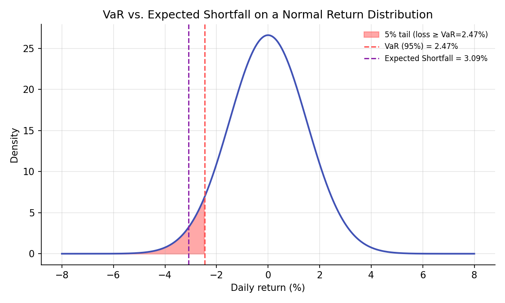
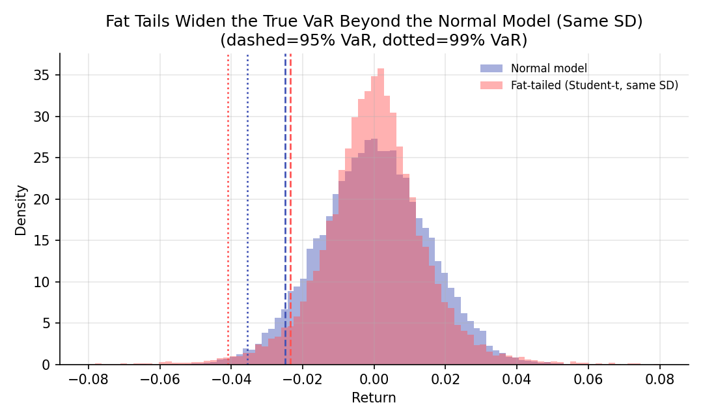

# Value at Risk and Expected Shortfall

!!! objectives "Learning objectives"
    By the end of this lecture you should be able to:

    - [ ] Define Value at Risk (VaR) and Expected Shortfall (ES) and explain what question each answers
    - [ ] Derive the closed-form VaR and ES formulas under a Normal return assumption
    - [ ] Explain why VaR is not a coherent risk measure, and why ES is
    - [ ] Compute parametric (Normal), historical, and Monte Carlo VaR/ES in Python and compare them

## 1. Intuition

Every risk concept in this module so far, variance, beta, correlation, describes risk in aggregate, on average, across the whole distribution of outcomes. Regulators, risk managers, and traders often want a more specific, single-number answer to a sharper question: "how bad could things get, at some specified confidence level, over some specified horizon?" **Value at Risk (VaR)** answers "what loss level will not be exceeded with probability \( 1-\alpha \)?" **Expected Shortfall (ES)**, also called Conditional VaR, answers a related but more informative question: "given that the loss does exceed the VaR threshold, how bad is it on average?"

The distinction matters more than it might first appear. VaR only reports a threshold; it says nothing about how bad things get *beyond* that threshold, an omission that became a widely discussed criticism of VaR-based risk management in the years around the 2008 financial crisis, since two portfolios can have an identical VaR while one has a catastrophically worse tail beyond it. ES was developed specifically to address this gap, and it has increasingly displaced VaR as the primary regulatory risk measure for market risk (the Basel Committee's move to ES in its 2016 Fundamental Review of the Trading Book is a direct institutional response to this).

## 2. Mathematical formulation

Let \( L \) denote the loss on a position over a fixed horizon (positive \( L \) means a loss; if \( R \) is the return, \( L=-R \)), and let \( \alpha\in(0,1) \) be the tail probability (commonly \( \alpha=0.05 \) or \( \alpha=0.01 \)).

**Value at Risk.**

\[
\text{VaR}_\alpha = \inf\{\, l : P(L>l) \le \alpha \,\}
\]

that is, the smallest loss level such that the probability of exceeding it is at most \( \alpha \). Equivalently, if \( F_R \) is the return distribution's CDF, \( \text{VaR}_\alpha=-F_R^{-1}(\alpha) \), the negative of the return's \( \alpha \)-quantile.

**Expected Shortfall.**

\[
\text{ES}_\alpha = E[L \mid L > \text{VaR}_\alpha]
\]

the expected loss, given that the loss already exceeds the VaR threshold.

**Closed form under a Normal return assumption.** If \( R\sim\mathcal N(\mu,\sigma^2) \):

\[
\text{VaR}_\alpha = -(\mu+\sigma\,z_\alpha), \qquad \text{ES}_\alpha = -\mu+\sigma\,\frac{\phi(z_\alpha)}{\alpha}
\]

where \( z_\alpha=\Phi^{-1}(\alpha) \) is the standard Normal \( \alpha \)-quantile (a negative number for \( \alpha<0.5 \)) and \( \phi \) is the standard Normal density.

**Coherence (Artzner et al., 1999).** A risk measure \( \rho \) is **coherent** if it satisfies, for all portfolios \( X,Y \) and constant \( c \):

- Monotonicity: \( X\le Y \Rightarrow \rho(X)\ge\rho(Y) \)
- Translation invariance: \( \rho(X+c)=\rho(X)-c \)
- Positive homogeneity: \( \rho(\lambda X)=\lambda\rho(X) \) for \( \lambda>0 \)
- **Subadditivity**: \( \rho(X+Y)\le\rho(X)+\rho(Y) \)

## 3. Derivation

**Deriving the Normal VaR and ES formulas.** For \( R\sim\mathcal N(\mu,\sigma^2) \), the \( \alpha \)-quantile of \( R \) is \( \mu+\sigma z_\alpha \) by definition of the standardized Normal quantile. Since \( \text{VaR}_\alpha=-F_R^{-1}(\alpha) \), substituting gives \( \text{VaR}_\alpha=-(\mu+\sigma z_\alpha) \) directly, as stated in Section 2. For Expected Shortfall, by definition \( \text{ES}_\alpha=-E[R\mid R\le -\text{VaR}_\alpha]=-E[R\mid R\le\mu+\sigma z_\alpha] \). Using the standard result for the truncated mean of a Normal distribution (a standard calculus exercise: differentiate the Normal CDF and integrate by parts, or look up the truncated-Normal moment formula, e.g. in Casella and Berger, 2002),

\[
E[R \mid R\le \mu+\sigma z_\alpha] = \mu - \sigma\,\frac{\phi(z_\alpha)}{\alpha}
\]

so \( \text{ES}_\alpha=-\mu+\sigma\,\phi(z_\alpha)/\alpha \), exactly as stated. Since \( \phi(z_\alpha)/\alpha>|z_\alpha| \) for the tail probabilities used in practice (a consequence of the Normal density's specific shape in the tail), \( \text{ES}_\alpha>\text{VaR}_\alpha \) always: Expected Shortfall is always at least as large as VaR at the same confidence level, consistent with ES describing what happens *inside* the tail rather than merely its boundary.

**Why VaR fails subadditivity (and is therefore not coherent), with a concrete counterexample.** Consider two independent bonds, each defaulting (losing the full \$100 notional) with probability 4%, and paying a small positive return otherwise. At the 95% confidence level (\( \alpha=0.05 \)), a single bond's default probability (4%) is below \( \alpha \), so the 95% VaR of a single bond is small (only the small no-default outcomes fall within the 95% region; the default event lies in the excluded 5% tail with room to spare). But the probability that a *portfolio* of two independent such bonds has *at least one* default is \( 1-(0.96)^2\approx7.84\% \), which now exceeds \( \alpha=5\% \), pushing the portfolio's 95% VaR up to reflect the (now more-than-5%-likely) default loss, a large jump. This produces \( \text{VaR}(\text{portfolio}) > \text{VaR}(\text{bond}_1)+\text{VaR}(\text{bond}_2) \), directly violating subadditivity: diversifying across two bonds appears, by VaR's own accounting, to have *increased* risk rather than decreased it, the opposite of what a sensible risk measure should say about diversification (Portfolio Basics' entire premise). Expected Shortfall, in contrast, is a coherent risk measure (Artzner et al., 1999; the proof of ES's subadditivity is more involved and is not reproduced here, but the interested reader can consult Acerbi and Tasche, 2002), meaning it never exhibits this specific pathology.

## 4. Worked numerical example

A portfolio has daily returns approximately \( \mathcal N(0,\ 0.015^2) \) (zero mean, 1.5% daily volatility, illustrative numbers). At the 95% level, \( z_{0.05}\approx-1.645 \), so \( \text{VaR}_{0.05}=-(0+0.015\times(-1.645))=0.0247 \), about a 2.47% one-day loss. The corresponding Expected Shortfall is \( \text{ES}_{0.05}=0+0.015\times\phi(-1.645)/0.05\approx0.0309 \), about 3.09%, noticeably larger than the VaR figure, confirming \( \text{ES}>\text{VaR} \) as derived. On a \$10 million portfolio, this is a 95% VaR of about \$247,000 but an expected loss of about \$309,000 *given* that the 5% tail event actually occurs, a materially different and arguably more decision-relevant number for stress planning.

## 5. Python implementation

```python
import numpy as np
from scipy import stats

rng = np.random.default_rng(81)

mu, sigma, alpha = 0.0, 0.015, 0.05

# --- Parametric (Normal) VaR and ES, closed form ---
z_alpha = stats.norm.ppf(alpha)
VaR_normal = -(mu + sigma * z_alpha)
ES_normal = -mu + sigma * stats.norm.pdf(z_alpha) / alpha
print(f"Normal VaR(95%) = {VaR_normal:.4f}, ES(95%) = {ES_normal:.4f}")

# --- Historical VaR and ES: use the empirical distribution directly, no Normal assumption ---
historical_returns = rng.normal(mu, sigma, 5000)   # stand-in for a real historical sample
VaR_hist = -np.percentile(historical_returns, alpha * 100)
tail_losses = -historical_returns[historical_returns <= -VaR_hist]
ES_hist = tail_losses.mean()
print(f"Historical VaR(95%) = {VaR_hist:.4f}, ES(95%) = {ES_hist:.4f}")

# --- Monte Carlo VaR/ES under a fat-tailed (Student-t) model instead of Normal ---
dof = 4
t_returns = stats.t.rvs(dof, size=20000, random_state=81) / np.sqrt(dof / (dof - 2)) * sigma
VaR_t = -np.percentile(t_returns, alpha * 100)
ES_t = -t_returns[t_returns <= -VaR_t].mean()
print(f"Student-t (fat-tailed) VaR(95%) = {VaR_t:.4f}, ES(95%) = {ES_t:.4f}")

# --- Same comparison at the deeper 99% tail, where fat tails matter more ---
alpha99 = 0.01
VaR_n99 = -(mu + sigma * stats.norm.ppf(alpha99))
VaR_t99 = -np.percentile(t_returns, alpha99 * 100)
print(f"\nAt 99%: Normal VaR = {VaR_n99:.4f}, Student-t VaR = {VaR_t99:.4f}  (ratio: {VaR_t99/VaR_n99:.2f})")

# --- Subadditivity counterexample: VaR of two independent risky bonds ---
p_default, loss_given_default, notional = 0.04, 1.0, 100
n_sims = 200000
bond1 = rng.random(n_sims) < p_default
bond2 = rng.random(n_sims) < p_default
loss_1 = bond1 * notional
loss_2 = bond2 * notional
loss_portfolio = loss_1 + loss_2

VaR_bond1 = np.percentile(loss_1, 95)
VaR_bond2 = np.percentile(loss_2, 95)
VaR_port = np.percentile(loss_portfolio, 95)
print(f"\nVaR(bond1) + VaR(bond2) = {VaR_bond1 + VaR_bond2:.1f}")
print(f"VaR(portfolio)          = {VaR_port:.1f}  (subadditivity violated if this is larger)")
```


Continuing directly from the code above, here is the plotting code that produces both charts in Section 6:

```python
import matplotlib.pyplot as plt

# --- Chart 1: Normal distribution with VaR and ES marked ---
x = np.linspace(-0.08, 0.08, 500)
pdf = stats.norm.pdf(x, mu, sigma)

fig, ax = plt.subplots(figsize=(7.5, 4.5))
ax.plot(x * 100, pdf, color="#3f51b5", lw=1.8)
mask = x <= -VaR_normal
ax.fill_between(x[mask] * 100, pdf[mask], color="#ff5252", alpha=0.5,
                label=f"5% tail (loss ≥ VaR={VaR_normal*100:.2f}%)")
ax.axvline(-VaR_normal * 100, color="#ff5252", ls="--", lw=1.4, label=f"VaR (95%) = {VaR_normal*100:.2f}%")
ax.axvline(-ES_normal * 100, color="#8e24aa", ls="--", lw=1.4, label=f"Expected Shortfall = {ES_normal*100:.2f}%")
ax.set_xlabel("Daily return (%)"); ax.set_ylabel("Density")
ax.set_title("VaR vs. Expected Shortfall on a Normal Return Distribution")
ax.legend(frameon=False, fontsize=8)
fig.tight_layout()
plt.show()

# --- Chart 2: Normal vs. fat-tailed model, VaR at 95% and 99% ---
fig, ax = plt.subplots(figsize=(7.2, 4.3))
bins = np.linspace(-0.08, 0.08, 90)
normal_sample = rng.normal(mu, sigma, 20000)
ax.hist(normal_sample, bins=bins, density=True, alpha=0.45, color="#3f51b5", label="Normal model")
ax.hist(t_returns, bins=bins, density=True, alpha=0.45, color="#ff5252", label="Fat-tailed (Student-t, same SD)")
for lvl, ls in zip([0.05, 0.01], ["--", ":"]):
    var_n = -np.percentile(normal_sample, lvl * 100)
    var_t = -np.percentile(t_returns, lvl * 100)
    ax.axvline(-var_n, color="#3f51b5", ls=ls, lw=1.3)
    ax.axvline(-var_t, color="#ff5252", ls=ls, lw=1.3)
ax.set_xlabel("Return"); ax.set_ylabel("Density")
ax.set_title("Fat Tails Widen the True VaR Beyond the Normal Model (Same SD)\n(dashed=95% VaR, dotted=99% VaR)")
ax.legend(frameon=False, fontsize=8)
fig.tight_layout()
plt.show()
```

## 6. Visualization

<figure class="qf-figure" markdown>

<figcaption>A Normal daily return distribution with the 5% loss tail shaded red. VaR (red dashed line) marks the boundary of that tail; Expected Shortfall (purple dashed line) marks the average loss within it, and is always further to the left (a larger loss) than VaR, as derived in Section 3.</figcaption>
</figure>

<figure class="qf-figure" markdown>

<figcaption>Two return distributions with the same standard deviation, Normal (blue) and fat-tailed Student-t (red). At the 95% level the two models' VaR are similar, but at the deeper 99% level the fat-tailed model's VaR is noticeably larger, illustrating why a Normal-model VaR can understate tail risk especially at high confidence levels, the fat-tails theme first raised in the Probability Distributions lecture.</figcaption>
</figure>

## 7. Financial interpretation

VaR remains widely used and required in various regulatory contexts (and is simple to communicate: "no more than a 5% chance of losing more than \$X tomorrow"), but its failure to be subadditive, and its complete silence about what happens beyond the threshold, are genuine, well-documented weaknesses, not just theoretical curiosities: several post-2008 analyses pointed to VaR-based risk management as having understated the risk of tail scenarios precisely because VaR does not "see" what's beyond its own threshold. Expected Shortfall directly addresses both weaknesses and has become the primary standard for regulatory market-risk capital under the Basel Committee's post-crisis framework. In practice, both parametric (Normal) and empirical (historical or Monte Carlo, covered in depth in the next lecture) approaches to computing VaR/ES are used side by side, since the Normal assumption, as Section 6's second chart shows, can meaningfully understate tail risk relative to a model that accounts for fat tails.

## 8. Common mistakes

!!! danger "Common mistake: using Normal VaR without checking the fat-tails assumption"
    As shown numerically in Section 5 and visually in Section 6, a Normal model can materially understate VaR and ES at high confidence levels (99% or beyond) relative to a fat-tailed model, precisely where accurate tail-risk measurement matters most.

!!! danger "Common mistake: treating VaR as the worst-case loss"
    VaR is explicitly *not* a worst-case number; by construction, losses exceed it with probability \( \alpha \) (5% or 1%, not 0%). Communicating VaR as "the most we can lose" is a common and serious misstatement of what the number actually means.

!!! danger "Common mistake: summing VaRs across a portfolio to get total risk"
    As the subadditivity counterexample in Section 3 shows concretely, summing individual VaRs does not bound portfolio VaR from above the way it would for a coherent risk measure; portfolio VaR must be computed directly from the portfolio's own loss distribution, not assembled naively from its parts.

## 9. Exercises

1. Recompute the Normal VaR and ES in Section 5 at the 99% confidence level (\( \alpha=0.01 \)) instead of 95%, and confirm \( \text{ES}_{0.01}>\text{VaR}_{0.01}>\text{ES}_{0.05} \).
2. Modify the subadditivity counterexample in Section 5 to use a lower default probability (e.g., 1% instead of 4%) and rerun it. Does the VaR subadditivity violation still occur? What does this suggest about when the pathology is most likely to appear?
3. Using the historical VaR/ES code in Section 5, apply it to a real or simulated multi-year daily return series and compare the resulting 95% and 99% figures to the Normal parametric estimates. Which is larger, and is that consistent with what you'd expect given the shape of real financial returns (Probability Distributions lecture)?

## 10. Further reading

- Artzner, Delbaen, Eber, and Heath (1999) is the foundational paper defining coherent risk measures and proving VaR's failure of subadditivity.

## 11. References

1. Artzner, P., Delbaen, F., Eber, J.-M., & Heath, D. (1999). "Coherent Measures of Risk." *Mathematical Finance*, 9(3), 203–228.
2. Acerbi, C., & Tasche, D. (2002). "On the Coherence of Expected Shortfall." *Journal of Banking & Finance*, 26(7), 1487–1503.
3. Basel Committee on Banking Supervision (2016). "Minimum Capital Requirements for Market Risk." Bank for International Settlements.
4. Jorion, P. (2006). *Value at Risk: The New Benchmark for Managing Financial Risk* (3rd ed.). McGraw-Hill.

---

<div class="grid" markdown>
[:material-arrow-left: Previous: Sharpe Ratio, Beta, and Covariance](/qf-lectures/portfolio-risk/sharpe-beta-covariance/){ .md-button }
[Next: Monte Carlo Simulation for Risk :material-arrow-right:](/qf-lectures/portfolio-risk/monte-carlo-risk/){ .md-button .md-button--primary }
</div>
