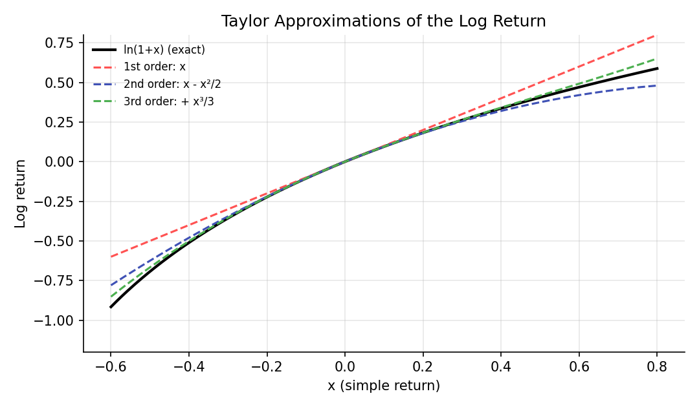

# Calculus for Finance

!!! objectives "Learning objectives"
    By the end of this lecture you should be able to:

    - [ ] Define the derivative as a limit and interpret it as a rate of change (a "sensitivity") of a financial quantity
    - [ ] Apply the product, quotient, and chain rules, and differentiate \( e^{rt} \) and \( \ln x \)
    - [ ] Write a Taylor expansion and use it to approximate a function, including the log return
    - [ ] Interpret a definite integral as an accumulated quantity and approximate it numerically

## 1. Intuition

Finance constantly asks "how much does this change when that changes?" How much does a bond's price move if yields rise by one basis point? How much does an option's value move if the stock moves by a dollar? These sensitivities are **derivatives** in the calculus sense, and the Greeks in Module 4 are literally partial derivatives.

Two further tools recur everywhere. **Taylor series** approximate a complicated function by a simple polynomial near a point, which is how the small-return approximation \( \ln(1+x)\approx x \) from the returns lecture arises, and how bond duration and convexity are defined. **Integrals** add up a continuum of small pieces, and every expectation of a continuous random variable is an integral. Itô calculus (Module 5) modifies these rules for random paths, so it helps to hold the ordinary versions firmly first.

## 2. Mathematical formulation

**Derivative.** For a function \( f(x) \), the derivative at \( x \) is

\[
f'(x) = \frac{df}{dx} = \lim_{h\to 0}\frac{f(x+h)-f(x)}{h}
\]

Here \( h \) is a small change in the input. The ratio is the average rate of change over that step, and the limit is the instantaneous rate. Geometrically, \( f'(x) \) is the slope of the tangent line.

**Rules used constantly:**

\[
\frac{d}{dx}\big[f g\big] = f'g + fg' \qquad \frac{d}{dx}\, f(g(x)) = f'(g(x))\,g'(x) \qquad \frac{d}{dx}e^{rx} = r e^{rx} \qquad \frac{d}{dx}\ln x = \frac1x
\]

The middle expression is the **chain rule**.

**Partial derivative.** For \( f(x,y) \), \( \partial f/\partial x \) is the derivative in \( x \) holding \( y \) fixed. Option prices depend on several inputs at once (stock price, time, volatility, rate), and each Greek is a partial derivative with respect to one of them.

**Taylor series.** If \( f \) is smooth near \( a \),

\[
f(x) = f(a) + f'(a)(x-a) + \frac{f''(a)}{2!}(x-a)^2 + \frac{f'''(a)}{3!}(x-a)^3 + \cdots
\]

**Definite integral.** \( \int_a^b f(x)\,dx \) is the limit of sums \( \sum_i f(x_i)\Delta x \) over thinner and thinner slices, that is, the signed area under \( f \). The **Fundamental Theorem of Calculus** states that if \( F' = f \), then \( \int_a^b f(x)\,dx = F(b)-F(a) \).

## 3. Derivation

**Where \( \ln(1+x)\approx x \) comes from.** Let \( f(x)=\ln(1+x) \) and expand around \( a=0 \). Compute the derivatives:

\[
f'(x)=\frac{1}{1+x},\quad f''(x)=-\frac{1}{(1+x)^2},\quad f'''(x)=\frac{2}{(1+x)^3}
\]

At \( x=0 \) these equal \( 1,\,-1,\,2 \), and \( f(0)=0 \). Plugging into the Taylor formula:

\[
\ln(1+x) = x - \frac{x^2}{2} + \frac{x^3}{3} - \cdots
\]

This is the expansion quoted in the returns lecture. The first term gives \( r\approx R \), and the second term, \( -R^2/2 \), is the leading correction, which is why the two return measures diverge for large moves.

**Bond price sensitivity as a Taylor expansion.** Regard a bond's price \( P \) as a function of its yield \( y \). Expanding around the current yield with a small change \( \Delta y \):

\[
\Delta P \approx P'(y)\,\Delta y + \tfrac12 P''(y)\,(\Delta y)^2
\]

The first term captures the **duration** effect (linear sensitivity) and the second the **convexity** effect (curvature), as covered in fixed-income texts such as Hull (2022). This is the same second-order structure that appears in option "delta-gamma" approximations later.

**The chain rule in finance.** If a portfolio's value is \( V(S) \) and the stock follows \( S(t) \), then \( \dfrac{dV}{dt} = \dfrac{dV}{dS}\dfrac{dS}{dt} \). In stochastic calculus, an extra term appears because \( S(t) \) is random and rough. That correction is the substance of Itô's lemma in Module 5.

## 4. Worked numerical example

**Derivative.** With continuous compounding, \( FV(t)=100\,e^{0.08t} \). Then \( FV'(t)=0.08\cdot 100\,e^{0.08t} \). At \( t=10 \), \( FV=100e^{0.8}\approx 222.55 \) and \( FV'(10)=0.08\times 222.55\approx 17.80 \). The investment is growing at about \$17.80 per year at that moment, which is 8% of its current value, the defining property of exponential growth.

**Taylor approximation.** Take a \(-20\%\) simple return, \( x=-0.2 \). The exact log return is \( \ln(0.8)=-0.22314 \).

| Order | Approximation | Value |
|---|---|---|
| 1st | \( x \) | \(-0.20000\) |
| 2nd | \( x - x^2/2 \) | \(-0.22000\) |
| 3rd | \( x - x^2/2 + x^3/3 \) | \(-0.22267\) |
| Exact | \( \ln(0.8) \) | \(-0.22314\) |

Each added term closes part of the gap. The first-order approximation is off by 2.3 percentage points at this size of move, which is why it should not be trusted for large returns.

## 5. Python implementation

```python
import numpy as np

# --- Numerical derivative (central difference) ---
def num_deriv(f, x, h=1e-5):
    return (f(x + h) - f(x - h)) / (2 * h)

fv = lambda t: 100 * np.exp(0.08 * t)
print("FV'(10) numeric: ", round(num_deriv(fv, 10), 4))
print("FV'(10) analytic:", round(0.08 * fv(10), 4))

# --- Taylor approximation of ln(1+x) ---
x = -0.2
exact = np.log1p(x)
approx = [x, x - x**2 / 2, x - x**2 / 2 + x**3 / 3]
for k, a in enumerate(approx, start=1):
    print(f"order {k}: {a:.5f}  (error {a - exact:+.5f})")
print(f"exact:   {exact:.5f}")

# --- Numerical integration: trapezoid rule vs. the exact Normal CDF ---
from scipy import stats
grid = np.linspace(-1.96, 1.96, 2001)
trapezoid = getattr(np, "trapezoid", None) or np.trapz   # NumPy >= 2.0 renamed trapz to trapezoid
area = trapezoid(stats.norm.pdf(grid), grid)
print("Area under N(0,1) density on [-1.96, 1.96]:", round(area, 5))
print("Exact via CDF:", round(stats.norm.cdf(1.96) - stats.norm.cdf(-1.96), 5))
```

The code above works on both older and newer NumPy releases: NumPy 2.0 renamed `trapz` to `trapezoid`, so the snippet falls back to `trapz` only if `trapezoid` is unavailable.


Continuing directly from the code above, here is the plotting code that produces the chart in Section 6:

```python
import matplotlib.pyplot as plt

x_grid = np.linspace(-0.6, 0.8, 400)
fig, ax = plt.subplots(figsize=(7.2, 4.2))
ax.plot(x_grid, np.log1p(x_grid), color="black", linewidth=2, label="ln(1+x) (exact)")
ax.plot(x_grid, x_grid, color="#ff5252", linestyle="--", label="1st order: x")
ax.plot(x_grid, x_grid - x_grid**2/2, color="#3f51b5", linestyle="--", label="2nd order: x - x²/2")
ax.plot(x_grid, x_grid - x_grid**2/2 + x_grid**3/3, color="#4caf50", linestyle="--",
        label="3rd order: + x³/3")
ax.set_ylim(-1.2, 0.8); ax.set_xlabel("x (simple return)"); ax.set_ylabel("Log return")
ax.set_title("Taylor Approximations of the Log Return")
ax.legend(frameon=False, fontsize=8)
fig.tight_layout()
plt.show()
```

## 6. Visualization

<figure class="qf-figure" markdown>

<figcaption>The function ln(1+x) (black) and its Taylor polynomials. All agree closely near zero and separate as |x| grows, most sharply on the downside, where the log curve falls steeply.</figcaption>
</figure>

## 7. Financial interpretation

Derivatives are sensitivities: risk managers hedge by neutralizing them (a delta-neutral option book has zero first-order exposure to the underlying). Taylor expansions explain why first-order hedges fail for big moves: the neglected second-order term, gamma or convexity, grows with the square of the move. Integrals are how probabilities and expected values of continuous variables are computed, for example \( E[X]=\int x f(x)\,dx \), which is how option prices are written as expected discounted payoffs.

## 8. Common mistakes

!!! danger "Common mistake: trusting a linear approximation too far"
    A first-order Taylor approximation is only good for small changes. Using duration alone to estimate the price change of a bond for a large yield shock ignores convexity and misstates the answer, with the error always in the same direction for a standard bond.

!!! danger "Common mistake: differentiating in the wrong variable"
    In option formulas, the price depends on many inputs. Confusing a partial derivative with a total derivative, or holding the wrong variables fixed, leads to wrong Greeks.

!!! danger "Common mistake: numerical differentiation with a badly chosen step"
    A step \( h \) that is too large gives truncation error, and one that is too small gives floating-point round-off error. The central difference with \( h \) around \( 10^{-5} \) is a reasonable default for smooth functions, but check sensitivity to \( h \).

## 9. Exercises

1. Differentiate \( P(y) = 1000\,e^{-yT} \) with respect to \( y \) and interpret the result as a duration. (This is the price of a zero-coupon bond under continuous compounding.)
2. Find the third-order Taylor polynomial of \( e^{x} \) around 0 and use it to approximate \( e^{0.1} \). Compare with the exact value.
3. Using the `num_deriv` function, estimate the derivative of \( f(x)=\ln x \) at \( x=2 \) and compare with \( 1/2 \). Repeat with \( h=10^{-1}, 10^{-5}, 10^{-12} \) and describe what happens.

## 10. Further reading

- Any single-variable calculus text covers this material in more depth. Stewart's is a common choice.

## 11. References

1. Stewart, J. (2020). *Calculus: Early Transcendentals* (9th ed.). Cengage Learning.
2. Hull, J. C. (2022). *Options, Futures, and Other Derivatives* (11th ed.). Pearson.
3. NumPy Developers. "`numpy.trapz`." [numpy.org/doc](https://numpy.org/doc/)

---

<div class="grid" markdown>
[:material-arrow-left: Previous: Python, NumPy & Pandas](/qf-lectures/prerequisites/python-numpy-pandas/){ .md-button }
[Next: Linear Algebra for Finance :material-arrow-right:](/qf-lectures/prerequisites/linear-algebra/){ .md-button .md-button--primary }
</div>
