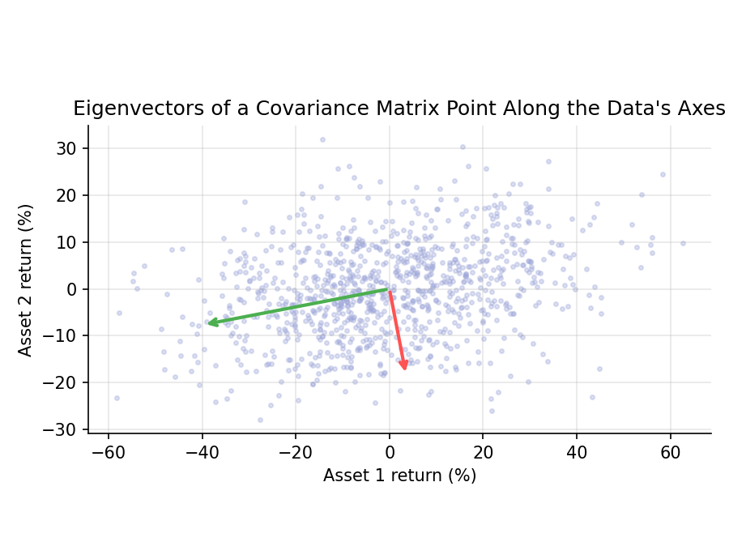

# Linear Algebra for Finance

!!! objectives "Learning objectives"
    By the end of this lecture you should be able to:

    - [ ] Represent portfolios and returns as vectors, and covariances as a matrix
    - [ ] Compute dot products, matrix-vector products, transposes, and inverses, and solve a linear system
    - [ ] Define eigenvalues and eigenvectors, and interpret them for a covariance matrix
    - [ ] Explain why a covariance matrix is symmetric and positive semi-definite
    - [ ] Carry out these operations in NumPy

## 1. Intuition

A portfolio of 500 stocks is not 500 separate problems, it is one object: a vector of weights, hit by a matrix of covariances. Linear algebra is the language that lets you write "portfolio variance", "least-squares regression", and "principal components" in one line each, and lets a computer evaluate them at any scale.

Two ideas matter most for what follows. First, a **matrix** acts on a vector by stretching and rotating it. Second, for a symmetric matrix such as a covariance matrix, there are special directions (**eigenvectors**) that are only stretched, not rotated, by the amount of the **eigenvalue**. For a covariance matrix, those directions are the axes along which returns vary independently, and the eigenvalues are the variances along them. This is the entire idea behind principal component analysis (Module 2) and the random matrix theory of Module 7.

## 2. Mathematical formulation

**Vectors and dot products.** A vector \( \mathbf{a}=(a_1,\dots,a_n)^\top \). The dot product is

\[
\mathbf{a}^\top\mathbf{b} = \sum_{i=1}^n a_i b_i
\]

For example, with weights \( \mathbf{w} \) and expected returns \( \boldsymbol\mu \), \( \mathbf{w}^\top\boldsymbol\mu \) is the portfolio's expected return.

**Matrix-vector product.** For an \( m\times n \) matrix \( A \), \( (A\mathbf{x})_i=\sum_j A_{ij}x_j \). The **transpose** \( A^\top \) swaps rows and columns, and \( A \) is **symmetric** if \( A=A^\top \).

**Inverse and linear systems.** A square matrix \( A \) is **invertible** if there is a matrix \( A^{-1} \) with \( AA^{-1}=I \), where \( I \) is the identity matrix. Then the system \( A\mathbf{x}=\mathbf{b} \) has the unique solution \( \mathbf{x}=A^{-1}\mathbf{b} \).

**Eigenvalues and eigenvectors.** A nonzero vector \( \mathbf{v} \) is an eigenvector of \( A \) with eigenvalue \( \lambda \) if

\[
A\mathbf{v}=\lambda\mathbf{v}
\]

**Covariance matrix.** For returns \( \mathbf{R} \) with mean \( \boldsymbol\mu \),

\[
\Sigma = E\big[(\mathbf{R}-\boldsymbol\mu)(\mathbf{R}-\boldsymbol\mu)^\top\big], \qquad \Sigma_{ij}=\text{Cov}(R_i,R_j)
\]

**Spectral theorem.** A real symmetric matrix has real eigenvalues and can be written \( \Sigma = Q\Lambda Q^\top \), where the columns of \( Q \) are orthonormal eigenvectors and \( \Lambda \) is diagonal with the eigenvalues.

## 3. Derivation

**A covariance matrix is symmetric and positive semi-definite.** Symmetry is immediate: \( \text{Cov}(R_i,R_j)=\text{Cov}(R_j,R_i) \). For any weight vector \( \mathbf{w} \), the portfolio return \( \mathbf{w}^\top\mathbf{R} \) has variance

\[
\mathbf{w}^\top\Sigma\,\mathbf{w} = \text{Var}(\mathbf{w}^\top\mathbf{R}) \ \ge\ 0
\]

because a variance cannot be negative. A symmetric matrix with \( \mathbf{w}^\top\Sigma\mathbf{w}\ge 0 \) for every \( \mathbf{w} \) is called positive semi-definite. This is why portfolio variance is never negative, and why a matrix of pairwise covariances estimated carelessly (for instance from mismatched samples) can be invalid: it may fail this property.

**Eigenvalues of \( \Sigma \) are variances along principal directions.** Let \( \mathbf{v} \) be a unit eigenvector, \( \Sigma\mathbf{v}=\lambda\mathbf{v} \), \( \mathbf{v}^\top\mathbf{v}=1 \). Then

\[
\text{Var}(\mathbf{v}^\top\mathbf{R}) = \mathbf{v}^\top\Sigma\mathbf{v} = \lambda\,\mathbf{v}^\top\mathbf{v} = \lambda
\]

So an eigenvalue is exactly the variance of the portfolio whose weights are the corresponding eigenvector. The largest eigenvalue is the maximum variance achievable by any unit-length weight vector, and it is the first principal component. Since the variance is nonnegative, all eigenvalues of a covariance matrix are nonnegative.

**Eigenvalues for a 2×2 matrix.** They solve \( \det(\Sigma-\lambda I)=0 \), which for a 2×2 matrix is \( \lambda^2-\text{tr}(\Sigma)\lambda+\det(\Sigma)=0 \). The eigenvalues sum to the trace and multiply to the determinant.

## 4. Worked numerical example

Use the two assets from the Portfolio Basics lecture: volatilities 20% and 10%, correlation 0.3. Then

\[
\Sigma=\begin{pmatrix}0.04 & 0.006\\ 0.006 & 0.01\end{pmatrix}
\]

since \( \text{Cov}=0.3\times0.20\times0.10=0.006 \).

- Trace \( =0.05 \), determinant \( =0.04\times0.01-0.006^2=0.000364 \).
- Eigenvalues solve \( \lambda^2-0.05\lambda+0.000364=0 \):

\[
\lambda=\frac{0.05\pm\sqrt{0.0025-0.001456}}{2}=\frac{0.05\pm0.03231}{2}\ \Rightarrow\ \lambda_1\approx0.04116,\ \lambda_2\approx0.00884
\]

Check: \( 0.04116+0.00884=0.05 \) (the trace). The largest eigenvalue, 0.04116, corresponds to a "portfolio" with a standard deviation of \( \sqrt{0.04116}\approx20.3\% \), mostly the riskier asset. The smaller one, 0.00884, gives \( \approx 9.4\% \), the least risky direction. Both are nonnegative, as the theory requires.

## 5. Python implementation

```python
import numpy as np

sigma = np.array([0.20, 0.10])
rho = 0.3
Sigma = np.array([[1, rho], [rho, 1]]) * np.outer(sigma, sigma)

# Dot product and quadratic form
w = np.array([0.6, 0.4])
print("Portfolio variance:", w @ Sigma @ w)

# Solve a linear system Sigma x = b (preferred over forming the inverse)
b = np.ones(2)
x = np.linalg.solve(Sigma, b)
print("Solution of Sigma x = 1:", x)

# Eigen-decomposition for a symmetric matrix: use eigh
vals, vecs = np.linalg.eigh(Sigma)          # eigenvalues in ascending order
print("Eigenvalues:", vals)
print("Trace check:", vals.sum(), "vs", np.trace(Sigma))
print("Determinant check:", vals.prod(), "vs", np.linalg.det(Sigma))

# Reconstruct Sigma = Q diag(lambda) Q^T
recon = vecs @ np.diag(vals) @ vecs.T
assert np.allclose(recon, Sigma)

# Variance of a portfolio built from an eigenvector equals its eigenvalue
v = vecs[:, -1]
print("Var of top-eigenvector portfolio:", v @ Sigma @ v, "= eigenvalue", vals[-1])
```

`np.linalg.eigh` is the routine for symmetric matrices. It is faster and numerically safer than the general `np.linalg.eig`, and it returns real eigenvalues.

## 6. Visualization

<figure class="qf-figure" markdown>

<figcaption>1,000 simulated return pairs from a Normal distribution with the covariance matrix above (in percent units). The arrows are the eigenvectors, scaled to twice the square root of each eigenvalue. The cloud is longest along the first eigenvector, the direction of maximum variance.</figcaption>
</figure>

## 7. Financial interpretation

Everything in portfolio theory is a quadratic form in \( \Sigma \). Minimum-variance weights come from solving a linear system (next-but-one lecture), factor models rewrite \( \Sigma \) in terms of a few eigen-directions, and principal component analysis reads off the dominant sources of common movement. In real markets, a few large eigenvalues (often interpreted as a market factor and sector factors) explain much of the co-movement, while many small eigenvalues are mostly estimation noise, the observation behind Laloux et al. (1999) and Module 7.

## 8. Common mistakes

!!! danger "Common mistake: inverting matrices explicitly"
    Computing `np.linalg.inv(A) @ b` is slower and less numerically stable than `np.linalg.solve(A, b)`. Solve the system directly.

!!! danger "Common mistake: ill-conditioned covariance matrices"
    When there are nearly as many assets as observations, or assets are nearly collinear, \( \Sigma \) has eigenvalues close to zero and its inverse is dominated by noise. Optimization on such a matrix produces extreme, unstable weights. This is a central practical problem in Module 3.

!!! danger "Common mistake: confusing row and column conventions"
    `w @ Sigma @ w` works for one-dimensional arrays, but for matrices of returns you must keep track of whether observations are rows or columns. Check shapes with `.shape` and remember `np.cov` treats rows as variables by default.

## 9. Exercises

1. For \( \Sigma \) above and \( \mathbf{w}=(1,0)^\top \), \( (0,1)^\top \), and \( (0.5,0.5)^\top \), compute \( \mathbf{w}^\top\Sigma\mathbf{w} \) by hand and verify with NumPy.
2. Show that if \( \rho=1 \), the covariance matrix has a zero eigenvalue. What does that mean for portfolios of the two assets?
3. Generate a return matrix of 60 observations on 100 uncorrelated assets, compute its sample covariance matrix, and inspect its smallest eigenvalues. What is the rank of the matrix, and why?

## 10. Further reading

- Strang's lecture series and text are an accessible, geometric introduction.

## 11. References

1. Strang, G. (2016). *Introduction to Linear Algebra* (5th ed.). Wellesley-Cambridge Press.
2. Horn, R. A., & Johnson, C. R. (2013). *Matrix Analysis* (2nd ed.). Cambridge University Press.
3. Laloux, L., Cizeau, P., Bouchaud, J.-P., & Potters, M. (1999). "Noise Dressing of Financial Correlation Matrices." *Physical Review Letters*, 83(7), 1467–1470.
4. NumPy Developers. "`numpy.linalg`." [numpy.org/doc](https://numpy.org/doc/stable/reference/routines.linalg.html)

---

<div class="grid" markdown>
[:material-arrow-left: Previous: Calculus for Finance](/qf-lectures/prerequisites/calculus/){ .md-button }
[Next: Probability Foundations :material-arrow-right:](/qf-lectures/prerequisites/probability/){ .md-button .md-button--primary }
</div>
