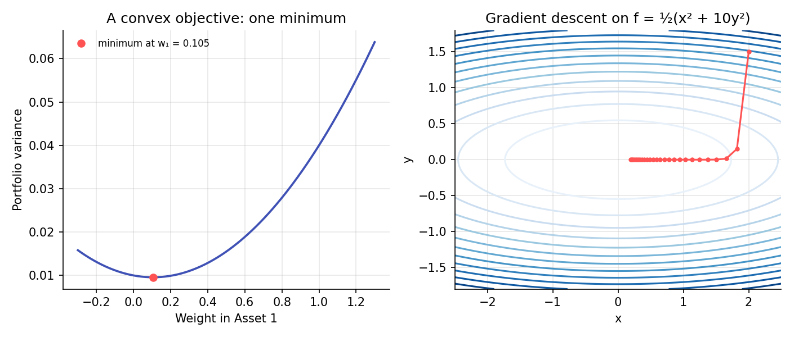

# Optimization Foundations

!!! objectives "Learning objectives"
    By the end of this lecture you should be able to:

    - [ ] State an optimization problem in terms of an objective function, decision variables, and constraints
    - [ ] Define a convex function and a convex problem, and explain why convexity guarantees a unique minimum
    - [ ] Derive the unconstrained minimum-variance portfolio using calculus, and set up a constrained problem with a Lagrange multiplier
    - [ ] Use gradient descent and a constrained solver (SciPy) to find an optimum numerically

## 1. Intuition

Almost every model in this curriculum ends in an optimization problem: choose portfolio weights to minimize risk for a given return, choose model parameters to maximize a likelihood, choose trading rule parameters to maximize a backtested Sharpe ratio. Optimization is the machinery that turns "the best choice, given some criterion and some constraints" into a number.

The single most useful property a problem can have is **convexity**. A convex objective, minimized over a convex set of allowed choices, has no false peaks or valleys to get trapped in: any local minimum is the global minimum. Markowitz portfolio optimization (Module 3) is convex, which is one reason it became the workhorse of the field; many machine learning problems (Module 8) are not, which is one reason they need more elaborate solvers.

## 2. Mathematical formulation

A generic optimization problem:

\[
\min_{\mathbf{x}}\ f(\mathbf{x}) \qquad \text{subject to}\quad g_i(\mathbf{x})\le 0,\ \ h_j(\mathbf{x})=0
\]

where \( f \) is the **objective**, \( \mathbf{x} \) the decision variables, \( g_i \) inequality constraints, and \( h_j \) equality constraints.

**Unconstrained first-order condition.** If \( f \) is differentiable and \( \mathbf{x}^* \) minimizes it, then the gradient vanishes:

\[
\nabla f(\mathbf{x}^*)=\mathbf{0}
\]

**Convexity.** A function \( f \) is convex if, for all \( \mathbf x,\mathbf y \) and \( t\in[0,1] \),

\[
f\big(t\mathbf x+(1-t)\mathbf y\big)\ \le\ t f(\mathbf x)+(1-t) f(\mathbf y)
\]

Geometrically, the graph lies below any chord connecting two points on it. A twice-differentiable \( f \) is convex if and only if its Hessian (matrix of second derivatives) is positive semi-definite everywhere.

**Lagrangian, for equality-constrained problems.** To minimize \( f(\mathbf x) \) subject to \( h(\mathbf x)=0 \), form

\[
\mathcal L(\mathbf x,\lambda)=f(\mathbf x)-\lambda\,h(\mathbf x)
\]

and set \( \nabla_{\mathbf x}\mathcal L=0 \) and \( \partial\mathcal L/\partial\lambda=0 \) (which just restates the constraint).

**Gradient descent.** An iterative unconstrained method:

\[
\mathbf x_{k+1}=\mathbf x_k-\eta\,\nabla f(\mathbf x_k)
\]

where \( \eta>0 \) is the step size (learning rate).

## 3. Derivation

**Minimum-variance two-asset portfolio.** Minimize \( \sigma_p^2(w)=w^2\sigma_1^2+(1-w)^2\sigma_2^2+2w(1-w)\rho\sigma_1\sigma_2 \) over \( w \), unconstrained (weights are allowed to be any real number, short sales permitted). Differentiate and set to zero:

\[
\frac{d\sigma_p^2}{dw}=2w\sigma_1^2-2(1-w)\sigma_2^2+2\rho\sigma_1\sigma_2(1-2w)=0
\]

Collecting terms in \( w \):

\[
w\big(2\sigma_1^2+2\sigma_2^2-4\rho\sigma_1\sigma_2\big)=2\sigma_2^2-2\rho\sigma_1\sigma_2
\]

\[
w^*=\frac{\sigma_2^2-\rho\sigma_1\sigma_2}{\sigma_1^2+\sigma_2^2-2\rho\sigma_1\sigma_2}
\]

This confirms the formula given as an exercise in Portfolio Basics. Because \( \sigma_p^2(w) \) is a quadratic in \( w \) with a positive leading coefficient (as long as \( \rho\ne\pm1 \) and both assets have positive variance), it is convex, and the point where the derivative vanishes is the unique global minimum, not merely a local one.

**Why convexity guarantees a global minimum.** Suppose \( \mathbf x^* \) is a local minimum of a convex \( f \) but not global, so some \( \mathbf y \) has \( f(\mathbf y)<f(\mathbf x^*) \). Convexity gives, for small \( t>0 \),

\[
f\big(\mathbf x^*+t(\mathbf y-\mathbf x^*)\big)\le (1-t)f(\mathbf x^*)+t f(\mathbf y) < f(\mathbf x^*)
\]

so points arbitrarily close to \( \mathbf x^* \) along the direction of \( \mathbf y \) have strictly lower objective value, contradicting that \( \mathbf x^* \) is a local minimum. Hence for a convex function, every local minimum is global. This is the formal reason Markowitz optimization, ridge and lasso regression (Module 2), and many risk measures have a single well-defined answer instead of many competing local optima.

## 4. Worked numerical example

Take the numbers from Portfolio Basics: \( \sigma_1=0.20,\ \sigma_2=0.10,\ \rho=0.3 \).

\[
w^*=\frac{0.01-0.3(0.20)(0.10)}{0.04+0.01-2(0.3)(0.20)(0.10)}=\frac{0.01-0.006}{0.05-0.012}=\frac{0.004}{0.038}\approx0.1053
\]

So the minimum-variance mix puts about 10.5% in the riskier asset and 89.5% in the safer one, even though (in Portfolio Basics) an investor targeting a specific expected return used a 60/40 split. Minimizing variance alone and targeting a given return are different objectives, reconciled by the full Markowitz problem in Module 3.

## 5. Python implementation

```python
import numpy as np
from scipy.optimize import minimize

s1, s2, rho = 0.20, 0.10, 0.3
Sigma = np.array([[s1**2, rho*s1*s2], [rho*s1*s2, s2**2]])

# --- Closed-form minimum-variance weight (unconstrained in w) ---
w_star = (s2**2 - rho*s1*s2) / (s1**2 + s2**2 - 2*rho*s1*s2)
print(f"Closed-form w* = {w_star:.4f}")

# --- Same answer via a numerical solver, with the budget constraint sum(w)=1 ---
def portfolio_var(w):
    w_full = np.array([w[0], 1 - w[0]])
    return w_full @ Sigma @ w_full

result = minimize(portfolio_var, x0=[0.5], method="SLSQP")
print(f"Numerical w* = {result.x[0]:.4f}, min variance = {result.fun:.6f}")

# --- Gradient descent on a simple convex quadratic, f(x,y) = 0.5(x^2 + 10y^2) ---
def grad(p):
    x, y = p
    return np.array([x, 10 * y])

p = np.array([2.0, 1.5])
eta = 0.09
path = [p.copy()]
for _ in range(25):
    p = p - eta * grad(p)
    path.append(p.copy())
print("Converged near:", np.round(path[-1], 4))

# --- General constrained example: minimum-variance with a target return, N assets ---
mu = np.array([0.08, 0.04])
Sigma_full = np.array([[0.04, 0.006], [0.006, 0.01]])
target = 0.06

cons = ({"type": "eq", "fun": lambda w: w.sum() - 1},
        {"type": "eq", "fun": lambda w: w @ mu - target})
res = minimize(lambda w: w @ Sigma_full @ w, x0=[0.5, 0.5], constraints=cons)
print("Target-return efficient weights:", np.round(res.x, 4))
```

## 6. Visualization

<figure class="qf-figure" markdown>

<figcaption>Left: portfolio variance is a convex parabola in the weight w₁, with a single minimum at w₁ ≈ 0.105, matching Section 4. Right: gradient descent on a convex quadratic bowl steps steadily toward the single minimum at the origin — the same guarantee, illustrated as a search path rather than a closed-form solution.</figcaption>
</figure>

## 7. Financial interpretation

Nearly every "optimal" object in quantitative finance, efficient portfolios, fitted model parameters, calibrated volatility surfaces, is the output of an optimization problem, and the properties of that problem (convex or not, constrained or not, well- or ill-conditioned) determine how much to trust the answer. A convex problem has one answer to find. A non-convex problem, common in machine learning (Module 8) and some calibration tasks (Module 7), may have many local optima, so the starting point and the algorithm can change the result, and reported "optimal" parameters deserve more scrutiny.

## 8. Common mistakes

!!! danger "Common mistake: assuming any solver output is the global optimum"
    Generic numerical solvers applied to non-convex problems can converge to a local optimum that depends on the starting point. For non-convex problems, try multiple starting points and compare results.

!!! danger "Common mistake: ignoring constraints when interpreting a solution"
    A solution to an unconstrained problem (as in Section 4) can differ substantially from the constrained problem an investor actually faces, for example if short sales are disallowed (\( w\ge0 \)). Check which constraints were actually imposed.

!!! danger "Common mistake: picking a bad step size in gradient descent"
    Too large a step size can make gradient descent diverge or oscillate; too small makes convergence very slow. This becomes especially important in Module 8, where training neural networks is essentially large-scale gradient descent.

## 9. Exercises

1. Re-derive \( w^* \) in Section 3 using the Lagrangian approach if a constraint \( w\ge0 \) is added, and explain qualitatively what changes if the unconstrained optimum were negative.
2. Verify by hand that the Hessian of \( \sigma_p^2(w) \) is a positive constant (confirming convexity) whenever \( \rho\ne\pm1 \).
3. Modify the gradient descent code to use \( \eta=0.25 \) instead of \( 0.09 \) and observe what happens. Explain why in terms of the largest eigenvalue of the Hessian, \( \text{diag}(1,10) \).

## 10. Further reading

- Boyd and Vandenberghe's *Convex Optimization* is available free online and is the standard reference, cited below.

## 11. References

1. Boyd, S., & Vandenberghe, L. (2004). *Convex Optimization*. Cambridge University Press.
2. Markowitz, H. (1952). "Portfolio Selection." *The Journal of Finance*, 7(1), 77–91.
3. SciPy Developers. "`scipy.optimize.minimize`." [docs.scipy.org](https://docs.scipy.org/doc/scipy/reference/generated/scipy.optimize.minimize.html)

---

<div class="grid" markdown>
[:material-arrow-left: Previous: Statistical Inference Foundations](/qf-lectures/prerequisites/statistical-inference/){ .md-button }
[Back to Curriculum :material-arrow-right:](/qf-lectures/curriculum/){ .md-button .md-button--primary }
</div>
