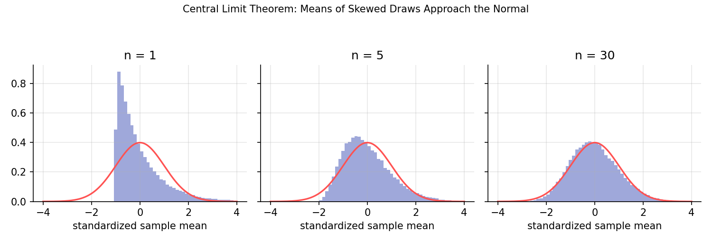

# Probability Foundations

!!! objectives "Learning objectives"
    By the end of this lecture you should be able to:

    - [ ] Define a random variable, its distribution (PMF/PDF and CDF), expectation, and variance
    - [ ] Compute conditional probabilities and apply Bayes' theorem
    - [ ] Define covariance, correlation, and independence, and state how they differ
    - [ ] State the Law of Large Numbers and the Central Limit Theorem and explain what each does and does not guarantee

## 1. Intuition

Future returns are uncertain, and probability is the vocabulary for reasoning about that uncertainty precisely. A **random variable** is a number whose value is not yet known, such as tomorrow's return. Its **distribution** says how likely each value is. Summaries of the distribution, chiefly the mean (expected value) and the variance, are what models actually work with.

Two results explain why averaging is so powerful and why the Normal distribution shows up so often. The **Law of Large Numbers** says sample averages settle down to the true mean. The **Central Limit Theorem** says that, after suitable scaling, the fluctuations of a sample average look Normal regardless of the underlying shape (given finite variance). Both come back repeatedly in estimation, risk, and Monte Carlo simulation.

## 2. Mathematical formulation

**Random variable and distribution.** A random variable \( X \) has cumulative distribution function

\[
F(x)=P(X\le x)
\]

If \( X \) is continuous with density \( f \), then \( P(a\le X\le b)=\int_a^b f(x)\,dx \) and \( f\ge0 \), \( \int f=1 \). If \( X \) is discrete, the probability mass function \( p(x)=P(X=x) \) sums to 1.

**Expectation and variance.**

\[
E[X]=\int x f(x)\,dx \ \ \left(\text{or }\sum_x x\,p(x)\right), \qquad \text{Var}(X)=E\big[(X-E[X])^2\big]
\]

Expectation is linear: \( E[aX+bY]=aE[X]+bE[Y] \), always.

**Conditional probability and Bayes' theorem.** For events \( A,B \) with \( P(B)>0 \):

\[
P(A\mid B)=\frac{P(A\cap B)}{P(B)}, \qquad P(A\mid B)=\frac{P(B\mid A)\,P(A)}{P(B)}
\]

**Covariance, correlation, independence.**

\[
\text{Cov}(X,Y)=E\big[(X-\mu_X)(Y-\mu_Y)\big], \qquad \rho_{XY}=\frac{\text{Cov}(X,Y)}{\sigma_X\sigma_Y}\in[-1,1]
\]

\( X \) and \( Y \) are **independent** if \( P(X\in A,\,Y\in B)=P(X\in A)P(Y\in B) \) for all sets \( A,B \). Independence implies zero correlation, but not the other way around.

**Variance of a sum.**

\[
\text{Var}(aX+bY)=a^2\text{Var}(X)+b^2\text{Var}(Y)+2ab\,\text{Cov}(X,Y)
\]

**Law of Large Numbers (LLN).** If \( X_1,X_2,\dots \) are independent with the same mean \( \mu \) (and finite variance), then the sample mean \( \bar X_n\to\mu \) as \( n\to\infty \).

**Central Limit Theorem (CLT).** If the \( X_i \) are independent and identically distributed with mean \( \mu \) and finite variance \( \sigma^2 \), then

\[
\frac{\bar X_n-\mu}{\sigma/\sqrt n}\ \xrightarrow{d}\ \mathcal N(0,1)
\]

meaning the distribution of the standardized sample mean converges to the standard Normal.

## 3. Derivation

**Variance computational formula.** Expand the definition, using linearity of expectation and writing \( \mu=E[X] \):

\[
\text{Var}(X)=E[X^2-2\mu X+\mu^2]=E[X^2]-2\mu E[X]+\mu^2=E[X^2]-\mu^2
\]

**Variance of a sum.** Let \( Z=aX+bY \) with mean \( a\mu_X+b\mu_Y \). Then \( Z-E[Z]=a(X-\mu_X)+b(Y-\mu_Y) \), and squaring and taking expectations gives

\[
\text{Var}(Z)=a^2E[(X-\mu_X)^2]+b^2E[(Y-\mu_Y)^2]+2ab\,E[(X-\mu_X)(Y-\mu_Y)]
\]

which is the formula above. This is exactly the two-asset portfolio variance from the Portfolio Basics lecture, with \( a=w \) and \( b=1-w \).

**Why the standard error shrinks like \( 1/\sqrt n \).** For independent \( X_i \) with variance \( \sigma^2 \),

\[
\text{Var}(\bar X_n)=\frac{1}{n^2}\sum_{i=1}^n\text{Var}(X_i)=\frac{\sigma^2}{n}
\]

so the standard deviation of the sample mean is \( \sigma/\sqrt n \). To halve the noise you need four times as much data. The CLT adds the shape: the sample mean is approximately Normal when \( n \) is large. (A full proof of the CLT is beyond this lecture, see Casella and Berger, 2002.)

**Uncorrelated does not mean independent.** Let \( X \) be symmetric around zero (say standard Normal) and \( Y=X^2 \). Then \( \text{Cov}(X,Y)=E[X^3]-E[X]E[X^2]=0-0=0 \), yet \( Y \) is completely determined by \( X \). In finance this matters because returns can be nearly uncorrelated day to day while their *magnitudes* are strongly dependent (volatility clustering).

## 4. Worked numerical example

**Bayes' theorem.** Suppose 2% of borrowers default in a year. A screening model flags 90% of borrowers who will default, and also wrongly flags 10% of those who will not. (Illustrative numbers.) A borrower is flagged. What is the probability of default?

- \( P(D)=0.02,\ P(F\mid D)=0.90,\ P(F\mid D^c)=0.10 \)
- \( P(F)=0.90(0.02)+0.10(0.98)=0.018+0.098=0.116 \)
- \( P(D\mid F)=\dfrac{0.018}{0.116}\approx 0.155 \)

Only about 15.5% of flagged borrowers actually default. The signal is informative (the probability rose from 2% to 15.5%) but far from conclusive, because defaults are rare. Ignoring the base rate \( P(D) \) is called the base-rate fallacy, and it is a classic error when interpreting trading signals that fire on rare events.

**Variance of a sum.** Two assets with \( \sigma_X=0.20,\ \sigma_Y=0.10,\ \rho=0.3 \): \( \text{Var}(0.6X+0.4Y)=0.36(0.04)+0.16(0.01)+2(0.6)(0.4)(0.006)=0.01888 \), matching the earlier lecture.

## 5. Python implementation

```python
import numpy as np

# --- Bayes' theorem ---
p_d, p_f_given_d, p_f_given_nd = 0.02, 0.90, 0.10
p_f = p_f_given_d * p_d + p_f_given_nd * (1 - p_d)
print("P(default | flagged) =", round(p_f_given_d * p_d / p_f, 4))

# --- LLN and CLT by simulation, with a skewed distribution ---
rng = np.random.default_rng(11)
draws = rng.exponential(scale=1.0, size=(50000, 30))   # mean 1, variance 1

# LLN: running mean of one long sample approaches the true mean 1
x = rng.exponential(1.0, 100000)
running_mean = np.cumsum(x) / np.arange(1, len(x) + 1)
print("Running mean after 100, 10,000, 100,000 draws:",
      running_mean[[99, 9999, 99999]].round(4))

# CLT: standardized sample means for n = 30 look standard Normal
means = draws.mean(axis=1)
z = (means - 1.0) / (1.0 / np.sqrt(30))
print("Mean, std of standardized means:", z.mean().round(3), z.std().round(3))
print("Fraction beyond +/-1.96:", (np.abs(z) > 1.96).mean().round(4), "(Normal: 0.05)")

# --- Uncorrelated but dependent ---
a = rng.normal(size=100000)
b = a ** 2
print("Corr(X, X^2) =", np.corrcoef(a, b)[0, 1].round(4))
```

## 6. Visualization

<figure class="qf-figure" markdown>

<figcaption>Standardized sample means of Exponential(1) draws, which are strongly right-skewed. With n = 1 the histogram is the skewed Exponential itself. By n = 30 it is already close to the standard Normal density (red). Convergence is slower for heavier-tailed or more skewed distributions.</figcaption>
</figure>

## 7. Financial interpretation

The CLT is the reason sums of many small independent shocks, such as log returns aggregated over a month, look approximately Normal. But it only describes the *center* of the distribution of the sum. Extreme tail events converge to Normality far more slowly, and when return variance is infinite or dependence is strong, the CLT may not apply in the standard form. That gap is one reason fat tails persist in practice (Cont, 2001). The LLN underlies Monte Carlo methods: averaging many simulated payoffs converges to the true expectation, with error shrinking like \( 1/\sqrt n \).

## 8. Common mistakes

!!! danger "Common mistake: equating zero correlation with independence"
    Correlation only measures linear dependence. Returns can be uncorrelated yet dependent in their volatility, as the \( X, X^2 \) example shows.

!!! danger "Common mistake: assuming the CLT applies at any sample size"
    The CLT is a limit statement. For skewed or fat-tailed data, and for tail quantities, a "large enough" \( n \) can be very large. Check by simulation rather than assuming.

!!! danger "Common mistake: ignoring base rates"
    Interpreting \( P(F\mid D) \) as \( P(D\mid F) \) reverses the conditioning. Use Bayes' theorem and include the prior probability.

## 9. Exercises

1. A stock has a 55% chance of an up day. Assuming independent days, what is the probability of at least 3 up days in 5? (Use the Binomial distribution.)
2. Using the Bayes example, recompute \( P(D\mid F) \) if the default rate is 10% instead of 2%. Explain the change.
3. Modify the CLT simulation to use a Student-t distribution with 3 degrees of freedom (variance exists but is heavy-tailed). Compare the fraction of standardized means beyond \( \pm1.96 \) at \( n=30 \) and \( n=500 \).

## 10. Further reading

- Blitzstein and Hwang's text is freely accompanied by video lectures and is very approachable.

## 11. References

1. Blitzstein, J. K., & Hwang, J. (2019). *Introduction to Probability* (2nd ed.). CRC Press.
2. Casella, G., & Berger, R. L. (2002). *Statistical Inference* (2nd ed.). Duxbury.
3. Cont, R. (2001). "Empirical Properties of Asset Returns: Stylized Facts and Statistical Issues." *Quantitative Finance*, 1(2), 223–236.
4. Wasserman, L. (2004). *All of Statistics*. Springer.

---

<div class="grid" markdown>
[:material-arrow-left: Previous: Linear Algebra for Finance](/qf-lectures/prerequisites/linear-algebra/){ .md-button }
[Next: Statistical Inference Foundations :material-arrow-right:](/qf-lectures/prerequisites/statistical-inference/){ .md-button .md-button--primary }
</div>
