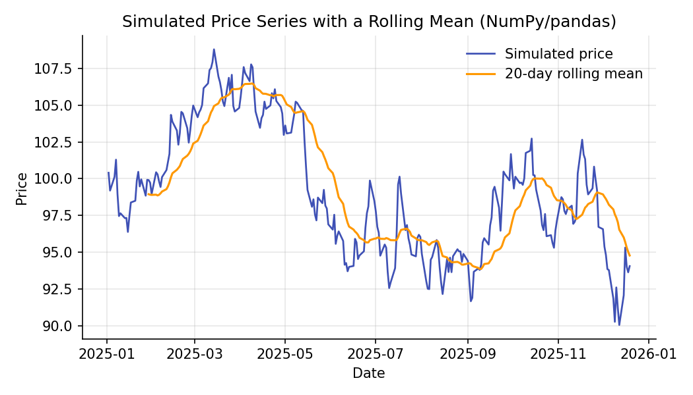

# Python, NumPy & Pandas for Quantitative Finance

!!! objectives "Learning objectives"
    By the end of this lecture you should be able to:

    - [ ] Explain why vectorized array operations (NumPy) replace explicit loops in quantitative finance code
    - [ ] Represent a price series as a pandas `Series`/`DataFrame` indexed by date, and compute returns and rolling statistics from it
    - [ ] Distinguish vectorized, index-aligned pandas arithmetic from naive Python loops, and explain why the distinction matters for correctness and speed
    - [ ] Read and reproduce the specific NumPy/pandas idioms used throughout the rest of this curriculum

## 1. Intuition

Every later lecture in this curriculum — Black-Scholes pricing, GARCH volatility, portfolio optimization, backtesting — is expressed as operations on **arrays of numbers indexed by time**: a price series, a return series, a covariance matrix. Two libraries make this practical in Python:

- **NumPy** gives you the array (`ndarray`) as a first-class object, with arithmetic that operates on the whole array at once ("vectorization") instead of element by element in a Python `for` loop. This is not just a convenience — pure-Python loops over daily price data are slow enough to be a real bottleneck, and vectorized NumPy code is typically implemented in compiled C under the hood.
- **pandas** builds on NumPy and adds a **labeled index** — typically dates — so that when you write `returns = prices / prices.shift(1) - 1`, the arithmetic automatically lines up each price with the *correct* prior price, even if you later merge, resample, or reorder your data.

Financial data is fundamentally a time-indexed array problem, so these two libraries are the computational foundation for everything that follows.

## 2. Mathematical formulation

There isn't new mathematics in this lecture — the goal is a computational vocabulary. Two operations recur constantly enough to formalize now.

**Element-wise (vectorized) operation.** Given two arrays \( \mathbf{a} = (a_1, \dots, a_n) \) and \( \mathbf{b} = (b_1, \dots, b_n) \), a vectorized binary operation \( \circ \) produces

\[
\mathbf{a} \circ \mathbf{b} = (a_1 \circ b_1,\, a_2 \circ b_2,\, \dots,\, a_n \circ b_n)
\]

computed without an explicit Python-level loop.

**Lag operator.** For a time-indexed series \( x_t \), the lag (shift) operator \( L \) is defined by

\[
(Lx)_t = x_{t-1}
\]

so that a one-period simple return can be written compactly as

\[
r_t = \frac{x_t}{(Lx)_t} - 1 = \frac{x_t - x_{t-1}}{x_{t-1}}
\]

In pandas, `L` is implemented by `.shift(1)`, and the whole expression above is computed as a single vectorized line: `prices / prices.shift(1) - 1`. (Returns themselves are covered in full in the next lecture; here we only need the mechanics.)

## 3. Derivation

There's no derivation to walk through here — instead, walk through *why* vectorization is faster, since that reasoning explains why NumPy/pandas code looks the way it does.

A Python `for` loop over a list of length \( n \) executes \( n \) iterations of the Python interpreter, each carrying interpreter overhead (type-checking, dynamic dispatch) on top of the arithmetic itself. NumPy avoids this by:

1. Storing the array as a single contiguous block of memory with a fixed data type (e.g., 64-bit float), rather than as \( n \) separate Python objects.
2. Dispatching the operation **once** to a compiled C loop that iterates over that memory block directly, with no per-element Python overhead.

The practical consequence: `prices.pct_change()` (vectorized) and `[prices[i]/prices[i-1] - 1 for i in range(1, len(prices))]` (looped) compute the *same* numbers, but the vectorized version is faster and, more importantly, is the idiom you'll see in every subsequent lecture — so it's worth building the reflex now to reach for it instead of a loop.

## 4. Worked numerical example

Suppose we have five daily closing prices:

$$
100.00,\ 101.50,\ 99.80,\ 102.30,\ 103.10
$$

By hand, the day-over-day simple returns are:

| From → To | Calculation | Return |
|---|---|---|
| 100.00 → 101.50 | 101.50/100.00 − 1 | +1.50% |
| 101.50 → 99.80 | 99.80/101.50 − 1 | −1.675% |
| 99.80 → 102.30 | 102.30/99.80 − 1 | +2.505% |
| 102.30 → 103.10 | 103.10/102.30 − 1 | +0.782% |

Note there are only 4 returns from 5 prices — the first price has no prior value to compare against, which is exactly what `.shift(1)` producing a `NaN` for the first entry reflects.

## 5. Python implementation

```python
import numpy as np
import pandas as pd

# --- 1. NumPy: vectorized arithmetic on raw arrays ---
prices_arr = np.array([100.00, 101.50, 99.80, 102.30, 103.10])

# Vectorized return calculation — no explicit loop
simple_returns = prices_arr[1:] / prices_arr[:-1] - 1
print("NumPy returns:", np.round(simple_returns, 5))

# --- 2. pandas: the same data, but time-indexed ---
dates = pd.date_range("2026-01-02", periods=5, freq="B")
prices = pd.Series(prices_arr, index=dates, name="close")

# Index-aligned arithmetic via .shift(1): pandas' implementation of the lag operator
returns = prices / prices.shift(1) - 1
print(returns.round(5))

# The same calculation has a built-in shortcut:
returns_builtin = prices.pct_change()
assert np.allclose(returns.dropna(), returns_builtin.dropna())

# --- 3. Rolling statistics: a 20-day rolling mean, computed without a loop ---
rng = np.random.default_rng(42)
daily_ret = rng.normal(0.0004, 0.012, 252)          # 252 simulated trading days
sim_prices = 100 * np.cumprod(1 + daily_ret)
sim_dates = pd.date_range("2025-01-02", periods=252, freq="B")
s = pd.Series(sim_prices, index=sim_dates)

rolling_mean_20 = s.rolling(window=20).mean()
print(rolling_mean_20.tail())
```

`prices.rolling(window=20).mean()` is doing the same conceptual thing as writing a loop that, for every day `t`, averages days `t-19` through `t` — but again, vectorized and index-aware, and it correctly produces `NaN` for the first 19 days where a full 20-day window doesn't yet exist.

## 6. Visualization

<figure class="qf-figure" markdown>

<figcaption>A simulated 252-day price path (blue) with its 20-day rolling mean (orange), computed in one vectorized pandas call: <code>s.rolling(20).mean()</code>. The rolling mean lags the price and smooths out day-to-day noise — the same mechanic that underlies moving-average trading signals covered in Module 6.</figcaption>
</figure>

## 7. Financial interpretation

Every quantitative task downstream of this lecture — computing a return series, estimating a covariance matrix for portfolio optimization, running a rolling regression for a beta estimate, backtesting a moving-average crossover — is built from exactly the two operations shown here: **vectorized arithmetic** and **shift/rolling operations on a time-indexed series**. Getting these idioms right is not a stylistic preference; using `.shift()` incorrectly (or not at all) is one of the most common sources of **look-ahead bias** in backtests, a problem covered in depth in Module 6.

## 8. Common mistakes

!!! danger "Common mistake: off-by-one errors with `.shift()`"
    `prices.shift(1)` moves values **forward** in time (each row now holds *yesterday's* value), not backward. A common bug is using `shift(-1)` when `shift(1)` was intended, which silently leaks *future* information into a "past" feature — a direct cause of look-ahead bias in a backtest.

!!! danger "Common mistake: mixing `NaN` handling silently"
    `.pct_change()` and `.rolling().mean()` both produce leading `NaN` values. Forgetting to `.dropna()` (or handle `NaN`s deliberately) before feeding a series into a statistical function can silently distort results, since many NumPy/pandas reductions propagate or mishandle `NaN` depending on the function used.

!!! danger "Common mistake: looping when a vectorized op exists"
    Writing a Python `for` loop to compute something pandas already vectorizes (returns, rolling means, cumulative products) is not just slower — it's also more error-prone, since manual indexing is where off-by-one and misalignment bugs creep in.

## 9. Exercises

1. Given the price array `[50, 52, 51, 53.5, 55]`, compute the simple returns by hand, then verify your answer with both a NumPy vectorized expression and `pandas.Series.pct_change()`.
2. Explain, in one sentence, what `prices.shift(2)` represents, and write the pandas expression for a *two-day* return using it.
3. Using the simulated series in the code above, compute a 5-day rolling **standard deviation** (`s.rolling(5).std()`) and plot it alongside the price. Where do you see it spike, and why?

## 10. Further reading

- The official NumPy [Absolute Beginners' Guide](https://numpy.org/doc/stable/user/absolute_beginners.html)
- The official pandas [10 Minutes to pandas](https://pandas.pydata.org/docs/user_guide/10min.html) user guide

## 11. References

1. NumPy Developers. "NumPy Documentation." [numpy.org/doc](https://numpy.org/doc/)
2. pandas Development Team. "pandas Documentation." [pandas.pydata.org/docs](https://pandas.pydata.org/docs/)
3. Harris, C. R., Millman, K. J., van der Walt, S. J., et al. (2020). "Array Programming with NumPy." *Nature*, 585, 357–362.
4. McKinney, W. (2010). "Data Structures for Statistical Computing in Python." *Proceedings of the 9th Python in Science Conference*, 56–61.

---

<div class="grid" markdown>
[:material-arrow-left: Back to Curriculum](/qf-lectures/curriculum/){ .md-button }
[Next: Calculus for Finance :material-arrow-right:](/qf-lectures/prerequisites/calculus/){ .md-button .md-button--primary }
</div>
