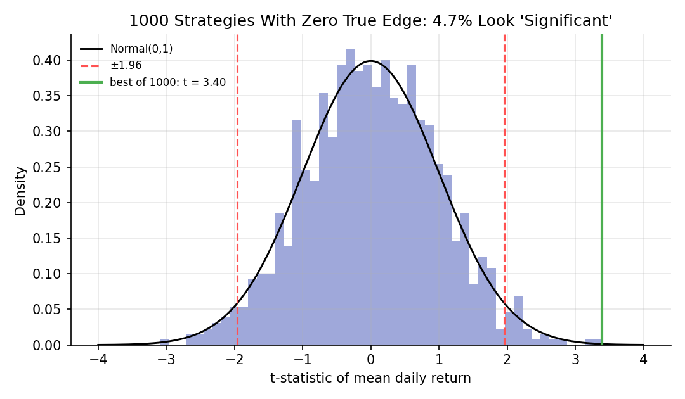

# Statistical Inference Foundations

!!! objectives "Learning objectives"
    By the end of this lecture you should be able to:

    - [ ] Define a sampling distribution and the standard error of a sample mean
    - [ ] Construct and interpret a confidence interval for a mean
    - [ ] Carry out a one-sample t-test, and interpret a p-value correctly
    - [ ] Distinguish Type I and Type II errors
    - [ ] Explain why testing many strategies inflates false discoveries

## 1. Intuition

Suppose a trading strategy earned an average of 0.8% per day over five days. Is that skill, or luck? Inference is the discipline of answering that honestly. The idea: imagine repeating the experiment many times. The sample mean would bounce around from sample to sample, and its spread (the **standard error**) tells us how much bouncing luck alone can produce. If the observed result is small relative to that noise, it is not convincing evidence of anything.

A **hypothesis test** formalizes this. We assume a boring "null hypothesis" (for example, the true mean return is zero) and ask how surprising the data would be if that were true. A **confidence interval** instead reports the range of true values consistent with the data. Both depend heavily on how many things you tried, which is the central warning of this lecture and of the whole backtesting module.

## 2. Mathematical formulation

Let \( x_1,\dots,x_n \) be independent draws with mean \( \mu \) and variance \( \sigma^2 \).

**Sample mean, sample standard deviation, standard error.**

\[
\bar x=\frac1n\sum_i x_i, \qquad s=\sqrt{\frac{1}{n-1}\sum_i (x_i-\bar x)^2}, \qquad \text{SE}(\bar x)=\frac{s}{\sqrt n}
\]

**t-statistic** for testing the null hypothesis \( H_0:\mu=\mu_0 \):

\[
t=\frac{\bar x-\mu_0}{s/\sqrt n}
\]

If the data are Normal (or \( n \) is large enough for the CLT to help), then under \( H_0 \) this statistic follows a Student-t distribution with \( n-1 \) degrees of freedom (Student, 1908).

**p-value.** For a two-sided test, the p-value is the probability, *assuming \( H_0 \) is true*, of a t-statistic at least as extreme as the one observed: \( p=P(|T|\ge|t_{\text{obs}}|) \).

**Confidence interval.** A 95% interval for \( \mu \) is

\[
\bar x\ \pm\ t_{0.975,\,n-1}\cdot\frac{s}{\sqrt n}
\]

where \( t_{0.975,\,n-1} \) is the 97.5th percentile of the t distribution.

**Errors.** A **Type I error** rejects a true \( H_0 \) (a false discovery), and its probability is the significance level \( \alpha \), commonly 5%. A **Type II error** fails to reject a false \( H_0 \) (a missed discovery). **Power** is one minus the probability of a Type II error.

## 3. Derivation

**Why divide by \( n-1 \) and use the t distribution.** The true standard error is \( \sigma/\sqrt n \), but \( \sigma \) is unknown, so we replace it with \( s \). That substitution adds extra uncertainty, especially for small \( n \). Student's result is that the ratio \( (\bar x-\mu)/(s/\sqrt n) \) has a t distribution, which has heavier tails than the Normal to reflect this. As \( n \) grows, the t distribution converges to the Normal and the distinction fades. (The divisor \( n-1 \) is the bias correction derived in the Estimation Theory lecture.)

**Where the confidence interval comes from.** Under the assumptions,

\[
P\!\left(-t_{0.975}\le \frac{\bar x-\mu}{s/\sqrt n}\le t_{0.975}\right)=0.95
\]

Rearranging the inequality to isolate \( \mu \) gives the interval above. The 95% refers to the *procedure*: if you repeated the sampling many times, about 95% of the intervals built this way would contain the true \( \mu \). It does not mean there is a 95% probability that \( \mu \) lies in one particular computed interval.

**Multiple testing.** If you test \( m \) independent strategies that all have zero true edge, each has probability \( \alpha \) of appearing significant, so the probability that *at least one* does is

\[
1-(1-\alpha)^m
\]

For \( \alpha=0.05 \) and \( m=100 \) this is \( 1-0.95^{100}\approx 99.4\% \). So the best-looking of many candidates will almost always look impressive by chance alone. This is the statistical core of backtest overfitting and "data snooping". A common remedy, the Bonferroni correction, tests each hypothesis at level \( \alpha/m \). Harvey, Liu and Zhu (2016) argue that, because so many factors have been tried in the literature, a t-statistic above roughly 3, rather than 2, should be demanded for new factors.

## 4. Worked numerical example

Five daily returns (percent): \( 1,-2,3,0,2 \), the same sample as in the Estimation Theory lecture. Test \( H_0:\mu=0 \).

- \( \bar x=0.8 \), \( s=\sqrt{3.7}\approx1.9235 \), \( \text{SE}=1.9235/\sqrt5\approx0.8602 \)
- \( t=0.8/0.8602\approx0.930 \), with 4 degrees of freedom
- Two-sided p-value \( \approx0.405 \)
- \( t_{0.975,4}\approx2.776 \), so the 95% interval is \( 0.8\pm2.776\times0.8602 = (-1.59,\ 3.19) \) percent

The interval comfortably includes zero, and a p-value of 0.41 means data this extreme would be common if the true mean were zero. Five days of a positive average is simply not evidence of skill. Note also that the interval is wide: with such a small sample, we can barely say anything about the true mean.

## 5. Python implementation

```python
import numpy as np
from scipy import stats

x = np.array([1.0, -2.0, 3.0, 0.0, 2.0])
n = len(x)
mean, s = x.mean(), x.std(ddof=1)
se = s / np.sqrt(n)
t_stat = mean / se
p_value = 2 * (1 - stats.t.cdf(abs(t_stat), df=n - 1))
tcrit = stats.t.ppf(0.975, df=n - 1)
print(f"t = {t_stat:.3f}, p = {p_value:.3f}")
print(f"95% CI: ({mean - tcrit*se:.2f}, {mean + tcrit*se:.2f})")

# Same test with SciPy's built-in
print(stats.ttest_1samp(x, popmean=0.0))

# --- Multiple testing: 1,000 strategies with zero true edge ---
rng = np.random.default_rng(11)
N, T = 1000, 252
r = rng.normal(0.0, 0.01, size=(N, T))          # daily returns, true mean = 0
t = r.mean(axis=1) / (r.std(axis=1, ddof=1) / np.sqrt(T))
print("Fraction with |t| > 1.96:", (np.abs(t) > 1.96).mean())
print("Best t-statistic:", t.max().round(2))
print("Bonferroni-adjusted critical value:", stats.norm.ppf(1 - 0.05 / (2 * N)).round(2))
```


Continuing directly from the code above, here is the plotting code that produces the chart in Section 6:

```python
import matplotlib.pyplot as plt
from scipy import stats

fig, ax = plt.subplots(figsize=(7.2, 4.2))
ax.hist(t, bins=50, color="#9fa8da", density=True)
grid = np.linspace(-4, 4, 200)
ax.plot(grid, stats.norm.pdf(grid), color="black", lw=1.4, label="Normal(0,1)")
ax.axvline(1.96, color="#ff5252", ls="--")
ax.axvline(-1.96, color="#ff5252", ls="--", label="±1.96")
ax.axvline(t.max(), color="#4caf50", ls="-", lw=2, label=f"best of {N}: t = {t.max():.2f}")
ax.set_xlabel("t-statistic of mean daily return"); ax.set_ylabel("Density")
ax.set_title(f"{N} Strategies With Zero True Edge: "
             f"{100*(np.abs(t) > 1.96).mean():.1f}% Look 'Significant'")
ax.legend(frameon=False, fontsize=8)
fig.tight_layout()
plt.show()
```

## 6. Visualization

<figure class="qf-figure" markdown>

<figcaption>t-statistics for 1,000 simulated strategies whose true mean return is exactly zero. About 5% cross the ±1.96 lines purely by chance, and the best one (green) has a t-statistic above 3. Picking the best of many candidates and reporting it alone would present pure luck as skill.</figcaption>
</figure>

## 7. Financial interpretation

Every backtest reports a mean return and, implicitly, a test. The right question is not "is this Sharpe ratio high?" but "how many things were tried before this was found?" A result that survives only if you ignore the search that produced it is not evidence. Statistical significance is also not economic significance: a tiny but precisely estimated edge can vanish after transaction costs. The reverse also occurs, where a large estimated edge is statistically indistinguishable from zero because the sample is short. These themes return in Modules 6 and 9.

## 8. Common mistakes

!!! danger "Common mistake: misreading the p-value"
    A p-value is \( P(\text{data this extreme}\mid H_0) \). It is not the probability that \( H_0 \) is true, and it is not the probability that the result is due to chance in any general sense.

!!! danger "Common mistake: reporting only the winner"
    Selecting the best of many tried strategies and testing it as though it were the only one tried massively overstates significance. Count every variant, parameter, and universe you tried.

!!! danger "Common mistake: assuming independent, identically distributed returns"
    The t-test above assumes independent observations. Autocorrelation and volatility clustering make standard errors from the simple formula too small. Robust standard errors are used in practice (Module 2).

## 9. Exercises

1. Twenty-five monthly returns have mean 1.2% and standard deviation 4%. Compute the t-statistic against zero, the p-value, and a 95% confidence interval. Would you call the mean "significant"?
2. Compute the probability that at least one of 20 independent zero-edge strategies looks significant at the 5% level. How large must \( m \) be for that probability to exceed 90%?
3. Rerun the simulation with 252 daily observations replaced by 2,520 (ten years). How does the standard error change, and what happens to the fraction of false positives?

## 10. Further reading

- Harvey, Liu and Zhu (2016) is a readable empirical treatment of multiple testing in asset pricing.

## 11. References

1. Student [W. S. Gosset] (1908). "The Probable Error of a Mean." *Biometrika*, 6(1), 1–25.
2. Casella, G., & Berger, R. L. (2002). *Statistical Inference* (2nd ed.), Chapters 8 and 9. Duxbury.
3. Harvey, C. R., Liu, Y., & Zhu, H. (2016). "…and the Cross-Section of Expected Returns." *The Review of Financial Studies*, 29(1), 5–68.
4. Wasserman, L. (2004). *All of Statistics*, Chapters 6–10. Springer.
5. SciPy Developers. "`scipy.stats.ttest_1samp`." [docs.scipy.org](https://docs.scipy.org/doc/scipy/reference/generated/scipy.stats.ttest_1samp.html)

---

<div class="grid" markdown>
[:material-arrow-left: Previous: Probability Foundations](/qf-lectures/prerequisites/probability/){ .md-button }
[Next: Optimization Foundations :material-arrow-right:](/qf-lectures/prerequisites/optimization/){ .md-button .md-button--primary }
</div>
