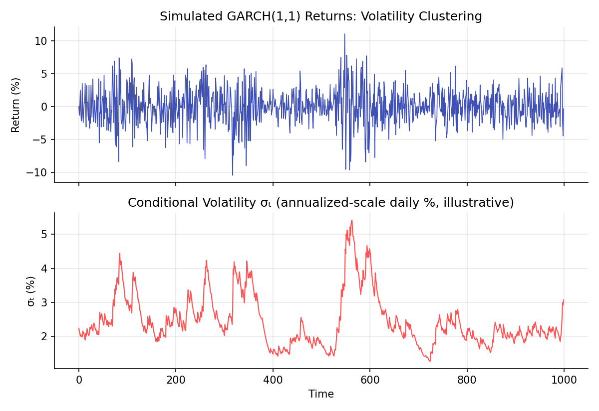
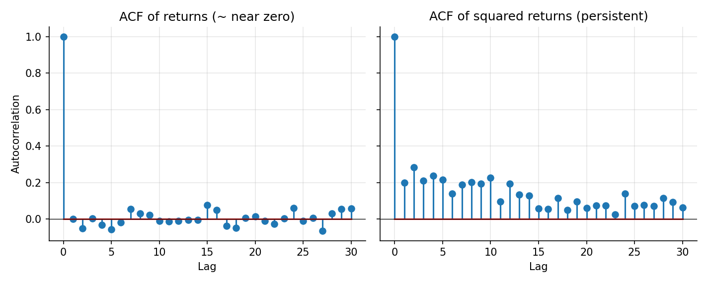

# Volatility Modeling: ARCH/GARCH

!!! objectives "Learning objectives"
    By the end of this lecture you should be able to:

    - [ ] Explain "volatility clustering" and show why it implies returns are not independent even when they are nearly uncorrelated
    - [ ] Define the ARCH(q) and GARCH(p,q) models and interpret their parameters
    - [ ] Derive the unconditional variance of a GARCH(1,1) process and explain the meaning of persistence \( \alpha+\beta \)
    - [ ] Fit a GARCH(1,1) model to a return series in Python and forecast conditional volatility

## 1. Intuition

The AR/MA/ARIMA lecture noted that daily returns are often close to linearly unpredictable from their own past, yet markets obviously go through calm periods and turbulent periods, volatility itself seems highly predictable even when direction is not. Large moves tend to be followed by more large moves (of either sign), and calm periods tend to be followed by more calm, a phenomenon called **volatility clustering**. This is a real, well-documented empirical regularity (Cont, 2001; Mandelbrot, 1963), and it means returns, despite near-zero autocorrelation, are not truly independent: their *magnitudes* are dependent even when their *signs* are not, exactly the \( X, X^2 \) example given in the Probability Foundations lecture.

**ARCH** (Engle, 1982) and its generalization **GARCH** (Bollerslev, 1986) model this directly: instead of treating volatility as constant, they let today's variance depend on yesterday's squared shock (ARCH) and, for GARCH, also on yesterday's variance itself. This gives a time-varying, but still parsimonious and estimable, model of volatility that consistently outperforms a constant-volatility assumption for real financial return series.

## 2. Mathematical formulation

Let \( r_t \) be a return series with \( r_t=\mu+\varepsilon_t \), where \( \varepsilon_t=\sigma_t z_t \), \( z_t \) i.i.d. with mean 0 and variance 1 (often standard Normal or Student-t), and \( \sigma_t^2 \) the **conditional variance** given information up to time \( t-1 \).

**ARCH(q).**

\[
\sigma_t^2 = \omega + \sum_{i=1}^q \alpha_i \varepsilon_{t-i}^2
\]

**GARCH(p,q).** Adds lagged conditional variances:

\[
\sigma_t^2 = \omega + \sum_{i=1}^q \alpha_i \varepsilon_{t-i}^2 + \sum_{j=1}^p \beta_j \sigma_{t-j}^2
\]

The most widely used specification in practice is **GARCH(1,1)**:

\[
\sigma_t^2 = \omega + \alpha\,\varepsilon_{t-1}^2 + \beta\,\sigma_{t-1}^2
\]

where:

- \( \omega>0 \) — a constant, related to the long-run average variance
- \( \alpha\ge0 \) — how strongly a recent shock's squared size feeds into today's variance ("reactiveness")
- \( \beta\ge0 \) — how strongly yesterday's variance persists into today's variance ("persistence")
- Stationarity of the variance process requires \( \alpha+\beta<1 \)

**Unconditional (long-run) variance**, when \( \alpha+\beta<1 \):

\[
\bar\sigma^2 = \frac{\omega}{1-\alpha-\beta}
\]

## 3. Derivation

**Unconditional variance of GARCH(1,1).** Take expectations of both sides of the GARCH(1,1) recursion, using \( E[\varepsilon_{t-1}^2]=E[\sigma_{t-1}^2] \) (since \( E[z_{t-1}^2]=1 \)) and assuming the process has reached a stable long-run average variance \( \bar\sigma^2=E[\sigma_t^2] \) for all \( t \):

\[
\bar\sigma^2 = \omega+\alpha\bar\sigma^2+\beta\bar\sigma^2 \quad\Longrightarrow\quad \bar\sigma^2(1-\alpha-\beta)=\omega \quad\Longrightarrow\quad \bar\sigma^2=\frac{\omega}{1-\alpha-\beta}
\]

exactly as stated in Section 2. This solution is only finite and positive when \( \alpha+\beta<1 \); at or beyond that boundary there is no stable long-run variance level, analogous to how the AR(1) process in the Stationarity lecture had no finite variance once \( |\phi|\ge1 \). The quantity \( \alpha+\beta \), called **persistence**, measures how quickly shocks to volatility decay: it can be shown by iterating the recursion that a shock to variance today decays geometrically at rate \( \alpha+\beta \) per period, so persistence close to 1 (commonly observed empirically for daily equity returns, often estimated in the 0.95-0.99 range) implies that volatility shocks fade out only very slowly, consistent with the extended, visually striking clustering seen in real markets and in the simulation below.

**Why GARCH captures volatility clustering while leaving returns themselves close to uncorrelated.** In the GARCH(1,1) model, \( \varepsilon_t=\sigma_t z_t \) with \( z_t \) independent across time, so \( \text{Corr}(\varepsilon_t,\varepsilon_{t-1})=0 \) by construction, matching the near-zero return autocorrelation observed empirically. But \( \varepsilon_t^2=\sigma_t^2 z_t^2 \), and because \( \sigma_t^2 \) depends on \( \varepsilon_{t-1}^2 \) and \( \sigma_{t-1}^2 \), the squared shocks *are* autocorrelated: large \( \varepsilon_{t-1}^2 \) directly raises \( \sigma_t^2 \), making a large \( \varepsilon_t^2 \) more likely on average. This is exactly the mechanism, and the formal resolution, behind the "uncorrelated but dependent" example given abstractly in the Probability Foundations lecture: GARCH is that example, applied to real return data.

## 4. Worked numerical example

Simulate 1,000 days from a GARCH(1,1) with \( \omega=0.00001 \), \( \alpha=0.08 \), \( \beta=0.90 \) (illustrative values in the typical empirical range for daily equity data). Persistence is \( \alpha+\beta=0.98 \), close to 1, implying long-lived, slowly-decaying volatility shocks. The unconditional daily variance is \( \bar\sigma^2=0.00001/(1-0.98)=0.0005 \), giving an unconditional daily volatility of about 2.2% (roughly 35% annualized, using \( \sqrt{252} \)). The simulated return series (Section 6) shows clear visual bursts of larger and smaller moves, tracking the conditional volatility series directly beneath it, and computing the ACF of the squared returns out to 30 lags shows persistent positive autocorrelation, in sharp contrast to the returns' own ACF, which stays close to zero throughout, exactly the empirical signature volatility clustering, and GARCH, is built to capture.

## 5. Python implementation

```python
import numpy as np

rng = np.random.default_rng(51)
T = 1000
omega, alpha, beta = 0.00001, 0.08, 0.90
print("Persistence (alpha + beta):", alpha + beta)
print("Unconditional daily variance:", omega / (1 - alpha - beta))
print("Unconditional daily volatility:", np.sqrt(omega / (1 - alpha - beta)))

# --- Simulate a GARCH(1,1) process ---
z = rng.normal(0, 1, T)
sigma2 = np.zeros(T)
r = np.zeros(T)
sigma2[0] = omega / (1 - alpha - beta)   # start at the unconditional variance
for t in range(1, T):
    sigma2[t] = omega + alpha * r[t-1]**2 + beta * sigma2[t-1]
    r[t] = np.sqrt(sigma2[t]) * z[t]

def acf(x, nlags):
    x = x - x.mean()
    return np.array([1.0] + [np.corrcoef(x[k:], x[:-k])[0, 1] for k in range(1, nlags + 1)])

print("\nACF of returns (lags 1-5):        ", np.round(acf(r, 5)[1:], 3))
print("ACF of squared returns (lags 1-5):", np.round(acf(r**2, 5)[1:], 3))

# --- Fit a GARCH(1,1) model with the 'arch' package (pip install arch) ---
from arch import arch_model

returns_pct = r * 100  # the arch package expects returns scaled roughly to percent for numerical stability
am = arch_model(returns_pct, vol="Garch", p=1, q=1, dist="normal")
res = am.fit(disp="off")
print("\nFitted GARCH(1,1) parameters:\n", res.params)

# --- Forecast conditional volatility one step ahead ---
forecast = res.forecast(horizon=1)
print("\nOne-step-ahead forecast variance (in percent^2):", forecast.variance.iloc[-1].values)
```

The `arch` package (Sheppard et al.) is the standard Python library for GARCH-family models; install it with `pip install arch`.


Continuing directly from the code above, here is the plotting code that produces both charts in Section 6:

```python
import matplotlib.pyplot as plt

# --- Chart 1: simulated returns and their conditional volatility ---
fig, axes = plt.subplots(2, 1, figsize=(8, 5.5), sharex=True)
axes[0].plot(r * 100, color="#3f51b5", lw=0.8)
axes[0].set_title("Simulated GARCH(1,1) Returns: Volatility Clustering")
axes[0].set_ylabel("Return (%)")
axes[1].plot(np.sqrt(sigma2) * 100, color="#ff5252", lw=1)
axes[1].set_title("Conditional Volatility σₜ (daily %, illustrative)")
axes[1].set_ylabel("σₜ (%)"); axes[1].set_xlabel("Time")
fig.tight_layout()
plt.show()

# --- Chart 2: ACF of returns vs. ACF of squared returns ---
nlags = 30
acf_r = acf(r, nlags)
acf_r2 = acf(r**2, nlags)

fig, axes = plt.subplots(1, 2, figsize=(9.5, 3.8), sharey=True)
axes[0].stem(range(nlags + 1), acf_r); axes[0].set_title("ACF of returns (~ near zero)")
axes[1].stem(range(nlags + 1), acf_r2); axes[1].set_title("ACF of squared returns (persistent)")
for a in axes:
    a.axhline(0, color="black", lw=0.6); a.set_xlabel("Lag")
axes[0].set_ylabel("Autocorrelation")
fig.tight_layout()
plt.show()
```

## 6. Visualization

<figure class="qf-figure" markdown>

<figcaption>Top: simulated GARCH(1,1) returns, showing clear volatility clustering, bursts of larger moves followed by more large moves, and calm stretches followed by more calm. Bottom: the model's own conditional volatility σₜ, which rises and falls in step with the return bursts above it.</figcaption>
</figure>

<figure class="qf-figure" markdown>

<figcaption>The ACF of the simulated returns themselves (left) stays close to zero at every lag, consistent with near-unpredictable direction. The ACF of the squared returns (right) is strongly and persistently positive, the statistical fingerprint of volatility clustering derived in Section 3.</figcaption>
</figure>

## 7. Financial interpretation

GARCH-based volatility forecasts feed directly into risk management (Value at Risk and Expected Shortfall, Module 3, are routinely computed using a GARCH-implied volatility rather than a constant historical one), option pricing under time-varying or stochastic volatility (Module 7's Heston model is a continuous-time cousin of this idea), and position-sizing rules in systematic trading (Module 6), where target risk levels are often set using a rolling GARCH volatility estimate rather than a fixed lookback standard deviation. High persistence (\( \alpha+\beta \) close to 1), commonly found in daily equity data, means a volatility shock, a crash or a calm patch, is expected to influence risk forecasts for many days or weeks afterward, not just the next single day.

## 8. Common mistakes

!!! danger "Common mistake: assuming constant volatility for risk management"
    Using a simple rolling historical standard deviation as a volatility forecast implicitly assumes volatility is constant over the lookback window, missing the clustering, and predictability, GARCH is built to capture. This can make risk measures systematically too slow to react to genuine volatility regime shifts.

!!! danger "Common mistake: estimating persistence above or too close to 1 without checking"
    A fitted \( \alpha+\beta \) very close to or exceeding 1 (integrated GARCH, or "IGARCH") signals that the unconditional variance formula in Section 3 is unreliable or undefined, and volatility shocks may not decay at all. This deserves scrutiny rather than being accepted at face value, since it can also result from structural breaks the simple GARCH model does not account for.

!!! danger "Common mistake: conflating conditional volatility with realized volatility"
    GARCH's \( \sigma_t \) is a *model-implied* conditional volatility forecast, not the same thing as a realized volatility computed directly from high-frequency data over some past window. The two are related and can be compared for model validation, but they answer different questions and are computed differently.

## 9. Exercises

1. Refit the simulation in Section 5 with \( \alpha=0.05,\ \beta=0.93 \) (persistence 0.98, same as the example, but more weight on persistence than reactiveness) and compare the resulting return series' visual clustering pattern to the original.
2. Derive, by iterating the GARCH(1,1) recursion two steps back, an expression for \( \sigma_t^2 \) purely in terms of \( \varepsilon_{t-1}^2,\varepsilon_{t-2}^2,\sigma_{t-2}^2 \), and the parameters. What does this suggest about how far back in time today's variance forecast "remembers"?
3. Using the fitted model from Section 5, generate a 10-day-ahead volatility forecast path (rather than just one step) and plot it. Does the forecast converge toward the unconditional variance as the horizon grows? Why would you expect that, given the derivation in Section 3?

## 10. Further reading

- Bollerslev (1986) and Engle (1982) are the two foundational papers; both are short and readable.

## 11. References

1. Engle, R. F. (1982). "Autoregressive Conditional Heteroscedasticity with Estimates of the Variance of United Kingdom Inflation." *Econometrica*, 50(4), 987–1007.
2. Bollerslev, T. (1986). "Generalized Autoregressive Conditional Heteroskedasticity." *Journal of Econometrics*, 31(3), 307–327.
3. Mandelbrot, B. (1963). "The Variation of Certain Speculative Prices." *The Journal of Business*, 36(4), 394–419.
4. Cont, R. (2001). "Empirical Properties of Asset Returns: Stylized Facts and Statistical Issues." *Quantitative Finance*, 1(2), 223–236.
5. Sheppard, K., et al. "`arch`: Python package for ARCH models." [bashtage.github.io/arch](https://bashtage.github.io/arch/)

---

<div class="grid" markdown>
[:material-arrow-left: Previous: AR / MA / ARIMA Models](/qf-lectures/statistics/arima-models/){ .md-button }
[Next: Cointegration :material-arrow-right:](/qf-lectures/statistics/cointegration/){ .md-button .md-button--primary }
</div>
