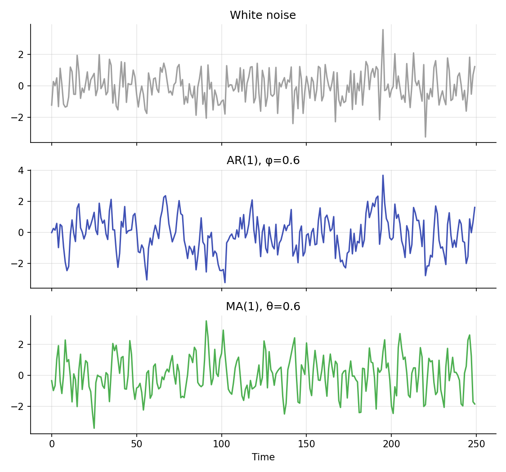
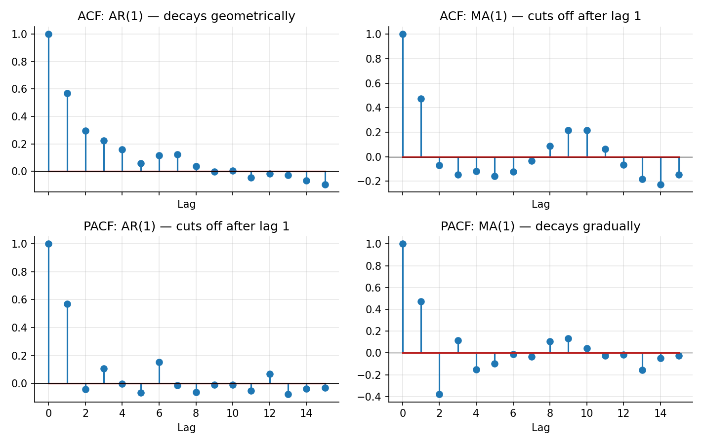

# AR / MA / ARIMA Models

!!! objectives "Learning objectives"
    By the end of this lecture you should be able to:

    - [ ] Define AR(p), MA(q), and ARMA(p,q) processes and explain what each captures about a time series
    - [ ] Distinguish the ACF/PACF signatures of AR and MA processes and use them for informal model identification
    - [ ] Explain what the "I" (integrated) in ARIMA(p,d,q) does, connecting it to the stationarity lecture
    - [ ] Fit an ARIMA model to a return series in Python and evaluate its residuals

## 1. Intuition

The Stationarity lecture established that an AR(1) process, today's value is a fraction of yesterday's plus new noise, is a simple, useful stationary model. That single model is one member of a broader family. An **autoregressive (AR)** model says today's value depends on a linear combination of several past values of the series itself. A **moving average (MA)** model instead says today's value depends on a linear combination of several past *shocks* (forecast errors), not past levels. Combining the two gives an **ARMA** model. Adding differencing to handle a non-stationary starting series gives **ARIMA**, the workhorse univariate time-series model.

These models earn their place because they are simple, well understood, and surprisingly effective as a baseline for describing short-term dependence in a series, even when they are not literally "true" descriptions of how markets work. They are also the direct ancestor of the volatility models (ARCH/GARCH) covered next in this module, which apply the same autoregressive logic to squared returns instead of returns themselves.

## 2. Mathematical formulation

**AR(p).**

\[
X_t = c + \phi_1 X_{t-1} + \phi_2 X_{t-2} + \cdots + \phi_p X_{t-p} + \varepsilon_t
\]

**MA(q).**

\[
X_t = c + \varepsilon_t + \theta_1 \varepsilon_{t-1} + \theta_2 \varepsilon_{t-2} + \cdots + \theta_q \varepsilon_{t-q}
\]

**ARMA(p,q).** Combines both:

\[
X_t = c + \sum_{i=1}^p \phi_i X_{t-i} + \varepsilon_t + \sum_{j=1}^q \theta_j \varepsilon_{t-j}
\]

**ARIMA(p,d,q).** Applies an ARMA(p,q) model to the series after differencing \( d \) times:

\[
(1-L)^d X_t \ \text{follows an ARMA(p,q) process}
\]

where \( L \) is the lag operator from the Prerequisites lecture, \( LX_t=X_{t-1} \), so \( (1-L)X_t=X_t-X_{t-1} \) is the first difference.

In all of these, \( \varepsilon_t \) is white noise (mean zero, constant variance, uncorrelated across time), \( c \) is a constant, and \( \phi_i,\theta_j \) are the model's coefficients.

**Order selection tools.** The **autocorrelation function** (ACF), defined in the Stationarity lecture, and the **partial autocorrelation function** (PACF), \( \pi_k = \text{Corr}(X_t, X_{t-k}\mid X_{t-1},\dots,X_{t-k+1}) \), the correlation at lag \( k \) after controlling for the intervening lags, are used together to identify plausible values of \( p \) and \( q \) before formally fitting.

## 3. Derivation

**Why AR and MA processes have different ACF/PACF signatures.** For an AR(1) process, it was shown in the Stationarity lecture that \( \rho_k=\phi^{|k|} \): the ACF decays geometrically and never exactly reaches zero at any finite lag. The PACF, however, only needs one lag to fully describe an AR(1) (by definition, \( X_t \) depends directly only on \( X_{t-1} \)), so the AR(1) **PACF cuts off sharply after lag 1**: partial autocorrelations at lag 2 and beyond are (in the population) exactly zero, since once \( X_{t-1} \) is controlled for, no further direct linear dependence remains.

For an MA(1) process \( X_t=\varepsilon_t+\theta\varepsilon_{t-1} \), compute the lag-1 autocovariance directly:

\[
\gamma_1 = \text{Cov}(X_t, X_{t-1}) = \text{Cov}(\varepsilon_t+\theta\varepsilon_{t-1},\ \varepsilon_{t-1}+\theta\varepsilon_{t-2}) = \theta\,\text{Var}(\varepsilon_{t-1}) = \theta\sigma_\varepsilon^2
\]

since \( \varepsilon_t \) is uncorrelated with everything except itself. At lag 2, \( \gamma_2=\text{Cov}(X_t,X_{t-2})=\text{Cov}(\varepsilon_t+\theta\varepsilon_{t-1},\varepsilon_{t-2}+\theta\varepsilon_{t-3})=0 \), since no shared shock terms appear. So an MA(1)'s **ACF cuts off sharply after lag 1**, while its PACF, by an argument symmetric to the AR case, decays gradually rather than cutting off. This ACF/PACF cutoff-versus-decay pattern, opposite for AR and MA processes, is the classical (Box-Jenkins) informal tool for identifying which family, and roughly what order, fits a given series, and it is exactly the contrast visualized in Section 6.

**Why differencing removes a unit root.** From the Stationarity lecture, a random walk \( X_t=X_{t-1}+\varepsilon_t \) is non-stationary because its variance grows with \( t \). Its first difference, \( \Delta X_t = X_t-X_{t-1}=\varepsilon_t \), is just white noise, which is trivially stationary (constant mean zero, constant variance \( \sigma_\varepsilon^2 \), zero autocorrelation at every lag). More generally, differencing a series that contains one unit root removes exactly that unit root, which is why ARIMA's "I" (integrated) parameter \( d \) is chosen to be the minimum number of differences needed to achieve stationarity, verified in practice with the ADF test from the previous lecture.

## 4. Worked numerical example

Simulate an AR(1) with \( \phi=0.6 \) and an MA(1) with \( \theta=0.6 \), each over 250 periods, both driven by the same kind of standard Normal shocks (Section 6, top figure). Computing their sample ACF and PACF out to 15 lags (Section 6, bottom figure) confirms the theoretical pattern: the AR(1)'s ACF decays smoothly (each successive value close to the previous one raised further toward zero) while its PACF has a single large spike at lag 1 and is small thereafter; the MA(1)'s ACF has a single large spike at lag 1 and is small thereafter, while its PACF decays gradually across several lags. These are two different-looking series (Section 6, top figure) with complementary diagnostic signatures.

## 5. Python implementation

```python
import numpy as np
from statsmodels.tsa.arima.model import ARIMA

rng = np.random.default_rng(41)
T = 250

# --- Simulate an AR(1) and an MA(1) ---
eps = rng.normal(0, 1, T)
phi = 0.6
ar1 = np.zeros(T)
for t in range(1, T):
    ar1[t] = phi * ar1[t-1] + eps[t]

theta = 0.6
eps2 = rng.normal(0, 1, T + 1)
ma1 = eps2[1:] + theta * eps2[:-1]

# --- ACF and PACF (a simple from-scratch PACF via the Yule-Walker/Durbin-Levinson recursion) ---
def acf(x, nlags):
    x = x - x.mean()
    return np.array([1.0] + [np.corrcoef(x[k:], x[:-k])[0, 1] for k in range(1, nlags + 1)])

def pacf_yw(x, nlags):
    x = x - x.mean()
    r = acf(x, nlags)
    phi_mat = np.zeros((nlags + 1, nlags + 1))
    vals = [1.0]
    phi_mat[1, 1] = r[1]
    vals.append(phi_mat[1, 1])
    for k in range(2, nlags + 1):
        num = r[k] - sum(phi_mat[k-1, j] * r[k-j] for j in range(1, k))
        den = 1 - sum(phi_mat[k-1, j] * r[j] for j in range(1, k))
        phi_mat[k, k] = num / den
        for j in range(1, k):
            phi_mat[k, j] = phi_mat[k-1, j] - phi_mat[k, k] * phi_mat[k-1, k-j]
        vals.append(phi_mat[k, k])
    return np.array(vals)

print("AR(1) ACF (lags 1-3):", np.round(acf(ar1, 5)[1:4], 3))
print("AR(1) PACF (lags 1-3):", np.round(pacf_yw(ar1, 5)[1:4], 3), "-> cuts off after lag 1")
print("MA(1) ACF (lags 1-3):", np.round(acf(ma1, 5)[1:4], 3), "-> cuts off after lag 1")
print("MA(1) PACF (lags 1-3):", np.round(pacf_yw(ma1, 5)[1:4], 3))

# --- Fit an ARIMA(1,0,0) (i.e. AR(1)) model with statsmodels and check the fitted phi ---
model = ARIMA(ar1, order=(1, 0, 0)).fit()
print("\nFitted AR(1) coefficient:", round(model.params[1], 3), " (true phi =", phi, ")")

# --- Fit an ARIMA(0,0,1) (i.e. MA(1)) model ---
model_ma = ARIMA(ma1, order=(0, 0, 1)).fit()
print("Fitted MA(1) coefficient:", round(model_ma.params[1], 3), " (true theta =", theta, ")")

# --- Residual diagnostics: fitted residuals should look like white noise ---
resid = model.resid
print("\nResidual ACF (lags 1-3):", np.round(acf(resid, 5)[1:4], 3), "(should be near zero if the model fits well)")
```

Continuing directly from the code above, here is the plotting code that produces both charts in Section 6:

```python
import matplotlib.pyplot as plt

# --- Chart 1: white noise, AR(1), and MA(1) series stacked for comparison ---
fig, axes = plt.subplots(3, 1, figsize=(7.5, 7), sharex=True)
axes[0].plot(eps, color="#9e9e9e"); axes[0].set_title("White noise")
axes[1].plot(ar1, color="#3f51b5"); axes[1].set_title(f"AR(1), φ={phi}")
axes[2].plot(ma1, color="#4caf50"); axes[2].set_title(f"MA(1), θ={theta}")
axes[2].set_xlabel("Time")
fig.tight_layout()
plt.show()

# --- Chart 2: ACF/PACF signature comparison ---
nlags = 15
acf_ar, pacf_ar = acf(ar1, nlags), pacf_yw(ar1, nlags)
acf_ma, pacf_ma = acf(ma1, nlags), pacf_yw(ma1, nlags)

fig, axes = plt.subplots(2, 2, figsize=(9.5, 6), sharex=True)
axes[0, 0].stem(range(nlags + 1), acf_ar); axes[0, 0].set_title("ACF: AR(1) — decays geometrically")
axes[1, 0].stem(range(nlags + 1), pacf_ar); axes[1, 0].set_title("PACF: AR(1) — cuts off after lag 1")
axes[0, 1].stem(range(nlags + 1), acf_ma); axes[0, 1].set_title("ACF: MA(1) — cuts off after lag 1")
axes[1, 1].stem(range(nlags + 1), pacf_ma); axes[1, 1].set_title("PACF: MA(1) — decays gradually")
for a in axes.flat:
    a.axhline(0, color="black", lw=0.6); a.set_xlabel("Lag")
fig.tight_layout()
plt.show()
```

## 6. Visualization

<figure class="qf-figure" markdown>

<figcaption>White noise (top) has no structure at all. The AR(1) series (middle) shows smoother, more persistent wandering, since each value is pulled partly toward the previous one. The MA(1) series (bottom) looks superficially similar but has a fundamentally different, shorter-memory dependence structure, as the ACF/PACF chart below reveals.</figcaption>
</figure>

<figure class="qf-figure" markdown>

<figcaption>The classic identification signatures derived in Section 3: an AR(1) process's ACF (top left) decays smoothly while its PACF (bottom left) cuts off sharply after lag 1. An MA(1) process shows the mirror-image pattern: its ACF (top right) cuts off after lag 1 while its PACF (bottom right) decays gradually.</figcaption>
</figure>

## 7. Financial interpretation

ARIMA models are most often applied, if at all, to returns rather than prices, consistent with the stationarity discussion, and even then, financial returns typically show very weak, if any, linear autocorrelation at the daily frequency (a finding sometimes summarized as the returns themselves being close to unpredictable from their own past, even though their *volatility* is highly predictable, the subject of the next lecture on ARCH/GARCH). ARIMA-family models see more use on macroeconomic series (GDP, inflation, interest rates), on higher-frequency or intraday return series where short-term dependence can be more pronounced, and as one building block within more elaborate forecasting or trading pipelines (Module 6), rather than as a standalone alpha-generating tool for daily equity returns.

## 8. Common mistakes

!!! danger "Common mistake: over-fitting the order (p,q)"
    Higher-order AR or MA terms will almost always improve the in-sample fit, but can easily overfit noise. Use information criteria (AIC, BIC) and out-of-sample validation (Module 8) rather than in-sample fit alone to choose \( p \) and \( q \).

!!! danger "Common mistake: skipping the stationarity check"
    Fitting ARMA (with \( d=0 \)) to a series that actually contains a unit root violates the model's assumptions and produces unreliable coefficient estimates and forecasts. Always check stationarity (e.g., with the ADF test) or difference the series first, exactly the workflow ARIMA's \( d \) parameter formalizes.

!!! danger "Common mistake: ignoring residual diagnostics"
    A "successfully fitted" ARIMA model whose residuals still show significant autocorrelation has not actually captured all the linear structure in the series. Check the residual ACF (as in Section 5) before trusting the model's forecasts.

## 9. Exercises

1. Simulate an ARMA(1,1) process (with both a \( \phi \) and a \( \theta \) term) and compute its ACF and PACF. Explain why neither one cuts off sharply, unlike the pure AR(1) or MA(1) cases.
2. Fit ARIMA(1,0,0), ARIMA(0,0,1), and ARIMA(1,0,1) models to the same AR(1) simulated series from Section 5, and compare their AIC values. Does the correctly specified model win?
3. Using real daily returns for a liquid stock or index, compute the ACF out to 10 lags. Is there visible short-term autocorrelation, or does the series look close to white noise? Relate your answer to the discussion in Section 7.

## 10. Further reading

- Box, Jenkins, and Reinsel's classic text remains a thorough reference for the identification methodology summarized here.

## 11. References

1. Box, G. E. P., Jenkins, G. M., Reinsel, G. C., & Ljung, G. M. (2015). *Time Series Analysis: Forecasting and Control* (5th ed.). Wiley.
2. Tsay, R. S. (2010). *Analysis of Financial Time Series* (3rd ed.), Chapter 2. Wiley.
3. Campbell, J. Y., Lo, A. W., & MacKinlay, A. C. (1997). *The Econometrics of Financial Markets*, Chapter 2. Princeton University Press.
4. statsmodels Developers. "`statsmodels.tsa.arima.model.ARIMA`." [statsmodels.org](https://www.statsmodels.org/stable/generated/statsmodels.tsa.arima.model.ARIMA.html)

---

<div class="grid" markdown>
[:material-arrow-left: Previous: Stationarity and Unit Roots](/qf-lectures/statistics/stationarity-unit-roots/){ .md-button }
[Next: Volatility Modeling — ARCH/GARCH :material-arrow-right:](/qf-lectures/statistics/arch-garch/){ .md-button .md-button--primary }
</div>
