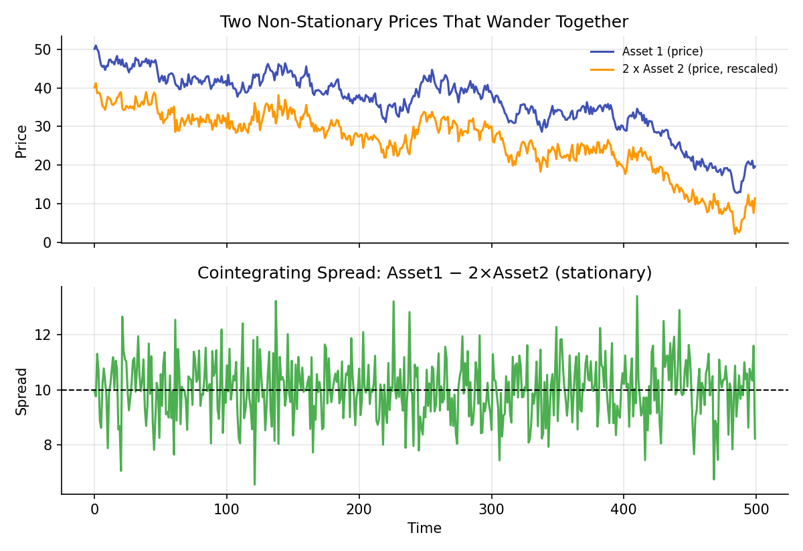

# Cointegration

!!! objectives "Learning objectives"
    By the end of this lecture you should be able to:

    - [ ] Explain what cointegration means and how it differs from correlation
    - [ ] Explain why regressing one non-stationary series on another can be spurious, and what property avoids this
    - [ ] Run the Engle-Granger two-step procedure to test for cointegration and estimate a cointegrating relationship
    - [ ] Construct and visualize a cointegrating spread in Python, the basis of statistical arbitrage pairs trading in Module 6

## 1. Intuition

The Stationarity lecture warned that regressing one non-stationary series on another can produce a **spurious regression**: an apparently strong, statistically significant relationship that reflects nothing more than both series independently wandering over time, with no real economic link. But sometimes two non-stationary series really are linked, not because either one is individually well-behaved, but because a specific *combination* of them is. Two stock prices in the same industry, or a commodity future and its underlying spot price, may each wander like a random walk on their own, yet their *difference* (or some weighted difference) stays roughly anchored, since whatever economic force pulls one away from the other also tends to pull it back.

This is **cointegration**: two (or more) non-stationary series are cointegrated if some linear combination of them is stationary. It is the mathematically precise condition under which regressing non-stationary series is meaningful rather than spurious, and it is the statistical foundation of pairs trading and statistical arbitrage (Module 6).

## 2. Mathematical formulation

Two time series \( X_t \) and \( Y_t \), each individually non-stationary (specifically, integrated of order 1, or "I(1)", meaning each becomes stationary after differencing once, as in the ARIMA lecture), are said to be **cointegrated** if there exists a constant \( \beta \) such that

\[
Z_t = Y_t - \beta X_t
\]

is stationary (I(0)), even though \( X_t \) and \( Y_t \) individually are not. \( \beta \) is called the **cointegrating coefficient**, and \( Z_t \) the **cointegrating spread** (or "error correction term").

**Engle-Granger two-step procedure.**

1. Regress \( Y_t \) on \( X_t \) by OLS (Linear Regression lecture): \( Y_t=\alpha+\beta X_t+Z_t \), obtaining \( \hat\beta \) and residuals \( \hat Z_t \).
2. Test \( \hat Z_t \) for a unit root using the Augmented Dickey-Fuller test (Stationarity lecture). If the null of a unit root is rejected, \( X_t \) and \( Y_t \) are judged cointegrated with cointegrating vector \( (1,-\hat\beta) \).

Because \( \hat Z_t \) is a residual from an estimated regression rather than an observed series, the ADF critical values used in step 2 must be adjusted (Engle & Granger, 1987, or the MacKinnon (1994, 2010) response-surface critical values used in standard software) rather than the ordinary ADF table; standard software implementations handle this automatically.

## 3. Derivation

**Why cointegration avoids spurious regression.** Recall from the Stationarity lecture that a random walk's variance grows linearly with time, \( \text{Var}(X_t)=t\sigma^2 \). If \( X_t \) and \( Y_t \) are two *independent* random walks with no genuine relationship, their regression residual \( Z_t=Y_t-\hat\beta X_t \) will generally also have variance growing with time (since it's built from two unrelated wandering series), and the standard OLS machinery, which assumes stationary, well-behaved residuals, is invalid. This is the origin of the Granger-Newbold (1974) spurious regression problem: with growing-variance residuals, the usual t-statistics on \( \hat\beta \) do not follow their assumed distribution, and can appear "significant" far more often than they should, purely as an artifact.

Cointegration is precisely the special condition under which this breakdown does not happen: if a *specific* \( \beta \) exists such that \( Z_t=Y_t-\beta X_t \) is stationary, the regression residual's variance does *not* grow over time, so the OLS-based inference, while still requiring the corrected critical values noted above for the unit-root test on the residuals themselves, rests on a solid foundation rather than a spurious one. In economic terms, cointegration formalizes the idea of a stable, long-run equilibrium relationship between two variables that can each wander individually but are tied together by some common underlying force (arbitrage pressure between related securities, a shared economic driver, a hedging relationship) which continually pulls any temporary divergence back toward that equilibrium.

**Why the spread, once found, is mean-reverting and tradeable.** Because \( Z_t \) is stationary by construction (that is exactly what the cointegration test confirms), it has a constant, finite unconditional mean and variance, meaning it does not wander indefinitely and instead fluctuates around a fixed level, the qualitative behavior of a stationary AR(1)-type process, as contrasted with a random walk in the Stationarity lecture. This mean-reverting property is what a pairs-trading strategy (Module 6) directly exploits: when the spread moves unusually far from its historical mean, the position is that it should revert, motivating a trade that profits if and when it does.

## 4. Worked numerical example

Simulate two price series that each individually follow a random walk (both driven partly by a shared underlying random walk "common factor," plus their own independent noise), over 500 periods. Regressing Asset 1 on Asset 2 by OLS and testing the residual for a unit root shows the residual is stationary (its ADF test rejects the unit-root null decisively), confirming cointegration with a cointegrating coefficient close to the true value of 2 used to construct the simulation. The resulting spread (Section 6, bottom panel) fluctuates around a stable mean throughout the sample, in sharp visual contrast to the two individual, unboundedly wandering price series (Section 6, top panel) built from them.

## 5. Python implementation

```python
import numpy as np
from statsmodels.tsa.stattools import adfuller

rng = np.random.default_rng(51)
T = 500

# --- Simulate two cointegrated, individually non-stationary price series ---
common_factor = np.cumsum(rng.normal(0, 1, T))       # shared underlying random walk
price1 = common_factor + rng.normal(0, 0.5, T) + 50
price2 = 0.5 * common_factor + rng.normal(0, 0.5, T) + 20

# --- Step 1: OLS regression of price1 on price2 ---
X = np.column_stack([np.ones(T), price2])
beta_hat = np.linalg.solve(X.T @ X, X.T @ price1)
resid = price1 - X @ beta_hat
print(f"Estimated intercept: {beta_hat[0]:.3f}, cointegrating coefficient: {beta_hat[1]:.3f}")

# --- Step 2: test the residual for a unit root ---
adf_resid = adfuller(resid, autolag="AIC")
print(f"ADF stat on residual: {adf_resid[0]:.3f}, p-value: {adf_resid[1]:.4f}")

# --- Compare: ADF test on the two raw price series (should NOT reject unit root) ---
print("ADF p-value, price1 (raw):", round(adfuller(price1, autolag='AIC')[1], 4))
print("ADF p-value, price2 (raw):", round(adfuller(price2, autolag='AIC')[1], 4))

# --- statsmodels' dedicated cointegration test (Engle-Granger with correct critical values) ---
from statsmodels.tsa.stattools import coint
coint_stat, coint_pvalue, crit_values = coint(price1, price2)
print(f"\nEngle-Granger coint test: stat={coint_stat:.3f}, p-value={coint_pvalue:.4f}")

# --- The tradeable spread, for a pairs-trading-style analysis (Module 6) ---
spread = price1 - beta_hat[1] * price2
print(f"\nSpread mean: {spread.mean():.3f}, spread std: {spread.std():.3f}")
```


Continuing directly from the code above, here is the plotting code that produces the chart in Section 6:

```python
import matplotlib.pyplot as plt

fig, axes = plt.subplots(2, 1, figsize=(8, 5.5), sharex=True)
axes[0].plot(price1, color="#3f51b5", label="Asset 1 (price)")
axes[0].plot(price2 * 2, color="#ff9800", label="2 x Asset 2 (price, rescaled)")
axes[0].set_title("Two Non-Stationary Prices That Wander Together")
axes[0].legend(frameon=False, fontsize=8); axes[0].set_ylabel("Price")

axes[1].plot(spread, color="#4caf50")
axes[1].axhline(spread.mean(), color="black", ls="--", lw=1)
axes[1].set_title("Cointegrating Spread: Asset1 − 2×Asset2 (stationary)")
axes[1].set_ylabel("Spread"); axes[1].set_xlabel("Time")
fig.tight_layout()
plt.show()
```

## 6. Visualization

<figure class="qf-figure" markdown>

<figcaption>Top: two simulated prices, each individually a random walk (non-stationary), built from a shared common driver plus independent noise. Bottom: the cointegrating spread, Asset 1 minus twice Asset 2, is stationary, fluctuating around a stable mean (dashed line) even while the two underlying prices above wander without bound.</figcaption>
</figure>

## 7. Financial interpretation

Cointegration is the rigorous statistical basis for **statistical arbitrage pairs trading** (developed fully in Module 6): find two (or more) securities whose prices are cointegrated, trade the spread when it diverges unusually far from its historical mean, betting on reversion, and close the position as it reverts. The approach only makes economic and statistical sense because the spread is stationary (mean-reverting) even though the individual legs are not; trading a "spread" between two unrelated, non-cointegrated random walks would be trading noise with no reversion tendency to exploit, precisely the spurious-regression trap this lecture, and the Stationarity lecture before it, are built to help avoid. Cointegration relationships also appear in macro-finance (interest rate spreads, exchange rate relationships) and in the analysis of the term structure of interest rates.

## 8. Common mistakes

!!! danger "Common mistake: confusing correlation with cointegration"
    Two series can be highly correlated in their period-to-period *changes* (returns) while their *levels* are not cointegrated at all, and vice versa: two series can have low return correlation yet still be cointegrated in levels. These are different properties, testing different things, and conflating them is a common and consequential error in pairs-trading research.

!!! danger "Common mistake: using ordinary ADF critical values on a regression residual"
    Because the residual \( \hat Z_t \) in the Engle-Granger procedure comes from an *estimated* regression rather than a directly observed series, using standard ADF critical values (rather than the adjusted ones from Engle & Granger, 1987, or MacKinnon) overstates the test's power to find cointegration, a source of false positives if not handled by dedicated software functions such as `statsmodels.tsa.stattools.coint`, used in Section 5.

!!! danger "Common mistake: assuming a historically cointegrated relationship is permanent"
    Cointegration is estimated from historical data and can break down if the underlying economic relationship between two securities changes (a merger, a change in an index's composition, a shift in business fundamentals). A pairs-trading strategy should monitor for such breaks rather than assuming a once-confirmed cointegrating relationship holds forever.

## 9. Exercises

1. Modify the simulation in Section 5 to make `price1` and `price2` fully independent random walks (no shared common factor). Rerun the Engle-Granger cointegration test and confirm it correctly fails to find cointegration.
2. Using the fitted cointegrating coefficient from Section 5, compute the spread's own ACF (using the function from the Stationarity or ARIMA lectures) and confirm it decays quickly, consistent with a stationary, mean-reverting series.
3. Extend the analysis to three series (a common factor driving all three, with independent idiosyncratic noise on each) and test each pair for cointegration. Are all three pairs cointegrated? Why might that be expected given how the data was generated?

## 10. Further reading

- Module 6's Statistical Arbitrage and Pairs Trading lecture builds a complete trading strategy directly on the concepts introduced here.

## 11. References

1. Engle, R. F., & Granger, C. W. J. (1987). "Co-Integration and Error Correction: Representation, Estimation, and Testing." *Econometrica*, 55(2), 251–276.
2. Granger, C. W. J., & Newbold, P. (1974). "Spurious Regressions in Econometrics." *Journal of Econometrics*, 2(2), 111–120.
3. MacKinnon, J. G. (2010). "Critical Values for Cointegration Tests." Queen's Economics Department Working Paper No. 1227.
4. Tsay, R. S. (2010). *Analysis of Financial Time Series* (3rd ed.), Chapter 8. Wiley.
5. statsmodels Developers. "`statsmodels.tsa.stattools.coint`." [statsmodels.org](https://www.statsmodels.org/stable/generated/statsmodels.tsa.stattools.coint.html)

---

<div class="grid" markdown>
[:material-arrow-left: Previous: Volatility Modeling — ARCH/GARCH](/qf-lectures/statistics/arch-garch/){ .md-button }
[Back to Curriculum :material-arrow-right:](/qf-lectures/curriculum/){ .md-button .md-button--primary }
</div>
