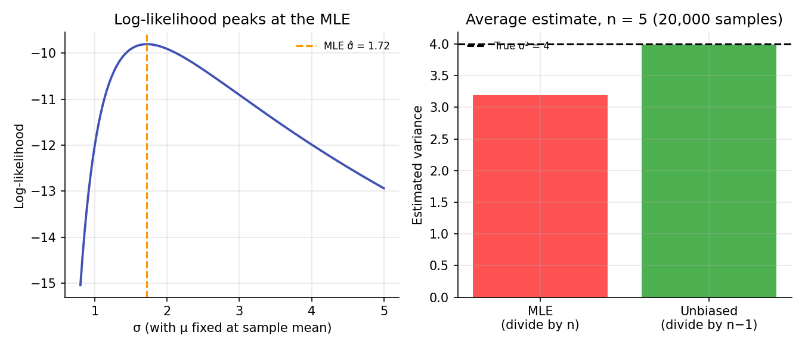

# Estimation Theory: MLE and Method of Moments

!!! objectives "Learning objectives"
    By the end of this lecture you should be able to:

    - [ ] Distinguish a parameter, an estimator, and an estimate
    - [ ] Define bias and explain why an unbiased estimator is not automatically the "best" one
    - [ ] Derive the maximum likelihood estimators of the mean and variance of a Normal distribution
    - [ ] Explain why the MLE of the variance is biased, and correct it
    - [ ] Fit a distribution to return data by maximum likelihood in Python

## 1. Intuition

Every model in this curriculum has **parameters**: the mean and volatility of returns, the degrees of freedom of a Student-t, the coefficients of a regression. These are unknown constants of the process generating the data. All we have is a finite sample, so we need a rule that turns data into a guess for each parameter. That rule is an **estimator**, and the number it produces from a particular sample is an **estimate**.

Because the sample is random, the estimate is random too. Estimation theory is about judging rules: on average, are they right (bias)? How much do they wobble from sample to sample (variance)? The two most widely used recipes are the **method of moments** (match sample averages to theoretical moments) and **maximum likelihood** (choose the parameters that make the observed data most probable).

## 2. Mathematical formulation

Let \( x_1, \dots, x_n \) be independent observations from a distribution with density \( f(x;\theta) \), where \( \theta \) is the parameter (or vector of parameters).

**Likelihood and log-likelihood.**

\[
L(\theta) = \prod_{i=1}^{n} f(x_i;\theta) \qquad\qquad \ell(\theta) = \ln L(\theta) = \sum_{i=1}^{n} \ln f(x_i;\theta)
\]

The **maximum likelihood estimator** is

\[
\hat{\theta}_{\text{MLE}} = \arg\max_{\theta}\ \ell(\theta)
\]

We take logs because sums are easier to differentiate than products, and the log is increasing so the maximizer is unchanged.

**Method of moments.** Set the theoretical moments \( E[X^k] \), which depend on \( \theta \), equal to the sample moments \( \frac{1}{n}\sum_i x_i^k \), and solve for \( \theta \).

**Bias.** For an estimator \( \hat\theta \),

\[
\text{Bias}(\hat\theta) = E[\hat\theta] - \theta
\]

An estimator is **unbiased** if its bias is zero.

**Normal case.** For \( X \sim \mathcal{N}(\mu,\sigma^2) \):

\[
\hat\mu = \bar{x} = \frac{1}{n}\sum_{i=1}^n x_i \qquad\qquad \hat\sigma^2_{\text{MLE}} = \frac{1}{n}\sum_{i=1}^n (x_i-\bar{x})^2
\]

and the bias-corrected sample variance is

\[
s^2 = \frac{1}{n-1}\sum_{i=1}^n (x_i-\bar{x})^2
\]

## 3. Derivation

**MLE for the Normal.** The log-likelihood is

\[
\ell(\mu,\sigma^2) = -\frac{n}{2}\ln(2\pi) - \frac{n}{2}\ln\sigma^2 - \frac{1}{2\sigma^2}\sum_{i=1}^n (x_i-\mu)^2
\]

Differentiate with respect to \( \mu \) and set to zero:

\[
\frac{\partial \ell}{\partial \mu} = \frac{1}{\sigma^2}\sum_i (x_i-\mu) = 0 \quad\Longrightarrow\quad \hat\mu = \bar{x}
\]

Differentiate with respect to \( \sigma^2 \) and set to zero:

\[
\frac{\partial \ell}{\partial \sigma^2} = -\frac{n}{2\sigma^2} + \frac{1}{2\sigma^4}\sum_i (x_i-\mu)^2 = 0 \quad\Longrightarrow\quad \hat\sigma^2 = \frac{1}{n}\sum_i (x_i-\hat\mu)^2
\]

**Why the MLE variance is biased.** Write \( x_i - \bar{x} = (x_i-\mu) - (\bar{x}-\mu) \) and expand:

\[
\sum_i (x_i-\bar{x})^2 = \sum_i (x_i-\mu)^2 - n(\bar{x}-\mu)^2
\]

Take expectations. Each \( E[(x_i-\mu)^2] = \sigma^2 \), and \( E[(\bar{x}-\mu)^2] = \text{Var}(\bar{x}) = \sigma^2/n \). Therefore

\[
E\Big[\sum_i (x_i-\bar{x})^2\Big] = n\sigma^2 - n\cdot\frac{\sigma^2}{n} = (n-1)\sigma^2
\]

so \( E[\hat\sigma^2_{\text{MLE}}] = \frac{n-1}{n}\sigma^2 < \sigma^2 \). The estimator systematically underestimates variance because \( \bar{x} \) was fitted to the same data and is, by construction, closer to the observations than the true \( \mu \) is. Dividing by \( n-1 \) instead of \( n \) removes the bias, giving \( s^2 \). The bias vanishes as \( n \) grows, and it matters most in small samples.

**Method of moments for the Normal.** Matching \( E[X]=\mu \) and \( E[X^2]=\sigma^2+\mu^2 \) to the sample moments gives the same estimators as MLE here. This is a coincidence of the Normal, not a general rule. For other distributions the two methods can differ, and MLE is generally preferred for its efficiency properties in large samples.

## 4. Worked numerical example

Five daily returns (in percent): \( 1,\ -2,\ 3,\ 0,\ 2 \). (Illustrative data.)

**Mean:** \( \bar{x} = (1-2+3+0+2)/5 = 0.8\% \).

**Squared deviations:** \( (0.2)^2 = 0.04,\ (-2.8)^2 = 7.84,\ (2.2)^2 = 4.84,\ (-0.8)^2 = 0.64,\ (1.2)^2 = 1.44 \). Sum \( = 14.8 \).

**MLE variance:** \( 14.8/5 = 2.96\ (\%^2) \), so \( \hat\sigma \approx 1.72\% \).

**Unbiased variance:** \( 14.8/4 = 3.70\ (\%^2) \), so \( s \approx 1.92\% \).

With only 5 observations the two differ by 25%, which is the factor \( n/(n-1) = 5/4 \).

## 5. Python implementation

```python
import numpy as np
from scipy import stats

x = np.array([1.0, -2.0, 3.0, 0.0, 2.0])   # returns in percent
n = len(x)

mean = x.mean()
var_mle = x.var(ddof=0)      # divide by n
var_unb = x.var(ddof=1)      # divide by n-1
print(f"mean={mean:.2f}  MLE var={var_mle:.2f}  unbiased var={var_unb:.2f}")

# --- Simulation: check the bias claim from Section 3 ---
rng = np.random.default_rng(1)
true_var, n_small = 4.0, 5
samples = rng.normal(0, np.sqrt(true_var), size=(20000, n_small))
print("Avg MLE variance:     ", samples.var(axis=1, ddof=0).mean().round(3),
      "(theory:", true_var * (n_small - 1) / n_small, ")")
print("Avg unbiased variance:", samples.var(axis=1, ddof=1).mean().round(3))

# --- MLE for a fat-tailed model: fit a Student-t by maximum likelihood ---
returns = stats.t.rvs(df=4, scale=0.01, size=5000, random_state=42)
df_hat, loc_hat, scale_hat = stats.t.fit(returns)   # numerical MLE
print(f"Fitted Student-t: df={df_hat:.2f}, loc={loc_hat:.5f}, scale={scale_hat:.5f}")
```

`stats.t.fit` maximizes the log-likelihood numerically, because the Student-t has no closed-form MLE. Numerical optimization is a general theme of Module 0's optimization lecture.


Continuing directly from the code above, here is the plotting code that produces both charts in Section 6:

```python
import matplotlib.pyplot as plt

# --- Chart 1: log-likelihood curve, peaking at the MLE of sigma ---
mu_hat = x.mean()
sig_grid = np.linspace(0.8, 5, 300)
n = len(x)
loglik = -n*np.log(sig_grid) - ((x - mu_hat)**2).sum()/(2*sig_grid**2) - 0.5*n*np.log(2*np.pi)
sig_mle = np.sqrt(((x - mu_hat)**2).mean())

fig, axes = plt.subplots(1, 2, figsize=(9, 3.9))
axes[0].plot(sig_grid, loglik, color="#3f51b5", linewidth=1.8)
axes[0].axvline(sig_mle, color="#ff9800", linestyle="--", label=f"MLE σ̂ = {sig_mle:.2f}")
axes[0].set_xlabel("σ (with μ fixed at sample mean)"); axes[0].set_ylabel("Log-likelihood")
axes[0].set_title("Log-likelihood peaks at the MLE"); axes[0].legend(frameon=False, fontsize=8)

# --- Chart 2: average MLE vs. unbiased variance across simulated samples ---
axes[1].bar(["MLE\n(divide by n)", "Unbiased\n(divide by n−1)"],
            [samples.var(axis=1, ddof=0).mean(), samples.var(axis=1, ddof=1).mean()],
            color=["#ff5252", "#4caf50"])
axes[1].axhline(true_var, color="black", linestyle="--", label=f"True σ² = {true_var}")
axes[1].set_title(f"Average estimate, n = {n_small} (20,000 samples)")
axes[1].set_ylabel("Estimated variance")
axes[1].legend(frameon=False, fontsize=8)
fig.tight_layout()
plt.show()
```

## 6. Visualization

<figure class="qf-figure" markdown>

<figcaption>Left: the log-likelihood of the five sample returns as a function of σ, peaking at the MLE. Right: across 20,000 simulated samples of size 5 from a Normal with true variance 4, the MLE variance averages about 3.2 (matching the theoretical \( \tfrac{4}{5}\times 4 \)), while the n−1 version averages about 4.</figcaption>
</figure>

## 7. Financial interpretation

Nearly every risk number is an estimate: volatility, covariance, beta, expected return. Sample noise means these numbers carry uncertainty, and with the short histories common in finance that uncertainty can be large. Expected returns in particular are notoriously hard to estimate precisely, while volatilities are estimated far more accurately. The choice of estimator matters most where data are scarce, such as tail risk, where extreme observations are by definition rare. MLE also underpins the GARCH models later in this module, which are fitted by maximizing a likelihood.

## 8. Common mistakes

!!! danger "Common mistake: mixing up ddof conventions"
    NumPy's `var` and `std` divide by \( n \) by default (`ddof=0`), while pandas' `.var()` and `.std()` divide by \( n-1 \) (`ddof=1`). The same data can give different volatilities depending on the library. Check which one you are using.

!!! danger "Common mistake: equating unbiased with best"
    Unbiasedness is one desirable property, not the only one. An estimator can be slightly biased yet have lower overall error, and \( s \) is itself a biased estimator of the standard deviation \( \sigma \), even though \( s^2 \) is unbiased for \( \sigma^2 \).

!!! danger "Common mistake: ignoring estimation uncertainty"
    Reporting a single estimated volatility or mean return with no notion of its sampling error invites false precision. Standard errors and confidence intervals, covered in the next lectures, quantify this.

## 9. Exercises

1. Derive the MLE of the rate \( \lambda \) for an Exponential distribution with density \( f(x;\lambda)=\lambda e^{-\lambda x} \), \( x \ge 0 \). Verify that it matches the method of moments estimator.
2. Modify the simulation in Section 5 to use \( n=50 \) instead of \( n=5 \). How does the gap between the MLE and unbiased variances change, and does it match the factor \( (n-1)/n \)?
3. Simulate returns from a Student-t with 3 degrees of freedom and compare the sampling variability of \( s^2 \) against a Normal sample of the same size. What does this suggest about estimating variance for fat-tailed returns?

## 10. Further reading

- The next lectures in this module build on estimators to construct confidence intervals and hypothesis tests.

## 11. References

1. Casella, G., & Berger, R. L. (2002). *Statistical Inference* (2nd ed.), Chapters 7 and 10. Duxbury.
2. Campbell, J. Y., Lo, A. W., & MacKinlay, A. C. (1997). *The Econometrics of Financial Markets*, Appendix and Chapter 1. Princeton University Press.
3. SciPy Developers. "`scipy.stats.t`." [docs.scipy.org](https://docs.scipy.org/doc/scipy/reference/generated/scipy.stats.t.html)

---

<div class="grid" markdown>
[:material-arrow-left: Previous: Probability Distributions in Finance](/qf-lectures/statistics/probability-distributions/){ .md-button }
[Next: Hypothesis Testing for Financial Data :material-arrow-right:](/qf-lectures/statistics/hypothesis-testing/){ .md-button .md-button--primary }
</div>
