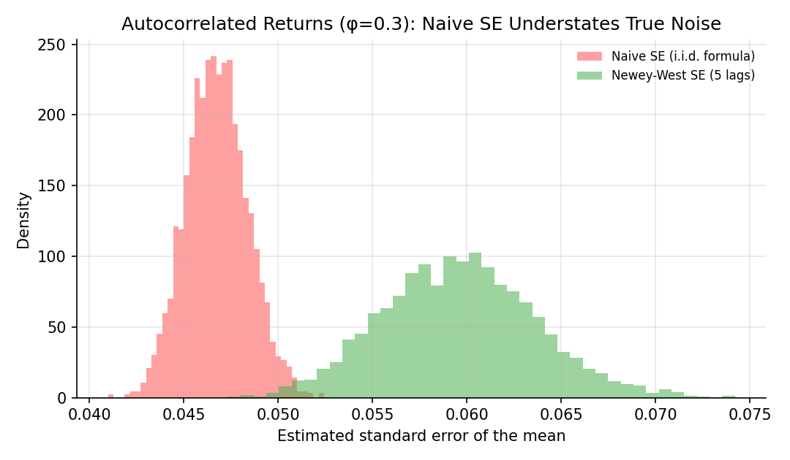
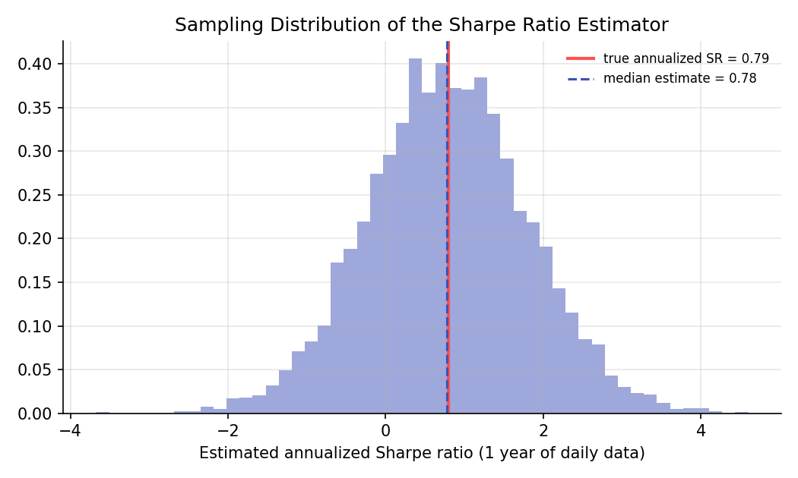

# Hypothesis Testing for Financial Data

!!! objectives "Learning objectives"
    By the end of this lecture you should be able to:

    - [ ] Test whether two strategies or assets have different mean returns, using a two-sample t-test
    - [ ] Explain why autocorrelated returns make the standard i.i.d. standard error formula unreliable, and compute a Newey-West corrected standard error
    - [ ] Derive an approximate standard error for a Sharpe ratio estimate and use it to test whether a Sharpe ratio is significantly different from zero
    - [ ] Explain what "statistically significant" does and does not establish about a trading strategy

## 1. Intuition

The Statistical Inference Foundations lecture built the one-sample t-test on the assumption that observations are independent and identically distributed. Financial returns routinely violate that assumption: returns are often (weakly) autocorrelated, volatility clusters over time, and the object most people actually care about testing, the Sharpe ratio, is a ratio of two random quantities rather than a single mean. This lecture extends the basic machinery to handle three situations that come up constantly in practice: comparing two return series, testing a mean when returns are autocorrelated, and testing whether a Sharpe ratio is really different from zero.

## 2. Mathematical formulation

**Two-sample t-test.** For independent samples of sizes \( n_1, n_2 \) with sample means \( \bar x_1,\bar x_2 \) and sample variances \( s_1^2,s_2^2 \), testing \( H_0:\mu_1=\mu_2 \), Welch's t-statistic (which does not assume equal variances) is

\[
t=\frac{\bar x_1-\bar x_2}{\sqrt{s_1^2/n_1+s_2^2/n_2}}
\]

**Newey-West standard error.** For a possibly autocorrelated series \( x_1,\dots,x_T \) with sample mean \( \bar x \) and demeaned values \( u_t=x_t-\bar x \), the Newey-West estimator of the long-run variance of the mean uses a weighted sum of autocovariances up to a chosen number of lags \( L \):

\[
\widehat{\text{Var}}(\bar x) = \frac{1}{T^2}\left[T\hat\gamma_0 + 2\sum_{k=1}^{L}\left(1-\frac{k}{L+1}\right)T\hat\gamma_k\right], \qquad \hat\gamma_k=\frac1T\sum_{t=k+1}^{T} u_t u_{t-k}
\]

where:

- \( \hat\gamma_0 \) — the sample variance of the series
- \( \hat\gamma_k \) — the sample autocovariance at lag \( k \)
- \( L \) — the truncation lag, chosen large enough to capture the relevant autocorrelation, commonly a small multiple of \( T^{1/3} \) (Newey & West, 1987)
- The declining weights \( 1-k/(L+1) \) (the Bartlett kernel) ensure the resulting variance estimate stays non-negative

**Sharpe ratio and its standard error.** The (per-period) Sharpe ratio is \( SR=\mu/\sigma \), estimated by \( \widehat{SR}=\bar x/s \). Under the assumption of i.i.d. Normal returns, Lo (2002) shows the asymptotic standard error of the estimated Sharpe ratio over \( T \) observations is approximately

\[
\text{SE}(\widehat{SR}) \approx \sqrt{\frac{1+\tfrac12 SR^2}{T}}
\]

so a test of \( H_0: SR=0 \) uses \( z=\widehat{SR}/\text{SE}(\widehat{SR}) \), compared against the standard Normal.

## 3. Derivation

**Where the Sharpe ratio standard error comes from.** \( \widehat{SR} \) is a nonlinear function of two estimated quantities, \( \bar x \) and \( s \), each with their own sampling variance. The **delta method** approximates the variance of a smooth function \( g(\bar x, s) \) of asymptotically Normal estimators by a first-order Taylor expansion:

\[
\text{Var}(g(\bar x,s)) \approx \left(\frac{\partial g}{\partial \mu}\right)^2\text{Var}(\bar x) + \left(\frac{\partial g}{\partial \sigma}\right)^2\text{Var}(s) + 2\frac{\partial g}{\partial \mu}\frac{\partial g}{\partial \sigma}\text{Cov}(\bar x, s)
\]

For \( g=\mu/\sigma \) under i.i.d. Normal sampling, \( \bar x \) and \( s \) are independent, \( \text{Var}(\bar x)=\sigma^2/T \), and \( \text{Var}(s)\approx\sigma^2/(2T) \) (a standard result for the sample standard deviation of Normal data). Substituting \( \partial g/\partial\mu=1/\sigma \) and \( \partial g/\partial\sigma=-\mu/\sigma^2 \):

\[
\text{Var}(\widehat{SR})\approx \frac{1}{\sigma^2}\cdot\frac{\sigma^2}{T} + \frac{\mu^2}{\sigma^4}\cdot\frac{\sigma^2}{2T} = \frac1T+\frac{SR^2}{2T}=\frac{1+\tfrac12SR^2}{T}
\]

which is exactly the formula in Section 2. This derivation makes the key limitation explicit: it assumes i.i.d. Normal returns. Real returns are typically fat-tailed and can be autocorrelated, and Lo (2002) derives corrected formulas for both departures; the general lesson, that ratio estimators need their own variance formula rather than borrowing one built for a simple mean, is the point to take away.

**Why autocorrelation breaks the naive standard error.** The naive formula \( s/\sqrt T \) implicitly assumes \( \text{Var}(\bar x)=\sigma^2/T \), which followed (in the Probability Foundations lecture) from returns being independent so that all covariance terms in \( \text{Var}(\sum_t x_t) \) vanish. If instead returns are positively autocorrelated, those covariance terms are positive and do not vanish, so the true variance of \( \bar x \) is larger than \( \sigma^2/T \):

\[
\text{Var}\left(\frac1T\sum_t x_t\right)=\frac{1}{T^2}\sum_t\sum_s\text{Cov}(x_t,x_s) = \frac{1}{T}\left[\gamma_0+2\sum_{k=1}^{T-1}\left(1-\frac{k}{T}\right)\gamma_k\right]
\]

The Newey-West estimator in Section 2 is exactly the sample analogue of the bracketed term, truncated at lag \( L \) for a stable estimate. Ignoring this and using \( s/\sqrt T \) understates the true standard error whenever autocorrelation is positive, which inflates t-statistics and overstates statistical significance, precisely the danger flagged (but not corrected) in the multiple-testing lecture.

## 4. Worked numerical example

Simulate 500 days of an AR(1) return series with autocorrelation \( \phi=0.3 \) (illustrative, chosen to make the effect visible; real daily equity return autocorrelation is typically much smaller). Averaged over 3,000 simulated series, the naive formula \( s/\sqrt T \) gave a mean standard error of about 0.0468, while the 5-lag Newey-West estimator gave about 0.0596, roughly 27% larger. Using the naive (too-small) standard error in a t-test would make genuinely noisy results look artificially more significant than they are.

For the Sharpe ratio: with a true annualized Sharpe ratio of about 0.79 (daily mean 0.0005, daily volatility 0.01, annualized by \( \sqrt{252} \)), estimating it from a single year of daily data (252 observations) produced a sampling standard deviation of about 1.02 across simulations, comparable in size to the Sharpe ratio itself. A single year is not enough data to pin down a Sharpe ratio with much precision, which is a general and important fact, not an artifact of this particular simulation.

## 5. Python implementation

```python
import numpy as np
from scipy import stats

rng = np.random.default_rng(21)

# --- Two-sample t-test: compare mean daily returns of two strategies ---
strat_a = rng.normal(0.0006, 0.010, 250)
strat_b = rng.normal(0.0003, 0.012, 250)
t_stat, p_val = stats.ttest_ind(strat_a, strat_b, equal_var=False)  # Welch's t-test
print(f"Welch t = {t_stat:.3f}, p = {p_val:.3f}")

# --- Newey-West standard error for an autocorrelated series ---
def newey_west_se(x, lags):
    n = len(x)
    u = x - x.mean()
    gamma0 = (u @ u) / n
    s = gamma0
    for k in range(1, lags + 1):
        w = 1 - k / (lags + 1)          # Bartlett kernel weight
        gammak = (u[k:] @ u[:-k]) / n
        s += 2 * w * gammak
    return np.sqrt(s / n)

phi, T = 0.3, 500
r = np.zeros(T)
eps = rng.normal(0, 1, T)
for t in range(1, T):
    r[t] = phi * r[t-1] + eps[t]

naive_se = r.std(ddof=1) / np.sqrt(T)
nw_se = newey_west_se(r, lags=5)
print(f"Naive SE: {naive_se:.4f}   Newey-West SE: {nw_se:.4f}")

# --- Sharpe ratio significance test (Lo, 2002, i.i.d.-Normal approximation) ---
daily_returns = rng.normal(0.0005, 0.01, 252)
sr_hat = daily_returns.mean() / daily_returns.std(ddof=1)
se_sr = np.sqrt((1 + 0.5 * sr_hat**2) / len(daily_returns))
z = sr_hat / se_sr
p_sr = 2 * (1 - stats.norm.cdf(abs(z)))
print(f"Daily SR={sr_hat:.4f}, annualized={sr_hat*np.sqrt(252):.2f}, z={z:.2f}, p={p_sr:.3f}")
```


Continuing directly from the code above, here is the plotting code that produces both charts in Section 6:

```python
import matplotlib.pyplot as plt

# --- Chart 1: naive vs. Newey-West SE across many simulated autocorrelated series ---
naive_ses, nw_ses = [], []
for _ in range(3000):
    eps = rng.normal(0, 1, T)
    series = np.zeros(T)
    for t_ in range(1, T):
        series[t_] = phi * series[t_-1] + eps[t_]
    naive_ses.append(series.std(ddof=1) / np.sqrt(T))
    nw_ses.append(newey_west_se(series, lags=5))
naive_ses, nw_ses = np.array(naive_ses), np.array(nw_ses)

fig, ax = plt.subplots(figsize=(7.2, 4.2))
ax.hist(naive_ses, bins=40, alpha=0.55, color="#ff5252", density=True, label="Naive SE (i.i.d. formula)")
ax.hist(nw_ses, bins=40, alpha=0.55, color="#4caf50", density=True, label="Newey-West SE (5 lags)")
ax.set_xlabel("Estimated standard error of the mean"); ax.set_ylabel("Density")
ax.set_title(f"Autocorrelated Returns (φ={phi}): Naive SE Understates True Noise")
ax.legend(frameon=False, fontsize=8)
fig.tight_layout()
plt.show()

# --- Chart 2: sampling distribution of the Sharpe ratio estimator ---
sr_true = (0.0005 / 0.01) * np.sqrt(252)
sims = rng.normal(0.0005, 0.01, (5000, 252))
sr_hats = (sims.mean(axis=1) / sims.std(axis=1, ddof=1)) * np.sqrt(252)

fig, ax = plt.subplots(figsize=(7, 4.2))
ax.hist(sr_hats, bins=50, color="#9fa8da", density=True)
ax.axvline(sr_true, color="#ff5252", lw=2, label=f"true annualized SR = {sr_true:.2f}")
ax.axvline(np.median(sr_hats), color="#3f51b5", ls="--", label=f"median estimate = {np.median(sr_hats):.2f}")
ax.set_xlabel("Estimated annualized Sharpe ratio (1 year of daily data)")
ax.set_title("Sampling Distribution of the Sharpe Ratio Estimator")
ax.legend(frameon=False, fontsize=8)
fig.tight_layout()
plt.show()
```

## 6. Visualization

<figure class="qf-figure" markdown>

<figcaption>Across 3,000 simulated 500-day AR(1) return series with autocorrelation 0.3, the naive i.i.d. standard error formula (red) systematically underestimates the true sampling noise compared to the Newey-West correction (green), whose distribution sits further right.</figcaption>
</figure>

<figure class="qf-figure" markdown>

<figcaption>Sampling distribution of the annualized Sharpe ratio estimator from a single simulated year (252 days) of i.i.d. daily returns with a true annualized Sharpe ratio of 0.79 (red line). The spread is wide relative to the true value, illustrating why one year of data poorly pins down a strategy's Sharpe ratio.</figcaption>
</figure>

## 7. Financial interpretation

A reported Sharpe ratio or a claimed outperformance is only as trustworthy as the standard error behind it, and the standard i.i.d. formulas taught first are frequently the wrong ones to apply directly to financial time series. Newey-West standard errors are the default correction used throughout empirical asset pricing whenever returns might be autocorrelated (a common feature of longer-horizon returns and less liquid assets). The Sharpe ratio standard error result is a caution against comparing strategies on short samples: even in a best-case i.i.d. Normal world, a single year materially understates how uncertain a Sharpe ratio estimate really is.

## 8. Common mistakes

!!! danger "Common mistake: applying the i.i.d. standard error to autocorrelated data"
    As Section 4 shows numerically, doing so can understate the true standard error substantially, which overstates t-statistics and understates p-values, making noise look like a genuine result.

!!! danger "Common mistake: comparing Sharpe ratios without a standard error"
    A Sharpe ratio of 1.2 is not obviously "better" than 0.8 if both are estimated with wide, overlapping confidence intervals. Report or at least mentally track the standard error from Section 2 before declaring a winner.

!!! danger "Common mistake: choosing the Newey-West lag length arbitrarily"
    Too few lags leaves autocorrelation uncorrected; too many lags adds estimation noise and can even produce an unreliable estimate in small samples. A common rule of thumb is \( L\approx 4(T/100)^{2/9} \) (or simply a small fixed number for daily financial data, as used here); check sensitivity to the choice rather than picking one value blindly.

## 9. Exercises

1. Generate two independent normal return series with equal true means but different volatilities (10% and 20% annualized). Run Welch's two-sample t-test and confirm the p-value is usually not below 0.05, since the true means are equal.
2. Increase the AR(1) autocorrelation parameter in Section 5 from 0.3 to 0.6 and rerun the simulation. How much further does the naive standard error diverge from the Newey-West estimate?
3. Using the Sharpe ratio standard error formula, compute how many years of daily data (assume 252 trading days per year) would be needed to get the standard error of an annualized Sharpe ratio of 1.0 down to 0.1. (Careful with the annualization of the standard error itself.)

## 10. Further reading

- Lo (2002) works through several extensions, including non-i.i.d. and non-Normal cases, in detail.

## 11. References

1. Newey, W. K., & West, K. D. (1987). "A Simple, Positive Semi-Definite, Heteroskedasticity and Autocorrelation Consistent Covariance Matrix." *Econometrica*, 55(3), 703–708.
2. Lo, A. W. (2002). "The Statistics of Sharpe Ratios." *Financial Analysts Journal*, 58(4), 36–52.
3. Harvey, C. R., Liu, Y., & Zhu, H. (2016). "...and the Cross-Section of Expected Returns." *The Review of Financial Studies*, 29(1), 5–68.
4. SciPy Developers. "`scipy.stats.ttest_ind`." [docs.scipy.org](https://docs.scipy.org/doc/scipy/reference/generated/scipy.stats.ttest_ind.html)

---

<div class="grid" markdown>
[:material-arrow-left: Previous: Estimation Theory](/qf-lectures/statistics/estimation-theory/){ .md-button }
[Next: Linear Regression and Regularization :material-arrow-right:](/qf-lectures/statistics/regression-regularization/){ .md-button .md-button--primary }
</div>
