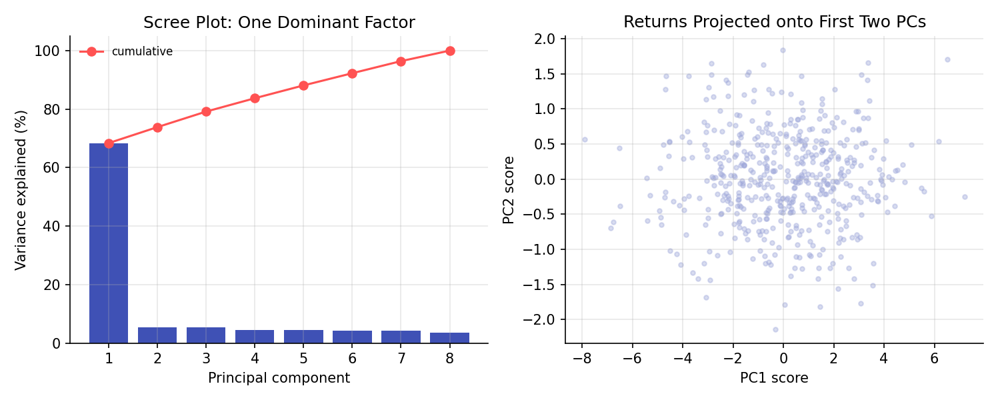

# Principal Component Analysis

!!! objectives "Learning objectives"
    By the end of this lecture you should be able to:

    - [ ] Explain what principal component analysis (PCA) does, geometrically and algebraically
    - [ ] Derive the first principal component as the direction of maximum variance, via the covariance matrix's eigenvectors
    - [ ] Interpret a scree plot and explain what "variance explained" means for a set of asset returns
    - [ ] Compute a PCA of a return covariance matrix in Python using eigen-decomposition

## 1. Intuition

A universe of, say, 500 stocks has a 500×500 covariance matrix, which is a lot of numbers to reason about directly. In practice, though, much of the co-movement across many assets is driven by a small number of common forces, a broad market factor, an industry effect, a rates-sensitivity effect. **Principal component analysis** finds those dominant directions of movement directly from the data, with no prior labeling of "market" or "industry" required.

The Linear Algebra for Finance lecture showed that the eigenvectors of a covariance matrix point along directions of independent variation, and the eigenvalues are the variances along those directions. PCA is simply the practice of ranking those eigenvector directions from most to least variance and using the top few to summarize the whole system. It is the unsupervised counterpart to the reduction-of-dimensionality problem, and it reappears in Module 7 (random matrix theory) and Module 8 (feature engineering).

## 2. Mathematical formulation

Let \( X \) be an \( n\times p \) matrix of \( p \) asset returns over \( n \) observations, with each column centered to have mean zero, and let \( \Sigma=\frac1n X^\top X \) be its sample covariance matrix.

**Principal components.** The \( k \)-th principal component direction \( \mathbf v_k \) solves

\[
\mathbf v_k = \arg\max_{\|\mathbf v\|=1,\ \mathbf v\perp \mathbf v_1,\dots,\mathbf v_{k-1}}\ \text{Var}(X\mathbf v)
\]

that is, the direction of maximum variance among all directions orthogonal to the previously found components. The **principal component scores** are \( \mathbf z_k = X\mathbf v_k \), the data projected onto that direction.

**Solution via eigen-decomposition.** By the spectral theorem (Linear Algebra for Finance), \( \Sigma = V\Lambda V^\top \), with \( V \) the matrix of orthonormal eigenvectors and \( \Lambda=\text{diag}(\lambda_1\ge\lambda_2\ge\cdots\ge\lambda_p\ge0) \). The principal components are exactly the eigenvectors, ordered by eigenvalue:

\[
\mathbf v_k = k\text{-th column of } V, \qquad \text{Var}(\mathbf z_k)=\lambda_k
\]

**Variance explained.** The fraction of total variance captured by the first \( k \) components is

\[
\frac{\sum_{i=1}^k \lambda_i}{\sum_{i=1}^p \lambda_i}
\]

## 3. Derivation

**Why the top eigenvector maximizes variance.** This was proven in the Linear Algebra for Finance lecture: for a unit vector \( \mathbf v \), \( \text{Var}(X\mathbf v)=\mathbf v^\top\Sigma\mathbf v \), and this quadratic form is maximized over unit vectors exactly at the top eigenvector, with maximum value equal to the largest eigenvalue. A brief reminder of why: writing \( \mathbf v=\sum_i c_i \mathbf v_i \) in the eigenbasis (with \( \sum_i c_i^2=1 \) since \( \mathbf v \) is a unit vector), \( \mathbf v^\top\Sigma\mathbf v=\sum_i c_i^2\lambda_i \), a weighted average of the eigenvalues with weights \( c_i^2 \) summing to 1. This average is maximized by putting all the weight on the largest eigenvalue, i.e. \( \mathbf v=\mathbf v_1 \).

**Why later components are orthogonal.** Once \( \mathbf v_1 \) is fixed, maximizing \( \mathbf v^\top\Sigma\mathbf v \) subject to \( \mathbf v\perp\mathbf v_1 \) restricts the weighted average above to the remaining eigenvalues \( \lambda_2,\dots,\lambda_p \), and by the same argument the maximizer is \( \mathbf v_2 \). This is why principal components are automatically uncorrelated with each other: \( \text{Cov}(\mathbf z_j,\mathbf z_k) = \mathbf v_j^\top\Sigma\mathbf v_k = \lambda_k\, \mathbf v_j^\top\mathbf v_k = 0 \) for \( j\ne k \), using the orthogonality of eigenvectors of a symmetric matrix.

**PCA and factor structure.** If returns follow an approximate one-factor model \( R_i = \beta_i F + e_i \) with a common factor \( F \) and small, weakly correlated idiosyncratic terms \( e_i \), then the covariance matrix is approximately \( \Sigma\approx\boldsymbol\beta\boldsymbol\beta^\top\sigma_F^2 + D \), where \( D \) is close to diagonal. This structure has one dominant eigenvalue (of order \( p \), proportional to the number of assets, since every pair contributes a bit of common covariance) and many small eigenvalues clustered together (from the diagonal-ish \( D \)). This is exactly the pattern in Section 6's scree plot, and it is the empirical basis for treating "the market" as the dominant, largely unavoidable source of common variance across a broad equity universe.

## 4. Worked numerical example

Simulate 8 assets over 500 days, each driven by one common factor (with a different sensitivity, or "loading," per asset) plus independent idiosyncratic noise. The resulting eigenvalue decomposition assigns about 68% of total variance to the first principal component alone, with the remaining seven components splitting the rest roughly evenly (each around 4-5%). This large first-eigenvalue-versus-the-rest pattern is the signature of a dominant common factor, and it is qualitatively what is observed in real, broad equity return covariance matrices, where the first principal component typically correlates highly with a broad market index.

## 5. Python implementation

```python
import numpy as np

rng = np.random.default_rng(31)
n_assets, n_obs = 8, 500

loadings = rng.uniform(0.5, 1.2, n_assets)   # each asset's sensitivity to the common factor
factor = rng.normal(0, 1, n_obs)
idio = rng.normal(0, 0.6, (n_obs, n_assets))
R = np.outer(factor, loadings) + idio
R = R - R.mean(axis=0)                       # center each column

Sigma = np.cov(R, rowvar=False)              # 8x8 covariance matrix
vals, vecs = np.linalg.eigh(Sigma)           # ascending order
vals, vecs = vals[::-1], vecs[:, ::-1]       # sort descending

explained = vals / vals.sum()
print("Eigenvalues:", np.round(vals, 3))
print("Variance explained by each PC:", np.round(explained * 100, 1), "%")
print("Cumulative (first 3 PCs):", round(explained[:3].sum() * 100, 1), "%")

# Project the data onto the first two principal components
scores = R @ vecs[:, :2]
print("\nFirst 5 PC1/PC2 scores:\n", np.round(scores[:5], 3))

# Sanity check: PC scores are uncorrelated
print("\nCorrelation of PC1 and PC2 scores:", round(np.corrcoef(scores[:, 0], scores[:, 1])[0, 1], 6))
```


Continuing directly from the code above, here is the plotting code that produces both panels in Section 6:

```python
import matplotlib.pyplot as plt

fig, axes = plt.subplots(1, 2, figsize=(10, 4))

# --- Left: scree plot ---
axes[0].bar(range(1, n_assets + 1), explained * 100, color="#3f51b5")
axes[0].plot(range(1, n_assets + 1), np.cumsum(explained) * 100, color="#ff5252",
             marker="o", label="cumulative")
axes[0].set_xlabel("Principal component"); axes[0].set_ylabel("Variance explained (%)")
axes[0].set_title("Scree Plot: One Dominant Factor"); axes[0].legend(frameon=False, fontsize=8)

# --- Right: returns projected onto the first two PCs ---
axes[1].scatter(scores[:, 0], scores[:, 1], s=10, alpha=0.4, color="#9fa8da")
axes[1].set_xlabel("PC1 score"); axes[1].set_ylabel("PC2 score")
axes[1].set_title("Returns Projected onto First Two PCs")

fig.tight_layout()
plt.show()
```

## 6. Visualization

<figure class="qf-figure" markdown>

<figcaption>Left: the scree plot for 8 simulated, factor-driven assets. The first principal component alone explains roughly 68% of total variance, the signature of a dominant common factor derived in Section 3. Right: the same return data projected onto its first two principal components.</figcaption>
</figure>

## 7. Financial interpretation

PCA is the empirical, data-driven counterpart to imposing a factor structure by hand (as CAPM or Fama-French do in Module 3). The first principal component of a broad equity universe is often interpreted as a market factor even without being told to look for one; subsequent components sometimes align with recognizable themes (sector, size, momentum) but often do not have a clean economic label. PCA is also central to risk management, where reducing a large covariance matrix to a handful of principal risk factors makes portfolio risk more tractable to monitor and stress-test, and to Module 7's random matrix theory, which asks how many of the smaller eigenvalues are genuine signal versus pure estimation noise.

## 8. Common mistakes

!!! danger "Common mistake: not centering (or not scaling) the data"
    PCA is defined on centered data; forgetting to subtract the mean produces a decomposition dominated by the mean level rather than the variance structure. If assets are on very different scales (e.g., mixing return series with raw price levels), consider standardizing before applying PCA, or the components will be dominated by whichever series happens to have the largest raw variance.

!!! danger "Common mistake: treating every principal component as economically meaningful"
    Only the first few components typically correspond to real, persistent sources of common variation; smaller components are frequently dominated by estimation noise, especially when the number of assets is comparable to the number of observations. Module 7's random matrix theory lecture gives a formal way to judge which eigenvalues are likely signal versus noise.

!!! danger "Common mistake: confusing loadings with correlations"
    An asset's eigenvector entry (its "loading" on a component) reflects its relative contribution to that component's direction, not a normalized correlation coefficient; comparing loadings across assets with very different individual variances without accounting for scale can mislead.

## 9. Exercises

1. Modify the simulation in Section 5 to use two independent common factors instead of one (e.g., a "market" factor and a "sector" factor affecting different subsets of assets), and inspect the resulting scree plot. How many components now dominate?
2. Verify numerically that the sum of all eigenvalues equals the trace of the covariance matrix (the sum of each asset's own variance), consistent with the Linear Algebra for Finance lecture.
3. Using real or simulated data for 20+ assets, compute the first principal component and check its correlation with a simple equal-weighted average of all the asset returns. Why would you expect these to be highly correlated?

## 10. Further reading

- Module 7's Random Matrix Theory lecture extends this analysis to ask which eigenvalues of an empirical covariance matrix are statistically distinguishable from noise.

## 11. References

1. Jolliffe, I. T. (2002). *Principal Component Analysis* (2nd ed.). Springer Series in Statistics.
2. Laloux, L., Cizeau, P., Bouchaud, J.-P., & Potters, M. (1999). "Noise Dressing of Financial Correlation Matrices." *Physical Review Letters*, 83(7), 1467–1470.
3. Connor, G., & Korajczyk, R. A. (1986). "Performance Measurement with the Arbitrage Pricing Theory: A New Framework for Analysis." *Journal of Financial Economics*, 15(3), 373–394.
4. NumPy Developers. "`numpy.linalg.eigh`." [numpy.org/doc](https://numpy.org/doc/stable/reference/generated/numpy.linalg.eigh.html)

---

<div class="grid" markdown>
[:material-arrow-left: Previous: Linear Regression and Regularization](/qf-lectures/statistics/regression-regularization/){ .md-button }
[Next: Stationarity and Unit Roots :material-arrow-right:](/qf-lectures/statistics/stationarity-unit-roots/){ .md-button .md-button--primary }
</div>
