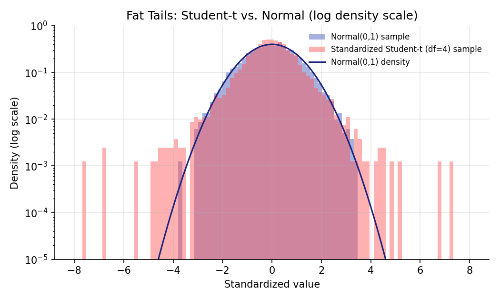

# Probability Distributions in Finance

!!! objectives "Learning objectives"
    By the end of this lecture you should be able to:

    - [ ] State the density function of the Normal distribution and explain its historical role as the default model for asset returns
    - [ ] Define skewness and (excess) kurtosis, and explain what "fat tails" means precisely in terms of kurtosis
    - [ ] Explain why the Student-t distribution is frequently preferred over the Normal for modeling financial return series
    - [ ] Fit and compare Normal and Student-t distributions to a return series in Python, and visually and numerically assess fit quality

## 1. Intuition

The Normal ("Gaussian") distribution is the natural starting point for modeling returns: it's fully described by just a mean and a variance, it's mathematically convenient (it underlies Black-Scholes in Module 4 and much of classical statistics in this module), and by the Central Limit Theorem, sums of many small, independent shocks tend toward it.

But real asset returns systematically violate the Normal assumption in one specific, well-documented way: **extreme moves — both crashes and spikes — happen far more often than a Normal distribution predicts.** This is the "fat tails" phenomenon, and it is one of the most robust empirical regularities in finance. Distributions like the **Student-t** capture this extra tail risk while still looking approximately bell-shaped near the center, which is why they show up repeatedly in risk models (Module 3), volatility models (later in this module), and stress-testing frameworks.

## 2. Mathematical formulation

**Normal distribution.** A random variable \( X \) is Normally distributed with mean \( \mu \) and variance \( \sigma^2 \), written \( X \sim \mathcal{N}(\mu, \sigma^2) \), if its probability density function is

\[
f(x) = \frac{1}{\sigma\sqrt{2\pi}} \exp\left( -\frac{(x-\mu)^2}{2\sigma^2} \right)
\]

where:

- \( \mu \) — the mean (expected value) of the distribution, i.e. the central location
- \( \sigma \) — the standard deviation, controlling the spread; \( \sigma^2 \) is the variance
- \( x \) — the value at which the density is evaluated (e.g., a candidate return)

**Skewness** (third standardized moment) measures asymmetry:

\[
\text{Skew}[X] = E\left[ \left( \frac{X - \mu}{\sigma} \right)^3 \right]
\]

Negative skew (common in equity returns) means the left tail — large losses — is heavier than the right tail.

**Kurtosis** (fourth standardized moment) measures tail heaviness:

\[
\text{Kurt}[X] = E\left[ \left( \frac{X - \mu}{\sigma} \right)^4 \right]
\]

The Normal distribution has kurtosis exactly 3. **Excess kurtosis** is defined as \( \text{Kurt}[X] - 3 \); a positive excess kurtosis (a "leptokurtic" or fat-tailed distribution) means more probability mass in the extreme tails *and* near the center, at the expense of the "shoulders," relative to a Normal with the same variance.

**Student-t distribution.** With \( \nu \) degrees of freedom, its density is

\[
f(x; \nu) = \frac{\Gamma\!\left(\frac{\nu+1}{2}\right)}{\sqrt{\nu\pi}\,\Gamma\!\left(\frac{\nu}{2}\right)} \left(1 + \frac{x^2}{\nu}\right)^{-\frac{\nu+1}{2}}
\]

where:

- \( \nu \) — degrees of freedom, controlling tail thickness: smaller \( \nu \) means fatter tails; as \( \nu \to \infty \), the Student-t converges to the standard Normal
- \( \Gamma(\cdot) \) — the Gamma function, a generalization of the factorial used to normalize the density so it integrates to 1

For \( \nu > 2 \), the Student-t has finite variance equal to \( \frac{\nu}{\nu - 2} \), so it must be rescaled by \( \sqrt{\nu/(\nu-2)} \) to be compared on equal footing with a unit-variance Normal — the code in Section 5 does exactly this.

## 3. Derivation

**Why does excess kurtosis mean "fatter tails," precisely?**

Consider two distributions standardized to mean 0 and variance 1 (so both have the *same* spread by construction). The variance is an average of squared deviations, \( E[(X-\mu)^2/\sigma^2] = 1 \) for both — that's fixed. Kurtosis is an average of *fourth-power* deviations. Because the fourth power grows much faster than the second power for values far from the mean, a distribution can hold its variance fixed at 1 while shifting probability mass in a specific way: moving some mass from the "shoulders" (moderate deviations, say 1–2 standard deviations out) into both the center (near zero) and the far tails (many standard deviations out). This trade-off is exactly what raises the fourth moment while holding the second moment constant — which is why excess kurtosis is the standard numerical signature of "fat tails plus a sharper peak," a shape referred to as leptokurtic.

This is not a hand-wavy description — it is a direct consequence of comparing the same distribution family with different tail parameters. For the Student-t specifically, the tails decay as a power law, \( f(x) \sim |x|^{-(\nu+1)} \) for large \( |x| \), which is a *polynomial* decay. The Normal's tails decay as \( \exp(-x^2/2) \), which is much faster (super-exponential relative to any polynomial). This difference in decay rate — polynomial vs. Gaussian — is the mathematical reason the Student-t assigns dramatically more probability to extreme events than the Normal does, especially many standard deviations from the mean, exactly where financial crashes live.

## 4. Worked numerical example

Suppose a daily return series has been standardized to mean 0, variance 1, and we observe a sample excess kurtosis of 2.0 (a commonly cited rough figure for daily equity index returns is an excess kurtosis in this neighborhood, though the precise value is data- and period-dependent). Under a Normal model, a move of 5 standard deviations should be astronomically rare. Under a Student-t with, say, \( \nu = 5 \) degrees of freedom (which has infinite kurtosis undefined beyond \( \nu \le 4 \), so consider \( \nu=6 \) for a finite comparison), the probability of a 5-standard-deviation move is many orders of magnitude higher than under the Normal — this is precisely why risk models that assume Normality (a mistake covered in Module 3's VaR lecture) tend to badly underestimate the likelihood of large losses.

The exact numerical comparison is best done in code rather than by hand, since it requires evaluating the Student-t CDF — see Section 5.

## 5. Python implementation

```python
import numpy as np
from scipy import stats

rng = np.random.default_rng(42)

# --- Simulate two return-like samples for comparison ---
n = 5000
normal_sample = rng.normal(0, 1, n)

dof = 4  # degrees of freedom: lower = fatter tails
t_sample_raw = stats.t.rvs(dof, size=n, random_state=42)
t_sample = t_sample_raw / np.sqrt(dof / (dof - 2))  # rescale to unit variance for a fair comparison

# --- Compare moments ---
print("Normal sample:  mean=%.3f  var=%.3f  skew=%.3f  excess kurtosis=%.3f" % (
    normal_sample.mean(), normal_sample.var(),
    stats.skew(normal_sample), stats.kurtosis(normal_sample)  # scipy's kurtosis() already reports EXCESS kurtosis
))
print("Student-t sample: mean=%.3f  var=%.3f  skew=%.3f  excess kurtosis=%.3f" % (
    t_sample.mean(), t_sample.var(),
    stats.skew(t_sample), stats.kurtosis(t_sample)
))

# --- Tail probability comparison: P(X > 5) under each model ---
p_normal_tail = 1 - stats.norm.cdf(5)
p_t_tail = 1 - stats.t.cdf(5 * np.sqrt(dof / (dof - 2)), dof)
print(f"\nP(X > 5) under Normal:   {p_normal_tail:.3e}")
print(f"P(X > 5) under Student-t(df={dof}): {p_t_tail:.3e}")
print(f"Ratio (t / Normal): {p_t_tail / p_normal_tail:,.0f}x more probable")

# --- Fitting a Student-t to data (method of maximum likelihood) ---
fitted_dof, fitted_loc, fitted_scale = stats.t.fit(t_sample_raw)
print(f"\nFitted Student-t degrees of freedom: {fitted_dof:.2f} (true value: {dof})")
```

## 6. Visualization

<figure class="qf-figure" markdown>

<figcaption>5,000 draws each from a standard Normal (blue) and a standardized Student-t with 4 degrees of freedom (red), plotted on a <strong>log</strong> density scale so the tail behavior is visible. Near the center the two look similar, but far from zero the Student-t histogram sits visibly above both the Normal histogram and the smooth Normal density curve (navy line) — a direct visualization of the polynomial-vs-exponential tail decay derived in Section 3.</figcaption>
</figure>

## 7. Financial interpretation

The choice of return distribution is not academic — it directly determines how much tail risk a model perceives. A risk manager using a Normal-distribution assumption in a Value-at-Risk calculation (Module 3) will systematically underestimate the probability and magnitude of extreme losses, because the Normal's tails decay too fast relative to what markets actually exhibit. This is a major reason the Student-t (and related fat-tailed families) appear throughout risk management, option pricing under jump/stochastic-volatility models (Module 7), and stress testing — they are a more honest, if less mathematically convenient, description of how often markets really do something extreme.

## 8. Common mistakes

!!! danger "Common mistake: treating scipy's kurtosis() as raw kurtosis"
    `scipy.stats.kurtosis()` returns **excess** kurtosis by default (kurtosis minus 3), not raw kurtosis. Comparing its output directly to "3" (the Normal's raw kurtosis) without accounting for this offset produces an off-by-3 misinterpretation of how fat-tailed a distribution is.

!!! danger "Common mistake: comparing distributions with mismatched variance"
    A raw (unscaled) Student-t sample does not have unit variance — its variance is \( \nu/(\nu-2) \). Comparing an unscaled Student-t histogram directly against a standard Normal conflates "more spread out" with "fatter-tailed," which are different properties; the rescaling step in Section 5 is what isolates the tail-shape difference specifically.

!!! danger "Common mistake: assuming a single global distribution fits all regimes"
    Fitting one Normal or Student-t to an entire multi-year return history ignores that volatility itself changes over time (volatility clustering, covered under GARCH later in this module). A distribution that fits reasonably well "on average" can still badly misrepresent risk during a specific high-volatility regime.

## 9. Exercises

1. Using the code in Section 5, refit the Student-t degrees of freedom on a *longer* simulated sample (e.g., \( n = 50{,}000 \)) and check whether the fitted `dof` gets closer to the true value of 4. What does this tell you about how much data is needed to reliably estimate tail thickness?
2. Compute \( P(X < -3) \) (a 3-standard-deviation loss) under both the standard Normal and a standardized Student-t with \( \nu = 4 \). Express the Student-t probability as a multiple of the Normal probability.
3. Excess kurtosis is undefined (infinite) for a Student-t with \( \nu \le 4 \). Look up why this is the case in terms of which moment integrals fail to converge, and explain in your own words what "infinite kurtosis" implies about the plausibility of extreme outliers under that model.

## 10. Further reading

- Cont, R. (2001) (full reference below) is the canonical survey of these "stylized facts" and is worth reading in full once comfortable with the material above.

## 11. References

1. Cont, R. (2001). "Empirical Properties of Asset Returns: Stylized Facts and Statistical Issues." *Quantitative Finance*, 1(2), 223–236.
2. Campbell, J. Y., Lo, A. W., & MacKinlay, A. C. (1997). *The Econometrics of Financial Markets*, Chapter 1. Princeton University Press.
3. Tsay, R. S. (2010). *Analysis of Financial Time Series* (3rd ed.), Chapter 3. Wiley.
4. SciPy Developers. "`scipy.stats.t`." [docs.scipy.org](https://docs.scipy.org/doc/scipy/reference/generated/scipy.stats.t.html)

---

<div class="grid" markdown>
[:material-arrow-left: Previous: Market Structure and Order Books](/qf-lectures/financial-foundations/market-structure-order-books/){ .md-button }
[Back to Curriculum :material-arrow-right:](/qf-lectures/curriculum/){ .md-button .md-button--primary }
</div>
