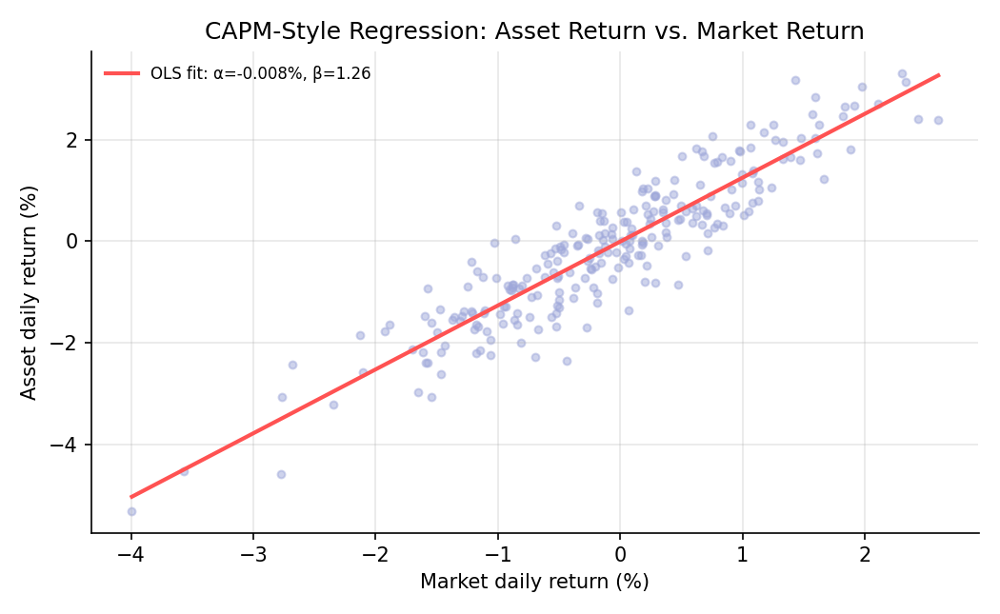
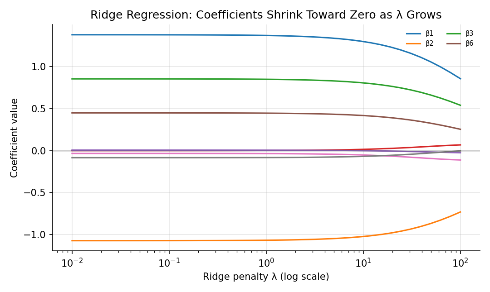

# Linear Regression and Regularization

!!! objectives "Learning objectives"
    By the end of this lecture you should be able to:

    - [ ] Derive the ordinary least squares (OLS) estimator via the normal equations
    - [ ] Interpret regression coefficients, R², and residuals in a financial context (e.g., CAPM beta)
    - [ ] Explain the bias-variance trade-off and derive how ridge regression addresses it
    - [ ] Fit OLS, ridge, and lasso regressions in Python and compare their coefficients

## 1. Intuition

Linear regression answers a specific question: given a linear relationship between a set of predictors and an outcome, what is the best-fitting line (or hyperplane)? In finance, the canonical example is the CAPM regression of an asset's excess return on the market's excess return, where the slope is the asset's **beta**. Regression is also the backbone of factor models (Fama-French, Module 3) and a great deal of feature-based prediction in Module 8.

When there are many predictors, especially correlated ones, ordinary least squares can produce wild, unstable coefficient estimates. **Regularization** techniques, ridge and lasso, add a penalty for large coefficients, trading a small amount of bias for a large reduction in variance. This trade-off, and not just the mechanics of fitting a line, is the real content of this lecture.

## 2. Mathematical formulation

**Model.** For observations \( i=1,\dots,n \), with outcome \( y_i \) and predictors \( \mathbf{x}_i=(1,x_{i1},\dots,x_{ip})^\top \) (the leading 1 is for the intercept):

\[
y_i = \boldsymbol\beta^\top \mathbf{x}_i + \varepsilon_i
\]

In matrix form, with \( X \) the \( n\times(p+1) \) design matrix and \( \mathbf y \) the outcome vector,

\[
\mathbf y = X\boldsymbol\beta+\boldsymbol\varepsilon
\]

**Ordinary least squares.** The OLS estimator minimizes the sum of squared residuals:

\[
\hat{\boldsymbol\beta}_{\text{OLS}}=\arg\min_{\boldsymbol\beta}\ \|\mathbf y-X\boldsymbol\beta\|^2 = (X^\top X)^{-1}X^\top \mathbf y
\]

**Coefficient of determination.**

\[
R^2 = 1-\frac{\sum_i(y_i-\hat y_i)^2}{\sum_i(y_i-\bar y)^2}
\]

**Ridge regression** adds an \( \ell_2 \) penalty on the coefficients (excluding the intercept):

\[
\hat{\boldsymbol\beta}_{\text{ridge}} = \arg\min_{\boldsymbol\beta}\ \|\mathbf y-X\boldsymbol\beta\|^2 + \lambda\|\boldsymbol\beta\|_2^2 = (X^\top X+\lambda I)^{-1}X^\top\mathbf y
\]

**Lasso regression** uses an \( \ell_1 \) penalty instead:

\[
\hat{\boldsymbol\beta}_{\text{lasso}} = \arg\min_{\boldsymbol\beta}\ \|\mathbf y-X\boldsymbol\beta\|^2+\lambda\|\boldsymbol\beta\|_1
\]

where:

- \( \boldsymbol\beta \) — the coefficient vector, including the intercept
- \( \lambda\ge0 \) — the regularization strength: \( \lambda=0 \) recovers OLS, and larger \( \lambda \) shrinks coefficients more
- \( \|\boldsymbol\beta\|_2^2=\sum_j\beta_j^2 \), \( \|\boldsymbol\beta\|_1=\sum_j|\beta_j| \)

## 3. Derivation

**OLS via the normal equations.** The sum of squared residuals is \( S(\boldsymbol\beta)=(\mathbf y-X\boldsymbol\beta)^\top(\mathbf y-X\boldsymbol\beta) \). Expanding,

\[
S(\boldsymbol\beta)=\mathbf y^\top\mathbf y-2\boldsymbol\beta^\top X^\top\mathbf y+\boldsymbol\beta^\top X^\top X\boldsymbol\beta
\]

Differentiate with respect to \( \boldsymbol\beta \) and set to zero (this is a convex quadratic in \( \boldsymbol\beta \), as in the Optimization Foundations lecture, since \( X^\top X \) is positive semi-definite):

\[
\nabla_{\boldsymbol\beta}S = -2X^\top\mathbf y+2X^\top X\boldsymbol\beta = 0 \quad\Longrightarrow\quad X^\top X\,\boldsymbol\beta = X^\top\mathbf y
\]

These are the **normal equations**. If \( X^\top X \) is invertible, solving gives \( \hat{\boldsymbol\beta}_{\text{OLS}}=(X^\top X)^{-1}X^\top\mathbf y \) directly.

**Ridge as a fix for near-singular \( X^\top X \).** The same differentiation applied to the ridge objective gives \( X^\top X\boldsymbol\beta+\lambda\boldsymbol\beta=X^\top\mathbf y \), i.e. \( (X^\top X+\lambda I)\boldsymbol\beta=X^\top\mathbf y \). Adding \( \lambda I \) shifts every eigenvalue of \( X^\top X \) up by \( \lambda \) (recall from Linear Algebra for Finance that \( X^\top X \) is symmetric positive semi-definite, so its eigen-decomposition is \( X^\top X=Q\Lambda Q^\top \), and \( X^\top X+\lambda I = Q(\Lambda+\lambda I)Q^\top \)). This guarantees invertibility even when \( X^\top X \) itself is singular or nearly so (highly correlated predictors), which is exactly the ill-conditioning problem flagged in that lecture.

**The bias-variance trade-off.** It can be shown that ridge introduces bias, \( E[\hat{\boldsymbol\beta}_{\text{ridge}}]\ne\boldsymbol\beta \) in general, but reduces variance relative to OLS. Along a given eigenvector direction with eigenvalue \( \mu \) of \( X^\top X \), the OLS coefficient has variance proportional to \( \sigma^2/\mu \), while the ridge coefficient's variance is scaled down by a factor \( \left(\frac{\mu}{\mu+\lambda}\right)^2 \) relative to OLS in that direction. This factor is largest, closest to 1, for high-variance (large \( \mu \)) directions, which are well estimated by the data, and smallest for low-variance (small \( \mu \)) directions, which are the ones OLS estimates least reliably. Ridge therefore shrinks the least-trustworthy coefficient directions the most, which is precisely why it stabilizes estimates in the presence of near-collinear predictors, at the cost of a small, controlled bias. Lasso's \( \ell_1 \) penalty behaves differently: because the penalty has a "corner" at zero, sufficiently small coefficients are driven to *exactly* zero, giving lasso a built-in variable selection property that ridge, whose penalty is smooth, does not share.

## 4. Worked numerical example

Regress an asset's daily return on the market's daily return, using 250 simulated trading days generated with a true intercept \( \alpha=0.0002 \) and slope \( \beta=1.3 \) plus idiosyncratic noise. The fitted OLS line (Section 5) recovered \( \hat\alpha\approx-0.0001 \) and \( \hat\beta\approx1.26 \), close to but not exactly equal to the true values, since any single finite sample gives an estimate, not the truth (the same estimation-noise theme as the Estimation Theory lecture). A beta above 1 indicates the asset is, on average, more volatile than the market, moving about 1.26% for each 1% market move in this simulated example.

## 5. Python implementation

```python
import numpy as np

rng = np.random.default_rng(21)
n = 250
market = rng.normal(0.0004, 0.011, n)
alpha_true, beta_true = 0.0002, 1.3
asset = alpha_true + beta_true * market + rng.normal(0, 0.006, n)

# --- OLS via the normal equations ---
X = np.column_stack([np.ones(n), market])
beta_ols = np.linalg.solve(X.T @ X, X.T @ asset)   # solves the normal equations directly
print("OLS [alpha, beta]:", np.round(beta_ols, 5))

fitted = X @ beta_ols
resid = asset - fitted
r2 = 1 - (resid @ resid) / ((asset - asset.mean()) @ (asset - asset.mean()))
print(f"R^2 = {r2:.4f}")

# --- Ridge regression: penalize the slope, not the intercept ---
def ridge_fit(X, y, lam):
    p = X.shape[1]
    penalty = lam * np.eye(p)
    penalty[0, 0] = 0.0   # do not penalize the intercept
    return np.linalg.solve(X.T @ X + penalty, X.T @ y)

for lam in [0, 1, 10, 100]:
    b = ridge_fit(X, asset, lam)
    print(f"lambda={lam:6.1f}  ->  [alpha, beta] = {np.round(b, 5)}")

# --- Lasso, using coordinate descent (or scikit-learn if available) ---
try:
    from sklearn.linear_model import Lasso
    lasso = Lasso(alpha=0.0005).fit(market.reshape(-1, 1), asset)
    print("Lasso: intercept =", round(lasso.intercept_, 5), " beta =", round(lasso.coef_[0], 5))
except ImportError:
    print("scikit-learn not installed; ridge/OLS above illustrate the same shrinkage idea.")
```


Continuing directly from the code above, here is the plotting code that produces both charts in Section 6:

```python
import matplotlib.pyplot as plt

# --- Chart 1: CAPM-style scatter with the fitted OLS line ---
x_grid = np.linspace(market.min(), market.max(), 50)
fig, ax = plt.subplots(figsize=(7, 4.3))
ax.scatter(market * 100, asset * 100, s=14, alpha=0.5, color="#9fa8da")
ax.plot(x_grid * 100, (beta_ols[0] + beta_ols[1] * x_grid) * 100, color="#ff5252", lw=2,
        label=f"OLS fit: α={beta_ols[0]*100:.3f}%, β={beta_ols[1]:.2f}")
ax.set_xlabel("Market daily return (%)"); ax.set_ylabel("Asset daily return (%)")
ax.set_title("CAPM-Style Regression: Asset Return vs. Market Return")
ax.legend(frameon=False, fontsize=8)
fig.tight_layout()
plt.show()

# --- Chart 2: ridge coefficient shrinkage path ---
p_features = 8
rng2 = np.random.default_rng(3)
X_multi = rng2.normal(size=(200, p_features))
true_b = np.array([1.5, -1.0, 0.8, 0, 0, 0.5, 0, 0])
y_multi = X_multi @ true_b + rng2.normal(0, 1, 200)

lambdas = np.logspace(-2, 2, 40)
paths = np.array([np.linalg.solve(X_multi.T @ X_multi + lam * np.eye(p_features), X_multi.T @ y_multi)
                   for lam in lambdas])

fig, ax = plt.subplots(figsize=(7.2, 4.3))
for j in range(p_features):
    ax.plot(lambdas, paths[:, j], lw=1.5, label=f"β{j+1}" if abs(true_b[j]) > 0 else None)
ax.set_xscale("log"); ax.axhline(0, color="black", lw=0.6)
ax.set_xlabel("Ridge penalty λ (log scale)"); ax.set_ylabel("Coefficient value")
ax.set_title("Ridge Regression: Coefficients Shrink Toward Zero as λ Grows")
ax.legend(frameon=False, fontsize=7, ncol=2)
fig.tight_layout()
plt.show()
```

## 6. Visualization

<figure class="qf-figure" markdown>

<figcaption>A CAPM-style regression: each point is one simulated day's market and asset return. The fitted OLS line's slope is the estimated beta, and its intercept is the estimated alpha (excess return not explained by the market).</figcaption>
</figure>

<figure class="qf-figure" markdown>

<figcaption>Ridge regression coefficients for eight predictors (three truly nonzero, five truly zero) as the penalty λ increases from small to large. All coefficients shrink toward zero, with the true zero coefficients shrinking to near-zero fastest, illustrating the bias-variance trade-off derived in Section 3.</figcaption>
</figure>

## 7. Financial interpretation

A CAPM beta is nothing more than an OLS slope coefficient, and its interpretation, sensitivity of an asset's return to market moves, only makes sense alongside its standard error and R², both computable from the same regression. Regularization becomes essential once a regression has many correlated predictors, the typical situation in multi-factor models (Module 3) or machine-learning-based return prediction (Module 8), where raw OLS coefficients on correlated factors can be large, unstable, and change sign with small changes in the data. Ridge is the standard first fix; lasso's automatic variable selection is often preferred when many candidate predictors are suspected to be irrelevant.

## 8. Common mistakes

!!! danger "Common mistake: regressing on nearly collinear predictors without regularization"
    When predictors are highly correlated, \( X^\top X \) is close to singular, and OLS coefficients become extremely sensitive to small data changes, sometimes flipping sign. This is exactly the ill-conditioning problem from the Linear Algebra lecture, and ridge is a direct, principled fix.

!!! danger "Common mistake: interpreting R² as predictive skill out-of-sample"
    A high in-sample R² does not guarantee good out-of-sample predictions, especially with many predictors or regularization tuned on the same data used to evaluate it. Module 8's lecture on time-series cross-validation addresses this directly.

!!! danger "Common mistake: penalizing the intercept"
    The intercept represents a location shift, not a "complexity" the model should be discouraged from having. Standard ridge and lasso implementations exclude the intercept from the penalty, as done explicitly in Section 5's code; forgetting this biases the intercept toward zero for no good reason.

## 9. Exercises

1. Using the code in Section 5, compute the OLS standard errors of \( \hat\alpha \) and \( \hat\beta \) using the formula \( \widehat{\text{Var}}(\hat{\boldsymbol\beta})=\hat\sigma^2(X^\top X)^{-1} \), where \( \hat\sigma^2 \) is the residual variance. Is \( \hat\beta \) significantly different from 1?
2. Add two more predictors to the design matrix that are highly correlated with `market` (e.g., `market + small_noise`), refit OLS, and observe what happens to the coefficient estimates. Then refit with ridge and compare stability.
3. Explain, using the shrinkage-factor argument in Section 3, why ridge regression coefficients are sometimes called "shrunk toward zero more in the directions the data is least informative about."

## 10. Further reading

- Hastie, Tibshirani, and Friedman's *Elements of Statistical Learning* (freely available from the authors) covers ridge and lasso in depth and is a standard graduate reference, revisited throughout Module 8.

## 11. References

1. Hastie, T., Tibshirani, R., & Friedman, J. (2009). *The Elements of Statistical Learning* (2nd ed.), Chapter 3. Springer.
2. Sharpe, W. F. (1964). "Capital Asset Prices: A Theory of Market Equilibrium under Conditions of Risk." *The Journal of Finance*, 19(3), 425–442.
3. Tibshirani, R. (1996). "Regression Shrinkage and Selection via the Lasso." *Journal of the Royal Statistical Society: Series B*, 58(1), 267–288.
4. scikit-learn Developers. "`sklearn.linear_model.Lasso`." [scikit-learn.org](https://scikit-learn.org/stable/modules/generated/sklearn.linear_model.Lasso.html)

---

<div class="grid" markdown>
[:material-arrow-left: Previous: Hypothesis Testing for Financial Data](/qf-lectures/statistics/hypothesis-testing/){ .md-button }
[Next: Principal Component Analysis :material-arrow-right:](/qf-lectures/statistics/pca/){ .md-button .md-button--primary }
</div>
