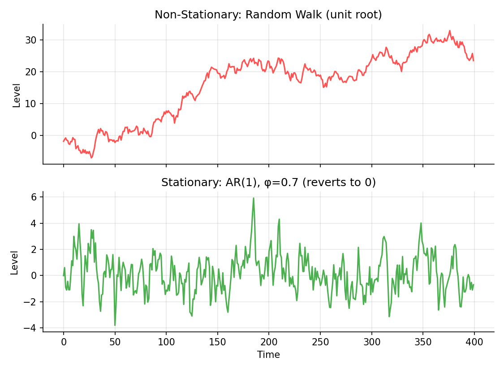
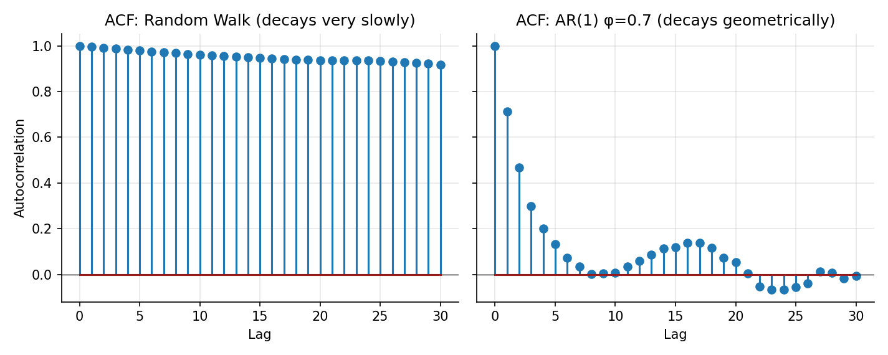

# Stationarity and Unit Roots

!!! objectives "Learning objectives"
    By the end of this lecture you should be able to:

    - [ ] Define (weak) stationarity and explain why it matters for time-series modeling
    - [ ] Explain what a "unit root" is and why a random walk is non-stationary
    - [ ] Interpret an autocorrelation function (ACF) and distinguish the ACF signatures of stationary versus non-stationary series
    - [ ] Run an Augmented Dickey-Fuller test in Python and interpret its result correctly

## 1. Intuition

Most of classical statistics, means, variances, regression standard errors, assumes the data-generating process does not change character over time. A time series is **stationary** if its statistical properties (mean, variance, autocorrelation structure) are stable through time. Asset **prices** are famously not stationary: a stock at \$400 has no natural tendency to return to \$40 just because that was its level a decade ago. Asset **returns**, by contrast, usually look much closer to stationary, which is one more reason (beyond the additivity argument in the Returns and Log Returns lecture) that time-series models throughout this module are built on returns rather than raw prices.

A price series behaving like a **random walk**, where today's price equals yesterday's price plus an unpredictable shock, is the textbook example of non-stationarity, and it has a "unit root," a specific mathematical signature explained below. Recognizing stationarity, or its absence, is a prerequisite for correctly applying almost every time-series technique that follows in this module: AR/MA/ARIMA models, GARCH, and cointegration.

## 2. Mathematical formulation

A time series \( \{X_t\} \) is **weakly (covariance) stationary** if:

\[
E[X_t]=\mu \ \ (\text{constant, independent of } t), \qquad \text{Var}(X_t)=\sigma^2 \ \ (\text{constant}), \qquad \text{Cov}(X_t,X_{t+k})=\gamma_k \ \ (\text{depends only on the lag } k,\text{ not on } t)
\]

**Autocorrelation function (ACF).**

\[
\rho_k = \frac{\gamma_k}{\gamma_0} = \text{Corr}(X_t, X_{t+k})
\]

**AR(1) process.** \( X_t = \phi X_{t-1} + \varepsilon_t \), with \( \varepsilon_t \) i.i.d. mean-zero noise. This process is stationary if and only if \( |\phi|<1 \).

**Random walk.** The special case \( \phi=1 \):

\[
X_t = X_{t-1} + \varepsilon_t
\]

This is said to have a **unit root**, referring to the root of the process's characteristic equation \( 1-\phi z=0 \) lying exactly at \( z=1 \).

**Augmented Dickey-Fuller (ADF) test.** Tests \( H_0:\ \) the series has a unit root (is non-stationary), against \( H_1: \) it is stationary, by estimating

\[
\Delta X_t = \alpha + \beta t + \gamma X_{t-1} + \sum_{i=1}^p \delta_i \Delta X_{t-i} + \varepsilon_t
\]

and testing whether \( \gamma=0 \) (unit root, non-stationary) versus \( \gamma<0 \) (stationary), using critical values specific to this test rather than the standard t-distribution (Dickey & Fuller, 1979).

## 3. Derivation

**Why an AR(1) is stationary only for \( |\phi|<1 \).** Assume the process has run for a long time and reached a stable variance \( \text{Var}(X_t)=\sigma_X^2 \) for all \( t \) (this is the definition of covariance stationarity applied to the variance). Since \( \varepsilon_t \) is independent of \( X_{t-1} \),

\[
\text{Var}(X_t) = \phi^2\,\text{Var}(X_{t-1}) + \text{Var}(\varepsilon_t) \quad\Longrightarrow\quad \sigma_X^2 = \phi^2\sigma_X^2+\sigma_\varepsilon^2 \quad\Longrightarrow\quad \sigma_X^2=\frac{\sigma_\varepsilon^2}{1-\phi^2}
\]

This solution for \( \sigma_X^2 \) is finite and positive only when \( \phi^2<1 \), i.e. \( |\phi|<1 \). At \( \phi=1 \) the formula blows up (division by zero), signaling that no finite, time-invariant variance exists, consistent with what direct calculation of a random walk's variance shows next.

**Why a random walk's variance grows without bound.** Unroll the random walk recursively: \( X_t = X_0+\sum_{s=1}^t \varepsilon_s \). Then

\[
\text{Var}(X_t) = \text{Var}\left(\sum_{s=1}^t \varepsilon_s\right) = t\,\sigma_\varepsilon^2
\]

using independence of the shocks. The variance grows linearly in \( t \) without limit, directly violating the "constant variance" requirement of stationarity. This is the formal reason a random walk (and, empirically, most raw asset price series) is non-stationary: there is no fixed spread the series settles into; it wanders further and further from any starting point over time.

**Why the ACF signatures differ.** For a stationary AR(1), it can be shown that \( \rho_k=\phi^{|k|} \), which decays geometrically to zero as \( k \) grows (since \( |\phi|<1 \)). For a random walk, the autocorrelation between \( X_t \) and \( X_{t+k} \) approaches 1 for any fixed \( k \) as the series lengthens, and empirically the sample ACF of a random walk decays extremely slowly, near-linearly, rather than geometrically. This qualitative difference, fast geometric decay versus slow, near-linear decay, is a quick visual diagnostic for stationarity before ever running a formal test, and it is exactly what Section 6's chart shows.

## 4. Worked numerical example

Simulate a 400-step random walk and a 400-step AR(1) process with \( \phi=0.7 \), both driven by independent standard Normal shocks. The random walk wanders visibly away from zero with no tendency to return (Section 6, top panel), while the AR(1) series fluctuates around zero throughout (bottom panel). Computing sample autocorrelations out to lag 30: the AR(1) series' ACF decays close to the theoretical \( 0.7^k \) (e.g., \( \rho_1\approx0.7 \), \( \rho_5\approx0.7^5\approx0.168 \)), while the random walk's ACF remains close to 1 across all 30 lags shown, exactly the slow-decay signature described in Section 3.

## 5. Python implementation

```python
import numpy as np
from statsmodels.tsa.stattools import adfuller

rng = np.random.default_rng(31)
T = 400

random_walk = np.cumsum(rng.normal(0, 1, T))

phi = 0.7
ar1 = np.zeros(T)
for t in range(1, T):
    ar1[t] = phi * ar1[t-1] + rng.normal(0, 1)

def sample_acf(x, nlags):
    x = x - x.mean()
    return np.array([1.0] + [np.corrcoef(x[k:], x[:-k])[0, 1] for k in range(1, nlags + 1)])

print("Random walk ACF (lags 1, 5, 10, 20):", np.round(sample_acf(random_walk, 20)[[1,5,10,20]], 3))
print("AR(1) ACF     (lags 1, 5, 10, 20):", np.round(sample_acf(ar1, 20)[[1,5,10,20]], 3))
print("Theoretical AR(1) rho_k = phi^k:  ", np.round(phi**np.array([1,5,10,20]), 3))

# --- Augmented Dickey-Fuller test ---
adf_rw = adfuller(random_walk, autolag="AIC")
adf_ar = adfuller(ar1, autolag="AIC")
print(f"\nRandom walk ADF stat={adf_rw[0]:.3f}, p-value={adf_rw[1]:.3f}  (expect: fail to reject unit root)")
print(f"AR(1) ADF stat={adf_ar[0]:.3f}, p-value={adf_ar[1]:.3f}  (expect: reject unit root)")

# --- Differencing a random walk makes it stationary ---
diffed = np.diff(random_walk)
adf_diff = adfuller(diffed, autolag="AIC")
print(f"\nDifferenced random walk ADF stat={adf_diff[0]:.3f}, p-value={adf_diff[1]:.3f}  (expect: reject unit root)")
```

`statsmodels` is a standard, widely used Python econometrics library; install it with `pip install statsmodels` if it is not already part of your environment.


Continuing directly from the code above, here is the plotting code that produces both charts in Section 6:

```python
import matplotlib.pyplot as plt

# --- Chart 1: random walk vs. mean-reverting AR(1) series ---
fig, axes = plt.subplots(2, 1, figsize=(7.5, 5.5), sharex=True)
axes[0].plot(random_walk, color="#ff5252"); axes[0].set_title("Non-Stationary: Random Walk (unit root)")
axes[0].set_ylabel("Level")
axes[1].plot(ar1, color="#4caf50"); axes[1].set_title(f"Stationary: AR(1), φ={phi} (reverts to 0)")
axes[1].set_ylabel("Level"); axes[1].set_xlabel("Time")
fig.tight_layout()
plt.show()

# --- Chart 2: ACF comparison ---
acf_rw = sample_acf(random_walk, 30)
acf_ar = sample_acf(ar1, 30)

fig, axes = plt.subplots(1, 2, figsize=(9.5, 3.8), sharey=True)
axes[0].stem(range(31), acf_rw); axes[0].set_title("ACF: Random Walk (decays very slowly)")
axes[1].stem(range(31), acf_ar); axes[1].set_title(f"ACF: AR(1) φ={phi} (decays geometrically)")
for ax in axes:
    ax.set_xlabel("Lag"); ax.axhline(0, color="black", lw=0.6)
axes[0].set_ylabel("Autocorrelation")
fig.tight_layout()
plt.show()
```

## 6. Visualization

<figure class="qf-figure" markdown>

<figcaption>Top: a simulated random walk (φ=1), non-stationary, drifting arbitrarily far from its starting level. Bottom: a simulated stationary AR(1) process (φ=0.7), which continually reverts toward its long-run mean of zero.</figcaption>
</figure>

<figure class="qf-figure" markdown>

<figcaption>The random walk's sample ACF (left) stays close to 1 across many lags, the slow-decay signature of non-stationarity. The AR(1) series' ACF (right) decays geometrically, closely tracking the theoretical φᵏ curve derived in Section 3.</figcaption>
</figure>

## 7. Financial interpretation

Whether a series is stationary determines which tools are valid. Regressing one non-stationary price series on another can produce a **spurious regression**, an apparently strong, statistically "significant" relationship that is really an artifact of both series independently trending or wandering, with no genuine economic link, a classic and important warning (Granger & Newbold, 1974). This is precisely why the cointegration lecture later in this module exists: it develops the specific conditions under which regressing non-stationary price series on each other is nonetheless meaningful. Volatility models (ARCH/GARCH, this module) and standard AR/MA models are built assuming the series being modeled, typically returns, is already stationary or has been transformed (e.g., differenced) until it is.

## 8. Common mistakes

!!! danger "Common mistake: fitting time-series models directly to price levels"
    Because prices are typically non-stationary, applying an AR/MA model, or standard regression, directly to raw price levels rather than returns or price differences risks all the problems described above, including spurious regression and mis-estimated standard errors.

!!! danger "Common mistake: misinterpreting the ADF null hypothesis"
    The ADF null hypothesis is that a unit root is present (the series is non-stationary). A high p-value means "cannot reject non-stationarity", not "the series is definitely non-stationary," and a low p-value supports (but does not prove with certainty) stationarity. Confusing which hypothesis is which direction reverses the conclusion.

!!! danger "Common mistake: over-differencing"
    Differencing a series more times than necessary to achieve stationarity introduces unnecessary noise and can create spurious negative autocorrelation. Test for stationarity after each differencing step rather than differencing repeatedly by default.

## 9. Exercises

1. Simulate an AR(1) process with \( \phi=0.95 \) (close to, but below, the unit root boundary) and compare its ACF decay rate to the \( \phi=0.7 \) case in Section 5. What does this suggest about how easy it is to visually distinguish a highly persistent stationary series from a true unit root?
2. Run the ADF test on the *cumulative sum* of the AR(1) series from Section 5 (i.e., integrate it once). Confirm it now behaves like a unit-root process.
3. Using real or simulated daily price data for a stock, run the ADF test on (a) the raw price level and (b) the log returns. Confirm the expected qualitative outcome for each.

## 10. Further reading

- The next two lectures in this module, AR/MA/ARIMA models and Cointegration, build directly on the concepts introduced here.

## 11. References

1. Dickey, D. A., & Fuller, W. A. (1979). "Distribution of the Estimators for Autoregressive Time Series with a Unit Root." *Journal of the American Statistical Association*, 74(366a), 427–431.
2. Granger, C. W. J., & Newbold, P. (1974). "Spurious Regressions in Econometrics." *Journal of Econometrics*, 2(2), 111–120.
3. Tsay, R. S. (2010). *Analysis of Financial Time Series* (3rd ed.), Chapter 2. Wiley.
4. statsmodels Developers. "`statsmodels.tsa.stattools.adfuller`." [statsmodels.org](https://www.statsmodels.org/stable/generated/statsmodels.tsa.stattools.adfuller.html)

---

<div class="grid" markdown>
[:material-arrow-left: Previous: Principal Component Analysis](/qf-lectures/statistics/pca/){ .md-button }
[Next: AR / MA / ARIMA Models :material-arrow-right:](/qf-lectures/statistics/arima-models/){ .md-button .md-button--primary }
</div>
